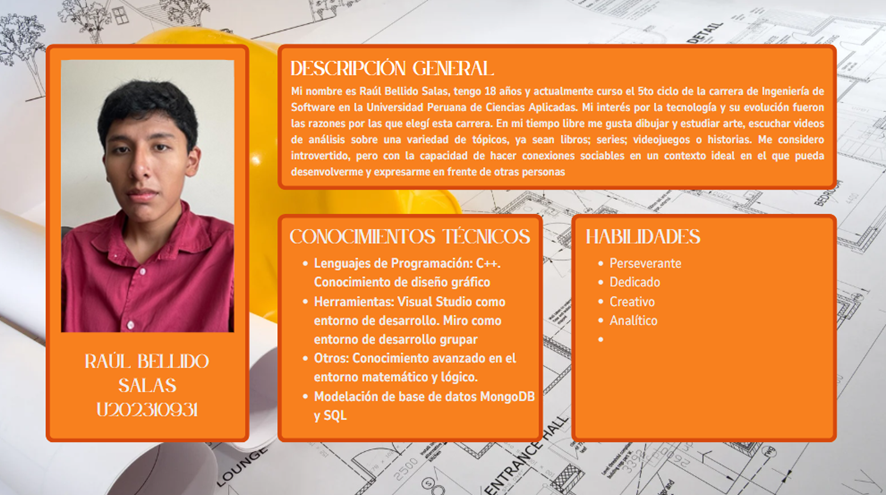

<h1 style="text-align: center;"><strong>Informe del Trabajo Final</strong></h1>
<h3 style="text-align: center;"><strong>Universidad Peruana de Ciencias Aplicadas</strong></h1>

  

<h4 style="text-align: center;"><strong>Ingeniería de Software</strong></h4>
<h4 style="text-align: center;"><strong> Desarrollo de Aplicaciones Open Source - 4348</strong></h4>
<h4 style="text-align: center;"><strong>Docente: Hugo Allan Mori Paiva </h4>
<h4 style="text-align: center;"><strong>Startup: Arquitech</strong></h4>

### **Team members:**

<table style="width: 100%; border-collapse: collapse; margin: 0 auto;">
  <tr>
    <th style="border: 1px solid black; padding: 8px; text-align: center;">Nombre</th>
    <th style="border: 1px solid black; padding: 8px; text-align: center;">Código</th>
  </tr>
  </tr>
    <tr>
    <td style="border: 1px solid black; padding: 8px; text-align: center;">Melissa Geraldine Sulca Silva</td>
    <td style="border: 1px solid black; padding: 8px; text-align: center;">U202224602</td>
  </tr>
  <tr>
    <td style="border: 1px solid black; padding: 8px; text-align: center;">Daniela Araceli Gómez Flores</td>
    <td style="border: 1px solid black; padding: 8px; text-align: center;">U202311184</td>
  </tr>
  </tr>
    <tr>
    <td style="border: 1px solid black; padding: 8px; text-align: center;">Ernesto Rodas Sotomayor</td>
    <td style="border: 1px solid black; padding: 8px; text-align: center;">U202312443</td>
  </tr>  
  <tr>
    <td style="border: 1px solid black; padding: 8px; text-align: center;">Raúl Bellido Salas</td>
    <td style="border: 1px solid black; padding: 8px; text-align: center;">U202310931</td>  
  </tr>
    <tr>
    <td style="border: 1px solid black; padding: 8px; text-align: center;">Sandra Paula Luyo Correa</td>
    <td style="border: 1px solid black; padding: 8px; text-align: center;">U202314513</td>
  </tr>
</table>

<h3 style="text-align: center;"><strong>Ciclo 2025-01</strong></h3>

## Registro de Versiones del Informe

## Project Report Collaboration Insights  

## Tabla de Contenidos

    
Capítulo I: Introducción 
    
        <ul>
            <li><a href="#11-Startup-Profile">1.1. Startup Profile</a></li>
            <li><a href="#111-Descripción-de-la-Startup">1.1.1. Descripción de la Startup</a></li>
            <li><a href="#112-Perfiles-de-Integrantes-del-Equipo">1.1.2. Perfiles de Integrantes del Equipo</a></li>
            <li><a href="#12-Solution-Profile">1.2. Solution Profile</a></li>
            <li><a href="#121-Antecedentes-y-Problemática">1.2.1. Antecedentes y Problemática</a></li>
            <li><a href="#122-Lean-UX-Process">1.2.2. Lean UX Process</a></li>
            <li><a href="#1221-Lean-UX-Problem-Statements">1.2.2.1. Lean UX Problem Statements</a></li>
            <li><a href="#1222-Lean-UX-Assumptions">1.2.2.2. Lean UX Assumptions</a></li>
            <li><a href="#1223-Lean-UX-Hypothesis-Statements">1.2.2.3. Lean UX Hypothesis Statements</a></li>
            <li><a href="#1224-Lean-UX-Canvas">1.2.2.4. Lean UX Canvas</a></li>
            <li><a href="#13-Segmentos-Objetivos">1.3. Segmentos Objetivos</a></li>
        </ul>    

    
Capítulo II: Requirements Elicitation & Analysis

        <ul>
            <li><a href="#21-competidores">2.1. Competidores</a></li>
            <li><a href="#211-Análisis-competitivo">2.1.1. Análisis competitivo</a></li>
            <li><a href="#212-Estrategias-y-tácticas-frente-a-competidores">2.1.2. Estrategias y tácticas frente a competidores</a></li>
            <li><a href="#22-Entrevistas">2.2. Entrevistas</a></li>
            <li><a href="#221-Diseño-de-entrevistas">2.2.1. Diseño de entrevistas</a></li>
            <li><a href="#222-Registro-de-entrevistas">2.2.2. Registro de entrevistas</a></li>
            <li><a href="#223-Análisis-de-entrevistas">2.2.3. Análisis de entrevistas</a></li>
            <li><a href="#23-Needfinding">2.3. Needfinding</a></li>
            <li><a href="#231-User-Personas">2.3.1. User Personas</a></li>
            <li><a href="#232-User-Task-Matrix">2.3.2. User Task Matrix</a></li>
            <li><a href="#233-User-Journey-Mapping">2.3.3. User Journey Mapping</a></li>
            <li><a href="#234-Empathy-Mapping">2.3.4. Empathy Mapping</a></li>
            <li><a href="#235-As-is-Scenario-Mapping">2.3.5. As-is Scenario Mapping</a></li>
            <li><a href="#24-Ubiquitous-Language">2.4. Ubiquitous Language</a></li>
        </ul>   

    
Capítulo III: Requirements Specification 

        <ul>
            <li><a href="#31-To-Be-Scenario-Mapping">3.1. To-Be Scenario Mapping</a></li>
            <li><a href="#32-User-Stories">3.2. User Stories</a></li>
            <li><a href="#33-Impact-Mapping">3.3. Impact Mapping</a></li>
            <li><a href="#34-Product-Backlog">3.4. Product Backlog</a></li>
        </ul>    

    
Capítulo IV: Product Design 

        <ul>
            <li><a href="#41-Style-Guidelines">4.1. Style Guidelines</a></li>
            <li><a href="#411-General-Style-Guidelines">4.1.1. General Style Guidelines</a></li>
            <li><a href="#412-Web-Style-Guidelines">4.1.2. Web Style Guidelines</a></li>
            <li><a href="#42-Information-Architecture">4.2. Information Architecture</a></li>
            <li><a href="#421-Organization-Systems">4.2.1. Organization Systems</a></li>
            <li><a href="#422-Labeling-Systems">4.2.2. Labeling Systems</a></li>
            <li><a href="#423-SEO-Tags-and-Meta-Tags">4.2.3. SEO Tags and Meta Tags</a></li>
            <li><a href="#424-Searching-Systems">4.2.4. Searching Systems</a></li>
            <li><a href="#425-Navigation-Systems">4.2.5. Navigation Systems</a></li>
            <li><a href="#43-Landing-Page-UI-Design">4.3. Landing Page UI Design</a></li>
            <li><a href="#431-Landing-Page-Wireframe">4.3.1. Landing Page Wireframe</a></li>
            <li><a href="#432-Landing-Page-Mock-up">4.3.2. Landing Page Mock-up</a></li>
            <li><a href="#44-Web-Applications-UXUI-Design">4.4. Web Applications UX/UI Design</a></li>
            <li><a href="#441-Web-Applications-Wireframes">4.4.1. Web Applications Wireframes</a></li>
            <li><a href="#442-Web-Applications-Wireflow-Diagrams">4.4.2. Web Applications Wireflow Diagrams</a></li>
            <li><a href="#443-Web-Applications-Mock-ups">4.4.3. Web Applications Mock-ups</a></li>
            <li><a href="#444-Web-Applications-User-Flow-Diagrams">4.4.4. Web Applications User Flow Diagrams</a></li>
            <li><a href="#45-Web-Applications-Prototyping">4.5. Web Applications Prototyping</a></li>
            <li><a href="#46-Domain-Driven-Software-Architecture">4.6. Domain-Driven Software Architecture</a></li>
            <li><a href="#461-Software-Architecture-Context-Diagrams">4.6.1. Software Architecture Context Diagrams</a></li>
            <li><a href="#462-Software-Architecture-Container-Diagrams">4.6.2. Software Architecture Container Diagrams</a></li>
            <li><a href="#463-Software-Architecture-Components-Diagrams">4.6.3. Software Architecture Components Diagrams</a></li>
            <li><a href="#47-Software-Object-Oriented-Design">4.7. Software Object-Oriented Design</a></li>
            <li><a href="#471-Class-Diagrams">4.7.1. Class Diagrams</a></li>
            <li><a href="#472-Class-Dictionary">4.7.2. Class Dictionary</a></li>
            <li><a href="#48-Database-Design">4.8. Database Design</a></li>
            <li><a href="#481-Database-Diagram">4.8.1. Database Diagram</a></li>
        </ul>    

    
Capítulo V: Product Implementation, Validation & Deployment 

        <ul>
            <li><a href="#51-software-configuration-management">5.1. Software Configuration Management</a></li>
            <li><a href="#511-software-development-environment-configuration">5.1.1. Software Development Environment Configuration</a></li>
            <li><a href="#512-source-code-management">5.1.2. Source Code Management</a></li>
            <li><a href="#513-source-code-style-guide-conventions">5.1.3. Source Code Style Guide & Conventions</a></li>
            <li><a href="#514-software-deployment-configuration">5.1.4. Software Deployment Configuration</a></li>
            <li><a href="#52-landing-page-services-applications-implementation">5.2. Landing Page, Services & Applications Implementation</a></li>
            <li><a href="#521-sprint-1">5.2.1. Sprint 1</a></li>
            <li><a href="#5211-sprint-planning-1">5.2.1.1. Sprint Planning 1</a></li>
            <li><a href="#5212-aspect-leaders-and-collaborators">5.2.1.2. Aspect Leaders and Collaborators</a></li>
            <li><a href="#5213-sprint-backlog-1">5.2.1.3. Sprint Backlog 1</a></li>
            <li><a href="#5214-development-evidence-for-sprint-review">5.2.1.4. Development Evidence for Sprint Review</a></li>
            <li><a href="#5215-execution-evidence-for-sprint-review">5.2.1.5. Execution Evidence for Sprint Review</a></li>
            <li><a href="#5216-services-documentation-evidence-for-sprint-review">5.2.1.6. Services Documentation Evidence for Sprint Review</a></li>
            <li><a href="#5217-software-deployment-evidence-for-sprint-review">5.2.1.7. Software Deployment Evidence for Sprint Review</a></li>
            <li><a href="#5218-team-collaboration-insights-during-sprint">5.2.1.8. Team Collaboration Insights during Sprint</a></li>
        </ul>        

## Student Outcome

# Capítulo I: Introducción 

## 1.1. Startup Profile

### 1.1.1. Descripción de la Startup

### 1.1.2. Perfiles de Integrantes del Equipo

### ***1.1.2. Perfiles de integrantes del equipo (Todos)***

#### Figura 1

*Perfil de Raúl Bellido*

  

 

*Nota.* Elaboración propia.

## 1.2. Solution Profile

### 1.2.1. Antecedentes y problemática

### 1.2.2. Lean UX Process

#### 1.2.2.1. Lean UX Problem Statements

#### 1.2.2.2. Lean UX Assumptions

#### 1.2.2.3. Lean UX Hypothesis Statements

#### 1.2.2.4. Lean UX Canvas

## 1.3. Segmentos Objetivos

# Capítulo II: Requirements Elicitation & Analysis

## 2.1. Competidores

### 2.1.1. Análisis competitivo

### 2.1.2. Estrategias y tácticas frente a competidores

## 2.2. Entrevistas

### 2.2.1. Diseño de entrevistas

### 2.2.2. Registro de entrevistas

### 2.2.3. Análisis de entrevistas

## 2.3. Needfinding

### 2.3.1. User Personas

### 2.3.2. User Task Matrix

### 2.3.3. User Journey Mapping

### 2.3.4. Empathy Mapping

### 2.3.5. As-is Scenario Mapping

## 2.4. Ubiquitous Language

# Capítulo III: Requirements Specification

## 3.1. To-Be Scenario Mapping

## 3.2. User Stories

| EPIC ID | Descripción de la Épica |
| :---- | ----- |
| EP01 | Gestión de inventario y maquinarias |
| EP02 | Gestión de trabajadores |
| EP03 | Generación y observación de reportes |
| EP04 | Configuración de perfil |
| EP05 | Navegación por la landing page |
| EP06 | Administración de proyectos |

| Epic / Story ID | Título | Descripción | Criterios de Aceptación | Relacionado con (Epic ID) |
| :---- | :---- | :---- | :---- | :---: |
| EP01/HU01 | Registrar Entrada de Materiales  | Como Supervisor de Obra, quiero registrar la entrada de materiales, para mantener un inventario actualizado y evitar retrasos.  | **Escenario 1: Registrar entrada de material con éxito Given**: Estoy autenticado como Gerente de Obra y tengo un proyecto activo con un inventario. **When**: Registro una entrada de 500 kg de cemento del proveedor "ConstruMax". **Then**: El sistema actualiza el inventario, aumentando la cantidad de cemento a 500 kg, y registra la transacción con el proveedor y la fecha actual. **Escenario 2: Intentar registrar entrada con datos incompletos Given**: Estoy autenticado como Gerente de Obra y tengo un proyecto activo. **When**: Intento registrar una entrada de cemento sin especificar la cantidad. **Then**: El sistema muestra un error indicando que la cantidad es obligatoria y no actualiza el inventario. | EP01 |
| EP01/HU02 | Registrar Uso de Materiales en Obra  | Como Supervisor de Obra, quiero registrar el uso de materiales, para controlar el consumo y evitar desperdicios.  | **Escenario 1: Registrar uso de material con éxito Given**: Estoy autenticado como Supervisor de Obra y tengo un inventario con 500 kg de cemento. **When**: Registro el uso de 200 kg de cemento para el día actual. **Then**: El sistema reduce el inventario a 300 kg y registra la transacción de uso con la fecha actual. **Escenario 2: Intentar registrar uso mayor al stock disponible Given**: Estoy autenticado como Supervisor de Obra y tengo un inventario con 100 kg de cemento. **When**: Intento registrar el uso de 150 kg de cemento. **Then**: El sistema muestra un error indicando que no hay suficiente stock y no actualiza el inventario. | EP01 |
| EP01/HU03 | Recibir Alertas de Bajo Nivel de Inventario  | Como Supervisor de Obra, quiero recibir alertas cuando el inventario esté bajo, para reabastecer a tiempo y evitar retrasos.  | **Escenario 1: Recibir alerta de bajo nivel de material Given**: Estoy autenticado como Gerente de Obra, y el inventario tiene 150 kg de cemento con un nivel mínimo de 100 kg. **When**: Registro el uso de 60 kg de cemento, reduciendo el stock a 90 kg. **Then**: El sistema me envía una notificación indicando que el cemento está por debajo del nivel mínimo (90 kg \< 100 kg). **Escenario 2: No recibir alerta si el nivel es suficiente Given**: Estoy autenticado como Gerente de Obra, y el inventario tiene 150 kg de cemento con un nivel mínimo de 100 kg. **When**: Registro el uso de 20 kg de cemento, reduciendo el stock a 130 kg. **Then**: El sistema no envía ninguna notificación, ya que el stock (130 kg) está por encima del nivel mínimo. | EP01 |
|  EP01/HU04 |  Consultar Historial de Transacciones de Inventario  |  Como Supervisor de Obra, quiero consultar el historial de transacciones de inventario, para auditar el uso de materiales y detectar irregularidades.  |  **Escenario 1: Consultar historial con transacciones existentes Given**: Estoy autenticado como Gerente de Obra, y el inventario de cemento tiene 2 transacciones: una entrada de 500 kg y un uso de 200 kg. **When**: Consulto el historial de transacciones del cemento. **Then**: El sistema muestra una lista con las 2 transacciones, incluyendo tipo (entrada/uso), cantidades, proveedor (para entradas), y fechas. **Escenario 2: Consultar historial sin transacciones Given**: Estoy autenticado como Gerente de Obra, y el inventario de acero no tiene transacciones registradas. **When**: Consulto el historial de transacciones del acero. **Then**: El sistema muestra un mensaje indicando que no hay transacciones registradas. | EP01 |
|  EP01/HU05 |  Registrar Maquinaria Asignada al Proyecto  |  Como Supervisor de Obra, quiero registrar maquinaria asignada al proyecto, para gestionar su disponibilidad y evitar retrasos.  |  **Escenario 1: Registrar maquinaria con éxito Given**: Estoy autenticado como Supervisor de Obra y tengo un proyecto activo. **When**: Registro una mezcladora con número de serie "MX123" y estado "Operativa". **Then**: El sistema agrega la mezcladora al inventario del proyecto con los datos proporcionados y actualiza su estado. **Escenario 2: Intentar registrar maquinaria con datos duplicados Given**: Estoy autenticado como Supervisor de Obra, y ya existe una mezcladora con número de serie "MX123". **When**: Intento registrar otra mezcladora con el mismo número de serie "MX123". **Then**: El sistema muestra un error indicando que el número de serie ya está registrado y no agrega la maquinaria. | EP01 |

## 3.3. Impact Mapping

## 3.4. Product Backlog

# Capítulo IV: Product Design

## 4.1. Style Guidelines

### 4.1.1. General Style Guidelines

### 4.1.2. Web Style Guidelines

## 4.2. Information Architecture

### 4.2.1. Organization Systems

### 4.2.2. Labeling Systems

### 4.2.3. SEO Tags and Meta Tags

### 4.2.4. Searching Systems

### 4.2.5. Navigation Systems

## 4.3. Landing Page UI Design

### 4.3.1. Landing Page Wireframe

### 4.3.2. Landing Page Mock-up

## 4.4. Web Applications UX/UI Design

### 4.4.1. Web Applications Wireframes.

### 4.4.2. Web Applications Wireflow Diagrams

### 4.4.3. Web Applications Mock-ups

### 4.4.4. Web Applications User Flow Diagrams

## 4.5. Web Applications Prototyping

## 4.6. Domain-Driven Software Architecture

### 4.6.1. Software Architecture Context Diagrams

### 4.6.2. Software Architecture Container Diagrams

### 4.6.3. Software Architecture Components Diagrams

## 4.7. Software Object-Oriented Design

### 4.7.1. Class Diagrams

### 4.7.2. Class Dictionary

## 4.8. Database Design

### 4.8.1. Database Diagram

# Capítulo V: Product Implementation, Validation & Deployment

## 5.1. Software Configuration Management.

### 5.1.1. Software Development Environment Configuration.

### 5.1.2. Source Code Management

### 5.1.3. Source Code Style Guide & Conventions

### 5.1.4. Software Deployment Configuration

## 5.2. Landing Page, Services & Applications Implementation

### 5.2.1. Sprint 1

##### 5.2.1.1. Sprint Planning 1

##### 5.2.1.2. Aspect Leaders and Collaborators

##### 5.2.1.3. Sprint Backlog 1

##### 5.2.1.4. Development Evidence for Sprint Review

##### 5.2.1.5. Execution Evidence for Sprint Review

##### 5.2.1.6. Services Documentation Evidence for Sprint Review

##### 5.2.1.7. Software Deployment Evidence for Sprint Review

##### 5.2.1.8. Team Collaboration Insights during Sprint

## Conclusiones

## Bibliografía

## Anexos