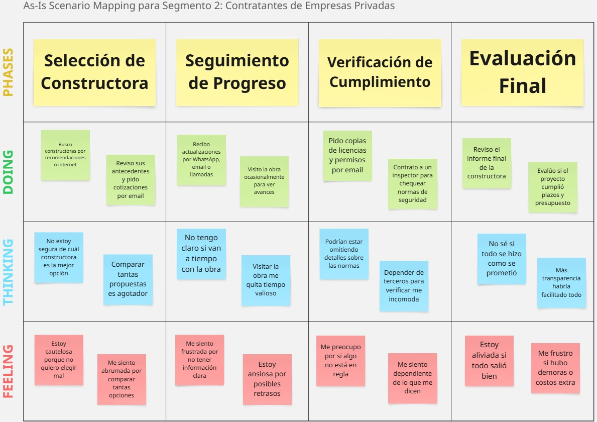
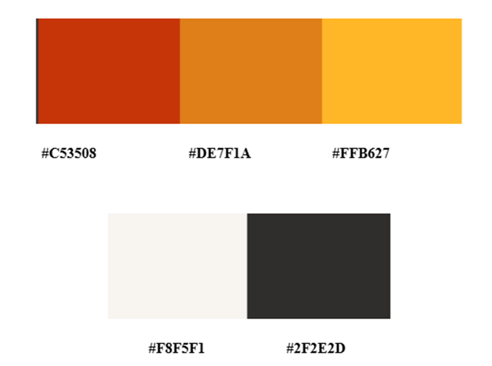
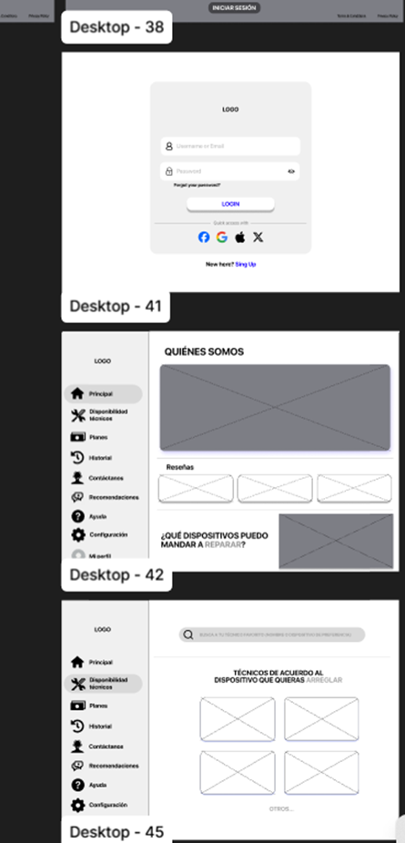
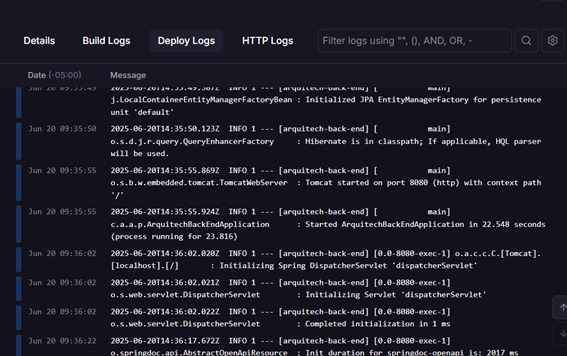
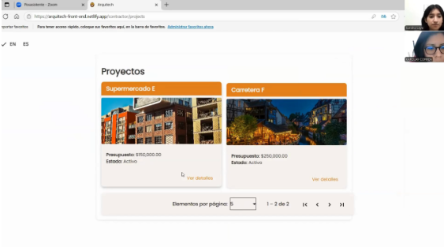
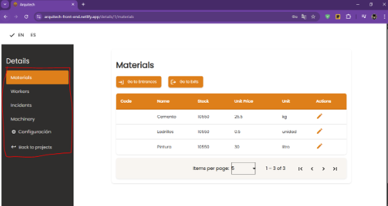

<h1 align="center"><strong>Informe del Trabajo Final</strong></h1>
<h3 align="center"><strong>Universidad Peruana de Ciencias Aplicadas</strong></h3>

<div align="center">
  
</div>

<h4 align="center"><strong>Ingeniería de Software</strong></h4>
<h4 align="center"><strong> Desarrollo de Aplicaciones Open Source - 4348</strong></h4>
<h4 align="center"><strong>Docente: </strong>Hugo Allan Mori Paiva</h4>
<h4 align="center"><strong>Startup: </strong>Arquitech</h4>

<p align="center"><strong>Team members:</strong></p>

<table align="center"; style="width: 100%; border-collapse: collapse; margin: 0 auto;">
  <tr>
    <th style="border: 1px solid black; padding: 8px; text-align: center;">Nombre</th>
    <th style="border: 1px solid black; padding: 8px; text-align: center;">Código</th>
  </tr>
  </tr>
    <tr>
    <td style="border: 1px solid black; padding: 8px; text-align: center;">Melissa Geraldine Sulca Silva</td>
    <td style="border: 1px solid black; padding: 8px; text-align: center;">U202224602</td>
  </tr>
  <tr>
    <td style="border: 1px solid black; padding: 8px; text-align: center;">Daniela Araceli Gómez Flores</td>
    <td style="border: 1px solid black; padding: 8px; text-align: center;">U202311184</td>
  </tr>
  </tr>
    <tr>
    <td style="border: 1px solid black; padding: 8px; text-align: center;">Ernesto Rodas Sotomayor</td>
    <td style="border: 1px solid black; padding: 8px; text-align: center;">U202312443</td>
  </tr>  
  <tr>
    <td style="border: 1px solid black; padding: 8px; text-align: center;">Raúl Bellido Salas</td>
    <td style="border: 1px solid black; padding: 8px; text-align: center;">U202310931</td>  
  </tr>
    <tr>
    <td style="border: 1px solid black; padding: 8px; text-align: center;">Sandra Paula Luyo Correa</td>
    <td style="border: 1px solid black; padding: 8px; text-align: center;">U202314513</td>
  </tr>
</table>

<h3 align="center"><strong>Ciclo 2025-01</strong></h3>

<hr>

# **Registro de Versiones del Informe**

# 

<body class="c9">
<table class="c0">
<tr class="c7">
<td class="c5" colspan="1" rowspan="1"><p>Versión</p></td>
<td class="c5" colspan="1" rowspan="1"><p>Fecha</p></td>
<td class="c5" colspan="1" rowspan="1"><p>Autor</p></td>
<td class="c5" colspan="1" rowspan="1"><p>Descripción de modificación</p></td>
</tr>
<tr class="c7">
<td class="c5" colspan="1" rowspan="1"><p>TB1</p></td>
<td class="c5" colspan="1" rowspan="1"><p>24/04/2025</p></td>
<td class="c5" colspan="1" rowspan="1"><p>Raúl Bellido Salas</p><p></p><p>Daniela Araceli Gómez Flores</p><p></p><p>Sandra Paula Luyo Correa</p><p></p><p>Ernesto Rodas Sotomayor</p><p></p><p>Melisa Geraldine Sulca</p></td>
<td class="c5" colspan="1" rowspan="1"><p>Para esta primera entrega, realizamos los primeros 5 capítulos del informe y desarrollamos la primera versión del landing page de ArquiTech.</p></td>
</tr>
<tr class="c7">
<td class="c5" colspan="1" rowspan="1"><p>TP1</p></td>
<td class="c5" colspan="1" rowspan="1"><p>13/05/2025</p></td>
<td class="c5" colspan="1" rowspan="1"><p>Raúl Bellido Salas</p><p></p><p>Daniela Araceli Gómez Flores</p><p></p><p>Sandra Paula Luyo Correa</p><p></p><p>Ernesto Rodas Sotomayor</p><p></p><p>Melisa Geraldine Sulca</p></td>
<td class="c5" colspan="1" rowspan="1"><p>Para la segunda entrega, hemos agregado la documentación del Sprint 2 y actualizado las conclusiones y anexos del documento de reporte. También, actualizamos la landing page y creamos la primera versión del Frontend Web Applications.</p></td>
</tr>
<tr class="c7">
<td class="c5" colspan="1" rowspan="1"><p>TB2</p></td>
<td class="c5" colspan="1" rowspan="1"><p>19/06/2025</p></td>
<td class="c5" colspan="1" rowspan="1"><p>Raúl Bellido Salas</p><p></p><p>Daniela Araceli Gómez Flores</p><p></p><p>Sandra Paula Luyo Correa</p><p></p><p>Ernesto Rodas Sotomayor</p><p></p><p>Melisa Geraldine Sulca</p></td>
<td class="c5" colspan="1" rowspan="1"><p>En esta tercera entrega, hemos agregado la documentación del Sprint 3 desarrollado, Validation Interviews (Diseño de entrevistas, registro de entrevistas y evaluaciones según heurísticas), también se realizó el Video About-the-Product y se actualizaron las conclusiones, bibliografía y anexos.</p></td>
</tr>
<tr class="c7">
<td class="c5" colspan="1" rowspan="1"><p>TF</p></td>
<td class="c5" colspan="1" rowspan="1"><p>09/07/2025</p></td>
<td class="c5" colspan="1" rowspan="1"><p>Raúl Bellido Salas</p><p></p><p>Daniela Araceli Gómez Flores</p><p></p><p>Sandra Paula Luyo Correa</p><p></p><p>Ernesto Rodas Sotomayor</p><p></p><p>Melisa Geraldine Sulca</p></td>
<td class="c5" colspan="1" rowspan="1"><p>En esta última entrega del reporte, hemos agregado la documentación del Sprint 4 que hemos desarrollado, se actualizaron el registro de versiones, collaboration, los Project Report Collaboration Insights, Student Outcome el Video About-the-Product, las conclusiones, bibliografía y anexos. También se agregaron recomendaciones.</p></td>
</tr>
</table>
</body>

#

# **Project Report Collaboration Insights**


Para realizar el informe de este proyecto, utilizaremos un repositorio llamado “ArquiTech\_ProjectReport” el cual está colocado en nuestra organización llamada “osFoundex” en GitHub. Se puede observar en el siguiente enlace: [https://github.com/Paulu27/ArquiTech\_ProjectReport](https://github.com/Paulu27/ArquiTech_ProjectReport)   

<ins> **TB1:** </ins>  
Para la elaboración de este informe, primero utilizamos un documento de google donde podíamos ver los avances en simultáneo. Posteriormente, una vez terminado, realizamos commits en el repositorio del project report en GitHub. A continuación, mostraremos analíticas de participación:  

**Figura 1**  
*Analíticas de participación TB1*  
<p align="center">
  
</p> 

*Nota.* Elaboración propia. 

<ins> **TP1:** </ins>  
Para la elaboración del informe del TP1, de igual manera que en la entrega pasada, primero utilizamos un documento de google donde podíamos ver los avances que realizábamos del Sprint 2. Luego, convertimos lo realizado a formato markdown y los subimos como commits en el repositorio del project report en GitHub. A continuación, mostraremos analíticas de participación:

**Figura 2**  
*Analíticas de participación TP1*  
<p align="center">
  
</p> 

*Nota.* Elaboración propia. 

<ins> **TB2:** </ins> 
Para la documentación de esta entrega, hemos realizado los commits de nuestras partes al repositorio "ArquiTech_ProjectReport". A continuación, mostramos los Insights del repositorio mencionado para comprobar la participación de cada uno de los miembros del equipo.

**Figura 3**  
*Analíticas de participación del TB2*  
<p align="center">
  
</p>

*Nota.* Elaboración propia. 

<ins> **TF:** </ins> 
Para el reporte de la entrega final de nuestro proyecto, hemos realizado los commits de nuestras partes al repositorio "ArquiTech_ProjectReport". A continuación, una imagen los Insights del repositorio mencionado para comprobar la participación de cada uno de los miembros del equipo.

**Figura 4**  
*Analíticas de participación del TF*  
<p align="center">
  
</p>

*Nota.* Elaboración propia. 

#
<hr>

# **Tabla de Contenidos**

#

<a href="#registro-de-versiones-del-informe">Registro de Versiones del Informe</a>

<a href="#project-report-collaboration-insights">Project Report Collaboration Insights</a>

<a href="#tabla-de-contenidos">Tabla de Contenidos</a>

<a href="#student-outcome">Student Outcome</a>

<a href="#capítulo-i-introducción">Capítulo I: Introducción</a>    
    	<ul>
            <a href="#11-startup-profile">1.1. Startup Profile</a><br>
	    <ul>
            <a href="#111-descripción-de-la-startup">1.1.1. Descripción de la Startup</a><br>
            <a href="#112-perfiles-de-integrantes-del-equipo">1.1.2. Perfiles de Integrantes del Equipo</a><br>
	    </ul>
            <a href="#12-solution-profile">1.2. Solution Profile</a><br>
	    <ul>
            <a href="#121-antecedentes-y-problemática">1.2.1. Antecedentes y Problemática</a><br>
            <a href="#122-lean-ux-process">1.2.2. Lean UX Process</a><br>
		<ul>
            <a href="#1221-lean-ux-problem-statements">1.2.2.1. Lean UX Problem Statements</a><br>
            <a href="#1222-lean-ux-assumptions">1.2.2.2. Lean UX Assumptions</a><br>
            <a href="#1223-lean-ux-hypothesis-statements">1.2.2.3. Lean UX Hypothesis Statements</a><br>
            <a href="#1224-lean-ux-canvas">1.2.2.4. Lean UX Canvas</a><br>
		</ul>
	    </ul>
            <a href="#13-segmentos-objetivos">1.3. Segmentos Objetivos</a><br>
        </ul>    


<a href="#capítulo-ii-requirements-elicitation--analysis">Capítulo II: Requirements Elicitation & Analysis</a>
        <ul>
            <a href="#21-competidores">2.1. Competidores</a><br>
		<ul>
            <a href="#211-análisis-competitivo">2.1.1. Análisis competitivo</a><br>
            <a href="#212-estrategias-y-tácticas-frente-a-competidores">2.1.2. Estrategias y tácticas frente a competidores</a><br>
		</ul>
            <a href="#22-entrevistas">2.2. Entrevistas</a><br>
		<ul>
            <a href="#221-diseño-de-entrevistas">2.2.1. Diseño de entrevistas</a><br>
            <a href="#222-registro-de-entrevistas">2.2.2. Registro de entrevistas</a><br>
            <a href="#223-análisis-de-entrevistas">2.2.3. Análisis de entrevistas</a><br>
		</ul>
            <a href="#23-needfinding">2.3. Needfinding</a><br>
		<ul>
            <a href="#231-user-personas">2.3.1. User Personas</a><br>
            <a href="#232-user-task-matrix">2.3.2. User Task Matrix</a><br>
            <a href="#233-user-journey-mapping">2.3.3. User Journey Mapping</a><br>
            <a href="#234-empathy-mapping">2.3.4. Empathy Mapping</a><br>
            <a href="#235-as-is-scenario-mapping">2.3.5. As-is Scenario Mapping</a><br>
		</ul>
            <a href="#24-ubiquitous-language">2.4. Ubiquitous Language</a><br>
        </ul>   

<a href="#capítulo-iii-requirements-specification">Capítulo III: Requirements Specification </a>
        <ul>
            <a href="#31-to-be-scenario-mapping">3.1. To-Be Scenario Mapping</a><br>
            <a href="#32-user-stories">3.2. User Stories</a><br>
            <a href="#33-impact-mapping">3.3. Impact Mapping</a><br>
            <a href="#34-product-backlog">3.4. Product Backlog</a><br>
        </ul>    

<a href="#capítulo-iv-product-design">Capítulo IV: Product Design </a>
        <ul>
            <a href="#41-style-guidelines">4.1. Style Guidelines</a><br>
		<ul>
            <a href="#411-general-style-guidelines">4.1.1. General Style Guidelines</a><br>
            <a href="#412-web-style-guidelines">4.1.2. Web Style Guidelines</a><br>
		</ul>
            <a href="#42-information-architecture">4.2. Information Architecture</a><br>
		<ul>
            <a href="#421-organization-systems">4.2.1. Organization Systems</a><br>
            <a href="#422-labeling-systems">4.2.2. Labeling Systems</a><br>
            <a href="#423-seo-tags-and-meta-tags">4.2.3. SEO Tags and Meta Tags</a><br>
            <a href="#424-searching-systems">4.2.4. Searching Systems</a><br>
            <a href="#425-navigation-systems">4.2.5. Navigation Systems</a><br>
		</ul>
            <a href="#43-landing-page-ui-design">4.3. Landing Page UI Design</a><br>
		<ul>
            <a href="#431-landing-page-wireframe">4.3.1. Landing Page Wireframe</a><br>
            <a href="#432-landing-page-mock-up">4.3.2. Landing Page Mock-up</a><br>
		</ul>
            <a href="#44-web-applications-uxui-design">4.4. Web Applications UX/UI Design</a><br>
		<ul>
            <a href="#441-web-applications-wireframes">4.4.1. Web Applications Wireframes</a><br>
            <a href="#442-web-applications-wire-diagrams">4.4.2. Web Applications Wireflow Diagrams</a><br>
            <a href="#443-web-applications-mock-ups">4.4.3. Web Applications Mock-ups</a><br>
            <a href="#444-web-applications-user-flow-diagrams">4.4.4. Web Applications User Flow Diagrams</a><br>
		</ul>
            <a href="#45-web-applications-prototyping">4.5. Web Applications Prototyping</a><br>
            <a href="#46-domain-driven-software-architecture">4.6. Domain-Driven Software Architecture</a><br>
		<ul>
            <a href="#461-software-architecture-context-diagrams">4.6.1. Software Architecture Context Diagrams</a><br>
            <a href="#462-software-architecture-container-diagrams">4.6.2. Software Architecture Container Diagrams</a><br>
            <a href="#463-software-architecture-components-diagrams">4.6.3. Software Architecture Components Diagrams</a><br>
		</ul>
            <a href="#47-software-object-oriented-design">4.7. Software Object-Oriented Design</a><br>
		<ul>
            <a href="#471-class-diagrams">4.7.1. Class Diagrams</a><br>
            <a href="#472-class-dictionary">4.7.2. Class Dictionary</a><br>
		</ul>
            <a href="#48-database-design">4.8. Database Design</a><br>
		<ul>
            <a href="#481-database-diagram">4.8.1. Database Diagram</a><br>
		</ul>
        </ul>    

<a href="#capítulo-v-product-implementation-validation--deployment">Capítulo V: Product Implementation, Validation & Deployment </a>
        <ul>
            <a href="#51-software-configuration-management">5.1. Software Configuration Management</a><br>
	<ul>
            <a href="#511-software-development-environment-configuration">5.1.1. Software Development Environment Configuration</a><br>
            <a href="#512-source-code-management">5.1.2. Source Code Management</a><br>
            <a href="#513-source-code-style-guide-&-conventions">5.1.3. Source Code Style Guide & Conventions</a><br>
            <a href="#514-software-deployment-configuration">5.1.4. Software Deployment Configuration</a><br>
	</ul>
            <a href="#52-landing-page-services--applications-implementation">5.2. Landing Page, Services & Applications Implementation</a><br>
		<ul>
            <a href="#521-sprint-1">5.2.1. Sprint 1</a><br>
			<ul>
            <a href="#5211-sprint-planning-1">5.2.1.1. Sprint Planning 1</a><br>
            <a href="#5212-aspect-leaders-and-collaborators">5.2.1.2. Aspect Leaders and Collaborators</a><br>
            <a href="#5213-sprint-backlog-1">5.2.1.3. Sprint Backlog 1</a><br>
            <a href="#5214-development-evidence-for-sprint-review">5.2.1.4. Development Evidence for Sprint Review</a><br>
            <a href="#5215-execution-evidence-for-sprint-review">5.2.1.5. Execution Evidence for Sprint Review</a><br>
            <a href="#5216-software-deployment-evidence-for-sprint-review">5.2.1.6. Software Deployment Evidence for Sprint Review</a><br>
            <a href="#5217-team-collaboration-insights-during-sprint">5.2.1.7. Team Collaboration Insights during Sprint</a><br>
			</ul>
	    <a href="#522-sprint-2">5.2.2. Sprint 2</a><br>
			<ul>
            <a href="#5221-sprint-planning-2">5.2.2.1. Sprint Planning 2</a><br>
            <a href="#5222-aspect-leaders-and-collaborators">5.2.2.2. Aspect Leaders and Collaborators</a><br>
            <a href="#5223-sprint-backlog-2">5.2.2.3. Sprint Backlog 2</a><br>
            <a href="#5224-development-evidence-for-sprint-review">5.2.2.4. Development Evidence for Sprint Review</a><br>
            <a href="#5225-execution-evidence-for-sprint-review">5.2.2.5. Execution Evidence for Sprint Review</a><br>
            <a href="#5226-services-documentation-evidence-for-sprint-review">5.2.2.6. Services Documentation Evidence for Sprint Review</a><br>
            <a href="#5227-software-deployment-evidence-for-sprint-review">5.2.2.7. Software Deployment Evidence for Sprint Review</a><br>
            <a href="#5228-team-collaboration-insights-during-sprint">5.2.2.8. Team Collaboration Insights during Sprint</a><br>
			</ul>
	    <a href="#523-sprint-3">5.2.3. Sprint 3</a><br>
			<ul>
            <a href="#5231-sprint-planning-2">5.2.3.1. Sprint Planning 3</a><br>
            <a href="#5232-aspect-leaders-and-collaborators">5.2.3.2. Aspect Leaders and Collaborators</a><br>
            <a href="#5233-sprint-backlog-3">5.2.3.3. Sprint Backlog 3</a><br>
            <a href="#5234-development-evidence-for-sprint-review">5.2.3.4. Development Evidence for Sprint Review</a><br>
            <a href="#5235-execution-evidence-for-sprint-review">5.2.3.5. Execution Evidence for Sprint Review</a><br>
            <a href="#5236-services-documentation-evidence-for-sprint-review">5.2.3.6. Services Documentation Evidence for Sprint Review</a><br>
        	<a href="#5237-software-deployment-evidence-for-sprint-review">5.2.3.7. Software Deployment Evidence for Sprint Review</a><br>
			<a href="#5238-team-collaboration-insights-during-sprint">5.2.3.8. Team Collaboration Insights during Sprint</a>
			</ul>
		<a href="#524-sprint-4">5.2.4. Sprint 4</a><br>
     		<ul>
            <a href="#5241-sprint-planning-4">5.2.4.1. Sprint Planning 4</a><br>
            <a href="#5242-aspect-leaders-and-collaborators">5.2.4.2. Aspect Leaders and Collaborators</a><br>
            <a href="#5243-sprint-backlog-4">5.2.4.3. Sprint Backlog 4</a><br>
            <a href="#5244-development-evidence-for-sprint-review">5.2.4.4. Development Evidence for Sprint Review</a><br>
            <a href="#5245-execution-evidence-for-sprint-review">5.2.4.5. Execution Evidence for Sprint Review</a><br>
            <a href="#5246-services-documentation-evidence-for-sprint-review">5.2.4.6. Services Documentation Evidence for Sprint Review</a><br>
            <a href="#5247-software-deployment-evidence-for-sprint-review">5.2.4.7. Software Deployment Evidence for Sprint Review</a><br>
            <a href="#5248-team-collaboration-insights-during-sprint">5.2.4.8. Team Collaboration Insights during Sprint</a>
      </ul>
</ul>
<a href="#53-validation-interviews">5.3. Validation Interviews.</a>
<ul>
<a href="#531-diseño-de-entrevistas">5.3.1. Diseño de Entrevistas.</a><br>
<a href="#532-registro-de-entrevistas">5.3.2. Registro de Entrevistas.</a><br>
<a href="#533-evaluaciones-según-heurísticas">5.3.3. Evaluaciones según heurísticas.</a>
</ul>
<a href="#54-video-about-the-product">5.4. Video About-the-Product.</a>
</ul>        

<a href="#conclusiones">Conclusiones</a>
<ul><a href="#video-about-the-team">Video About the team</a></ul>

<a href="#bibliografía">Bibliografía</a>

<a href="#anexos">Anexos</a>

<hr>

# **Student Outcome**


El curso contribuye al cumplimiento del Student Outcome ABET: **ABET – EAC - Student Outcome 3**  
**Criterio:** *Capacidad de comunicarse efectivamente con un rango de audiencias.*   
En el siguiente cuadro se describen las acciones realizadas y enunciados de conclusiones por parte del grupo, que permiten sustentar el haber alcanzado el logro del ABET – EAC \- Student Outcome 3\.

**Objetivo general:** Desarrollar ArquiTech, una aplicación basada en Domain-Driven Design que facilite la gestión integral de obras de construcción, optimizando el control de tareas, trabajadores, materiales, maquinaria, incidentes y roles de usuario, mediante una arquitectura modular con frontend en Angular y backend en Java, promoviendo la colaboración y el liderazgo compartido en entornos universitarios de desarrollo ágil.

<table class="c9">
<tr class="c10">
<td class="c3" colspan="1" rowspan="1"><p>Criterio específico</p></td>
<td class="c3" colspan="1" rowspan="1"><p>Acciones realizadas</p></td>
<td class="c3" colspan="1" rowspan="1"><p>Conclusiones</p></td>
</tr>
<tr class="c10">
<td class="c3" colspan="1" rowspan="1"><p>Comunica oralmente con efectividad a diferentes rangos de audiencia.</p></td>
<td class="c3" colspan="1" rowspan="1">
	<p><strong>Bellido Salas, Raúl</strong></p>
	<p><i>TB1</i></p>
	<p>Investigué los segmentos objetivos. Redacté la Task matrix. Ayudé en la creación del diagrama de clases. Modelé el diagrama de datos. Realicé 2 entrevistas para el primer segmento objetivo. Ayudé en la modelación de wireframes, y redacté el sprint planning</p>
	<p><i>TP</i></p>
	<p>Me encargué de realizar código para el Frontend Web Application. También realicé el Software Deployment Evidence for Sprint Review y las conclusiones.</p>
	<p><i>TB2</i></p>
	<p>Realicé el backend de la gestión de usuarios y roles, y la gestión de proyectos. Además, realicé el deployment del backend y entrevistas para la validación del producto.</p>
	<p><i>TF</i></p>
	<p>Corregí errores de la entrega pasada. Coloqué el nuevo video del student outcome en la landing page. Realicé del Sprint 4: Execution Evidence for Sprint Review y Software Deployment Evidence for Sprint Review. En el backend realicé los endpoints de usuarios y roles, implementé la autenticación.</p>
	<p></p>
	<p><strong>Gómez Flores, Daniela Araceli</strong></p>
	<p><i>TB1</i></p>
	<p>Para esta entrega, realicé los Lean UX Problem Statements, Estrategias y tácticas frente a competidores, User Personas, User Journey Mapping, Empathy Mapping, 5 user stories, impact mapping, product backlog de mis user stories, organization systems, labeling systems, diagrama de contexto, diagrama de contenedores, landing page wireframe, landing page mockup.</p>
	<p><i>TP</i></p>
	<p>Para esta entrega actualicé la landing page, ayudé a agregar conclusiones e hice parte del Sprint Backlog 2. Ayudé con el Frontend Web Application.</p>
	<p><i>TB2</i></p>
	<p>Realicé el backend de la gestión de incidentes. Además, realicé entrevistas para la validación del producto y la evaluación según heurística.</p>
	<p><i>TF</i></p>
	<p>En el reporte, del sprint 4 realicé: Sprint Planning 4 y Services Documentation Evidence for Sprint Review. Del backend realicé la conexión con el frontend de los endpoints de incidentes.</p>
	<p></p>
	<p><strong>Luyo Correa, Sandra Paula</strong></p>
	<p><i>TB1</i></p>
	<p>Me encargué de realizar el registro de versiones, el project report collaboration insights, Lean UX Assumptions, Lean UX Hypothesis Statements, diseño de entrevistas, 2 entrevistas, As-Is Scenario Mapping, To-Be Scenario Mapping, 5 user stories, el product backlog de dichas historias, Web App Applications Prototyping, Software Object-Oriented Design, Source Code Management, Source Code Style Guide & Conventions, Sprint Backlog 1, Software Documentation Evidence for Sprint Review.</p>
	<p><i>TP</i></p>
	<p>Para esta entrega, me encargué de realizar Sprint Planning 2, cuadro de Aspect Leaders y Development Evidence, parte del Product Backlog y de colocar los Team Collaboration Insights. Ayudé con el Frontend Web Application.</p>
	<p><i>TB2</i></p>
	<p>Realicé el backend de la gestión de tareas y trabajadores. Además, hice entrevistas para la validación del producto y la evaluación según heurística.</p>
	<p><i>TF</i></p>
	<p>En el reporte de la entrega final, actualicé el registro de versiones del informe, Project Report Collaboration Insights y el Student Outcome. También, del sprint 4 realicé parte del Sprint Backlog 4 y Team Collaboration Insights during Sprint. Del backend realicé la conexión con el frontend de los endpoints de los bounded context de tareas y trabajadores.</p>
	<p></p>
	<p><strong>Rodas Sotomayor, Ernesto</strong></p>
	<p><i>TB1</i></p>
	<p>Realicé los antecedentes (5ws y 2H),los análisis de las entrevistas, el UX Canvas, SEO Tags and Meta Tags, Searching Systems, Navigation Systems, App wireframes, App mock Ups</p>
	<p><i>TP</i></p>
	<p>Me encargué de agregar User flows al reporte. Ayudé con el Frontend Web Application.</p>
	<p><i>TB2</i></p>
	<p>Realicé el backend de la gestión de maquinaria. Además, hice una entrevista para la validación de nuestro producto.</p>
	<p><i>TF</i></p>
	<p>Realicé Aspect Leaders and Collaborators en la documentación del Sprint 4 y también las recomendaciones del proyecto. En el backend realicé la conexión con el frontend de los endpoints de maquinaria.</p>
	<p></p>
	<p><strong>Sulca Silva, Melisa Geraldine</strong></p>
	<p><i>TB1</i></p>
	<p>Realice el Startup Profile, el Análisis Competitivo, el Style Guidelines, General Style Guide, el Web Style Guidelines, una épica con sus respectivos user stories, el diagrama de componentes y los wireframes de las user stories.</p>
	<p><i>TP</i></p>
	<p>Me encargué de realizar nuevos wireframes de ArquiTech. Contribuí con las conclusiones. Ayudé con el Frontend Web Application.</p>
	<p><i>TB2</i></p>
	<p>Realicé el backend de gestión de materiales. Además, hice una entrevista para la validación de nuestro producto.</p>
	<p><i>TF</i></p>
	<p>Realicé parte del Sprint Backlog 4 y las conclusiones del proyecto. En el backend realicé la conexión con el frontend de los endpoints de materiales.</p>
</td>
<td class="c3" colspan="1" rowspan="1">
	<p><ins><i><strong>TB1:</strong></i></ins></p>
	<p><strong>Objetivo específico: </strong> Exponer de manera clara el problema identificado, nuestros primeros hallazgos y los segmentos objetivo a través de entrevistas, presentaciones orales y dinámicas grupales, logrando transmitir nuestras ideas tanto a compañeros como al docente.</p>
	<p><strong>Conclusión: </strong>La presentación del proyecto Arquitech ha demostrado la capacidad del equipo para comunicar de manera clara y efectiva su propuesta de valor a diversos públicos, desde especialistas técnicos hasta posibles usuarios no familiarizados con soluciones digitales. Al adaptar el lenguaje y los recursos visuales según la audiencia, se logró transmitir con precisión los beneficios y funcionalidades de la plataforma.</p>
	<p></p>
	<p><ins><i><strong>TP:</strong></i></ins></p>
	<p><strong>Objetivo específico: </strong>Presentar los avances técnicos del Sprint 2, evidenciando el desarrollo inicial de la aplicación y justificando nuestras decisiones frente al grupo y el docente, con claridad técnica y enfoque en el valor funcional.</p>
	<p><strong>Conclusión: </strong>Como equipo, al actualizar la Landing Page y desarrollar la primera versión del Frontend Web Application de ArquiTech durante el Sprint 2, fortalecimos nuestra capacidad para comunicar oralmente de manera efectiva a distintos rangos de audiencia. Al presentar nuestros avances en revisiones de sprint, coordinar tareas entre líderes y colaboradores, y explicar el funcionamiento de las funcionalidades implementadas, aprendimos a adaptar nuestro lenguaje técnico a contextos más accesibles para usuarios, compañeros y posibles interesados del proyecto. Esta experiencia nos permitió mejorar nuestra claridad, cohesión y confianza al exponer resultados de desarrollo en entornos colaborativos.</p>
	<p></p>
	<p><ins><i><strong>TB2:</strong></i></ins></p>
	<p><strong>Objetivo específico: </strong>Validar nuestro producto comunicando nuestras funcionalidades a usuarios reales para que lo evalúen, adaptando nuestro lenguaje a sus perfiles y recogiendo retroalimentación útil para mejorar ArquiTech.</p>
	<p><strong>Conclusión: </strong>El equipo continuó desarrollando y validando el backend de ArquiTech en diferentes áreas clave, incluyendo la gestión de usuarios, incidentes, tareas, trabajadores, maquinaria, y materiales. Además, se implementó mejoras en el frontend. Asimismo, las entrevistas de validación fueron una parte importante del proceso, permitiendo recoger retroalimentación valiosa de los usuarios y ajustar la plataforma a sus necesidades. La comunicación oral dentro del equipo fue efectiva para coordinar los avances, mientras que las presentaciones de resultados fueron claras y adaptadas al nivel de conocimiento de los asistentes.</p>
	<p></p>
	<p><ins><i><strong>TF:</strong></i></ins></p>
	<p><strong>Objetivo específico: </strong>Exponer el cierre del proyecto explicando tanto los aspectos funcionales como técnicos de ArquiTech, demostrando dominio del sistema y capacidad de respuesta frente a preguntas de diversa índole.</p>
	<p><strong>Conclusión: </strong>En la entrega final, como equipo Foundex comunicamos de forma clara y precisa los avances y resultados del proyecto ArquiTech, adaptando nuestro discurso a diferentes públicos. La presentación del sistema funcionando, junto con la explicación de su arquitectura e integración, evidenció nuestra capacidad de expresarnos con propiedad técnica y enfoque práctico.</p>
</td>
</tr>
<tr class="c11">
<td class="c3" colspan="1" rowspan="1"><p>Comunica por escrito con efectividad a diferentes rangos de audiencia</p></td>
<td class="c3" colspan="1" rowspan="1">
	<p>Bellido Salas, Raúl</p>
	<p><i>TB1</i></p>
	<p>Investigué los segmentos objetivos. Redacté la Task matrix. Ayudé en la creación del diagrama de clases. Modelé el diagrama de datos. Realicé 2 entrevistas para el primer segmento objetivo. Ayudé en la modelación de wireframes, y redacté el sprint planning</p>
	<p><i>TP</i></p>
	<p>Me encargué de realizar código para el Frontend Web Application. También realicé el Software Deployment Evidence for Sprint Review y las conclusiones.</p>
	<p><i>TB2</i></p>
	<p>Comuniqué de manera clara en la documentación escrita, destacando en la planificación del Sprint y evidencias de despliegue del backend, lo que facilitó el seguimiento de la base de datos del proyecto para todos los involucrados.</p>
	<p></p>
	<p>Gómez Flores, Daniela Araceli</p>
	<p><i>TB1</i></p>
	<p>Para esta entrega, realicé los Lean UX Problem Statements, Estrategias y tácticas frente a competidores, User Personas, User Journey Mapping, Empathy Mapping, 5 user stories, impact mapping, product backlog de mis user stories, organization systems, labeling systems, diagrama de contexto, diagrama de contenedores, landing page wireframe, landing page mockup.</p>
	<p><i>TP</i></p>
	<p>Para esta entrega actualicé la landing page, ayudé a agregar conclusiones e hice parte del Sprint Backlog 2. Ayudé con el Frontend Web Application.</p>
	<p><i>TB2</i></p>
	<p>Contribuí eficazmente a la documentación técnica y visual, estructurando las entrevistas de validación y el Sprint Backlog, asegurando que los avances del proyecto fueran comprensibles para todo el equipo.</p>
	<p></p>
	<p>Luyo Correa, Sandra Paula</p>
	<p><i>TB1</i></p>
	<p>Me encargué de realizar el registro de versiones, el project report collaboration insights, Lean UX Assumptions, Lean UX Hypothesis Statements, diseño de entrevistas, 2 entrevistas, As-Is Scenario Mapping, To-Be Scenario Mapping, 5 user stories, el product backlog de dichas historias, Web App Applications Prototyping, Software Object-Oriented Design, Source Code Management, Source Code Style Guide & Conventions, Sprint Backlog 1, Software Documentation Evidence for Sprint Review.</p>
	<p><i>TP</i></p>
	<p>Para esta entrega, me encargué de realizar Sprint Planning 2, cuadro de Aspect Leaders y Development Evidence, parte del Product Backlog y de colocar los Team Collaboration Insights. Ayudé con el Frontend Web Application.</p>
	<p><i>TB2</i></p>
	<p>Organicé la documentación del Sprint, lo que facilitó la comprensión de los avances y tareas asignadas, asegurando la alineación del equipo a través de un Sprint Planning claro y conciso.</p>
	<p></p>
	<p>Rodas Sotomayor, Ernesto</p>
	<p><i>TB1</i></p>
	<p>Realicé los antecedentes (5ws y 2H),los análisis de las entrevistas, el UX Canvas, SEO Tags and Meta Tags, Searching Systems, Navigation Systems, App wireframes, App mock Ups</p>
	<p><i>TP</i></p>
	<p>Me encargué de agregar User flows al reporte. Ayudé con el Frontend Web Application.</p>
	<p><i>TB2</i></p>
	<p>Documente los flujos de usuario y decisiones de diseño de manera clara, lo que permitió que el equipo comprendiera fácilmente la estructura de la plataforma y los objetivos de desarrollo.</p>
	<p></p>
	<p>Sulca Silva, Melisa Geraldine</p>
	<p><i>TB1</i></p>
	<p>Realice el Startup Profile, el Análisis Competitivo, el Style Guidelines, General Style Guide, el Web Style Guidelines, una épica con sus respectivos user stories, el diagrama de componentes y los wireframes de las user stories.</p>
	<p><i>TP</i></p>
	<p>Me encargué de realizar nuevos wireframes de ArquiTech. Contribuí con las conclusiones. Ayudé con el Frontend Web Application.</p>
	<p><i>TB2</i></p>
	<p>Contribuí con la documentación visual del sprint, además, ayudé a comunicar el diseño de la plataforma de forma clara, asegurando que todos los involucrados comprendieran los avances y el enfoque del proyecto.</p>
<td class="c3" colspan="1" rowspan="1">
	<p><ins><i><strong>TB1:</strong></i></ins></p>
	<p><strong>Objetivo específico: </strong>Documentar de forma estructurada los insumos UX, análisis de entrevistas, modelado de escenarios, user stories, y diagramas arquitectónicos en el informe, permitiendo que cualquier lector comprenda el enfoque inicial del proyecto y su justificación.</p>
	<p><strong>Conclusión: </strong>La elaboración del informe y los recursos complementarios del proyecto permitió ejercitar una comunicación escrita estructurada, concisa y orientada a distintos perfiles de lectura. A través de fichas, mapas, cuadros y descripciones técnicas claras, se facilitó la comprensión del problema, la solución propuesta y su impacto, tanto para audiencias técnicas como para usuarios administrativos.</p>
	<p></p>
	<p><ins><i><strong>TP:</strong></i></ins></p>
	<p><strong>Objetivo específico: </strong>Presentar los avances técnicos del Sprint 2, evidenciando el desarrollo inicial de la aplicación y justificando nuestras decisiones frente al grupo y el docente, con claridad técnica y enfoque en el valor funcional.</p>
	<p><strong>Conclusión: </strong>A lo largo del Sprint 2, al actualizar la Landing Page y desarrollar la primera versión del Frontend Web Application de ArquiTech, reforzamos nuestra capacidad de comunicar por escrito con efectividad a diferentes rangos de audiencia. La elaboración de documentación técnica, reportes de avance, planificación de sprint, registro de colaboración y evidencias detalladas nos permitió transmitir información clara, estructurada y adaptada tanto a usuarios técnicos como a stakeholders no especializados. Este proceso nos ayudó a desarrollar habilidades clave para documentar y comunicar con precisión el progreso y los objetivos del proyecto, asegurando una comprensión compartida entre todos los involucrados.</p>
	<p></p>
	<p><ins><i><strong>TB2:</strong></i></ins></p>
	<p><strong>Objetivo específico: </strong>Incluir en el informe entrevistas, evaluaciones heurísticas, documentación técnica del backend y análisis colaborativo del sprint, reflejando un trabajo integral y comprensible para audiencias diversas.</p>
	<p><strong>Conclusión: </strong>El equipo ha demostrado una capacidad sobresaliente para comunicar de manera clara y efectiva tanto en la documentación escrita como en la presentación de avances del proyecto. A través de la elaboración de Sprint Backlogs, la creación del backend, la documentación técnica y la planificación del Sprint, se logró transmitir de forma estructurada el progreso y los objetivos del proyecto a audiencias con diferentes niveles de conocimiento técnico. </p>
	<p><ins><i><strong>TF:</strong></i></ins></p>
	<p><strong>Objetivo específico: </strong>Exponer el cierre del proyecto explicando tanto los aspectos funcionales como técnicos de ArquiTech, demostrando dominio del sistema y capacidad de respuesta frente a preguntas de diversa índole.</p>
	<p><strong>Conclusión: </strong>La documentación del TF fue clara, estructurada y completa. Reflejamos el trabajo realizado en el Sprint 4, la integración de los módulos, la autenticación y la colaboración entre miembros. El informe resultante permitió comunicar de manera efectiva tanto los aspectos funcionales como técnicos del proyecto, facilitando su comprensión a distintos tipos de audiencia.</p>
</td>
</tr>
</table>

<hr>

# **Capítulo I: Introducción** 

## **1.1. Startup Profile**

### ***1.1.1. Descripción de la Startup***

Foundex es una startup impulsada por jóvenes universitarios de la Universidad Peruana de Ciencias Aplicadas (UPC) dedicada a permitir gestionar eficientemente proyectos de construcción para pequeñas y medianas empresas constructoras, asimismo, para trabajadores administrativos. A través de nuestra herramienta digital, ArquiTech, se podrá realizar solicitudes de servicios tanto como el monitoreo de avances y gastos de las construcciones.  
Nuestro objetivo es facilitar la administración y mejorar la transparencia de los procesos constructivos. Los principales procesos que gestionamos son: la administración de trabajadores, la gestión de materiales, el control de presupuestos, control del tiempo de ejecución de la obra y el seguimiento en tiempo real del progreso de cada proyecto.   
En Foundex, creemos que  es fundamental agilizar los procesos de construcción para ayudar a nuestros clientes a obtener mayor ganancias, reducir tiempos de ejecución y tomar decisiones informadas. Nuestra empresa apuesta por la tecnología como una herramienta clave para transformar el sector, permitiendo que incluso las pequeñas y medianas empresas puedan acceder a una gestión profesional, organizada y eficiente de sus obras.  
**Misión:** Brindar soluciones digitales innovadoras que ayuden a optimizar la gestión de proyectos de construcción en pequeñas y medianas empresas. Esto facilita la administración de recursos, el seguimiento de avances, el control de gastos y otros procesos más con la finalidad de impulsar la eficiencia, la transparencia y la toma de decisiones estratégicas en el sector de construcción.   
**Visión:** Ser la plataforma líder en Latinoamérica en la digitalización de procesos constructivos para pequeñas y medianas empresas, transformando la manera en que se gestionan las obras mediante tecnología accesible, eficaz y enfocada en las necesidades de nuestros usuarios.

### ***1.1.2. Perfiles de Integrantes del Equipo***

**Figura 4**

*Perfil de Raúl Bellido*

<p align="center">
  
</p> 

*Nota.* Elaboración propia.

**Figura 5**

*Perfil de Daniela Gómez*  

<p align="center">
  
</p>

**Figura 6**

*Perfil de Sandra Luyo*  

<p align="center">
  
</p>

**Figura 7**

*Perfil de Ernesto Rodas*  

<p align="center">
  
</p>

**Figura 8**

*Perfil de Melisa Sulca*  

<p align="center">
  
</p>

*Nota.* Elaboración propia.  

## **1.2. Solution Profile**

### ***1.2.1. Antecedentes y problemática***

En el contexto actual del sector construcción en Lima Metropolitana, muchas pequeñas y medianas empresas enfrentan dificultades al momento de administrar sus proyectos de forma eficiente. La mayoría de estos procesos, como la gestión de materiales, personal, presupuestos y avances de obra, aún se realizan de manera manual o a través de herramientas poco integradas, como hojas de cálculo, notas físicas o mensajería informal, lo que genera desorganización, pérdida de información y errores costosos.
 
Particularmente, los supervisores de obra (quienes en muchos casos también cumplen funciones de jefes de obra) se enfrentan a múltiples retos. Deben coordinar equipos, controlar recursos, reportar avances y tomar decisiones en tiempo real, todo esto con herramientas limitadas y en entornos que no siempre cuentan con buena conectividad. Por otro lado, los contratantes de empresas privadas necesitan transparencia, cumplimiento normativo y visibilidad del progreso de la obra, pero suelen recibir información fragmentada y poco clara, lo que puede generar desconfianza y retrasos en los pagos o decisiones.

Frente a este panorama, surge la necesidad de una solución digital adaptada a esta realidad: accesible, intuitiva, y enfocada en automatizar tareas críticas como el control de inventario, la gestión de personal, y la generación de reportes. Una herramienta que no solo ayude a optimizar procesos, sino que también facilite la toma de decisiones estratégicas, mejore la comunicación y permita a estas empresas competir en un mercado cada vez más exigente.

**What (¿Qué problema existe?)**

El principal problema que enfrentan muchas pequeñas y medianas empresas del sector construcción es la falta de una herramienta digital centralizada que permita gestionar eficientemente sus obras. Actualmente, gran parte de la gestión operativa , como el control de inventario, la asistencia del personal, el avance del proyecto y la generación de reportes, se realiza de forma manual o desorganizada, utilizando hojas de cálculo, aplicaciones no integradas o canales de mensajería informal. Esta situación genera desorden, pérdida de información, errores administrativos y retrasos en la toma de decisiones.

**Why (¿Por qué es importante gestionar bien una obra?)**  

Porque una buena gestión de obra garantiza que los proyectos se desarrollen dentro del presupuesto, en el tiempo estimado y cumpliendo los estándares de calidad y seguridad. Cuando estos procesos no se administran adecuadamente, se corre el riesgo de incurrir en sobrecostos, retrasos, accidentes laborales, reclamos de los contratantes y una menor rentabilidad del proyecto. Además, una gestión eficiente fortalece la transparencia y la confianza entre los supervisores de obra y los contratantes, lo cual es clave para futuras oportunidades de negocio.

**When (¿Cuándo ocurre?)**  

Este problema ocurre principalmente durante las etapas de ejecución y supervisión de las obras, donde se requiere una coordinación constante entre personal, materiales, plazos y reportes. Sucede tanto al inicio del día (planificación y distribución de tareas), como durante el desarrollo del proyecto (seguimiento en campo) y al cierre del día (informes de avance).

**Where (¿Dónde sucede?)**  

Principalmente en obras ubicadas en zonas urbanas y semiurbanas de Lima Metropolitana, como San Juan de Lurigancho, Villa El Salvador, Ate y San Martín de Porres. Estas áreas concentran una alta actividad de pequeñas y medianas empresas constructoras que aún no han adoptado herramientas digitales especializadas.

**Who (¿A quién afecta?)**  

Afecta directamente a los supervisores de obra, quienes deben cumplir múltiples roles en la gestión operativa, y a los contratantes de empresas privadas, quienes exigen cumplimiento de plazos, transparencia y seguridad en la ejecución del proyecto. También impacta a los trabajadores administrativos que deben organizar, comunicar y reportar toda la información relacionada con los avances de la obra.

**How (¿Cómo se manifiesta el problema?)**  

Se manifiesta mediante la falta de control en el inventario, errores en la asistencia de personal, demoras en la entrega de reportes, dificultades en la comunicación entre actores involucrados y poca capacidad para tomar decisiones basadas en datos. Además, el uso de canales informales como WhatsApp o Excel disperso impide centralizar la información y genera retrabajo.

**How much (¿Qué tan grave es?)**  

La gravedad radica en que estas deficiencias pueden representar pérdidas económicas importantes: retrasos que extienden la duración de la obra, compras innecesarias por mal control de materiales, baja productividad del personal, y descontento del cliente. Además, las soluciones existentes en el mercado como Procore o Buildertrend, aunque completas, son financieramente inaccesibles para estas empresas (costos desde $95 hasta $370 mensuales), lo que deja un vacío en el mercado que nuestra solución puede cubrir.


### ***1.2.2. Lean UX Process***

#### **1.2.2.1. Lean UX Problem Statements**

* Nuestra solución digital ha sido desarrollada pensando en brindar a las pequeñas y medianas empresas del sector construcción, así como a su personal administrativo, una herramienta eficaz para gestionar sus obras. Desde la solicitud de servicios hasta el control del progreso y los gastos, la plataforma busca simplificar la administración y promover una mayor claridad en cada etapa del proceso constructivo.

* Durante nuestra investigación, notamos que uno de los mayores retos para estas empresas es la ausencia de un sistema unificado, práctico y fácil de usar que les permita monitorear de forma ordenada sus proyectos, registrar avances diarios, tener visibilidad del presupuesto disponible y comunicarse sin fricciones con los distintos actores involucrados en el desarrollo de las obras. Esta carencia suele traducirse en desorganización, demoras en la entrega de informes y dificultades al momento de tomar decisiones clave.

* Entonces, ¿de qué manera podemos transformar la gestión de obras para estas empresas, haciendo que la experiencia sea más amigable, accesible y dotada de herramientas integradas que permitan un seguimiento preciso de cada etapa del proyecto?

* El propósito de nuestra plataforma es mejorar la administración de proyectos constructivos, minimizar errores en los procesos administrativos y ofrecer a los usuarios una comprensión clara y actualizada del estado de sus obras, el uso de los recursos y el cumplimiento de los plazos establecidos.

* Hemos identificado que muchas tareas administrativas aún se realizan utilizando hojas de cálculo, notas dispersas o canales de comunicación desorganizados. Esta realidad limita el acceso a información en tiempo real y aumenta el riesgo de cometer errores o duplicar esfuerzos.

* Por ello, surge la necesidad de automatizar y digitalizar estos procesos para que el personal administrativo cuente con soluciones prácticas, intuitivas y efectivas que les permitan centralizar, registrar y compartir información de manera ordenada y eficiente.

* También observamos que algunas pequeñas empresas enfrentan limitaciones tecnológicas, ya sea por falta de conocimiento en el uso de herramientas digitales o porque las plataformas existentes no están pensadas para su realidad particular. Como resultado, no logran sacar el máximo provecho de estas soluciones.

* ¿De qué forma podemos diseñar una plataforma que se adapte a distintos niveles de habilidad tecnológica, que sea accesible tanto para empresas con mayor experiencia como para aquellas que recién están empezando, y que puedan aprovechar sus beneficios sin necesidad de invertir demasiado tiempo en aprender a utilizarla?


#### **1.2.2.2. Lean UX Assumptions**

**Assumptions worksheet**

1. Creemos que nuestros clientes necesitan reducir errores y pérdidas por desorganización en obra al momento de gestionar el inventario, personal y obreros.  
2. Estas necesidades se pueden resolver con un seguimiento personalizado para cada uno de estos aspectos del proyecto.  
3. Mis clientes iniciales son supervisores de obra de proyectos medianos de construcción.  
4. El valor \#1 que mi cliente quiere de mi servicio es ahorrar tiempo y dinero al centralizar la gestión operativa al optimizar los procesos con una buena organización.  
5. El cliente también puede obtener el beneficio adicional de tener mayor visibilidad y control sobre recursos y personal en tiempo real y una mejor toma de decisiones gracias a datos precisos y actualizados.  
6. Voy a adquirir la mayoría de mis clientes a través de marketing digital localizado y pruebas gratuitas de 30 días con soporte personalizado para atraer usuarios.  
7. Haré dinero a través de suscripciones mensuales escalables.  
8. Mi competencia principal en el mercado serán otras aplicaciones de gestión de proyectos.  
9. Los venceremos debido a que nuestros planes tienen precios más bajos y son flexibles, nuestro enfoque es específico en operaciones diarias (inventario, personal, obreros) y la adaptación será rápida debido a la fácil implementación del sistema que cuenta con soporte localizado.  
10. Mi mayor riesgo de producto es la resistencia inicial a la adopción tecnológica en empresas acostumbradas a métodos manuales.  
11. Resolveremos esto a través de capacitaciones gratuitas y videos tutoriales que estarán disponibles en todo momento a través de la web de la empresa.

* **¿Quién es el usuario?**

	Nuestros principales clientes serán los supervisores de obra y contratantes de empresas privadas que se encuentran en un rango de edad de 28 a 50 años que pueden ser de clase media-alta, estos quieren encontrar una manera eficiente de llevar la administración de sus proyectos de construcción para evitar pérdidas.

* **¿Dónde encaja nuestro producto en su trabajo o vida?**

	Nuestro producto encaja al momento de iniciar la supervisión de un aspecto del proyecto que se está administrando en ese momento o se quiere revisar el avance y buen manejo.

* **¿Qué problemas tiene nuestro producto y cómo se pueden resolver?**  
	* La dependencia del internet en la obra para poder utilizar el aplicativo el cual se puede solucionar incluyendo un modo offline que sincronice datos al reconectarse a una red de internet.
	* El soporte técnico insuficiente para picos de demanda, en caso de un aumento repentino de usuarios se podría saturar el soporte técnico, frustrando a clientes que esperan respuestas rápidas. Este problema lo podremos solucionar creando una base de conocimientos con videos y guías para resolver dudas comunes y evitar un número masivo de consultas.  
* **¿Cómo y cuándo es usado nuestro producto?**  
	* Nuestro producto puede ser usado al inicio del día para planificar (confirmar asistencia, revisar inventario), durante el día para monitorear (actualizar avances) y al final para generar y/o revisar reportes.  
* **¿Qué características son importantes?**  
	* Nuestro producto debe contar con una interfaz intuitiva, fácil de usar y aprender por nuestros usuarios, también debe contar con una buena sincronización de datos para poder tener un buen seguimiento de los distintos aspectos de la obra.  
* **¿Cómo debe verse nuestro producto y cómo comportarse?**  
	* La interfaz de nuestro producto debe ser intuitiva y resposive con un diseño que transmita confianza y profesionalismo y que sea de respuesta rápida.

#### **1.2.2.3. Lean UX Hypothesis Statements**
* Creemos que ofrecer una plataforma web centralizada para supervisores y asistentes administrativos que integre la gestión de inventario, personal y obreros resultará en una reducción del tiempo dedicado a tareas administrativas, y lo sabremos porque el tiempo promedio para generar reportes diarios disminuirá de 60 minutos a 15 minutos en las primeras cuatro semanas de uso.  
* Creemos que proporcionar un modo offline que sincronice datos de inventario y asistencia una vez conectado para supervisores en obras sin internet resultará en un uso continuo en entornos remotos, y lo sabremos porque el 90% de las actualizaciones offline se sincronizará correctamente en las primeras 24 horas.  
* Creemos que proporcionar un onboarding interactivo con videos cortos para supervisores y asistentes resultará en una curva de aprendizaje más corta, y lo sabremos porque el 75% de los nuevos usuarios realizarán al menos tres acciones clave (registrar asistencia, actualizar inventario, generar reporte) en su primera semana.

#### **1.2.2.4. Lean UX Canvas**

**Figura 9**  
*Lean UX Canvas*  
<p align="center">
  
</p>

*Nota.* Elaboración propia.  

## **1.3. Segmentos Objetivos**

<ins>**Segmento objetivo #1: Supervisores de obra**</ins>  

Este segmento está compuesto por profesionales encargados de supervisar y gestionar la ejecución de los proyectos de construcción. En muchas empresas pequeñas y medianas, el rol de supervisor es asumido también por el jefe de obra, quien cumple múltiples funciones que van desde la supervisión directa en campo hasta la toma de decisiones administrativas y técnicas.  

**Características demográficas**  

Ubicación: Principalmente en zonas urbanas y semiurbanas de Lima Metropolitana, como San Juan de Lurigancho, Villa El Salvador, Ate y San Martín de Porres, donde se concentran pequeñas y medianas empresas constructoras.  
Edad: Entre 28 y 50 años, con una media de 38 años.  
Nivel socioeconómico: Clase media  
Desafíos: Los supervisores de obra pueden afrontar desafíos como mantener el desarrollo de la obra dentro del presupuesto estimado, tener los materiales adecuados para la ejecución de la obra, comunicar los avances a los contratantes y asegurar la coordinación del personal  

<ins>**Segmento objetivo #2: Contratantes de empresas privadas**</ins>   

**Características demográficas:**  

Ubicación:  Principalmente en zonas urbanas y semiurbanas de Lima Metropolitana, como San Juan de Lurigancho, Villa El Salvador, Ate y San Martín de Porres, donde se concentran pequeñas y medianas empresas constructoras.  
Edad: Entre 34 y 45 años, con una media de de 39 años  
Nivel socioeconómico: Clase media-alta  
Desafíos: Necesitan obras terminadas a tiempo para evitar interrupciones en sus operaciones o pérdidas económicas. Esperan que todo esté en regla: licencias, seguros, normas de construcción y seguridad laboral.

# **Capítulo II: Requirements Elicitation & Analysis**

## 2.1. Competidores

### *2.1.1. Análisis competitivo*

<body class="c23 doc-content">
<table class="c19">
<tr class="c14">
<td class="c21" colspan="6" rowspan="1"><p>Competitive Analysis Landscape</p></td>
</tr>
<tr class="c12">
<td class="c20" colspan="2" rowspan="1"><p>¿Por qué realizar este análisis?</p></td>
<td class="c26" colspan="4" rowspan="1"><p>Es fundamental realizarlo debido a que te brinda una visión más detallada de los competidores del rubro donde se está desarrollando nuestra startup.</p><p>Esto nos permite identificar los FODA de nuestra startup, así como de los competidores. Además, nos ayuda a detectar aspectos clave para saber en donde marcamos la diferencia contra los otros competidores, y así poder sobresalir en el mercado. Incluso podemos reconocer nuestras fortalezas y debilidades, lo que servirá de apoyo para la toma de decisiones estratégicas más acertadas.</p></td>
</tr>
<tr class="c12">
<td class="c20" colspan="2" rowspan="1"><p>Nombre</p></td>
<td class="c7" colspan="1" rowspan="1"><p>ArquiTech</p></td>
<td class="c1" colspan="1" rowspan="1"><p></p><p>Procore</p><p></p></td>
<td class="c1" colspan="1" rowspan="1"><p>BuilderTrend</p></td>
<td class="c9" colspan="1" rowspan="1"><p>BuildWise</p></td>
</tr>
<tr class="c12">
<td class="c20" colspan="2" rowspan="1"><p>Logo</p></td>
<td class="c7" colspan="1" rowspan="1"><p></p></td>
<td class="c1" colspan="1" rowspan="1"><p></p></td>
<td class="c1" colspan="1" rowspan="1"><p></p></td>
<td class="c9" colspan="1" rowspan="1"><p></p></td>
</tr>
<tr class="c18">
<td class="c11" colspan="1" rowspan="2"><p>Perfil</p></td>
<td class="c6" colspan="1" rowspan="1"><p>Overview</p></td>
<td class="c7" colspan="1" rowspan="1"><p>ArquiTech es una plataforma digital integral que permite a constructoras y equipos administrativos gestionar con eficiencia sus proyectos. Se basa en la optimización de procesos, brindando herramientas que les permita tomar decisiones informadas.</p></td>
<td class="c1" colspan="1" rowspan="1"><p>Procore es una plataforma que impulsa las construcciones basadas en datos para permitir que los clientes posean una visión completa de sus proyectos en distintas escalas, pero más aún para las grandes constructoras.</p></td>
<td class="c1" colspan="1" rowspan="1"><p>BuilderTrend es una empresa de software de gestión de construcción residencial y remodelación. Us```markdown
Usan herramientas de planificación, presupuestos y CRM, para gestionar eficientemente los negocios.
<td class="c9" colspan="1" rowspan="1"><p>BuildWise es una empresa que posee una plataforma ágil y es accesible para PYMEs (pequeñas o medianas empresas) constructoras. Además proporciona información técnica, realiza investigaciones científicas y brinda asesoramiento a sus clientes.</p></td>
</tr>
<tr class="c13">
<td class="c6" colspan="1" rowspan="1"><p>Ventaja competitiva</p><p></p><p>¿Qué valor ofrece a los clientes?</p></td>
<td class="c7" colspan="1" rowspan="1"><p>Solución completa, accesible y fácil de usar, diseñada para pequeñas y medianas constructoras con soporte personalizado e informes automatizados.</p></td>
<td class="c1" colspan="1" rowspan="1"><p>Gestión de proyectos a base de distintas escalas con múltiples módulos especializados.</p><p>También, posee funcionalidad robusta y escalabilidad.</p></td>
<td class="c1" colspan="1" rowspan="1"><p>Mejora la comunicación, la planificación y el presupuesto en las construcciones residenciales y remodelaciones. Logra obtener buen soporte para las diferentes empresas y remodeladores.</p><p></p></td>
<td class="c9" colspan="1" rowspan="1"><p>Solución accesible y sencilla para digitalizar obras pequeñas y medianas (PYMEs) con soporte directo y automatizado.</p><p>Precio accesible, facilidad de uso, soporte local y enfoque en automatización básica.</p></td>
</tr>
<tr class="c12">
<td class="c11" colspan="1" rowspan="2"><p>Plan de marketing</p></td>
<td class="c6" colspan="1" rowspan="1"><p>Mercado objetivo</p></td>
<td class="c7" colspan="1" rowspan="1"><p>Supervisores de obras y contratantes de empresas privadas. Ambos segmentos de empresas pequeñas y medianas empresas.</p></td>
<td class="c1" colspan="1" rowspan="1"><p>Grandes empresas constructoras, gerentes de proyectos, contratistas generales e ingenieros y desarrolladores inmobiliarios.</p></td>
<td class="c1" colspan="1" rowspan="1"><p>Constructores de viviendas, remodeladores, contratistas especializados, y pequeñas y medianas empresas de construcción.</p></td>
<td class="c9" colspan="1" rowspan="1"><p>Pequeñas empresas constructoras, remodeladores independientes y contratistas en mercados locales o regionales.</p></td>
</tr>
<tr class="c12">
<td class="c6" colspan="1" rowspan="1"><p>Estrategias de marketing</p></td>
<td class="c7" colspan="1" rowspan="1"><p>Precio competitivo, pruebas gratuitas, capacitación gratuita, atención personalizada y realización de marketing de contenidos.</p></td>
<td class="c1" colspan="1" rowspan="1"><p>Marketing de contenido, presencia en ferias de construcción y tecnología y alianzas estratégicas con otras plataformas del rubro.</p></td>
<td class="c1" colspan="1" rowspan="1"><p>Publicidad en redes sociales, vídeos tutoriales, marketing segmentado y SEO en su sitio web.</p></td>
<td class="c9" colspan="1" rowspan="1"><p>Página web optimizada para SEO, precios simples y transparentes y promoción a través de asociaciones con gremios de construcción locales.</p></td>
</tr>
<tr class="c12">
<td class="c11" colspan="1" rowspan="3"><p>Plan de producto</p></td>
<td class="c6" colspan="1" rowspan="1"><p>Productos y servicios</p></td>
<td class="c7" colspan="1" rowspan="1"><p>Gestión de proyectos de construcción, control de inventario, gestión de personal en obra, reportes visuales de avances, registro y seguimiento de obras.</p></td>
<td class="c1" colspan="1" rowspan="1"><p>Gestión de proyectos, gestión financiera, gestión de calidad y seguridad, gestión de recursos y documentos.</p></td>
<td class="c1" colspan="1" rowspan="1"><p>Planificación de proyectos, presupuestos y cotizaciones, gestión de pagos y facturación, comunicación con clientes e informes financieros.</p></td>
<td class="c9" colspan="1" rowspan="1"><p>Control de presupuestos, programación y seguimiento de proyectos, control de costos y materiales y visualización de cronogramas y tareas.</p></td>
</tr>
<tr class="c12">
<td class="c6" colspan="1" rowspan="1"><p>Precios y costos</p></td>
<td class="c7" colspan="1" rowspan="1"><p>Inicialmente para que pruebes nuestra plataforma contarás con una prueba gratuita de 30 días. Luego de probarla, tendrás un precio accesible para una suscripción inicial de $45 mensuales, en los cuales podrás utilizar funciones como clave el control de inventario y la gestión de personal.</p></td>
<td class="c1" colspan="1" rowspan="1"><p>Planes personalizados que comienzan alrededor de $375 mensuales, basándose en el volumen anual de construcción y los módulos seleccionados en la plataforma.</p></td>
<td class="c1" colspan="1" rowspan="1"><p>Planes personalizados que comienzan con precios alrededor de $99 mensuales y que depende de las necesidades específicas del negocio.</p></td>
<td class="c9" colspan="1" rowspan="1"><p>Existe la tarifa mensual o anual fija que incluye todas las funcionalidades y uso ilimitado.</p></td>
</tr>
<tr class="c12">
<td class="c6" colspan="1" rowspan="1"><p>Canales de distribución</p></td>
<td class="c7" colspan="1" rowspan="1"><p>Sitio web oficial (landing page), cuentas de nuestra empresa en distintas redes sociales, talleres gratuitos y atención directa personalizada vía chat y teléfono.</p></td>
<td class="c1" colspan="1" rowspan="1"><p>Plataforma web, app móvil, equipo de ventas B2B e integraciones con plataformas de terceros.</p></td>
<td class="c1" colspan="1" rowspan="1"><p>Plataforma web, app móvil, modelo de ventas en línea y canal de atención al cliente para soporte y capacitación.</p></td>
<td class="c9" colspan="1" rowspan="1"><p>Plataforma web, app móvil, venta directa en línea desde su sitio web y soporte en línea con base de conocimientos.</p></td>
</tr>
<tr class="c12">
<td class="c11" colspan="1" rowspan="4"><p>Análisis FODA</p><p></p><p>(SWOT)</p></td>
<td class="c6" colspan="1" rowspan="1"><p>Fortalezas</p></td>
<td class="c7" colspan="1" rowspan="1"><p></p><p>-Precio accesible y competitivo.</p><p></p><p>-Soporte personalizado en chat y teléfono.</p><p></p><p>-Prueba gratuita de 30 días.</p><p></p><p>-Funcionalidades adaptadas a necesidades reales de obra.</p></td>
<td class="c1" colspan="1" rowspan="1"><p>-Plataforma consolidada.</p><p></p><p>-Funcionalidades avanzadas.</p><p></p><p>-Soporte 24/7.</p><p></p><p>-Escalabilidad para grandes proyectos.</p></td>
<td class="c1" colspan="1" rowspan="1"><p>-Integración de gestión de ventas y proyectos.</p><p></p><p>-Interfaz amigable.</p><p></p><p>-Recursos de capacitación disponibles.</p></td>
<td class="c9" colspan="1" rowspan="1"><p>-Precio competitivo.</p><p></p><p>-Atención personalizada</p><p></p><p>-Prueba gratuita extendida.</p><p></p><p>-Herramientas prácticas enfocadas en necesidades reales de obra.</p></td>
</tr>
<tr class="c12">
<td class="c6" colspan="1" rowspan="1"><p>Oportunidades</p></td>
<td class="c7" colspan="1" rowspan="1"><p>-Tendencia creciente de digitalización en la construcción.</p><p></p><p>-Ausencia de soluciones locales especializadas.</p><p></p><p>-Mayor demanda de herramientas en español.</p></td>
<td class="c1" colspan="1" rowspan="1"><p>-Expansión en mercados emergentes.</p><p></p><p>-Desarrollo de nuevas integraciones</p></td>
<td class="c1" colspan="1" rowspan="1"><p></p><p>-Aumento en la demanda de soluciones integrales para constructores residenciales.</p><p></p><p>-Expansión en mercados de remodelaciones.</p></td>
<td class="c9" colspan="1" rowspan="1"><p></p><p>-Digitalización creciente del sector construcción en LATAM.</p><p></p><p>-Baja adopción actual de tecnología en PYMEs.</p></td>
</tr>
<tr class="c12">
<td class="c6" colspan="1" rowspan="1"><p>Debilidades</p></td>
<td class="c7" colspan="1" rowspan="1"><p>-Producto aún en fase de crecimiento.</p><p></p><p>-Requiere inversión constante en desarrollo y soporte.</p><p></p><p>-Limitada visibilidad de la marca en las primeras etapas.</p><p></p></td>
<td class="c1" colspan="1" rowspan="1"><p></p><p>-Costo elevado para PYMEs.</p><p></p><p>-Complejidad en la implementación inicial.</p></td>
<td class="c1" colspan="1" rowspan="1"><p></p><p>-Costos elevados para planes avanzados.</p><p></p><p>-Curva de aprendizaje para nuevas empresas.</p></td>
<td class="c9" colspan="1" rowspan="1"><p></p><p>-Baja notoriedad de marca por ser nueva en el mercado.</p><p></p><p>-Recursos limitados en comparación con competidores consolidados.</p></td>
</tr>
<tr class="c12">
<td class="c6" colspan="1" rowspan="1"><p>Amenazas</p></td>
<td class="c7" colspan="1" rowspan="1"><p>-Ingreso de competidores internacionales con mayor presupuesto.</p><p></p><p>-Resistencia al cambio por parte de usuarios tradicionales.</p></td>
<td class="c1" colspan="1" rowspan="1"><p>-Competencia de plataformas especializadas con precios más bajos.</p></td>
<td class="c1" colspan="1" rowspan="1"><p>-Entrada de nuevos competidores con soluciones más accesibles.</p></td>
<td class="c9" colspan="1" rowspan="1"><p>-Competidores consolidados con mayores recursos</p></td>
</tr>
</table>
</body>

### *2.1.2. Estrategias y tácticas frente a competidores*

* Lanzaremos un plan de suscripción inicial a un precio accesible de $45 mensuales, el cual incluirá funciones clave como el control de inventario y la gestión de personal. Este precio representa una alternativa mucho más económica comparada con soluciones como Procore (alrededor de $370 mensuales) o Buildertrend (aproximadamente $95 al mes), lo que nos posiciona como una opción rentable para empresas que buscan digitalizarse sin altos costos.

* Para atraer a empresas que aún trabajan con procesos manuales, compartiremos recursos gratuitos como seminarios virtuales, guías descargables y tutoriales enfocados en los beneficios de automatizar la gestión operativa y cómo utilizar nuestra plataforma paso a paso. Esto posicionará a BuildWise como una puerta de entrada accesible al mundo digital, ideal para quienes aún no dan el salto a herramientas más complejas.

* Ofreceremos una prueba sin costo de 30 días, en contraste con los 14 días que suelen ofrecer otras plataformas, brindando acceso total a todas las funcionalidades del sistema. De esta forma, los nuevos usuarios podrán comprobar lo sencillo que es adoptar nuestra herramienta sin necesidad de soporte técnico avanzado, a diferencia de otras soluciones que requieren tiempo y asistencia para empezar.

* Entre nuestras funcionalidades diferenciadoras, incluiremos herramientas como notificaciones automáticas ante niveles bajos de inventario, lo cual responde a una necesidad concreta en obra y que no suele ser prioridad en plataformas enfocadas en planos o comunicación cliente-empresa.

* Brindaremos atención directa y personalizada vía chat y teléfono, con tiempos de respuesta ágiles. Esto supera la experiencia de muchas soluciones del mercado, donde el soporte suele gestionarse a través de tickets y puede demorar en responder.

* Ofreceremos planes ajustables según la cantidad de obras activas, permitiendo a los usuarios comenzar con una inversión mínima y escalar progresivamente a medida que su operación lo requiera, sin estar obligados a adquirir paquetes costosos desde el inicio, como ocurre con algunos competidores.

## 2.2. Entrevistas

### *2.2.1. Diseño de entrevistas*

<ins>**Diseño de entrevistas para el segmento objetivo #1: Supervisores de obra**</ins>  

* **Introducción y contexto**
	* ¿Cuál es tu nombre?  
	* ¿Cuántos años tiene?  
	* ¿En qué distrito reside?  
	* ¿Puedes contarme sobre tu rol como supervisor? ¿Qué haces en un día típico?  
	* ¿Cuántos obreros y qué tipo de materiales gestionas en una obra promedio?

* **Procesos actuales**
	* ¿Cómo confirmas la asistencia de los obreros cada día? ¿Qué haces si alguien falta?  
	* ¿Cómo llevas el control del inventario de materiales? ¿Qué herramientas usas?  
	* ¿Cómo registras los avances de la obra y preparas reportes? ¿Cuánto tiempo te toma?

* **Puntos de dolor** 
	* ¿Qué es lo más frustrante o lento en la gestión de obreros o materiales? Dame un ejemplo reciente.  
	* ¿Alguna vez has tenido problemas por errores en inventario o reportes? ¿Qué pasó?  
	* ¿Qué tan fácil o difícil es coordinar con otros roles, como asistentes administrativos?

* **Necesidades y expectativas**
	* Si tuvieras una herramienta que centralizará asistencia, inventario y reportes ¿te ayudaría? ¿de qué manera?  
	* ¿Qué tan importante es tener información en tiempo real desde la obra? ¿Por qué?  
	* ¿Qué te haría confiar en una nueva plataforma digital? ¿Qué te preocuparía?

* **Cierre**
	* ¿Hay algo que no hayamos tocado que te gustaría que una herramienta como esta resolviera?  
	* ¿Estarías dispuesto a probar una plataforma como ArquiTech? ¿Qué necesitarías para convencerte?

<ins>**Diseño de entrevistas para el segmento objetivo #2: Contratantes de empresas privadas**</ins>  

* **Introducción y contexto**  
	* ¿Cuál es tu nombre?  
	* ¿Cuántos años tiene?  
	* ¿En qué distrito reside?  
	* ¿Qué tipo de proyectos de construcción contratas normalmente (ej. locales, edificios)?  
	* ¿Cómo es el proceso para elegir una constructora? ¿Qué buscas en ellas?

* **Procesos actuales**  
	* ¿Cómo te mantienes informado sobre el avance de una obra? ¿Qué información recibes y con qué frecuencia?  
	* ¿Qué herramientas o métodos usa la constructora para reportarte?  
	* ¿Cómo verificas que se cumplan licencias, normas de seguridad o plazos?

* **Puntos de dolor**
	* ¿Qué problemas has tenido con constructoras en el pasado? Por ejemplo, retrasos o falta de claridad.  
	* ¿Qué tan frustrante es no tener visibilidad completa sobre el uso de materiales o el personal en obra?  
	* ¿Alguna vez has perdido dinero por demoras o errores en un proyecto? ¿Qué pasó?

* **Necesidades y expectativas**
	* Si pudieras acceder a una plataforma que te muestre en tiempo real el avance, materiales y personal de la obra, ¿cómo te ayudaría?  
	* ¿Qué tan importante es para ti que la constructora use tecnología moderna? ¿Por qué?  
	* ¿Qué características de una herramienta digital te harían confiar más en una constructora?

* **Cierre**
	* ¿Hay algo que las constructoras podrían mejorar para darte más tranquilidad?  
	* Si una constructora usará una plataforma como ArquiTech para reportarte, ¿influiría en tu decisión de contratarla? ¿Por qué?

### *2.2.2. Registro de entrevistas*

<ins>**Segmento objetivo #1: Supervisores de obra**</ins>

+ **Entrevista #1:**

**Figura 10**  
*Imagen del usuario número 1 entrevistado*
<p align="center">
  
</p>

*Nota.* Elaboración propia. Link: [https://upcedupe-my.sharepoint.com/:v:/g/personal/u202224602_upc_edu_pe/EegVpHo0tqhLusOI6515yCwBaWF81pAp3SFNHNxjp3Y3zQ?nav=eyJyZWZlcnJhbEluZm8iOnsicmVmZXJyYWxBcHAiOiJPbmVEcml2ZUZvckJ1c2luZXNzIiwicmVmZXJyYWxBcHBQbGF0Zm9ybSI6IldlYiIsInJlZmVycmFsTW9kZSI6InZpZXciLCJyZWZlcnJhbFZpZXciOiJNeUZpbGVzTGlua0NvcHkifX0&e=eZqhO9](https://upcedupe-my.sharepoint.com/:v:/g/personal/u202224602_upc_edu_pe/EegVpHo0tqhLusOI6515yCwBaWF81pAp3SFNHNxjp3Y3zQ?nav=eyJyZWZlcnJhbEluZm8iOnsicmVmZXJyYWxBcHAiOiJPbmVEcml2ZUZvckJ1c2luZXNzIiwicmVmZXJyYWxBcHBQbGF0Zm9ybSI6IldlYiIsInJlZmVycmFsTW9kZSI6InZpZXciLCJyZWZlcnJhbFZpZXciOiJNeUZpbGVzTGlua0NvcHkifX0&e=eZqhO9)

Víctor Huarca, supervisor de obra de 61 años, explicó sus funciones diarias, las cuales incluyen la supervisión del cumplimiento del expediente técnico, coordinación con el residente de obra, control de asistencia de obreros mediante hojas de tareo y gestión del inventario con hojas tipo Cardex y movimientos de almacén. El avance de obra se mide diariamente por metrados y se consolida en reportes semanales y mensuales.

Entre las principales dificultades que enfrenta están la ausencia de personal clave, los retrasos en la entrega de materiales y los errores en el registro de inventario. Además, destacó la importancia de una coordinación constante con los asistentes administrativos.

Víctor considera que una herramienta digital que centralice la asistencia, inventario y reportes sería muy útil. Esta debería permitir registrar requerimientos, controlar el uso de maquinaria y combustible, y generar reportes comparativos del avance real con el uso de recursos. Sin embargo, expresó preocupación por la correcta implementación del sistema y el ingreso preciso de los datos por parte del personal.

Finalmente, recomendó incluir funcionalidades adicionales como el control separado de tareo y planillas, reportes valorizados y control monetario integral de materiales, maquinaria y mano de obra.

+ **Entrevista #2:**

**Figura 11**  
*Imagen del usuario número 2 entrevistado*
<p align="center">
  
</p>

*Nota.* Elaboración propia. Link: [https://upcedupe-my.sharepoint.com/:v:/g/personal/u202224602_upc_edu_pe/EY4aIUyUjjZMl9IhtxJZzBQBA7sBDkEgiL4rlA1F0_4Bag?nav=eyJyZWZlcnJhbEluZm8iOnsicmVmZXJyYWxBcHAiOiJPbmVEcml2ZUZvckJ1c2luZXNzIiwicmVmZXJyYWxBcHBQbGF0Zm9ybSI6IldlYiIsInJlZmVycmFsTW9kZSI6InZpZXciLCJyZWZlcnJhbFZpZXciOiJNeUZpbGVzTGlua0NvcHkifX0&e=ViAcDx](https://upcedupe-my.sharepoint.com/:v:/g/personal/u202224602_upc_edu_pe/EY4aIUyUjjZMl9IhtxJZzBQBA7sBDkEgiL4rlA1F0_4Bag?nav=eyJyZWZlcnJhbEluZm8iOnsicmVmZXJyYWxBcHAiOiJPbmVEcml2ZUZvckJ1c2luZXNzIiwicmVmZXJyYWxBcHBQbGF0Zm9ybSI6IldlYiIsInJlZmVycmFsTW9kZSI6InZpZXciLCJyZWZlcnJhbFZpZXciOiJNeUZpbGVzTGlua0NvcHkifX0&e=ViAcDx) 

Lourdes Espinosa, supervisora de obra de 55 años, describió su rol enfocado en controlar la calidad de materiales, verificar el uso de EPPs por parte del personal y asegurar el cumplimiento de funciones del equipo técnico. El número de obreros y los materiales utilizados varían según la actividad programada para el día.

La asistencia se controla mediante una hoja de tareo gestionada por el asistente técnico y el maestro de obra. La ausencia de personal o retrasos en la llegada de materiales son factores críticos que afectan negativamente el avance del proyecto.

El control de inventario se realiza mediante notas de entrada y salida registradas en Excel, mientras que los avances se valorizan físicamente y se reportan semanal y mensualmente. Lourdes indicó que errores en el control o en la actualización de registros pueden tener consecuencias negativas importantes.

Sobre la coordinación, destacó la necesidad de un trabajo conjunto y diario entre técnicos, residentes, administrativos y almaceneros para asegurar el éxito del proyecto.

Considera que una plataforma digital que centralice la asistencia, inventario y reportes sería muy útil, ya que permitiría gestionar información en tiempo real, organizar requerimientos y consolidar reportes de manera eficiente. Sin embargo, advirtió que su eficacia dependería del correcto uso por parte del personal.

Finalmente, propuso que la herramienta digital sea integral, que consolide toda la información relevante y que permita generar reportes en distintos formatos y frecuencias según se requiera.


+ **Entrevista #3:**

**Figura 12**  
*Imagen del usuario número 3 entrevistado*
<p align="center">
  
</p>

*Nota.* Elaboración propia. Link: [https://upcedupe-my.sharepoint.com/:v:/g/personal/u202224602_upc_edu_pe/ERR5EqG0P7xJuQcm6q75Tr8BFcAGRgfW7z5PPU7lIr3qYw?nav=eyJyZWZlcnJhbEluZm8iOnsicmVmZXJyYWxBcHAiOiJPbmVEcml2ZUZvckJ1c2luZXNzIiwicmVmZXJyYWxBcHBQbGF0Zm9ybSI6IldlYiIsInJlZmVycmFsTW9kZSI6InZpZXciLCJyZWZlcnJhbFZpZXciOiJNeUZpbGVzTGlua0NvcHkifX0&e=op7gtn](https://upcedupe-my.sharepoint.com/:v:/g/personal/u202224602_upc_edu_pe/ERR5EqG0P7xJuQcm6q75Tr8BFcAGRgfW7z5PPU7lIr3qYw?nav=eyJyZWZlcnJhbEluZm8iOnsicmVmZXJyYWxBcHAiOiJPbmVEcml2ZUZvckJ1c2luZXNzIiwicmVmZXJyYWxBcHBQbGF0Zm9ybSI6IldlYiIsInJlZmVycmFsTW9kZSI6InZpZXciLCJyZWZlcnJhbFZpZXciOiJNeUZpbGVzTGlua0NvcHkifX0&e=op7gtn) 

Selena Maximiliano, supervisora de obra de 31 años, explicó que su rol principal consiste en organizar y supervisar las actividades diarias en obra, gestionar al personal obrero (entre 10 y 18 personas según el proyecto), y comunicarse con el área administrativa al final del día. Entre los materiales que utiliza con frecuencia están el ladrillo, cemento, fierro y concreto premezclado.

La asistencia se registra manualmente con firmas, y las ausencias se reportan por WhatsApp, aunque a veces hay retrasos debido a la carga de trabajo. El inventario se gestiona con Excel o cuadernos, pero existen dificultades cuando no hay conectividad o no se actualiza a tiempo. El avance de obra se registra con fotos y reportes redactados en Word, aunque muchas veces se retrasa por atender otras gestiones fuera de horario laboral.

Los principales problemas que enfrenta incluyen errores en el inventario (como exceso de compras por datos duplicados) y la falta de conexión fluida con el equipo administrativo, lo cual complica la coordinación entre campo y oficina. También destacó lo poco práctico que resulta usar papel o Excel en obras con alta dinámica.

Selena considera muy útil una herramienta digital que centralice asistencia, inventario y reportes. Idealmente, esta permitiría tomar decisiones en tiempo real, facilitaría la coordinación y brindaría visibilidad directa al cliente. Para confiar en la plataforma, necesitaría que fuera fácil de usar, intuitiva y sin necesidad de capacitación técnica intensiva. Le preocupa que sea más complicada de operar que sus tareas diarias.

Finalmente, sugirió funciones adicionales como alertas automáticas por faltas de trabajadores o escasez de materiales, y reportes resumidos comprensibles incluso para quienes no tienen formación técnica. También señaló que la disponibilidad de una versión gratuita y fácil instalación aumentaría sus posibilidades de adoptar la herramienta en sus proyectos.

<ins>**Segmento objetivo #2: Contratantes de empresas privadas**</ins>

+ **Entrevista #4:**  

**Figura 13**  
*Imagen del usuario número 1 entrevistado*  
<p align="center">
  
</p>

*Nota.* Elaboración propia. Link: [https://youtu.be/5BsK1qWQFfU](https://youtu.be/5BsK1qWQFfU)

Karolay Correa, de 27 años y residente en Cercado de Lima, suele contratar proyectos de construcción para locales comerciales, oficinas y almacenes. Para elegir una constructora, se basa en recomendaciones, revisa experiencia previa y busca empresas que cumplan plazos, tengan precios razonables y muestren trabajos anteriores confiables.

Actualmente, recibe actualizaciones del avance de obras por WhatsApp o email en formato de fotos y listados semanales, aunque considera que la información es bastante informal y poco clara. En cuanto a la verificación de normas y licencias, revisa documentos con ayuda de un abogado y, ocasionalmente, contrata inspecciones externas.

Ha enfrentado problemas como retrasos en entregas, mala calidad en acabados, y falta de transparencia en los reportes. Una vez perdió aproximadamente S/10,000 por una obra que no se entregó a tiempo, lo que afectó la apertura de su tienda y sus ingresos.

Karolay considera fundamental tener mayor visibilidad del avance de obra, uso de materiales y asistencia del personal. Le gustaría acceder a una plataforma que brinde información en tiempo real, lo cual le daría confianza, facilitaría la planificación de su negocio y evitaría pérdidas.

Valora que las constructoras utilicen tecnología moderna, pues esto transmite profesionalismo y mejora la comunicación. Confiaría en una plataforma que ofrezca reportes actualizados, seguimiento de materiales y personal, y verificación de licencias. La facilidad de uso también es clave para ella.

Finalmente, destacó que lo que más espera de una constructora es transparencia total, notificación temprana de problemas y herramientas que le permitan estar informada sin tener que insistir. Confirmó que el uso de una plataforma como ArquiTech influiría positivamente en su decisión de contratación.

+ **Entrevista #5:**

**Figura 14**  
*Imagen del usuario número 2 entrevistado*  
<p align="center">
  
</p>

*Nota.* Elaboración propia. Link: [https://upcedupe-my.sharepoint.com/:v:/g/personal/u202224602_upc_edu_pe/EUjGFmZWrDpFuzQBFM1swBsBMFptUzpV6w0ANNv-f-g5fg?nav=eyJyZWZlcnJhbEluZm8iOnsicmVmZXJyYWxBcHAiOiJPbmVEcml2ZUZvckJ1c2luZXNzIiwicmVmZXJyYWxBcHBQbGF0Zm9ybSI6IldlYiIsInJlZmVycmFsTW9kZSI6InZpZXciLCJyZWZlcnJhbFZpZXciOiJNeUZpbGVzTGlua0NvcHkifX0&e=MqyhtF](https://upcedupe-my.sharepoint.com/:v:/g/personal/u202224602_upc_edu_pe/EUjGFmZWrDpFuzQBFM1swBsBMFptUzpV6w0ANNv-f-g5fg?nav=eyJyZWZlcnJhbEluZm8iOnsicmVmZXJyYWxBcHAiOiJPbmVEcml2ZUZvckJ1c2luZXNzIiwicmVmZXJyYWxBcHBQbGF0Zm9ybSI6IldlYiIsInJlZmVycmFsTW9kZSI6InZpZXciLCJyZWZlcnJhbFZpZXciOiJNeUZpbGVzTGlua0NvcHkifX0&e=MqyhtF) 

Iván Tarqui, de 35 años y residente en San Martín de Porres, contrata proyectos de construcción para oficinas pequeñas, remodelaciones industriales y almacenes. Al elegir una constructora, busca experiencia específica, cumplimiento de normas y plazos, transparencia y control de presupuesto.

Actualmente, recibe informes del avance cada 10 días por email, complementados por fotos y visitas quincenales a obra. La comunicación rápida se da por WhatsApp. Aunque algunas constructoras han enviado reportes con gráficos, la mayoría mantiene un formato básico en Word o Excel.

Verifica licencias y permisos con su equipo legal y en algunos casos envía a un ingeniero para controlar aspectos de seguridad. Sin embargo, se queja de falta de detalle en los reportes y de comunicación poco proactiva por parte de las constructoras.

Ha tenido problemas como retrasos por mala gestión de materiales o licencias, lo cual generó pérdidas económicas de hasta S/15,000 en penalidades con clientes y costos adicionales para acelerar obras. También descubrió que se usaron materiales de calidad inferior sin que se lo informaran.

Iván valora mucho la **transparencia y control**. Le gustaría tener acceso en tiempo real al estado del proyecto, al uso de materiales y al personal en obra, para tomar decisiones rápidas y evitar sorpresas. Considera esencial que las constructoras usen **tecnología moderna**, lo cual demuestra organización y compromiso.

Confía más en herramientas digitales que entreguen reportes actualizados, registros detallados y validación de cumplimiento de normas y licencias. También le importa la seguridad de los datos. Cree que una plataforma como **ArquiTech** sería un factor clave para decidirse por una constructora, ya que mostraría seriedad y responsabilidad

+ **Entrevista #6:**

**Figura 15**  
*Imagen del usuario número 3 entrevistado*  
<p align="center">
  
</p>

*Nota.* Elaboración propia. Link: [Entrevista \#6.mp4](https://upcedupe-my.sharepoint.com/:v:/g/personal/u202224602_upc_edu_pe/ETGzyS47omtAofC1QB08j5QBsiEbxCbBuykRsLRIIZ5Tdw?nav=eyJyZWZlcnJhbEluZm8iOnsicmVmZXJyYWxBcHAiOiJPbmVEcml2ZUZvckJ1c2luZXNzIiwicmVmZXJyYWxBcHBQbGF0Zm9ybSI6IldlYiIsInJlZmVycmFsTW9kZSI6InZpZXciLCJyZWZlcnJhbFZpZXciOiJNeUZpbGVzTGlua0NvcHkifX0&e=9m8wRl) 

Vania Hidalgo, de 28 años y residente en San Juan de Miraflores, contrata principalmente remodelaciones, locales comerciales pequeños y edificaciones de hasta tres pisos. Al elegir una constructora, prioriza la **experiencia, cumplimiento de plazos y transparencia**.

Recibe avances semanales por correo en Word o Excel, y ocasionalmente fotos por WhatsApp, aunque considera que todo es muy informal y le gustaría un sistema más estructurado. Verifica licencias y cumplimiento normativo solicitando documentos por correo y con visitas puntuales de su equipo, pero **no cuenta con herramientas digitales para seguimiento**.

Sus principales frustraciones han sido la **falta de comunicación proactiva**, informes incompletos y poca visibilidad sobre el uso de materiales y personal. En 2022, sufrió **pérdidas económicas** al no poder entregar una obra a tiempo por fallas en planificación y comunicación, lo que le costó un contrato y penalidades.

Considera que una plataforma que le brinde acceso en tiempo real al avance, uso de materiales y personal en obra sería de **gran ayuda** y marcaría una diferencia importante. Valora especialmente que las constructoras usen **tecnología moderna**, ya que demuestra compromiso y profesionalismo.

Afirma que el uso de una herramienta como **ArquiTech** influiría fuertemente en su decisión de contratar una constructora, pues le daría mayor confianza y sensación de control.

### *2.2.3. Análisis de entrevistas*

<ins>**Segmento objetivo #1: Supervisores de obra**</ins>  

**Figura 16**  
*Herramientas utilizadas por supervisores de obra*  
<p align="center">
  
</p>

*Nota.* Elaboración propia.  

Este gráfico muestra que el 100% de los supervisores entrevistados utilizan herramientas tradicionales como hojas de tareo físicas y archivos Excel para registrar la asistencia del personal y el control de inventario. No se reportó el uso de herramientas digitales especializadas, lo cual evidencia un entorno operativo altamente manual y fragmentado. La ausencia de plataformas centralizadas limita el acceso en tiempo real a la información, genera duplicación de esfuerzos y favorece errores operativos.

**Figura 17**  
*Frustraciones frecuentes en la supervisión de obras*  
<p align="center">
  
</p>

*Nota.* Elaboración propia. 

Los entrevistados coinciden en que las principales fuentes de frustración en su gestión son: la inasistencia del personal clave (100%), los retrasos en la entrega de materiales por parte de proveedores (100%), y los errores en el control de inventario (100%). Además, un 66% de los casos reportó dificultades por la descoordinación entre áreas administrativas y técnicas. Estos factores no solo afectan la ejecución operativa, sino también la valorización económica del proyecto y la relación con el contratante.

**Figura 18**  
*Necesidades principales detectadas en supervisores*  
<p align="center">
  
</p>

*Nota.* Elaboración propia. 

Las necesidades más urgentes identificadas por los supervisores giran en torno a la centralización de procesos operativos. Un 100% expresó la necesidad de una plataforma que integre el control de tareo, el seguimiento del inventario y la generación de reportes valorizados. El 66% también manifestó interés en funcionalidades específicas como el control de maquinaria y recursos complementarios. Finalmente, todos coincidieron en que la solución debe contar con una interfaz intuitiva y confiable que garantice la facilidad de adopción en campo.

**Herramientas utilizadas:** Uso exclusivo de herramientas manuales (hoja de tareo y Excel); no hay uso actual de plataformas digitales.

**Frustraciones frecuentes:** La falta de personal, retrasos logísticos y errores de inventario son los principales puntos de dolor.

**Necesidades críticas:** Existe consenso absoluto en digitalizar tareo, inventario y reportes; además, se valora una interfaz intuitiva y funciones de control de maquinaria.


<ins>**Segmento objetivo #2: Contratantes de empresas privadas**</ins>

**Figura 19**  
*Herramientas utilizadas por constructoras para informar a contratantes*  
<p align="center">
  
</p>

*Nota.* Elaboración propia. 

El gráfico evidencia que los contratantes reciben información mayormente a través de canales informales y no estructurados. El 100% mencionó el uso de correos electrónicos con archivos Word o Excel, y mensajes vía WhatsApp, como principales métodos de comunicación. Solo el 33% reportó el uso de presentaciones formales, y ninguno indicó el uso de plataformas digitales especializadas. Esta informalidad afecta la transparencia, organización y trazabilidad de los proyectos.

**Figura 20**  
*Frustraciones frecuentes reportadas por contratantes*  
<p align="center">
  
</p>

*Nota.* Elaboración propia. 

Los contratantes entrevistados manifestaron una frustración generalizada por la falta de visibilidad en tiempo real (100%), los retrasos no comunicados a tiempo (100%) y los errores de calidad en obra (66%). Además, todos (100%) destacaron la preocupación por la falta de transparencia en el uso de materiales, lo cual genera desconfianza, sobrecostos y problemas con terceros (clientes o proveedores).

**Figura 21**  
*Necesidades principales detectadas en contratantes*  
<p align="center">
  
</p>

*Nota.* Elaboración propia. 
  
Las expectativas de los contratantes apuntan a la necesidad urgente de implementar reportes en tiempo real, información clara sobre el personal y materiales, y visibilidad del estado de licencias y cumplimiento normativo. Un 100% exige acceso fácil a toda esta información desde dispositivos móviles o computadoras. Esta visión se alinea con la propuesta de ArquiTech como una plataforma que centraliza, automatiza y transparenta todos los procesos del proyecto constructivo.  


## 2.3. Needfinding

### *2.3.1. User Personas*

**Figura 22**  
*User persona del segmento #1: Supervisor de Obra*  
<p align="center">
  
</p>

*Nota.* Elaboración propia.  

**Figura 23**  
*User persona del segmento #2: Contratista de Empresas privadas*  
<p align="center">
  
</p>

*Nota.* Elaboración propia.  


### *2.3.2. User Task Matrix*

| Área | Tarea | Juan Carlos Zegarra |  | Verónica Delgado |  |
| :---- | :---- | ----- | ----- | ----- | ----- |
|  |  | Frecuencia | Importancia | Frecuencia | Importancia |
| Supervisión de Avances | Monitorear el avance de la obra en tiempo real | Diaria | Alta | \- | \- |
| Supervisión de Avances | Revisar reportes semanales detallados con métricas personalizadas | \- | \- | Semanal | Alta |
| Gestión de Materiales y Personal | Verificar el uso de materiales y evitar desperdicio | Diaria | Alta | \- | \- |
| Gestión de Materiales y Personal | Supervisar la asistencia de obreros y detectar ausencias | \- | \- | Diaria | Alta |
| Cumplimiento de Normas y Licencias | Validar que las licencias estén en orden y vigentes | Mensual | Media | \- | \- |
| Cumplimiento de Normas y Licencias | Recibir alertas sobre vencimientos de licencias | \- | \- | Según vencimientos | Alta |
| Comunicación y Reportes | Compartir avances con stakeholders (ej. cliente, equipo legal) | Semanal | Alta | \- | \- |
| Comunicación y Reportes | Recibir notificaciones de problemas críticos (ej. bajo inventario) | \- | \- | Inmediata (alertas) | Alta |


### *2.3.3. User Journey Mapping*

**Figura 24**  
*User Journey Mapping del segmento #1: Supervisor de Obra*  
<p align="center">
  
</p>

*Nota.* Elaboración propia.  

**Figura 25**  
*User Journey Mapping del segmento #2: Contratista de Empresas privadas*  
<p align="center">
  
</p>

*Nota.* Elaboración propia.  


### *2.3.4. Empathy Mapping*

**Figura 26**  
*Empathy Mapping del segmento #1: Supervisor de Obra*  
<p align="center">
  
</p>

*Nota.* Elaboración propia.  

**Figura 27**  
*Empathy Mapping del segmento #2: Contratista de Empresas privadas*  
<p align="center">
  
</p>

*Nota.* Elaboración propia.  


### *2.3.5. As-is Scenario Mapping*

<ins>**As-Is Scenario Mapping del segmento #1: Supervisores de Obra**</ins>

**Figura 28**  
*As-Is Scenario Mapping para segmento #1*  
<p align="center">
  
</p>

*Nota*. Elaboración propia. Realizado en [https://bit.ly/44AMcUs](https://bit.ly/44AMcUs)   

**Figura 29**  
*Áreas positivas del As-Is Scenario Mapping para segmento #1*  
<p align="center">
  
</p>

*Nota*. Elaboración propia. Realizado en [https://bit.ly/44AMcUs](https://bit.ly/44AMcUs)   

**Figura 30**   
*Áreas negativas del As-Is Scenario Mapping para segmento #1*
<p align="center">
  
</p>

*Nota*. Elaboración propia. Realizado en [https://bit.ly/44AMcUs](https://bit.ly/44AMcUs)   

**Figura 31**   
*Blank areas del As-Is Scenario Mapping para segmento \#1*
<p align="center">
  
</p>

*Nota*. Elaboración propia. Realizado en [https://bit.ly/44AMcUs](https://bit.ly/44AMcUs)   

<ins>**As-Is Scenario Mapping para Segmento \# 2: Contratantes de Empresas Privadas**</ins>  

**Figura 32**   
*As-Is Scenario Mapping para segmento #2*  
<p align="center">
  
</p>

*Nota*. Elaboración propia. Realizado en [https://bit.ly/44AMcUs](https://bit.ly/44AMcUs)   

**Figura 33**   
*Áreas positivas del As-Is Scenario Mapping para segmento #2*  
<p align="center">
  
</p>

*Nota*. Elaboración propia. Realizado en [https://bit.ly/44AMcUs](https://bit.ly/44AMcUs)   

**Figura 34**   
*Áreas negativas del As-Is Scenario Mapping para segmento #2*  
<p align="center">
  
</p>

*Nota*. Elaboración propia. Realizado en [https://bit.ly/44AMcUs](https://bit.ly/44AMcUs)   

**Figura 35**   
*Blank areas del As-Is Scenario Mapping para segmento #2*  
<p align="center">
  
</p>

*Nota*. Elaboración propia. Realizado en [https://bit.ly/44AMcUs](https://bit.ly/44AMcUs)  

## 2.4. Ubiquitous Language

# 

| Término (Inglés) | Término (Español) | Definición |
| :---- | :---- | :---- |
| Construction Site | Obra de construcción | Lugar físico donde se ejecuta un proyecto de construcción, gestionado por supervisores y equipos operativos. |
| Supervisor | Supervisor | Persona responsable de coordinar y controlar las actividades diarias en la obra, incluyendo personal, materiales y cumplimiento de plazos. |
| Contractor | Contratante | Empresa o persona que encarga una obra y espera su ejecución conforme a los estándares, plazos y regulaciones establecidos. |
| Resource | Recurso | Elemento necesario para el desarrollo de la obra, como materiales de construcción, maquinaria o personal. |
| Attendance | Asistencia | Registro diario de la presencia del personal obrero o técnico en la obra. |
| Offline Mode | Modo sin conexión | Funcionalidad que permite usar la aplicación sin {acceso a internet, sincronizando los datos al reconectarse. |
| Progress Report | Reporte de avance | Documento o visualización que resume el estado actual del proyecto, incluyendo tareas realizadas, tiempos y uso de recursos. |
| Workforce | Mano de obra / Personal | Grupo de trabajadores (obreros y técnicos) que participan activamente en la ejecución de la obra. |
| Material Entry | Registro de materiales | Acción de añadir nuevos materiales o equipos al inventario dentro del sistema. |
| Stock Update	 | Actualización de stock | Modificación de las cantidades de materiales disponibles, ya sea por consumo o nueva adquisición. |
| Construction Budget | Presupuesto de obra | Estimación financiera que define los costos proyectados del proyecto, incluyendo materiales, personal y otros gastos. |
| Work Order | Orden de trabajo | Documento o instrucción digital que detalla tareas a realizar por el personal en obra. |
| Company Profile | Perfil de la empresa | Información registrada sobre la empresa constructora: nombre, contacto, tipo de proyectos, etc. |
| Onboarding | Introducción / Capacitación inicial | Proceso mediante el cual nuevos usuarios aprenden a usar la plataforma por medio de videos y tutoriales guiados. |


# **Capítulo III: Requirements Specification**

#

## 3.1. To-Be Scenario Mapping

<ins>**To-Be Scenario Mapping del segmento #1: Supervisores de obra**</ins>  

**Figura 36**   
*To-Be Scenario Mapping del segmento #1*
<p align="center">
  
</p>

*Nota*. Elaboración propia. Realizado en [https://bit.ly/44AMcUs](https://bit.ly/44AMcUs)   

**Figura 37**   
*Áreas positivas del To-Be Scenario Mapping para segmento #1*
<p align="center">
  
</p>

*Nota*. Elaboración propia. Realizado en [https://bit.ly/44AMcUs](https://bit.ly/44AMcUs)   

**Figura 38**   
*Áreas negativas del To-Be Scenario Mapping para segmento #1*
<p align="center">
  
</p>

*Nota*. Elaboración propia. Realizado en [https://bit.ly/44AMcUs](https://bit.ly/44AMcUs)   

**Figura 39**   
*Blank areas del To-Be Scenario Mapping para segmento #1*
<p align="center">
  
</p>

*Nota*. Elaboración propia. Realizado en [https://bit.ly/44AMcUs](https://bit.ly/44AMcUs)   

<ins>**To-Be Scenario Mapping para Segmento #2: Contratantes de Empresas Privadas**</ins>  

**Figura 40**   
*To-Be Scenario Mapping para segmento #2*  
<p align="center">
  
</p>

*Nota*. Elaboración propia. Realizado en [https://bit.ly/44AMcUs](https://bit.ly/44AMcUs)   

**Figura 41**   
*Áreas positivas del To-Be Scenario Mapping para segmento #2*
<p align="center">
  
</p>

*Nota*. Elaboración propia. Realizado en [https://bit.ly/44AMcUs](https://bit.ly/44AMcUs)   

**Figura 42**   
*Áreas negativas del To-Be Scenario Mapping para segmento #2*
<p align="center">
  
</p>

*Nota*. Elaboración propia. Realizado en [https://bit.ly/44AMcUs](https://bit.ly/44AMcUs)   

**Figura 43**   
*Blank areas del To-Be Scenario Mapping para segmento #2*
<p align="center">
  
</p>

*Nota*. Elaboración propia. Realizado en [https://bit.ly/44AMcUs](https://bit.ly/44AMcUs)   


## **3.2. User Stories**


| EPIC ID | Descripción de la Épica |
| :---- | ----- |
| EP01 | Gestión de inventario y maquinarias |
| EP02 | Gestión de trabajadores |
| EP03 | Generación y observación de reportes |
| EP04 | Configuración de perfil |
| EP05 | Navegación por la landing page |
| EP06 | Administración de proyectos |
| EP07 | Implementación de Autenticación y Gestión de sesión (JWT) |
| EP08 | Gestión de Roles y permisos (IAM) |
| EP09 | Conexión y sincronización Frontend-Backend |

<body class="c25 doc-content">
<p></p>
<table class="c4">
<tr class="c22">
<td class="c16" colspan="1" rowspan="1"><p><strong>Epic / Story ID</strong></p></td>
<td class="c13" colspan="1" rowspan="1"><p><strong>Título</strong></p></td>
<td class="c15" colspan="1" rowspan="1"><p><strong>Descripción</strong></p></td>
<td class="c19" colspan="1" rowspan="1"><p><strong>Criterios de Aceptación</strong></p></td>
<td class="c11" colspan="1" rowspan="1"><p><strong>Relacionado con (Epic ID)</strong></p></td>
</tr>
<tr class="c1">
<td class="c16" colspan="1" rowspan="1"><p>EP01/HU01</p></td>
<td class="c13" colspan="1" rowspan="1"><p>Registrar Entrada de Materiales</p><p></p></td>
<td class="c15" colspan="1" rowspan="1"><p>Como Supervisor de Obra, quiero registrar la entrada de materiales, para mantener un inventario actualizado y evitar retrasos.</p><p></p></td>
<td class="c19" colspan="1" rowspan="1">
	<p><b><u>Escenario 1: Registrar entrada de material con éxito</u></b></p><p><b>Given</b>: Estoy autenticado como Gerente de Obra y tengo un proyecto activo con un inventario.</p><p><b>When</b>: Registro una entrada de 500 kg de cemento del proveedor "ConstruMax".</p><p><b>Then</b>: El sistema actualiza el inventario, aumentando la cantidad de cemento a 500 kg, y registra la transacción con el proveedor y la fecha actual.</p><p><u><b>Escenario 2: Intentar registrar entrada con datos incompletos</b></u></p><p><b>Given</b>: Estoy autenticado como Gerente de Obra y tengo un proyecto activo.</p><p><b>When</b>: Intento registrar una entrada de cemento sin especificar la cantidad.</p><p><b>Then</b>: El sistema muestra un error indicando que la cantidad es obligatoria y no actualiza el inventario.</p></td>
<td class="c11" colspan="1" rowspan="1"><p>EP01</p></td>
</tr>
<tr class="c1">
<td class="c16" colspan="1" rowspan="1"><p>EP01/HU02</p></td>
<td class="c13" colspan="1" rowspan="1"><p>Registrar Uso de Materiales en Obra</p><p></p></td>
<td class="c15" colspan="1" rowspan="1"><p>Como Supervisor de Obra, quiero registrar el uso de materiales, para controlar el consumo y evitar desperdicios.</p><p></p><p></p></td>
<td class="c19" colspan="1" rowspan="1"><p><u><b>Escenario 1: Registrar uso de material con éxito</b></u></p><p><b>Given</b>: Estoy autenticado como Supervisor de Obra y tengo un inventario con 500 kg de cemento.</p><p><b>When</b>: Registro el uso de 200 kg de cemento para el día actual.</p><p><b>Then</b>: El sistema reduce el inventario a 300 kg y registra la transacción de uso con la fecha actual.</p><p><u><b>Escenario 2: Intentar registrar uso mayor al stock disponible</b></u></p><p><b>Given</b>: Estoy autenticado como Supervisor de Obra y tengo un inventario con 100 kg de cemento.</p><p><b>When</b>: Intento registrar el uso de 150 kg de cemento.</p><p><b>Then</b>: El sistema muestra un error indicando que no hay suficiente stock y no actualiza el inventario.</p></td>
<td class="c11" colspan="1" rowspan="1"><p>EP01</p></td>
</tr>
<tr class="c1">
<td class="c16" colspan="1" rowspan="1"><p>EP01/HU03</p></td>
<td class="c13" colspan="1" rowspan="1"><p>Recibir mensaje si la cantidad de salida del material excede a la registrada en la tabla de entrada.</p><p></p></td>
<td class="c15" colspan="1" rowspan="1"><p>Como Supervisor, quiero recibir una notificación cuando la cantidad de material registrada para salida exceda la cantidad disponible en el inventario de entrada, para asegurarme de que no se registre más material del disponible y evitar errores en la gestión del inventario.</p><p></p><p></p></td>
<td class="c19" colspan="1" rowspan="1"><p><u><b>Escenario 1: Recibir una notificación cuando la salida excede el inventario disponible</b></u></p><p><b>Given</b>: Estoy autenticado como Supervisor de Inventario, y el inventario tiene 1000 kg de cemento.</p><p><b>When</b>: Registro la salida de 1500 kg de cemento, que excede la cantidad disponible.</p><p><b>Then</b>: El sistema me envía una notificación indicando que no puedo mover más material del que se registró originalmente (disponible: 1000 kg, intento mover: 1500 kg)</p><p><u><b>Escenario 2: No recibir alerta si la salida es dentro del límite</b></u></p><p><b>Given</b>: Estoy autenticado como Supervisor de Inventario, y el inventario tiene 1000 kg de cemento.</p><p><b>When</b>: Registro la salida de 500 kg de cemento.</p><p><b>Then</b>: El sistema no envía ninguna notificación, ya que la cantidad solicitada (500 kg) está por debajo de la cantidad disponible (1000 kg).</p></td>
<td class="c11" colspan="1" rowspan="1"><p>EP01</p></td>
</tr>

<tr class="c1">
<td class="c16" colspan="1" rowspan="1"><p>EP01/HU04</p></td>
<td class="c13" colspan="1" rowspan="1"><p>Consulta de Transacciones de Inventario</p><p></p></td>
<td class="c15" colspan="1" rowspan="1"><p>Como Supervisor de Obra, quiero consultar las transacciones de entrada y salida del inventario de los materiales, para auditar el uso de materiales y verificar el stock disponible.</p><p></p></td>
<td class="c19" colspan="1" rowspan="1"><p><u><b>Escenario 1: Consultar transacciones de materiales</b></u></p><p><b>Given</b>: Estoy autenticado como Supervisor de Inventario, y el material "Acero" tiene 1000 kg registrados en la tabla de entrada y </p><p><b>When</b>: Consulto las transacciones del material "Acero" en la tabla de la salida.</p><p><b>Then</b>: El sistema muestra la tabla de salida con 200 kg de Acero, además  con sus datos relacionados con el material de la tabla de entrada.</p><p><u><b>Escenario 2: Ver el inventario actual tras las transacciones</b></u></p><p><b>Given</b>: Estoy autenticado como Supervisor de Inventario, y el material "Acero" tiene un stock de 1000 kg. Se ha registrado una salida de 200 kg.</p><p><b>When</b>: Consulto el stock del material "Acero".</p><p><b>Then</b>: El sistema muestra el stock actualizado de 800 kg en la tabla de materiales.</p></td>
<td class="c11" colspan="1" rowspan="1"><p>EP01</p></td>
</tr>
<tr class="c1">
<td class="c16" colspan="1" rowspan="1"><p>EP01/HU05</p></td>
<td class="c13" colspan="1" rowspan="1"><p>Registrar Maquinaria Asignada al Proyecto</p><p></p></td>
<td class="c15" colspan="1" rowspan="1"><p>Como Supervisor de Obra, quiero registrar maquinaria asignada al proyecto, para gestionar su disponibilidad y evitar retrasos.</p><p></p></td>
<td class="c19" colspan="1" rowspan="1"><p><u><b>Escenario 1: Registrar maquinaria con éxito</b></u></p><p><b>Given</b>: Estoy autenticado como Supervisor de Obra y tengo un proyecto activo.</p><p><b>When</b>: Registro una mezcladora con número de serie "MX123" y estado "Operativa".</p><p><b>Then</b>: El sistema agrega la mezcladora al inventario del proyecto con los datos proporcionados y actualiza su estado.</p><p><u><b>Escenario 2: Intentar registrar maquinaria con datos duplicados</b></u></p><p><b>Given</b>: Estoy autenticado como Supervisor de Obra, y ya existe una mezcladora con número de serie "MX123".</p><p><b>When</b>: Intento registrar otra mezcladora con el mismo número de serie "MX123".</p><p><b>Then</b>: El sistema muestra un error indicando que el número de serie ya está registrado y no agrega la maquinaria.</p></td>
<td class="c11" colspan="1" rowspan="1"><p>EP01</p></td>
</tr>
<tr class="c1">
<td class="c16" colspan="1" rowspan="1"><p>EP02/HU06</p></td>
<td class="c13" colspan="1" rowspan="1"><p>Registro de trabajadores</p></td>
<td class="c15" colspan="1" rowspan="1"><p>Como supervisor de obra, quiero registrar a los trabajadores con sus datos personales, cargo y especialidad, para tener un control ordenado y centralizado del personal en cada proyecto.</p></td>
<td class="c19" colspan="1" rowspan="1"><p><u><b>Escenario 1: Registro exitoso de un nuevo trabajador</b></u></p><p><b>Given</b>: El supervisor accede al registro de trabajadores</p><p><b>When</b>: Ingresa los datos personales, cargo y especialidad de un nuevo trabajador.</p><p><b>Then</b>: El sistema guarda correctamente la información y muestra al nuevo trabajador en la lista de trabajadores.</p><p><u><b>Escenario 2: Modificación de datos de un trabajador existente</b></u></p><p><b>Given</b>: El supervisor quiere editar los datos de un trabajador registrado anteriormente.</p><p><b>When</b>: Selecciona el trabajador y modifica la información.</p><p><b>Then</b>: El sistema actualiza los datos y muestra los cambios reflejados en la lista de trabajadores.</p></td>
<td class="c11" colspan="1" rowspan="1"><p>EP02</p></td>
</tr>
<tr class="c1">
<td class="c16" colspan="1" rowspan="1"><p>EP02/HU07</p></td>
<td class="c13" colspan="1" rowspan="1"><p>Asignación de tareas y roles</p></td>
<td class="c15" colspan="1" rowspan="1"><p>Como supervisor de obra, quiero asignar tareas específicas y roles a cada trabajador dentro de una obra, para saber sus responsabilidades diarias en una lista de trabajadores.</p></td>
<td class="c19" colspan="1" rowspan="1"><p><u><b>Escenario 1: Asignación inicial de tarea y rol a un trabajador.</b></u></p><p><b>Given</b>: El supervisor está en la sección de lista de trabajadores</p><p><b>When</b>: Selecciona un trabajador y le asigna una tarea y un rol.</p><p><b>Then</b>: El sistema guarda la asignación y la muestra en el recuadro de tarea asignada y rol.</p><p><u><b>Escenario 2: Modificación de la tarea asignada a un trabajador</b></u></p><p><b>Given</b>: El supervisor de obra necesita cambiar la tarea asignada a un trabajador.</p><p><b>When</b>: Acceder a la lista de trabajadores y editar la tarea de asignada.</p><p><b>Then</b>: El sistema actualiza la tarea y actualiza el cambio en la pantalla.</p></td>
<td class="c11" colspan="1" rowspan="1"><p>EP02</p></td>
</tr>
<tr class="c1">
<td class="c16" colspan="1" rowspan="1"><p>EP02/HU08</p></td>
<td class="c13" colspan="1" rowspan="1"><p>Visualización de tareas de un trabajador</p></td>
<td class="c15" colspan="1" rowspan="1"><p>Como supervisor de obra, quiero visualizar las tareas de cada uno de los trabajadores de un proyecto para poder tener un buen control y visualización del avance de la obra.</p></td>
<td class="c19" colspan="1" rowspan="1"><p><u><b>Escenario 1: Visualización de tareas de un trabajador.</b></u></p><p><b>Given</b>: que soy el supervisor de una obra y estoy en la pestaña de trabajadores de un proyecto</p><p><b>When</b>: le doy al botón “Ver” de la columna “Tareas” de la fila con los datos del trabajador al que le quiero asignar una tarea.</p><p><b>Then</b>: se abrirá una ventana con la lista de tareas (descripción, fecha de inicio, fecha de vencimiento, estado) del trabajador.</p></td>
<td class="c11" colspan="1" rowspan="1"><p>EP02</p></td>
</tr>
<tr class="c1">
<td class="c16" colspan="1" rowspan="1"><p>EP06/HU09</p></td>
<td class="c13" colspan="1" rowspan="1"><p>Ingresar un Nuevo Proyecto</p><p></p></td>
<td class="c15" colspan="1" rowspan="1"><p>Como Supervisor de Obra, quiero ingresar un nuevo proyecto, para planificar y gestionar todas las actividades relacionadas con la obra.</p><p></p></td>
<td class="c19" colspan="1" rowspan="1"><p><u><b>Escenario 1: Ingresar un proyecto con éxito</b></u></p><p>Given: Estoy autenticado como Gerente de Obra y tengo permisos para crear proyectos.</p><p></p><p><b>When</b>: Ingreso un proyecto con nombre "Construcción Edificio A", fecha de inicio "2025-05-01", presupuesto "100,000" y estado "Activo".</p><p></p><p><b>Then</b>: El sistema crea el proyecto y lo muestra en mi lista de proyectos con los datos ingresados.</p><p></p><p><u><b>Escenario 2: Intentar ingresar un proyecto con datos incompletos</b></u></p><p>Given: Estoy autenticado como Gerente de Obra.</p><p></p><p><b>When</b>: Intento ingresar un proyecto sin especificar el nombre ni la fecha de inicio.</p><p></p><p><b>Then</b>: El sistema muestra un error indicando que el nombre y la fecha de inicio son obligatorios y no crea el proyecto.</p><p></p><p></p></td>
<td class="c11" colspan="1" rowspan="1"><p>EP06</p></td>
</tr>
<tr class="c1">
<td class="c16" colspan="1" rowspan="1"><p>EP02/HU10</p></td>
<td class="c13" colspan="1" rowspan="1"><p>Lista de trabajadores por obra</p></td>
<td class="c15" colspan="1" rowspan="1"><p>Como supervisor de obra, quiero ver una lista de todos los trabajadores asignados a cada obra, para saber rápidamente quién está trabajando en cada proyecto y que roles o tareas cumplen.</p></td>
<td class="c19" colspan="1" rowspan="1"><p><u><b>Escenario 1: Visualización general de trabajadores en una obra</b></u></p><p><b>Given</b>: El gerente de la obra entra la sección obras activas.</p><p><b>When</b>: Selecciona una obra en específico.</p><p><b>Then</b>: El sistema muestra la lista de todos los trabajadores asignados a esa obra.</p><p><u><b>Escenario 2: Búsqueda de trabajadores por nombre o cargo en una obra.</b></u></p><p><b>Given</b>: El gerente de obra quiere buscar un trabajador específico en una obra.</p><p><b>When</b>: Usa el buscador por nombre o cargo.</p><p><b>Then</b>: El sistema filtra y muestra solo a los trabajadores que cumplen con ese criterio.</p></td>
<td class="c11" colspan="1" rowspan="1"><p>EP02</p></td>
</tr>
<tr class="c1">
<td class="c16" colspan="1" rowspan="1"><p>EP05/HU11</p></td>
<td class="c13" colspan="1" rowspan="1"><p>Ver descripción de ArquiTech</p></td>
<td class="c15" colspan="1" rowspan="1"><p>Como contratante de empresa privada, quiero leer una descripción clara de ArquiTech para entender sus beneficios.</p><p></p></td>
<td class="c19" colspan="1" rowspan="1"><p><u><b>Escenario 1: Descripción visible</b></p></u><p><b>Given</b> que soy un contratante de empresa privada y me encuentro en del sitio web de ArquiTech,</p><p><b>When</b> navego hacia abajo en la sección de inicio,</p><p><b>Then</b> se presenta una descripción clara de ArquiTech.</p><p><u><b>Escenario 2: Contenido actualizado</b></u></p><p><b>Given</b> que el contenido se actualiza,</p><p><b>When</b> accedo al sitio web,</p><p><b>Then</b> se muestra la versión más reciente.</p></td>
<td class="c11" colspan="1" rowspan="1"><p>EP05</p></td>
</tr>
<tr class="c1">
<td class="c16" colspan="1" rowspan="1"><p>EP05/HU12</p></td>
<td class="c13" colspan="1" rowspan="1"><p>Contactar al equipo de ArquiTech para contratar el servicio</p></td>
<td class="c15" colspan="1" rowspan="1"><p>Como supervisor de obra, quiero contactarme con el equipo de ArquiTech para poder tener más información y contratar el servicio.</p></td>
<td class="c19" colspan="1" rowspan="1"><p><u><b>Escenario 1: Ir a la sección contacto con un boton</b></u></p><p><b>Given</b> que estoy en la página web de ArquiTech,</p><p><b>When</b> le doy clic al botón que dice “Contacto” en la barra superior al lado derecho,</p><p><b>Then</b> la página se desplazará automáticamente hasta esa sección.</p><p></p><p><b>Escenario 2: Solicitud exitosa con campos completos</b></p><p></p><p><b>Given</b> que estoy en el sitio web de ArquiTech y estoy en la sección "Contacto" de la landing page,</p><p></p><p><b>When</b> completo el formulario que aparece con todos mis datos solicitados obligatorios (nombres, apellidos, email, número telefónico), y presiono el botón "Enviar",</p><p></p><p><b>Then</b> recibo un mensaje de confirmación en la pantalla que dice "Solicitud enviada. Te contactaremos pronto."</p><p><u><b>Escenario 3: Solicitud Fallida por Campo de Email Inválido</b></u></p><p><b>Given</b> que estoy en el sitio web de ArquiTech y estoy en la sección "Contacto" de la landing page,</p><p><b>When</b> relleno el formulario, pero dejo un campo obligatorio vacío o con el tipo de dato equivocado y presiono el botón "Enviar",</p><p><b>Then</b> el formulario mostrará un mensaje de error que indique que falta completar un campo solicitado.</p></td>
<td class="c11" colspan="1" rowspan="1"><p>EP05</p></td>
</tr>
<tr class="c1">
<td class="c16" colspan="1" rowspan="1"><p>EP05/HU13</p></td>
<td class="c13" colspan="1" rowspan="1"><p>Explorar beneficios</p></td>
<td class="c15" colspan="1" rowspan="1"><p>Como supervisor de obra, quiero explorar los beneficios de ArquiTech en la landing page, para entender cómo puede ayudarme a gestionar mejor mis proyectos y ahorrar tiempo.</p></td>
<td class="c19" colspan="1" rowspan="1"><p><u><b>Escenario 1: Navegar a la sección de beneficios y leer detalles</b></u></p><p><b>Given</b> que estoy en la página principal de ArquiTech</p><p><b>When</b> desplazo hacia abajo hasta encontrar la sección "Beneficios" y hago clic en el botón "Ver Más Beneficios".</p><p><b>Then</b> se despliega una sección detallada donde leo cómo ArquiTech automatiza la gestión de inventario y asistencia, con ejemplos de reportes en tiempo real.</p></td>
<td class="c11" colspan="1" rowspan="1"><p>EP05</p></td>
</tr>
<tr class="c1">
<td class="c16" colspan="1" rowspan="1"><p>EP05/HU14</p></td>
<td class="c13" colspan="1" rowspan="1"><p>Observar los medios oficiales de comunicación directa con ArquiTech.</p></td>
<td class="c15" colspan="1" rowspan="1"><p>Como supervisor de obra, quiero contactarme con el equipo directamente para realizar consultas sobre los beneficios u otras dudas que me surjan.</p></td>
<td class="c19" colspan="1" rowspan="1"><p><u><b>Escenario 1: Ubicar el lugar donde se encuentran los medios de contacto</b></u></p><p><b>Given</b> que me encuentro en la página web de ArquiTech,</p><p><b>When</b> me desplazo hacia la parte final de la página,</p><p><b>Then</b> veré el número telefónico y el correo electrónico en el lado derecho del pie de página debajo de “Contáctanos”.</p></td>
<td class="c11" colspan="1" rowspan="1"><p>EP05</p></td>
</tr>
<tr class="c1">
<td class="c16" colspan="1" rowspan="1"><p>EP05/HU15</p></td>
<td class="c13" colspan="1" rowspan="1"><p>Visitar las redes sociales de ArquiTech</p></td>
<td class="c15" colspan="1" rowspan="1"><p>Como supervisor de obra, quiero visitar las redes sociales de ArquiTech para poder observar las opiniones de otros usuarios y más información de la empresa.</p></td>
<td class="c19" colspan="1" rowspan="1"><p><u><b>Escenario 1: Visualizar las redes en las que la empresa tiene una cuenta</b></u></p><p><b>Given</b> que me encuentro en la página de ArquiTech.</p><p><b>When</b> me desplazo hacia el final de la página</p><p><b>Then</b> observaré los íconos de las redes sociales en las que ArquiTech tiene una cuenta.</p><p><u><b>Escenario 2: Entrar a las redes desde las páginas</b></u></p><p><b>Given</b> que me encuentro observando los íconos de las redes sociales en el pie de la página,</p><p><b>When</b> le doy clic a uno de los íconos,</p><p><b>Then</b> se abrirá otra pestaña con la cuenta de la red social del ícono que seleccioné.</p></td>
<td class="c11" colspan="1" rowspan="1"><p>EP05</p></td>
</tr>
<tr class="c1">
<td class="c16" colspan="1" rowspan="1"><p>EP04/HU16</p></td>
<td class="c13" colspan="1" rowspan="1"><p>Editar Información del Perfil</p></td>
<td class="c15" colspan="1" rowspan="1"><p>Como usuario de la plataforma, quiero poder editar mi información personal (nombre, correo, cargo),para mantener mis datos actualizados en el sistema.</p></td>
<td class="c19" colspan="1" rowspan="1"><p><u><b>Escenario 1: Edición exitosa del perfil</b></u></p><p><b>Given</b> estoy autenticado y accedo a la sección de configuración de perfil.</p><p><b>When</b> modifico mi nombre y cargo, y presiono “Guardar cambios”.</p><p><b>Then</b> el sistema actualiza mis datos correctamente y muestra un mensaje de confirmación.</p><p><u><b>Escenario 2: Edición con campos vacíos</b></u></p><p><b>Given</b> estoy autenticado y accedo a la sección de perfil.</p><p><b>When</b> elimino el campo de correo y trato de guardar.</p><p><b>Then</b> el sistema muestra un error indicando que el correo es obligatorio y no guarda los cambios.</p></td>
<td class="c11" colspan="1" rowspan="1"><p>EP04</p></td>
</tr>
<tr class="c1">
<td class="c16" colspan="1" rowspan="1"><p>EP04/HU17</p></td>
<td class="c13" colspan="1" rowspan="1"><p>Cambiar Foto de Perfil</p></td>
<td class="c15" colspan="1" rowspan="1"><p>Como usuario registrado, quiero subir o cambiar mi foto de perfil, para personalizar mi cuenta y facilitar la identificación.</p></td>
<td class="c19" colspan="1" rowspan="1"><p><u><b>Escenario 1: Carga de imagen exitosa</b></u></p><p><b>Given</b> estoy en la configuración del perfil y elijo una imagen válida (.jpg, .png).</p><p><b>When</b> presiono el botón “Subir foto”.</p><p><b>Then</b> el sistema actualiza mi imagen y se refleja inmediatamente en la interfaz.</p><p><u><b>Escenario 2: Carga de formato no permitido</b></u></p><p><b>Given</b> intento subir un archivo PDF como imagen de perfil.</p><p><b>When</b> selecciono el archivo y hago clic en “Subir”.</p><p><b>Then</b> el sistema muestra un mensaje de error que indica que el formato no es válido.</p></td>
<td class="c11" colspan="1" rowspan="1"><p>EP04</p></td>
</tr>
<tr class="c1">
<td class="c16" colspan="1" rowspan="1"><p>EP04/HU18</p></td>
<td class="c13" colspan="1" rowspan="1"><p>Cambiar Contraseña</p></td>
<td class="c15" colspan="1" rowspan="1"><p>Como usuario autenticado, quiero cambiar mi contraseña de acceso, para mantener segura mi cuenta.</p></td>
<td class="c19" colspan="1" rowspan="1"><p><u><b>Escenario 1: Cambio exitoso</b></u></p><p></p><p><b>Given</b> estoy en la sección de “Cambiar ” del perfil.</p><p><b>When</b> ingreso mi contraseña actual, la nueva y su confirmación, y luego presiono “Guardar”.</p><p><b>Then</b> el sistema actualiza mi contraseña y muestra un mensaje de éxito.</p><p><u><b>Escenario 2: Contraseñas no coinciden</b></u></p><p><b>Given</b> ingreso una nueva contraseña y su confirmación con diferencias.</p><p><b>When</b> presiono “Guardar”.</p><p><b>Then</b> el sistema muestra un mensaje de error indicando que las contraseñas no coinciden.</p></td>
<td class="c11" colspan="1" rowspan="1"><p>EP04</p></td>
</tr>
<tr class="c1">
<td class="c16" colspan="1" rowspan="1"><p>EP04/HU19</p></td>
<td class="c13" colspan="1" rowspan="1"><p>Configurar las Preferencias de Accesibilidad</p></td>
<td class="c15" colspan="1" rowspan="1"><p>Como usuario administrador, quiero configurar mis preferencias de pantalla como cambiar el tamaño de la letra o el color de la pantalla para que mi vista no se canse si estoy mucho tiempo usando la aplicación.</p></td>
<td class="c19" colspan="1" rowspan="1"><p><u><b>Escenario 1: Activar Contraste Alto</b></u></p><p></p><p><b>Given</b> Estoy en la sección de Preferencias de Accesibilidad de mi perfil. </p><p><b>When</b> Activo la opción "Modo Oscuro".</p><p><b>Then</b> El sistema cambia la interfaz a un modo oscuro para facilitar la visualización y reducir el cansancio visual durante largos períodos de uso.</p><p><u><b>Escenario 2: Activar Contraste Alto</b></u></p><p><b>Given</b>  Estoy en la sección de Preferencias de Accesibilidad de mi perfil.</p><p><b>When</b> Activo la opción "Contraste Alto".</p><p><b>Then</b>  El sistema ajusta los colores de la pantalla para aumentar el contraste, haciendo más fácil la lectura para usuarios con dificultades visuales.</p><p><u><b>Escenario 3: Aumentar el Tamaño de la Fuente</b></u></p><p></p><p><b>Given</b> Estoy en la sección de Preferencias de Accesibilidad de mi perfil.  </p><p><b>When</b> Activo la opción "Aumentar Fuente".</p><p><b>Then</b> El sistema aumenta el tamaño del texto en la interfaz, mejorando la legibilidad sin necesidad de acercar la pantalla.</p><p><u><b>Escenario 4: Restablecer las Preferencias de Fuente</b></u></p><p><b>Given</b>  Estoy en la sección de Preferencias de Accesibilidad de mi perfil, con opciones de fuente modificadas.</p><p><b>When</b> Activo la opción "Resetear Fuente".</p><p><b>Then</b>   El sistema restablece el tamaño de la fuente y los ajustes a su configuración predeterminada. </p></td>
<td class="c11" colspan="1" rowspan="1"><p>EP04</p></td>
</tr>
<tr class="c1">
<td class="c16" colspan="1" rowspan="1"><p>EP03/HU20</p></td>
<td class="c13" colspan="1" rowspan="1"><p>Visualizar reportes semanales</p></td>
<td class="c15" colspan="1" rowspan="1"><p>Como Gerente de Obra, quiero visualizar reportes semanales consolidados que resuman los avances diarios, asistencias, y consumo de materiales.</p></td>
<td class="c19" colspan="1" rowspan="1"><p><u><b>Escenario 1: Acceso a reportes semanales consolidados</b></u></p><p><b>Given</b>: que el gerente ha iniciado sesión y se encuentra en el módulo de reportes,</p><p><b>When</b>: selecciona la opción “reporte semanal” desde el menú,</p><p><b>Then</b>: el sistema debe mostrarle un reporte con gráficos y datos consolidados de los últimos 7 días.</p><p><u><b>Escenario 2: Datos faltantes en la semana</b></u></p><p><b>Given</b>: que uno o más días de la semana no tienen reporte cargado,</p><p><b>When</b>: el gerente accede al reporte semanal,</p><p><b>Then</b>: el sistema debe indicarle qué días no cuentan con información y mostrar los demás datos correctamente.</p></td>
<td class="c11" colspan="1" rowspan="1"><p>EP03</p></td>
</tr>
<tr class="c1">
<td class="c16" colspan="1" rowspan="1"><p>EP03/HU21</p></td>
<td class="c13" colspan="1" rowspan="1"><p>Seleccionar obra específica para ver sus reportes</p></td>
<td class="c15" colspan="1" rowspan="1"><p>Como Gerente de Obra o Supervisor, quiero poder seleccionar una obra específica desde un listado, para ver únicamente los reportes relacionados con esa obra</p></td>
<td class="c19" colspan="1" rowspan="1"><p><u><b>Escenario 1: Filtrar reportes por obra</b></u></p><p><b>Given</b>: que el usuario tiene acceso a más de una obra,</p><p><b>When</b>: selecciona una obra desde un menú desplegable o buscador,</p><p><b>Then</b>: el sistema debe mostrar únicamente los reportes correspondientes a esa obra.</p><p><u><b>Escenario 2: Persistencia de selección</b></u></p><p><b>Given</b>: que el usuario ya ha seleccionado una obra,</p><p><b>When</b>: navega entre diferentes secciones del módulo de reportes,</p><p><b>Then</b>: el sistema debe mantener esa obra seleccionada hasta que el usuario decida cambiarla manualmente.</p></td>
<td class="c11" colspan="1" rowspan="1"><p>EP03</p></td>
</tr>
<tr class="c1">
<td class="c16" colspan="1" rowspan="1"><p>EP06/HU22</p></td>
<td class="c13" colspan="1" rowspan="1"><p>Visualizar Lista de Proyectos</p><p></p></td>
<td class="c15" colspan="1" rowspan="1"><p>Como Supervisor de Obra, quiero visualizar una lista de mis proyectos, para tener un panorama claro de todas mis obras activas.</p><p></p></td>
<td class="c19" colspan="1" rowspan="1"><p><u><b>Escenario 1: Visualizar lista con proyectos existentes</b></u></p><p><b>Given</b>: Estoy autenticado como Supervisor de Obra y tengo 3 proyectos activos: "Edificio A", "Tienda B" y "Casa C".</p><p><b>When</b>: Accede a la sección de proyectos.</p><p><b>Then</b>: El sistema muestra una lista con los 3 proyectos, incluyendo nombre, fecha de inicio, presupuesto y estado.</p><p></p><p><u><b>Escenario 2: Visualizar lista sin proyectos</b></u></p><p><b>Given</b>: Estoy autenticado como Supervisor de Obra y no tengo proyectos registrados.</p><p><b>When</b>: Accede a la sección de proyectos.</p><p><b>Then</b>: El sistema muestra un mensaje indicando que no hay proyectos registrados.</p></td>
<td class="c11" colspan="1" rowspan="1"><p>EP06</p></td>
</tr>
<tr class="c1">
<td class="c16" colspan="1" rowspan="1"><p>EP07/HU23</p></td>
<td class="c13" colspan="1" rowspan="1"><p>Implementar autenticación de usuarios con JWT</p><p></p></td>
<td class="c15" colspan="1" rowspan="1"><p>Como usuario, quiero poder iniciar sesión en la plataforma mediante JWT, para acceder a mis datos y funcionalidades de manera segura.</p><p></p></td>
<td class="c19" colspan="1" rowspan="1"><p><u><b>Escenario 1: Autenticación exitosa con JWT</b></u></p><p><b>Given</b>: El usuario tiene credenciales válidas.</p><p><b>When</b>: El usuario inicia sesión con su nombre de usuario y contraseña.</p><p><b>Then</b>: El sistema genera y devuelve un JWT válido para el usuario, y le da acceso a las rutas protegidas.</p><p></p><p><u><b>Escenario 2: Intento de autenticación fallida con JWT</b></u></p><p><b>Given</b>:  El usuario tiene credenciales inválidas.</p><p><b>When</b>: El usuario intenta iniciar sesión con credenciales incorrectas.</p><p><b>Then</b>: El sistema retorna un error de autenticación y no genera un JWT.</p></td>
<td class="c11" colspan="1" rowspan="1"><p>EP07</p></td>
</tr>
<tr class="c1">
<td class="c16" colspan="1" rowspan="1"><p>EP09/HU24</p></td>
<td class="c13" colspan="1" rowspan="1"><p>Establecer la conexión entre frontend y backend</p><p></p></td>
<td class="c15" colspan="1" rowspan="1"><p>Como usuario, quiero que el frontend esté correctamente conectado al backend, para que mis interacciones con la plataforma se sincronicen y los datos se actualicen correctamente.</p><p></p></td>
<td class="c19" colspan="1" rowspan="1"><p><u><b>Escenario 1: Conexión exitosa entre frontend y backend</b></u></p><p><b>Given</b>: El usuario está autenticado y navegando por la plataforma.</p><p><b>When</b>:  El usuario realiza una acción, como consultar información o enviar datos.</p><p><b>Then</b>: El sistema responde correctamente, mostrando los datos solicitados o confirmando la acción realizada.</p><p></p><p><u><b>Escenario 2: Error de conexión entre frontend y backend</b></u></p><p><b>Given</b>: El backend está inactivo debido a problemas de conexión.</p><p><b>When</b>: El usuario intenta realizar una acción en el sistema.</p><p><b>Then</b>: El sistema muestra un mensaje claro y amigable indicando que no se pudo realizar la solicitud debido a un problema de conexión y que el usuario intente nuevamente más tarde.</p></td>
<td class="c11" colspan="1" rowspan="1"><p>EP09</p></td>
</tr>
<tr class="c1">
<td class="c16" colspan="1" rowspan="1"><p>EP09/HU25</p></td>
<td class="c13" colspan="1" rowspan="1"><p>Manejo de errores de conexión entre frontend y backend</p><p></p></td>
<td class="c15" colspan="1" rowspan="1"><p>Como usuario, quiero que los errores de conexión entre el frontend y el backend se manejen adecuadamente, para saber cuando hay problemas técnicos y poder actuar en consecuencia.</p><p></p></td>
<td class="c19" colspan="1" rowspan="1"><p><u><b>Escenario 1: Mensaje de error cuando no hay conexión</b></u></p><p><b>Given</b>: El backend está inactivo.</p><p><b>When</b>: El frontend intenta hacer una solicitud.</p><p><b>Then</b>: El sistema muestra un mensaje claro de error indicando que no se pudo conectar.</p><p></p><p><u><b>Escenario 2: Recuperación automática de la conexión</b></u></p><p><b>Given</b>: El sistema ha detectado un problema de conexión.</p><p><b>When</b>: La conexión se restablece.</p><p><b>Then</b>: El sistema vuelve a intentar la solicitud y se realiza correctamente.</p></td>
<td class="c11" colspan="1" rowspan="1"><p>EP09</p></td>
</tr>
<tr class="c1">
<td class="c16" colspan="1" rowspan="1"><p>EP09/HU26</p></td>
<td class="c13" colspan="1" rowspan="1"><p>Sincronización de datos entre frontend y backend</p><p></p></td>
<td class="c15" colspan="1" rowspan="1"><p>Como usuario, quiero que los datos entre el frontend y el backend se sincronicen correctamente, para asegurar que la información mostrada siempre esté actualizada y sea precisa.</p></p><p></p></td>
<td class="c19" colspan="1" rowspan="1"><p><u><b>Escenario 1: Sincronización exitosa de datos</b></u></p><p><b>Given</b>: El usuario realiza una acción que modifica los datos.</p><p><b>When</b>: El frontend envía los cambios al backend.</p><p><b>Then</b>: El backend actualiza los datos y los refleja correctamente en el frontend.</p><p></p><p><u><b>Escenario 2: Error de sincronización de datos</b></u></p><p><b>Given</b>: El backend no recibe los datos correctamente.</p><p><b>When</b>: El sistema intenta sincronizar los datos.</p><p><b>Then</b>:  El sistema muestra un mensaje de error y solicita al usuario intentar nuevamente</p></td>
<td class="c11" colspan="1" rowspan="1"><p>EP09</p></td>
</tr>
<tr class="c1">
<td class="c16" colspan="1" rowspan="1"><p>EP08/HU27</p></td>
<td class="c13" colspan="1" rowspan="1"><p>Mostrar interfaz de usuario correspondiente según el rol (Supervisor/Contractor)</p><p></p></td>
<td class="c15" colspan="1" rowspan="1"><p>Como usuario, quiero que al acceder a la plataforma se muestre la interfaz adecuada según mi rol (Supervisor o Contractor), para que pueda acceder de manera intuitiva y eficiente a las funcionalidades que me corresponden.</p></p><p></p></td>
<td class="c19" colspan="1" rowspan="1"><p><u><b>Escenario 1: Mostrar interfaz de Supervisor</b></u></p><p><b>Given</b>: El usuario tiene el rol de Supervisor.</p><p><b>When</b>:  El usuario inicia sesión en la plataforma.</p><p><b>Then</b>: El sistema presenta la interfaz correspondiente al rol de Supervisor, mostrando opciones para gestionar trabajadores, incidentes y materiales.</p><p></p><p><u><b>Escenario 2: Mostrar interfaz de Contractor</b></u></p><p><b>Given</b>: El usuario tiene el rol de Contractor.</p><p><b>When</b>: El usuario inicia sesión en la plataforma.</p><p><b>Then</b>:  El sistema presenta la interfaz correspondiente al rol de Contractor, mostrando opciones para consultar reportes, avances de obra, etc.</p><u><b>Escenario 3: Redirección a interfaz incorrecta si el rol no coincide</b></u></p><p><b>Given</b>: Un usuario intenta acceder con un rol incorrecto o sin los permisos adecuados.</p><p><b>When</b>: El usuario intenta acceder a funcionalidades fuera de su rol asignado.</p><p><b>Then</b>: El sistema bloquea el acceso y muestra un mensaje informando que no tiene permisos para acceder a esa interfaz.</p></td>
<td class="c11" colspan="1" rowspan="1"><p>EP08</p></td>
</tr>
</table>
<p></p>
</body>

**TECHNICAL STORIES**

<body class="c25 doc-content">
<p></p>
<table class="c4">
<tr class="c22">
<td class="c16" colspan="1" rowspan="1"><p><strong>Epic / Story ID</strong></p></td>
<td class="c13" colspan="1" rowspan="1"><p><strong>Título</strong></p></td>
<td class="c15" colspan="1" rowspan="1"><p><strong>Descripción</strong></p></td>
<td class="c19" colspan="1" rowspan="1"><p><strong>Criterios de Aceptación</strong></p></td>
<td class="c11" colspan="1" rowspan="1"><p><strong>Relacionado con (Epic ID)</strong></p></td>
</tr>
<tr class="c1">
<td class="c16" colspan="1" rowspan="1"><p>EP01/TS01</p></td>
<td class="c13" colspan="1" rowspan="1"><p>Implementar registro de entrada de materiales en el inventario</p><p></p></td>
<td class="c15" colspan="1" rowspan="1"><p>Como desarrollador backend, quiero crear un endpoint RESTful que permita registrar la entrada de materiales al inventario, para actualizar el stock y registrar las transacciones con los datos del proveedor y la fecha.</p><p></p></td>
<td class="c19" colspan="1" rowspan="1">
	<p><b><u>Escenario 1: Registrar entrada de materiales</u></b></p><p><b>Given</b>:  El sistema tiene un inventario activo y el usuario está autenticado.</p><p><b>When</b>: El endpoint recibe una solicitud POST con los datos de entrada de material (cantidad, proveedor, material, etc).</p><p><b>Then</b>: El sistema debe actualizar la cantidad de materiales en la base de datos y registrar la transacción con el proveedor y la fecha.</p><p><u><b>Escenario 2: Validación de nombre de material</b></u></p><p><b>Given</b>: El usuario está autenticado como Supervisor de Obra.</p><p><b>When</b>: La solicitud POST para registrar materiales no incluye la cantidad.</p><p><b>Then</b>: El backend debe devolver un error 400 (Bad Request) indicando que el nombre es obligatorio.</p></td>
<td class="c11" colspan="1" rowspan="1"><p>EP01</p></td>
</tr>
<tr class="c1">
<td class="c16" colspan="1" rowspan="1"><p>EP01/TS02</p></td>
<td class="c13" colspan="1" rowspan="1"><p>Implementar registro de salida de materiales en la obra</p><p></p></td>
<td class="c15" colspan="1" rowspan="1"><p>Como desarrollador backend, quiero crear un endpoint RESTful que permita registrar la salida de materiales desde el inventario hacia la obra, para actualizar el stock correctamente y registrar las transacciones con la fecha de salida.</p><p></p><p></p></td>
<td class="c19" colspan="1" rowspan="1"><p><u><b>Escenario 1: Registrar salida de materiales</b></u></p><p><b>Given</b>: El sistema tiene un inventario con materiales disponibles y el usuario está autenticado.</p><p><b>When</b>: El endpoint recibe una solicitud POST con los datos de la salida (cantidad de material y tipo).</p><p><b>Then</b>:  El sistema debe reducir la cantidad de material en el inventario y registrar la transacción con la fecha.</p><p><u><b>Escenario 2: Verificación de stock disponible</b></u></p><p><b>Given</b>:El inventario tiene 100 kg de cemento.</p><p><b>When</b>: El endpoint recibe una solicitud para registrar la salida de 150 kg de cemento.</p><p><b>Then</b>: El backend debe devolver un error 400 (Bad Request) indicando que no hay suficiente stock.</p></td>
<td class="c11" colspan="1" rowspan="1"><p>EP01</p></td>
</tr>
<tr class="c1">
<td class="c16" colspan="1" rowspan="1"><p>EP01/TS03</p></td>
<td class="c13" colspan="1" rowspan="1"><p>Implementar sistema de alertas para control de inventario</p><p></p></td>
<td class="c15" colspan="1" rowspan="1"><p>Como desarrollador backend, quiero crear un sistema de alertas que notifique cuando la salida de materiales supere el stock disponible en el inventario.</p><p></p><p></p></td>
<td class="c19" colspan="1" rowspan="1"><p><u><b>Escenario 1: Generación de alerta por exceso de salida</b></u></p><p><b>Given</b>:  El inventario tiene 1000 kg de cemento.</p><p><b>When</b>: El sistema recibe una solicitud para registrar una salida de 1500 kg.</p><p><b>Then</b>: El sistema debe generar una alerta y devolver un error 400 (Bad Request) con un mensaje que indique que la cantidad de salida excede el inventario.</p><p><u><b>Escenario 2:  Sin alerta si la salida está dentro del límite</b></u></p><p><b>Given</b>: El inventario tiene 1000 kg de cemento.</p><p><b>When</b>: El sistema recibe una solicitud para registrar la salida de 500 kg.</p><p><b>Then</b>: El sistema debe proceder con la transacción y no generar ninguna alerta.</p></td>
<td class="c11" colspan="1" rowspan="1"><p>EP01</p></td>
</tr>

<tr class="c1">
<td class="c16" colspan="1" rowspan="1"><p>EP01/TS04</p></td>
<td class="c13" colspan="1" rowspan="1"><p>Implementar consulta de transacciones de inventario</p><p></p></td>
<td class="c15" colspan="1" rowspan="1"><p>Como desarrollador backend, quiero crear un servicio que permita consultar las transacciones de entrada y salida de materiales, para obtener la visibilidad del historial de movimientos y el stock actualizado.</p><p></p></td>
<td class="c19" colspan="1" rowspan="1"><p><u><b>Escenario 1: Consulta de historial de transacciones</b></u></p><p><b>Given</b>: El usuario está autenticado y tiene acceso a la información de inventario. </p><p><b>When</b>: El usuario realiza una solicitud GET para obtener el historial de transacciones de un material específico.</p><p><b>Then</b>: El sistema debe devolver las transacciones correspondientes (entrada y salida) con detalles como cantidad, fecha y proveedor.</p><p><u><b>Escenario 2: Consulta del stock actualizado</b></u></p><p><b>Given</b>: El inventario tiene 1000 kg de acero.</p><p><b>When</b>: El usuario consulta el stock actual de acero.</p><p><b>Then</b>: El sistema debe devolver 800 kg después de registrar una salida de 200 kg.</p></td>
<td class="c11" colspan="1" rowspan="1"><p>EP01</p></td>
</tr>
<tr class="c1">
<td class="c16" colspan="1" rowspan="1"><p>EP01/TS05</p></td>
<td class="c13" colspan="1" rowspan="1"><p>Implementar registro de maquinaria asignada al proyecto</p><p></p></td>
<td class="c15" colspan="1" rowspan="1"><p>Como desarrollador backend, quiero crear un servicio para registrar maquinaria asignada a un proyecto, asegurando que no haya duplicados en los números de serie y que el inventario de maquinaria esté correctamente actualizado.</p><p></p></td>
<td class="c19" colspan="1" rowspan="1"><p><u><b>Escenario 1: Registro exitoso de maquinaria</b></u></p><p><b>Given</b>: El sistema está autenticado como Supervisor de Obra. </p><p><b>When</b>: El endpoint recibe una solicitud POST para registrar una mezcladora con número de serie "MX123".</p><p><b>Then</b>: El sistema ya tiene una maquinaria con número de serie "MX123".</p><p><u><b>Escenario 2: Verificación de duplicado en número de serie</b></u></p><p><b>Given</b>: Estoy autenticado como Supervisor de Obra, y ya existe una mezcladora con número de serie "MX123".</p><p><b>When</b>: El endpoint recibe una solicitud POST para registrar otra maquinaria con el mismo número de serie.</p><p><b>Then</b>: El backend debe devolver un error 400 (Conflict) indicando que el número de serie ya está registrado y existe. </p></td>
<td class="c11" colspan="1" rowspan="1"><p>EP01</p></td>
</tr>
<tr class="c1">
<td class="c16" colspan="1" rowspan="1"><p>EP02/TS06</p></td>
<td class="c13" colspan="1" rowspan="1"><p>Implementar registro de trabajadores en un proyecto</p><p></p></td>
<td class="c15" colspan="1" rowspan="1"><p>Como desarrollador backend, quiero crear un servicio para registrar a los trabajadores asignados a un proyecto, asegurando que sus datos se almacenen correctamente y que se puedan gestionar eficientemente dentro del sistema.</p><p></p></td>
<td class="c19" colspan="1" rowspan="1"><p><u><b>Escenario 1: Registro exitoso de trabajador</b></u></p><p><b>Given</b>: El usuario está autenticado como Supervisor de Obra</p><p><b>When</b>: Se agrega un trabajador con nombre, cargo y fecha de contratación.</p><p><b>Then</b>: El sistema debe almacenar correctamente la información en la base de datos y devolver una respuesta con el estado de la transacción.</p><p><u><b>Escenario 2: Actualización de los datos del trabajador</b></u></p><p><b>Given</b>: El usuario está autenticado como Supervisor de Obra.</p><p><b>When</b>: Se selecciona un trabajador para editar sus datos (por ejemplo, cambiar el cargo).</p><p><b>Then</b>: El sistema debe actualizar la información del trabajador en la base de datos y reflejar los cambios en la consulta.</p></td>
<td class="c11" colspan="1" rowspan="1"><p>EP02</p></td>
</tr>
<tr class="c1">
<td class="c16" colspan="1" rowspan="1"><p>EP02/TS07</p></td>
<td class="c13" colspan="1" rowspan="1"><p>Implementar asignación de tareas y roles a trabajadores</p></td>
<td class="c15" colspan="1" rowspan="1"><p>Como desarrollador backend, quiero crear un servicio para asignar tareas y roles a los trabajadores, para que sus responsabilidades sean claramente definidas y el sistema las actualice de manera eficiente.</p></td>
<td class="c19" colspan="1" rowspan="1"><p><u><b>Escenario 1: Asignación de tarea exitosa</b></u></p><p><b>Given</b>: El sistema está autenticado como Supervisor de Obra.</p><p><b>When</b>: Se asigna una tarea a un trabajador, especificando nombre, rol, fecha de contratación y projectId.</p><p><b>Then</b>: El sistema debe registrar la tarea en la base de datos y devolver la respuesta de éxito.</p><p><u><b>Escenario 2: Actualización de tarea asignada</b></u></p><p><b>Given</b>:  El sistema está autenticado como Supervisor de Obra.</p><p><b>When</b>: Se edita una tarea ya asignada.</p><p><b>Then</b>: El sistema debe actualizar la tarea y reflejar los cambios en la base de datos.</p></td>
<td class="c11" colspan="1" rowspan="1"><p>EP02</p></td>
</tr>
<tr class="c1">
<td class="c16" colspan="1" rowspan="1"><p>EP02/TS08</p></td>
<td class="c13" colspan="1" rowspan="1"><p>Implementar visualización de tareas de un trabajador</p></td>
<td class="c15" colspan="1" rowspan="1"><p>Como desarrollador backend, quiero crear un servicio que permita consultar las tareas asignadas a un trabajador para que los supervisores puedan revisar el progreso y estado de las tareas asignadas.</p></td>
<td class="c19" colspan="1" rowspan="1"><p><u><b>Escenario 1: Consulta de tareas asignadas</b></u></p><p><b>Given</b>: El sistema está autenticado como Supervisor de Obra.</p><p><b>When</b>: El supervisor consulta la lista de tareas asignadas a un trabajador.</p><p><b>Then</b>: El sistema debe devolver la lista de tareas con id project, id worker, description, start date, due date y status.</p></td>
<td class="c11" colspan="1" rowspan="1"><p>EP02</p></td>
</tr>
<tr class="c1">
<td class="c16" colspan="1" rowspan="1"><p>EP06/TS09</p></td>
<td class="c13" colspan="1" rowspan="1"><p>Implementar funcionalidad de ingreso de nuevos proyectos</p></td>
<td class="c15" colspan="1" rowspan="1"><p>Como desarrollador backend, quiero crear un servicio para registrar nuevos proyectos, asegurando que toda la información relevante sea almacenada y que el proyecto se pueda consultar posteriormente.</p></td>
<td class="c19" colspan="1" rowspan="1"><p><u><b>Escenario 1: Ingreso exitoso de un nuevo proyecto</b></u></p><p><b>Given</b>:  El sistema está autenticado como Contractor.</p><p><b>When</b>: Se ingresa un nuevo proyecto con nombre, fecha de inicio, fecha fin, Budget, status, userId, contractorId y imageUrl.</p><p><b>Then</b>:  El sistema debe crear y almacenar el proyecto correctamente en la base de datos.</p><p><u><b>Escenario 2: Validación de entrada de datos incompletos</b></u></p><p><b>Given</b>:  El sistema está autenticado como Contrator.</p><p><b>When</b>: Se intenta ingresar un proyecto sin especificar los campos obligatorios.</p><p><b>Then</b>: El sistema debe devolver un error 400 (Bad Request) indicando que los campos obligatorios deben ser completados.</p></td>
<td class="c11" colspan="1" rowspan="1"><p>EP06</p></td>
</tr>
<tr class="c1">
<td class="c16" colspan="1" rowspan="1"><p>EP02/TS10</p></td>
<td class="c13" colspan="1" rowspan="1"><p>Implementar visualización de lista de trabajadores por obra</p><p></p></td>
<td class="c15" colspan="1" rowspan="1"><p>Como desarrollador backend, quiero crear un servicio que permita visualizar todos los trabajadores asignados a un proyecto, para que los supervisores puedan gestionar su equipo de manera eficiente.</p><p></p></td>
<td class="c19" colspan="1" rowspan="1"><p><u><b>Escenario 1: Visualización de lista de trabajadores por obra</b></u></p><p><b>Given</b>: El sistema está autenticado como Supervisor de Obra.</p><p></p><p><b>When</b>: Se selecciona un proyecto en específico.</p><p></p><p><b>Then</b>:  El sistema debe mostrar la lista de todos los trabajadores asignados a ese proyecto.</p></td>
<td class="c11" colspan="1" rowspan="1"><p>EP02</p></td>
</tr>
<tr class="c1">
<td class="c16" colspan="1" rowspan="1"><p>EP03/TS11</p></td>
<td class="c13" colspan="1" rowspan="1"><p>Implementar generación de reportes de incidentes en la obra</p></td>
<td class="c15" colspan="1" rowspan="1"><p>Como desarrollador backend, quiero crear un servicio para generar reportes diarios sobre el avance de obra, para que los supervisores puedan registrar y consultar actividades, materiales utilizados y personal presente de manera estructurada.</p></td>
<td class="c19" colspan="1" rowspan="1"><p><u><b>Escenario 1: Generación exitosa de reporte diario</b></u></p><p><b>Given</b>: El sistema está autenticado como Supervisor de Obra y se encuentra en el módulo de incidentes.</p><p><b>When</b>: Se completa la información requerida como fecha, tipo de incidente, severidad, estado, descripción, medidas adoptadas y projectId.</p><p><b>Then</b>: El sistema debe guardar el reporte correctamente en la base de datos y devolver una respuesta de éxito con la confirmación visual.</p><p><u><b>Escenario 2: Validación de campos obligatorios para el reporte.</b></u></p><p><b>Given</b>: El sistema está en el formulario de reporte.</p><p><b>When</b>: Se intenta generar el reporte sin completar todos los campos obligatorios.</p><p><b>Then</b>: El sistema debe mostrar un error indicando que los campos obligatorios deben ser completados y evitar que el reporte sea generado.</p></td>
<td class="c11" colspan="1" rowspan="1"><p>EP03</p></td>
</tr>
<tr class="c1">
<td class="c16" colspan="1" rowspan="1"><p>EP03/TS12</p></td>
<td class="c13" colspan="1" rowspan="1"><p>Implementar selección de obra específica para ver sus reportes</p></td>
<td class="c15" colspan="1" rowspan="1"><p>Como desarrollador backend, quiero crear un servicio que permita a los usuarios ver reportes por id de incidentes, para que puedan gestionar múltiples incidentes.</p><p></p></td>
<td class="c19" colspan="1" rowspan="1"><p><u><b>Escenario 1: Reportes por id específico</b></p></u><p><b>Given</b> El sistema tiene un id de incidente registrado.</p><p><b>When</b> El usuario busca un incidente por id</p><p><b>Then</b> El sistema debe mostrar solo los reportes relacionados con ese id, consultando en la base de datos.</p></td>
<td class="c11" colspan="1" rowspan="1"><p>EP03</p></td>
</tr>
<tr class="c1">
<td class="c16" colspan="1" rowspan="1"><p>EP06/TS13</p></td>
<td class="c13" colspan="1" rowspan="1"><p>Implementar visualización de lista de proyectos activos</p></td>
<td class="c15" colspan="1" rowspan="1"><p>Como desarrollador backend, quiero crear un servicio para que los supervisores puedan visualizar la lista de proyectos activos, para que tengan una visión clara de todos los proyectos en curso y sus detalles clave.</p></td>
<td class="c19" colspan="1" rowspan="1"><p><u><b>Escenario 1: Visualización de proyectos activos</b></u></p><p><b>Given</b> El sistema está autenticado como Contractor de Obra y tiene 3 proyectos activos.</p><p><b>When</b> El usuario accede a la sección de proyectos.</p><p><b>Then</b> El sistema debe mostrar una lista con los 3 proyectos, incluyendo nombre, fecha de inicio, presupuesto y estado.</p><p></p><p><b>Escenario 2: Mensaje de no proyectos registrados</b></p><p></p><p><b>Given</b>  El sistema está autenticado como Contractor de Obra y no tiene proyectos registrados.</p><p></p><p><b>When</b> El usuario accede a la sección de proyectos.</p><p></p><p><b>Then</b> El sistema debe mostrar un mensaje indicando que no hay proyectos registrados.</p></td>
<td class="c11" colspan="1" rowspan="1"><p>EP06</p></td>
</tr>
<tr class="c1">
<td class="c16" colspan="1" rowspan="1"><p>EP07/HU14</p></td>
<td class="c13" colspan="1" rowspan="1"><p>Implementar sistema de autenticación de usuarios con JWT</p></td>
<td class="c15" colspan="1" rowspan="1"><p>Como desarrollador backend, quiero implementar un sistema de autenticación utilizando JWT, para garantizar que los usuarios puedan iniciar sesión de manera segura y sus sesiones sean válidas durante toda la interacción con el sistema.</p></td>
<td class="c19" colspan="1" rowspan="1"><p><u><b>Escenario 1: Autenticación exitosa con JWT</b></u></p><p><b>Given</b> El usuario tiene credenciales válidas.</p><p><b>When</b> El usuario inicia sesión con su email y password.</p><p><b>Then</b> El sistema genera y devuelve un JWT válido para el usuario, y le da acceso a las rutas protegidas.</p><p><u><b>Escenario 2: Intento de autenticación fallida con JWT</b></u></p><p><b>Given</b> El usuario tiene credenciales inválidas.</p><p><b>When</b>  El usuario intenta iniciar sesión con credenciales incorrectas.</p><p><b>Then</b> El sistema retorna un error de autenticación y no genera un JWT.</p></td>
<td class="c11" colspan="1" rowspan="1"><p>EP07</p></td>
</tr>
<tr class="c1">
<td class="c16" colspan="1" rowspan="1"><p>EP08/TS15</p></td>
<td class="c13" colspan="1" rowspan="1"><p>Implementar gestión de roles y permisos para usuarios en el sistema IAM</p></td>
<td class="c15" colspan="1" rowspan="1"><p>Como desarrollador backend, quiero implementar la gestión de roles y permisos dentro del sistema IAM (Identity and Access Management), para que los usuarios tengan accesos controlados a las funcionalidades según su rol.</p></td>
<td class="c19" colspan="1" rowspan="1"><p><u><b>Escenario 1: Verificación de acceso a funcionalidad según el rol del usuario</b></u></p><p><b>Given</b> El usuario está autenticado y tiene un rol asignado (por ejemplo, "Supervisor" o "Contractor").</p><p><b>When</b> El usuario intenta acceder a una funcionalidad protegida del sistema (por ejemplo, ver reportes o editar datos).</p><p><b>Then</b> El backend verifica el rol del usuario y permite o deniega el acceso a la funcionalidad basada en los permisos asignados a ese rol. Si el usuario no tiene permiso, el sistema devuelve un error 403 (Prohibido).</p><p><u><b>Escenario 2: Validación de permisos para realizar acciones específicas</b></u></p><p><b>Given</b> El usuario está autenticado y tiene un rol asignado.</p><p><b>When</b>  El usuario realiza una acción que requiere permisos específicos (por ejemplo, generar un reporte).</p><p><b>Then</b> El backend valida si el rol del usuario tiene los permisos necesarios para realizar esa acción y responde adecuadamente. Si el permiso es válido, la acción se lleva a cabo; si no, se devuelve un error 403 (Prohibido).</p></td>
<td class="c11" colspan="1" rowspan="1"><p>EP08</p></td>
</tr>
<tr class="c1">
<td class="c16" colspan="1" rowspan="1"><p>EP09/TS16</p></td>
<td class="c13" colspan="1" rowspan="1"><p>Integrar frontend con backend para la autenticación con JWT</p></td>
<td class="c15" colspan="1" rowspan="1"><p>Como desarrollador frontend, quiero integrar el frontend con el backend para la autenticación usando JWT, para asegurarme de que el frontend maneje correctamente el JWT en todas las solicitudes.</p></td>
<td class="c19" colspan="1" rowspan="1"><p><u><b>Escenario 1: Autenticación con JWT en el frontend</b></u></p><p><b>Given</b> El usuario está en la página de inicio de sesión.</p><p><b>When</b> El usuario envía sus credenciales al backend.</p><p><b>Then</b> El backend devuelve un JWT, que el frontend almacena correctamente y lo usa en las siguientes solicitudes.</p><p><u><b>Escenario 2: Redirección del usuario después de iniciar sesión</b></u></p><p><b>Given</b> El usuario ha iniciado sesión correctamente y se ha autenticado.</p><p><b>When</b> El JWT es almacenado en el frontend.</p><p><b>Then</b> El sistema redirige al usuario a la página principal de la aplicación.</p></td>
<td class="c11" colspan="1" rowspan="1"><p>EP09</p></td>
</tr>
<tr class="c1">
<td class="c16" colspan="1" rowspan="1"><p>EP07/TS17</p></td>
<td class="c13" colspan="1" rowspan="1"><p>Implementar gestión de sesión con JWT en frontend</p></td>
<td class="c15" colspan="1" rowspan="1"><p>Como desarrollador frontend, quiero gestionar la sesión del usuario utilizando JWT, para garantizar que el usuario pueda continuar utilizando la aplicación sin ningún problema.</p></td>
<td class="c19" colspan="1" rowspan="1"><p><u><b>Escenario 1: Verificación del JWT en el frontend</b></u></p><p><b>Given</b> El usuario ha iniciado sesión y tiene un JWT almacenado. </p><p><b>When</b> El sistema realiza una solicitud al backend.</p><p><b>Then</b>  El JWT se incluye en la consola y la sesión es validada correctamente.</p></td>
<td class="c11" colspan="1" rowspan="1"><p>EP07</p></td>
</tr>
<tr class="c1">
<td class="c16" colspan="1" rowspan="1"><p>EP09/TS18</p></td>
<td class="c13" colspan="1" rowspan="1"><p>Implementar la conexión del frontend con el backend</p></td>
<td class="c15" colspan="1" rowspan="1"><p>Como desarrollador frontend, quiero establecer una conexión entre el frontend y el backend, para que el frontend pueda enviar y recibir datos correctamente del servidor.</p></td>
<td class="c19" colspan="1" rowspan="1"><p><u><b>Escenario 1: Conexión exitosa entre frontend y backend</b></u></p><p><b>Given</b> El usuario está autenticado y navega por la aplicación. </p><p><b>When</b> El usuario realiza en el frontend solicitudes CRUD</p><p><b>Then</b>  El backend responde con datos válidos y el frontend los muestra correctamente.</p><p><u><b>Escenario 2: Error de conexión entre frontend y backend</b></u></p><p><b>Given</b> El backend está inactivo.</p><p><b>When</b> El frontend realiza una solicitud al backend.</p><p><b>Then</b> El sistema muestra un mensaje de error al usuario indicando que no se pudo conectar.</p></td>
<td class="c11" colspan="1" rowspan="1"><p>EP09</p></td>
</tr>
<tr class="c1">
<td class="c16" colspan="1" rowspan="1"><p>EP07/TS19</p></td>
<td class="c13" colspan="1" rowspan="1"><p>Mejorar experiencia de usuario durante la autenticación</p></td>
<td class="c15" colspan="1" rowspan="1"><p>Como desarrollador frontend, quiero mejorar la experiencia del usuario durante la autenticación, para hacer que el proceso sea más fluido y fácil de usar.</p></td>
<td class="c19" colspan="1" rowspan="1"><p><u><b>Escenario 1: Mostrar mensaje claro de error</b></u></p><p></p><p><b>Given</b> El usuario ha introducido credenciales incorrectas.</p><p><b>When</b> El sistema intenta autenticar al usuario.</p><p><b>Then</b>  El frontend muestra un mensaje claro de error sobre la autenticación fallida.</p><p><u><b>Escenario 2: Formulario de inicio de sesión con validación de campos</b></u></p><p><b>Given</b> El usuario intenta enviar el formulario de inicio de sesión.</p><p><b>When</b> El formulario tiene campos vacíos.</p><p><b>Then</b>  El sistema muestra un mensaje de validación indicando que los campos obligatorios deben completarse.</p></td>
<td class="c11" colspan="1" rowspan="1"><p>EP07</p></td>
</tr>
<tr class="c1">
<td class="c16" colspan="1" rowspan="1"><p>EP07/TS20</p></td>
<td class="c13" colspan="1" rowspan="1"><p>Implementar validación de token JWT en el backend</p></td>
<td class="c15" colspan="1" rowspan="1"><p>Como desarrollador backend, quiero validar el JWT en todas las solicitudes al backend, para asegurarme de que las solicitudes provienen de usuarios autenticados.</p></td>
<td class="c19" colspan="1" rowspan="1"><p><u><b>Escenario 1: Validación exitosa del JWT</b></u></p><p></p><p><b>Given</b> El usuario ha enviado una solicitud con un JWT válido. </p><p><b>When</b> El backend valida el token.</p><p><b>Then</b> El backend permite el acceso a los recursos solicitados.</p><p><u><b>Escenario 2: JWT inválido</b></u></p><p><b>Given</b>  El JWT es inválido.</p><p><b>When</b> El backend valida el token.</p><p><b>Then</b> El sistema devuelve un error 401 (No autorizado).</p></td>
<td class="c11" colspan="1" rowspan="1"><p>EP07</p></td>
</tr>
<tr class="c1">
<td class="c16" colspan="1" rowspan="1"><p>EP08/TS21</p></td>
<td class="c13" colspan="1" rowspan="1"><p>Implementar protección de rutas sensibles en el backend</p></td>
<td class="c15" colspan="1" rowspan="1"><p>Como desarrollador backend, quiero implementar protección de rutas sensibles, para asegurarme de que solo los usuarios con permisos específicos puedan acceder a funcionalidades críticas.</p></td>
<td class="c19" colspan="1" rowspan="1"><p><u><b>Escenario 1: Acceso permitido a rutas protegidas</b></u></p><p><b>Given</b>:  El usuario tiene un rol adecuado.</p><p><b>When</b>:  El usuario solicita acceder a una ruta protegida.</p><p><b>Then</b>: El backend permite el acceso</p><p><u><b>Escenario 2: Acceso denegado a rutas no autorizadas</b></u></p><p><b>Given</b>: El usuario no tiene el rol adecuado.</p><p><b>When</b>: El usuario intenta acceder a una ruta protegida.</p><p><b>Then</b>: El backend devuelve un error 403 (Prohibido).</p></td>
<td class="c11" colspan="1" rowspan="1"><p>EP08</p></td>
</tr>
<tr class="c1">
<td class="c16" colspan="1" rowspan="1"><p>EP09/TS22</p></td>
<td class="c13" colspan="1" rowspan="1"><p>Corregir errores de funcionalidades en el frontend</p></td>
<td class="c15" colspan="1" rowspan="1"><p>Como desarrollador frontend, quiero corregir algunas secciones del frontend para asegurarme de que no haya problemas de conexión con el backend, para que los datos se sincronicen correctamente y el sistema funcione sin errores de comunicación.</p></td>
<td class="c19" colspan="1" rowspan="1"><p><u><b>Escenario 1: Arreglar sección de solicitudes de datos</b></u></p><p><b>Given</b>: Se han identificado problemas de conexión entre el frontend y el backend en la sección de solicitudes de datos.</p><p><b>When</b>: El sistema realiza una solicitud al backend.</p><p><b>Then</b>: El frontend debe enviar la solicitud correctamente, recibir los datos sin problemas y mostrarlos correctamente en la interfaz.</p><p><u><b>Escenario 2: Arreglar sección de envío de datos al backend</b></u></p><p><b>Given</b>: Los formularios de envío de datos no están funcionando correctamente debido a errores de conexión.</p><p><b>When</b>: El usuario envía un formulario que requiere comunicación con el backend./p><p><b>Then</b>: El sistema debe enviar los datos al backend correctamente y recibir la confirmación de que la acción fue realizada, sin errores de conexión.</p></td>
<td class="c11" colspan="1" rowspan="1"><p>EP09</p></td>
</tr>
<tr class="c1">
<td class="c16" colspan="1" rowspan="1"><p>EP09/TS23</p></td>
<td class="c13" colspan="1" rowspan="1"><p>Corregir errores de funcionalidad del backend</p><p></p></td>
<td class="c15" colspan="1" rowspan="1"><p>Como desarrollador backend, quiero corregir los errores de funcionalidad en el backend, para garantizar que los bounded contexts como IAM y otras APIS operen sin fallos.</p><p></p></td>
<td class="c19" colspan="1" rowspan="1"><p><u><b>Escenario 1: Errores de lógica en el backend corregidos</b></u></p><p><b>Given</b>: Se han identificado errores en el flujo de trabajo del backend.</p><p><b>When</b>: Se aplican las correcciones necesarias en los bounded contexts.</p><p><b>Then</b>: El sistema funciona correctamente y sin errores.</p><p></p><p><u><b>Escenario 2: Pruebas de regresión después de correcciones</b></u></p><p><b>Given</b>: Se han corregido los errores de funcionalidad.</p><p><b>When</b>: El sistema realiza pruebas de regresión.</p><p><b>Then</b>:  El sistema sigue funcionando correctamente en todas las rutas y funcionalidades.</p></td>
<td class="c11" colspan="1" rowspan="1"><p>EP09</p></td>
</tr>
</table>
<p></p>
</body>


## **3.3. Impact Mapping**

**Figura 44**   
*Impact Mapping de ArquiTech*
<p align="center">
  
</p>

*Nota*. Elaboración propia.  


## **3.4. Product Backlog**


| \# Orden | User Story Id | Título | Descripción | Story Points (1 / 2 / 3 / 5 / 8\)  |
| ----- | ----- | :---- | :---- | ----- |
|  **1** |  **HU01** | Registrar Entrada de Materiales  | Como Supervisor de Obra, quiero registrar la entrada de materiales, para mantener un inventario actualizado y evitar retrasos. |  **2** |
|  **2** |  **HU02** |  Registrar Uso de Materiales en Obra | Como Supervisor de Obra, quiero registrar el uso de materiales, para controlar el consumo y evitar desperdicios. |  **2** |
|  **3** |  **HU03** | Recibir mensaje si la cantidad de salida del material excede a la registrada en la tabla de entrada. | Como Supervisor, quiero recibir una notificación cuando la cantidad de material registrada para salida exceda la cantidad disponible en el inventario de entrada, para asegurarme de que no se registre más material del disponible y evitar errores en la gestión del inventario. |  **3** |
|  **4** |  **HU04** |  Consulta de Transacciones de Inventario  | Como Supervisor de Obra, quiero consultar las transacciones de entrada y salida del inventario de los materiales, para auditar el uso de materiales y verificar el stock disponible. |  **5** |
| **5** | **HU05** | Registrar Maquinaria Asignada al Proyecto | Como Supervisor de Obra, quiero registrar maquinaria asignada al proyecto, para gestionar su disponibilidad y evitar retrasos. |  **2** |
|  **6** |  **HU06** |   Registro de trabajadores | Como supervisor de obra, quiero registrar a los trabajadores con sus datos personales, cargo y especialidad, para tener un control ordenado y centralizado del personal en cada proyecto. |  **3** |
|  **7** |  **HU07** |  Asignación de tareas y roles | Como supervisor de obra, quiero asignar tareas específicas y roles a cada trabajador dentro de una obra, para saber sus responsabilidades diarias en una lista de trabajadores. |  **3** |
|  **8** |  **HU08** |  Visualización de tareas de un trabajador | Como supervisor de obra, quiero visualizar las tareas de cada uno de los trabajadores de un proyecto para poder tener un buen control y visualización del avance de la obra. |  **5** |
|  **9** |  **HU 09** |  Ingresar un Nuevo Proyecto | Como Supervisor de Obra, quiero ingresar un nuevo proyecto, para planificar y gestionar todas las actividades relacionadas con la obra. |  **3** |
|  **10** |  **HU10** |   Lista de trabajadores por obra | Como supervisor de obra, quiero ver una lista de todos los trabajadores asignados a cada obra, para saber rápidamente quién está trabajando en cada proyecto y que roles o tareas cumplen. |  **3** |
|  **11** |  **HU11** |  Ver descripción de ArquiTech | Como contratante de empresa privada, quiero leer una descripción clara de ArquiTech para entender sus beneficios.  |  **1** |
|  **12** |  **HU12** | Contactar al equipo de ArquiTech para contratar el servicio | Como supervisor de obra, quiero contactarme con el equipo de ArquiTech para poder tener más información y contratar el servicio. |  **3** |
|  **13** |  **HU13** |  Explorar beneficios | Como supervisor de obra, quiero explorar los beneficios de ArquiTech en la landing page, para entender cómo puede ayudarme a gestionar mejor mis proyectos y ahorrar tiempo. |  **1** |
|  **14** |  **HU14** | Observar los medios oficiales de comunicación directa con ArquiTech | Como supervisor de obra, quiero contactarme con el equipo directamente para realizar consultas sobre los beneficios u otras dudas que me surjan. |  **1** |
|  **15** |  **HU15** | Visitar las redes sociales de ArquiTech | Como supervisor de obra, quiero visitar las redes sociales de ArquiTech para poder observar las opiniones de otros usuarios y más información de la empresa. |  **1** |
|  **16** |  **HU16** |  Editar información de perfil | Como usuario de la plataforma, quiero poder editar mi información personal (nombre, correo, cargo),para mantener mis datos actualizados en el sistema. |  **2** |
|  **17** |  **HU17** |  Cambiar foto de perfil | Como usuario registrado, quiero subir o cambiar mi foto de perfil, para personalizar mi cuenta y facilitar la identificación. |  **1** |
| **18** | **HU18** | Cambiar contraseña | Como usuario autenticado, quiero cambiar mi contraseña de acceso, para mantener segura mi cuenta. | **2** |
| **19** | **HU19** | Configurar las Preferencias de Accesibilidad | Como usuario administrador, quiero configurar mis preferencias de pantalla como cambiar el tamaño de la letra o el color de la pantalla para que mi vista no se canse si estoy mucho tiempo usando la aplicación. | **2** |
| **20** | **HU20** | Visualizar reportes semanales | Como Gerente de Obra, quiero visualizar reportes semanales consolidados que resuman los avances diarios, asistencias, y consumo de materiales. | **3** |
|  **21** |  **HU21** | Seleccionar obra específica para ver sus reportes | Permite a usuarios que gestionan múltiples obras filtrar los reportes por proyecto, mostrando solo los relacionados con la obra seleccionada. |  **2** |
|  **22** |  **HU22** |  Visualizar Lista de Proyectos | Como Supervisor de Obra, quiero visualizar una lista de mis proyectos, para tener un panorama claro de todas mis obras activas.  |  **3** |
| **23** | **HU23** | Implementar autenticación de usuarios con JWT | Como usuario, quiero poder iniciar sesión en la plataforma mediante JWT, para acceder a mis datos y funcionalidades de manera segura. | **5** |
| **24** | **HU24** | Establecer la conexión entre frontend y backend | Como usuario, quiero que el frontend esté correctamente conectado al backend, para que mis interacciones con la plataforma se sincronicen y los datos se actualicen correctamente. | **5** |
|  **25** |  **HU25** | Manejo de errores de conexión entre frontend y backend | Como usuario, quiero que los errores de conexión entre el frontend y el backend se manejen adecuadamente, para saber cuando hay problemas técnicos y poder actuar en consecuencia. |  **3** |
|  **26** |  **HU26** |  Sincronización de datos entre frontend y backend | Como usuario, quiero que los datos entre el frontend y el backend se sincronicen correctamente, para asegurar que la información mostrada siempre esté actualizada y sea precisa.  |  **5** |
|  **27** |  **HU27** |  Mostrar interfaz de usuario correspondiente según el rol (Supervisor/Contractor) | Como usuario, quiero que al acceder a la plataforma se muestre la interfaz adecuada según mi rol (Supervisor o Contractor), para que pueda acceder de manera intuitiva y eficiente a las funcionalidades que me corresponden.  |  **5** |

<br>

**Technical stories**

| \# Orden | Technical Story Id | Título | Descripción | Story Points (1 / 2 / 3 / 5 / 8\)  |
| ----- | ----- | :---- | :---- | ----- |
|  **1** |  **TS01** | Implementar registro de entrada de materiales en el inventario  | Como desarrollador backend, quiero crear un endpoint RESTful que permita registrar la entrada de materiales al inventario, para actualizar el stock y registrar las transacciones con los datos del proveedor y la fecha. |  **5** |
|  **2** |  **TS02** |  Implementar registro de salida de materiales en la obra | Como desarrollador backend, quiero crear un endpoint RESTful que permita registrar la salida de materiales desde el inventario hacia la obra, para actualizar el stock correctamente y registrar las transacciones con la fecha de salida. |  **5** |
|  **3** |  **TS03** | Implementar sistema de alertas para control de inventario | Como desarrollador backend, quiero crear un sistema de alertas que notifique cuando la salida de materiales supere el stock disponible en el inventario. |  **3** |
|  **4** |  **TS04** |  Implementar consulta de transacciones de inventario  | Como desarrollador backend, quiero crear un servicio que permita consultar las transacciones de entrada y salida de materiales, para obtener la visibilidad del historial de movimientos y el stock actualizado. |  **3** |
| **5** | **HTS05** | Implementar registro de maquinaria asignada al proyecto | Como desarrollador backend, quiero crear un servicio para registrar maquinaria asignada a un proyecto, asegurando que no haya duplicados en los números de serie y que el inventario de maquinaria esté correctamente actualizado. |  **5** |
|  **6** |  **TS06** | Implementar registro de trabajadores en un proyecto | Como desarrollador backend, quiero crear un servicio para registrar a los trabajadores asignados a un proyecto, asegurando que sus datos se almacenen correctamente y que se puedan gestionar eficientemente dentro del sistema. |  **3** |
|  **7** |  **TS07** |  Implementar asignación de tareas y roles a trabajadores | Como desarrollador backend, quiero crear un servicio para asignar tareas y roles a los trabajadores, para que sus responsabilidades sean claramente definidas y el sistema las actualice de manera eficiente. |  **5** |
|  **8** |  **TS08** | Implementar visualización de tareas de un trabajador | Como desarrollador backend, quiero crear un servicio que permita consultar las tareas asignadas a un trabajador para que los supervisores puedan revisar el progreso y estado de las tareas asignadas. |  **3** |
|  **9** |  **TS09** | Implementar funcionalidad de ingreso de nuevos proyectos | Como desarrollador backend, quiero crear un servicio para registrar nuevos proyectos, asegurando que toda la información relevante sea almacenada y que el proyecto se pueda consultar posteriormente. |  **5** |
|  **10** |  **TS10** | Implementar visualización de lista de trabajadores por obra | Como desarrollador backend, quiero crear un servicio que permita visualizar todos los trabajadores asignados a un proyecto, para que los supervisores puedan gestionar su equipo de manera eficiente. |  **3** |
|  **11** |  **TS11** | Implementar generación de reportes de incidentes en la obra | Como desarrollador backend, quiero crear un servicio para generar reportes diarios sobre el avance de obra, para que los supervisores puedan registrar y consultar actividades, materiales utilizados y personal presente de manera estructurada.  |  **8** |
|  **12** |  **TS12** | Implementar selección de obra específica para ver sus reportes | Como desarrollador backend, quiero crear un servicio que permita a los usuarios ver reportes por id de incidentes, para que puedan gestionar múltiples incidentes. |  **3** |
|  **13** |  **TS13** | Implementar visualización de lista de proyectos activos | Como desarrollador backend, quiero crear un servicio para que los supervisores puedan visualizar la lista de proyectos activos, para que tengan una visión clara de todos los proyectos en curso y sus detalles clave. |  **3** |
|  **14** |  **TS14** | Implementar sistema de autenticación de usuarios con JWT | Como desarrollador backend, quiero implementar un sistema de autenticación utilizando JWT, para garantizar que los usuarios puedan iniciar sesión de manera segura y sus sesiones sean válidas durante toda la interacción con el sistema. |  **5** |
|  **15** |  **TS15** | Implementar gestión de roles y permisos para usuarios en el sistema IAM | Como desarrollador backend, quiero implementar la gestión de roles y permisos dentro del sistema IAM (Identity and Access Management), para que los usuarios tengan accesos controlados a las funcionalidades según su rol. |  **3** |
|  **16** |  **TS16** | Integrar frontend con backend para la autenticación con JWT | Como desarrollador frontend, quiero integrar el frontend con el backend para la autenticación usando JWT, para asegurarme de que el frontend maneje correctamente el JWT en todas las solicitudes. |  **3** |
|  **17** |  **TS17** | Implementar gestión de sesión con JWT en frontend | Como desarrollador frontend, quiero gestionar la sesión del usuario utilizando JWT, para garantizar que el usuario pueda continuar utilizando la aplicación sin ningún problema. |  **3** |
| **18** | **TS18** | Implementar la conexión del frontend con el backend | Como desarrollador frontend, quiero establecer una conexión entre el frontend y el backend, para que el frontend pueda enviar y recibir datos correctamente del servidor. | **5** |
| **19** | **TS19** | Mejorar experiencia de usuario durante la autenticación | Como desarrollador frontend, quiero mejorar la experiencia del usuario durante la autenticación, para hacer que el proceso sea más fluido y fácil de usar. | **3** |
| **20** | **TS20** | Implementar validación de token JWT en el backend | Como desarrollador backend, quiero validar el JWT en todas las solicitudes al backend, para asegurarme de que las solicitudes provienen de usuarios autenticados. | **5** |
|  **21** |  **TS21** | Implementar protección de rutas sensibles en el backend | Como desarrollador backend, quiero implementar protección de rutas sensibles, para asegurarme de que solo los usuarios con permisos específicos puedan acceder a funcionalidades críticas. |  **5** |
|  **22** |  **TS22** | Seleccionar obra específica para ver sus reportes | Como desarrollador frontend, quiero corregir algunas secciones del frontend para asegurarme de que no haya problemas de conexión con el backend, para que los datos se sincronicen correctamente y el sistema funcione sin errores de comunicación. |  **3** |
| **23** | **TS23** | Corregir errores de funcionalidad del backend | Como desarrollador backend, quiero corregir los errores de funcionalidad en el backend, para garantizar que los bounded contexts como IAM y otras APIS operen sin fallos. | **8** |


Adicionalmente, para llevar a cabo el manejo del product backlog, decidimos usar la herramienta virtual “Jira”.  

**Figura 45**   
*Product Backlog de ArquiTech*
<p align="center">
  
</p>

*Nota.* Elaboración propia. Obtenido de [https://foundex.atlassian.net/jira/software/projects/SCRUM/boards/1/backlog?epics=visible\&atlOrigin=eyJpIjoiMDI2MjcyMjE2OTc5NDY4ZWJkOGI0MWVlOTFmMGRhZWMiLCJwIjoiaiJ9](https://foundex.atlassian.net/jira/software/projects/SCRUM/boards/1/backlog?epics=visible&atlOrigin=eyJpIjoiMDI2MjcyMjE2OTc5NDY4ZWJkOGI0MWVlOTFmMGRhZWMiLCJwIjoiaiJ9)   

<hr>

# **Capítulo IV: Product Design**

#

## **4.1. Style Guidelines**

Esta sección ofrece la estructura que va contener nuestro diseño y los elementos visuales de nuestra aplicación llamada Arquitech. Se  presentarán recursos como tipografías del logo y del texto, las paletas de colores que se van a usar en nuestra aplicación y nuestro logo. Todo aquello con el propósito de garantizar una imagen visual coherente y que coincida con el objetivo principal de nuestra startup, que es la de brindar soluciones digitales innovadoras para optimizar la gestión de proyectos de construcción de pequeñas y medianas empresas. Esta sección se divide en General Style Guidelines, Web Style Guidelines y Mobile Style Guidelines y se mostrará la experiencia visual atractiva y accesible que les presentaremos a nuestros usuarios. Es necesario que el diseño sea coherente para facilitar la navegación y mejorar la experiencia del usuario, asegurando la funcionalidad, claridad y alineación con las características que representa Arquitech.  


### *4.1.1. General Style Guidelines*

Se presentará el diseño conceptual para la landing page como para la aplicación, realizado con el objetivo de lograr una interfaz intuitiva, fácil de usar y mostrar una experiencia estética agradable y cómoda. Se usarán 5 colores, los cuales son el Jet, Sinopia, Fulvous, Selective Yellow y Isabelline. Algunos de estos colores serán usados para el logotipo y para la landing page y la aplicación se alternará entre los 5 colores. Estos colores reflejan nuestra intención de crear un entorno visual digital para mejorar procesos de construcción. A continuación, se detallarán los elementos visuales con mayor precisión.  

<ins> **Branding e ícono:** </ins>  

**Figura 46**   
*Logo*  
<p align="center">
  
</p>

*Nota.* Elaboración Propia.  
 
* Identidad:

	Arquitech representa una fusión entre la construcción tradicional y la innovación tecnológica. La marca proyecta solidez, precisión y modernidad, dirigida a supervisores de obras y contratantes de pequeñas o medianas empresas privadas que valoran la optimización de procesos de las construcciones.

* Paleta de Colores:

	* \#C43508 (Sinopia): Es un color intenso y cálido y transmite fuerza y energía. También refleja estabilidad ya que representa solidez y firmeza.  
	* \#DE7F1A (Fulvous): Transmite profundidad, energía y dinamismo.  
	* \#FFB627 (Selective yellow): Aporta energía, innovación y enfoque en soluciones.  
	* \#F8F5F1 (Isabelline): Sirve para usarlo como fondo ya que aporta neutralidad, elegancia y contraste.  
	* \#2F2E2D (Jet): Representa seriedad, profesionalismo y sobriedad.

* Simbolismo:

	* Casco de construcción: Evidencia seguridad, ingeniería y trabajo profesional..  
	* Engranaje: Representa tecnología, precisión, procesos y avance constante.  
	* El combinar ambos iconos refuerza la idea de una startup que construye con inteligencia y eficiencia e integra lo físico con lo digital para optimizar procesos de construcción. 

* Mensaje de la marca:

	* Optimización y eficiencia: Comunica simplicidad y que la startup busca mejorar los procesos constructivos desde la planificación hasta la ejecución, busca eliminar lo innecesario,  maximizar recursos y entregar soluciones inteligentes y funcionales.  
	* Precisión y confiabilidad: El logo refleja solidez y confianza que Arquitech le brindará a sus clientes. Además, refleja seguridad, calidad y resultados duraderos.  
	* Claridad visual y profesionalismo: Representa lo funcional, lo directo y profesional. También, refuerza la idea de una empresa seria, accesible y alineada con las necesidades de la industria actualmente.

* Aplicación del branding:

	* Sitios web (landing page) y app: Interfaz limpia con los colores corporativos, iconos vectoriales y navegación intuitiva.  
	* Redes sociales y presentaciones digitales: Plantillas visualmente coherentes con el mensaje de la startup.  
	* Identidad visual corporativa: Uso estratégico del logo y la paleta de colores en material gráfico de la startup como las tarjetas de presentación, presentaciones empresariales, o imagen de perfil en aplicaciones de chats para contactar clientes. 

<ins> **Tipografía** </ins>  
La tipografía de Arquitech cumple un importante rol en la expresión de la identidad de nuestra marca y brinda una sensación de claridad visual, calidez, acompañamiento para nuestros usuarios. Nuestra empresa eligió una fuente tipográfica que combina lo amigable y lo fluido, asegurando al usuario comodidad y nitidez en la landing page y en la aplicación.  

* Tipografía del Logo y Títulos:  
	El logo de Arquitech que se eligió comunica claridad con varios valores clave como el profesionalismo y técnica, por lo que se ha utilizado la tipografía Anton Regular que pertenece a la Anton Font Family. Esta tipografía transmite un aspecto fuerte y serio, lo cual es ideal para una empresa de construcción que busca mejorar los procesos de las obras. Además, las letras son altas y gruesas, lo que da buena visibilidad al nombre de la empresa en el logo y en los títulos. Cabe agregar, que tiene un aire moderno, pero sin dejar de ser profesional.
 
**Figura 47**  
*Tipografía de logo y títulos*
<p align="center">
  
</p>

*Nota.* Obtenido de: [https://www.dafontfree.io/download/anton-font/\#google\_vignette](https://www.dafontfree.io/download/anton-font/#google_vignette)   

* Tipografía de Texto Regular:  
	Para el texto de la landing page y la aplicación se ha elegido la tipografía Futura que pertenece a Futura Font Family con el objetivo de que el usuario pueda obtener una cómoda y agradable lectura al visitar nuestras plataformas digitales. Además, esta tipografía representa modernidad, minimalismo, profesionalismo y seriedad. Aquello ayuda a la marca a representar tecnicismo, precisión y avances.

**Figura 48**  
*Tipografía de texto regular*
<p align="center">
  
</p>

*Nota.* Obtenido de: [https://www.dafontfree.io/download/futura/](https://www.dafontfree.io/download/futura/)   

<ins> **Colores** </ins>  
	Es importante elegir los colores para las plataformas digitales  adecuadamente, ya que así se asegura que la experiencia del usuario sea placentera y agradable. Por ello, nos aseguramos que la paleta de colores seleccionada de Arquitech refleje la esencia de la startup en la landing page y en nuestra aplicación.  

**Figura 49**  
*Paleta de colores de ArquiTech*
<p align="center">
  
</p>

*Nota.* Elaboración Propia.  
	       
<ins>**Espaciado**</ins>

* Interlineado: 140%-160% para que los textos sean legibles.  
* Padding en botones: Mínimo 12px vertical x 24px horizontal para accesibilidad táctil a nuestros usuarios.  
* Margen entre secciones: 34px-64px para mantener un aire visual a los usuarios.  
* Grid base: Utilizar un grid de 8px para dar consistencia.

Esto transmite un espaciado limpio y estructurado, ya que se aprecia un orden, claridad y refleja la misión de Arquitech  de optimizar procesos, pero en lo visual.   

<ins>**Tono de Comunicación y Lenguaje Aplicado**</ins>  

* El tono de Arquitech es profesional, preciso, eficiente, tecnológico y accesible y confiable, diseñado para generar confianza, demostrando experiencia en el rubro de la construcción sin recurrir a un lenguaje complicado o inaccesible para nuestros usuarios.  
* Arquitech acompaña a los clientes desde el inicio hasta el final del proceso constructivo, comunicando con claridad cómo la innovación tecnológica y la eficiencia operativa pueden realizar la diferencia en cada obra.  
* El lenguaje se mantiene preciso y funcional, priorizando la acción. Se evita el exceso de tecnicismos y apuesta por una forma de comunicar que cualquiera dentro del sector pueda entender con facilidad.   
* El estilo comunicativo está alineado con los principios de Arquitech que es innovar, optimizar y liderar.		


### *4.1.2. Web Style Guidelines*

En esta sección, para nuestra aplicación de Arquitech, se ha decidido colocar como fuente  SF Pro Display y Poppins. Consideramos que estas fuentes son atractivas e ideales para títulos, encabezados y contenido de texto en cada sección, ya que brinda un estilo claro, moderno y profesional. Además, se ha usado la fuente Inter Regular para los botones, ya que está específicamente diseñada para interfaces digitales. Inter Regular posee un diseño limpio y permite una lectura rápida y concisa, lo cual es vital para elementos interactivos como los botones.  
Los colores que hemos usado para Arquitech, son los mismos anteriormente mencionados. Se ha usado aquellos colores alternándose en cada sección de contenido para ofrecer a nuestros usuarios una experiencia visual agradable y alineada. Se usó el color Isabelline (\#F8F5F1) para el fondo ya que transmite una sensación de calidez, limpieza y simplicidad, lo que permite que los elementos visuales  y los textos puedan destacar sin generar distracción. También, se usó el color Jet (\#2F2E2D) en los iconos de botones de agregar para que se pueda resaltar aquellas opciones con mayor facilidad. Para los botones de registrar o que tienen la finalidad de guardar información se le colocó el color Green Pigment (\#2BBA51), ya que es un color que se suele usar para elementos que necesitan llamar la atención, dinamismo y resalta visualmente sobre fondos claros como el nuestro que usamos el color Isabelline. 

La interfaz de Arquitech debe ser responsiva y se debe adaptar a diversos tamaños de pantalla a través de un diseño flexible. Por esta razón es importante saber el tamaño de la pantalla que vamos a utilizar y ajustar aquello en otros dispositivos.  
Medidas para Web Responsive:  
Monitor pequeño: 1296x1781px

**Figura 50**  
<p align="center">
  
</p>

*Nota*. Elaboración Propia

**Figura 51**  
<p align="center">
  
</p>

*Nota*. Elaboración Propia

**Figura 52**  
<p align="center">
  
</p>

*Nota*. Elaboración Propia  


## **4.2. Information Architecture**

### ***4.2.1. Organization Systems***

En la arquitectura de información de Arquitech, se aplican distintos sistemas de organización para estructurar el contenido de manera clara y funcional, adaptada al contexto de los usuarios del sector construcción.

<ins> **Organización Visual del Contenido** </ins>

1. Jerárquica (Visual Hierarchy):

	Se aplica principalmente en la vista general del dashboard, donde la información más importante y urgente se muestra primero (como reportes recientes, alertas de bajo inventario y resumen de avances).
Esta jerarquía ayuda a que el usuario enfoque su atención en lo prioritario al momento de ingresar.


2. Secuencial (Step-by-Step):

	Se utiliza en procesos como la generación de reportes diarios, donde se guía al usuario paso a paso:

	* Selección de obra

	* Registro de asistencia

	* Registro de materiales utilizados

	* Observaciones finales

	* Adjuntar evidencias

	Esto evita errores y facilita la curva de aprendizaje.


3. Matricial:

	Se emplea para la vista comparativa de reportes semanales, permitiendo ver columnas con distintas métricas (avance físico, asistencia, materiales) por cada día, en una tabla ordenada que el usuario puede leer horizontal y verticalmente.


<ins> **Esquemas de Categorización del Contenido** </ins>

1. Por tópicos:

	Toda la plataforma está organizada por módulos funcionales:

	* Gestión de personal

	* Control de materiales

	* Reportes

	* Configuración de perfil
 
	Esto facilita al usuario identificar rápidamente dónde realizar cada acción.

2. Cronológico:

	En los módulos de reportes y asistencia, los datos se organizan por fecha para reflejar la progresión temporal de la obra.

3. Alfabético:

	Utilizado en listas de trabajadores, maquinaria o materiales para facilitar la búsqueda rápida y ordenada.

4. Por audiencia:

	* Los contratantes solo pueden ver y recibir reportes.

	* Los supervisores pueden generar y editar.

	* Los administrativos tienen permisos de configuración y visualización más avanzada.  

	Esto mejora la experiencia personalizada según el rol.


### ***4.2.2. Labeling Systems***

En Arquitech, se ha diseñado un sistema de etiquetado simple y funcional para evitar la sobrecarga cognitiva y facilitar la comprensión inmediata de la interfaz.

* Principios utilizados:

	* Simplicidad y claridad:

		Se prioriza el uso de palabras clave cortas y comunes en obra (ej. "Reporte diario", "Materiales", "Asistencia", "Obreros", "Avance", "Notificaciones").

	* Evitar ambigüedad:

		Se evita el uso de términos técnicos complejos o jerga poco conocida. Por ejemplo, se prefiere "Registro de materiales" en lugar de "Logística de recursos".

	* Consistencia visual:

		Las etiquetas mantienen estilo uniforme en botones, menús y formularios, para que el usuario no dude sobre el significado de cada elemento.

	* Asociaciones entre etiquetas:

		* “Reporte” siempre se relaciona con acciones como “Generar”, “Visualizar”, “Descargar”, “Compartir”.
		* “Materiales” se relaciona con “Entrada”, “Salida”, “Inventario”.
		* “Obreros” se relaciona con “Asistencia”, “Tareas”, “Evaluación”.


### ***4.2.3. SEO Tags and Meta Tags***

Aquí mostraremos los Meta Tagas y los SEO tags que hemos usado para poder desarrollar el landing page con el objetivo de que sea agradable para los usuarios.

	<!DOCTYPE html>

	<html lang="es">

	</head>

	  <meta charset="UTF-8" />

 	 <meta name="viewport" content="width=device-width, initial-scale=1.0" />

 	 <title\> Foundex | Tecnología IoT para Restaurantes Inteligentes</title>

	  <meta name="description" content="Foundex ofrece una solución completa de sensores IoT y plataforma web para monitorear alimentos, mejorar la eficiencia operativa y elevar la atención al cliente en restaurantes." />

 	 <meta name="keywords" content="Foundex, IoT para restaurantes, monitoreo de alimentos, sensores de temperatura, gestión de inventario, eficiencia operativa, tecnología gastronómica" />

	  <meta name="author" content="Equipo Foundex" />

	  <meta name="robots" content="index, follow" />

	  <meta property="og:title" content="Foundex | Tecnología IoT para Restaurantes Inteligentes" />

	  <meta property="og:description" content="Descubre cómo Foundex ayuda a los dueños y trabajadores de restaurantes a optimizar la conservación de alimentos con sensores IoT y una plataforma web de gestión." />

	  <meta property="og:image" content="https://foundex.com/img/logo.png" />

	  <meta property="og:url" content="https://foundex.com/" />

	  <meta property="og:type" content="website" />

	  <meta name="twitter:card" content="summary_large_image" />

	  <meta name="twitter:title" content="Foundex | Tecnología IoT para Restaurantes Inteligentes" />

	  <meta name="twitter:description" content="Optimiza tu restaurante con Foundex: tecnología IoT, sensores y plataforma web para un mejor control alimentario." />

	  <meta name="twitter:image" content="https://foundex.com/img/logo.png" />

	  <link rel="icon" href="img/logo.png" type="image/x-icon" />

	  <link rel="stylesheet" href="style.css" />

	</head>


### ***4.2.4. Searching Systems***

Dentro de la plataforma ArquiTech, los sistemas de búsqueda han sido diseñados para facilitar el acceso rápido y eficiente a información crítica relacionada con la gestión de obras. La aplicación contempla un volumen significativo de datos relacionados con proyectos, documentos técnicos, solicitudes, trabajadores, insumos y cronogramas. Por ello, se proyecta la implementación de un sistema de búsqueda integral que ayude a los usuarios a evitar pérdidas de tiempo y a mantener el control operativo en todo momento.  

El sistema permitirá a los usuarios buscar información dentro de los distintos módulos del sistema, utilizando:

* Palabras clave (términos técnicos, nombres de obra, actividades específicas, materiales).  
* Filtros por categoría (tipo de documento, fase del proyecto, tipo de solicitud, tipo de personal).  
* Rangos de fechas (fecha de emisión, entrega, modificación o supervisión).  
* Códigos internos asignados a solicitudes, órdenes de servicio, contratistas o áreas constructivas.

Este sistema será particularmente útil para:

* Ahorrar tiempo en la localización de documentos, reportes o actividades específicas, sin necesidad de navegar por múltiples módulos manualmente.  
* Encontrar rápidamente registros relacionados con avances de obra, observaciones, solicitudes de materiales o incidencias.  
* Apoyar la toma de decisiones sobre ejecución, control de calidad o cumplimiento de cronogramas mediante el acceso inmediato a la información registrada.

Una vez realizada una búsqueda, los resultados se presentarán de forma estructurada en tablas o tarjetas, con opciones para visualizar, editar o exportar la información según los permisos del usuario.

### ***4.2.5. Navigation Systems***

Los sistemas de navegación implementados en el proyecto ArquiTech han sido diseñados para garantizar una experiencia intuitiva, fluida y orientada a la consecución de objetivos por parte del usuario. Considerando que el público objetivo está conformado principalmente por supervisores de obra, contratistas y personal administrativo de empresas constructoras, se ha priorizado una arquitectura de navegación clara, jerárquica y adaptada al flujo natural de las actividades constructivas.

<ins>**En la Landing Page**</ins>  
La navegación en la landing page tiene una estructura lineal con anclajes internos y botones de acción, facilitando la exploración informativa en orden lógico. Las acciones de navegación se guían mediante:

* Un menú fijo en la parte superior con enlaces directos a secciones como: “¿Qué es ArquiTech?”, “Beneficios”, “Funcionalidades”, “Casos de uso” y “Contacto”.  
* Botones con anclas que desplazan suavemente al usuario dentro de la misma página, sin recarga.  
* Llamados a la acción (“Conoce la plataforma”, “Solicita una demo”) que direccionan al formulario de contacto o a secciones específicas de interés.

Este diseño permite que los visitantes comprendan rápidamente el propósito de la solución y se dirijan con claridad hacia la acción deseada.  


## **4.3. Landing Page UI Design**

### ***4.3.1. Landing Page Wireframe***
<p align="center">
  
</p>


### ***4.3.2. Landing Page Mock-up***
<p align="center">
  
</p>


## **4.4. Web Applications UX/UI Design**

### ***4.4.1. Web Applications Wireframes.***

**Figura 53**  
<p align="center">
  
<br>*Nota.* Elaboración propia. 
</p>
<br>


**Figura 54**
<p align="center">
  
<br>*Nota.* Elaboración propia. 
</p>
<br>

**Figura 55**
<p align="center">
  
<br>*Nota.* Elaboración propia. 
</p>
<br>  

**Figura 56**
<p align="center">
  
<br>*Nota.* Elaboración propia.  
</p>
<br>

**Figura 57**
<p align="center">
  
<br>*Nota.* Elaboración propia.  
</p>
<br>

**Figura 58**
<p align="center">
  
<br>*Nota.* Elaboración propia.  
</p>
<br>


### ***4.4.2. Web Applications Wire Diagrams***
**Segmento #2: Contratantes de empresa privadas** 
<br>
**User Goal 1: Supervisión de Materiales y personal de obra**
<br>
Como usuario, quiero poder ver la lista de proyectos que posee mi empresa con sus respectivos reportes de materiales y trabajadores para poder obtener un mejor control y supervisión de materiales y personal de cada obra.

**Wire:** 
<br>
**Figura 59**
<p align="center">
  
<br>*Nota.* Elaboración propia.  
</p>
<br>
Para poder obtener los reportes anteriormente dichos que brinda Arquitech a cada usuario, debes primero acceder a la app web mediante el login. Luego, podrás observar la lista de trabajadores y materiales cuando presiones “ver detalles” en la página de listado de proyectos. Esto te dirigirá a la sección de materiales donde puedes visualizar campos como la cantidad de materiales, el stock, el precio, el estado del pago, el nombre del material, etc. En cuanto a la sección de trabajadores, logras acceder con la barra lateral donde se muestra aquella sección y se detalla el nombre del trabajador, su rol y la fecha de cuando fue contratado.
<br><br>


**Segmento #1: Supervisores de obra** 
<br>
**User Goal 1: Gestión de maquinarias y accidentes** 
<br>
Como usuario quiero tener detallado las maquinarias que se usan por cada proyecto y que incidentes suelen ocurrir en las obras para tener una visión panorámica más acertada sobre lo seguro que son las obras y asegurarse de que se cuenta con las máquinas necesarias.

**Wireflow:** <br>
**Figura 60**
<p align="center">
  
<br>*Nota.* Elaboración propia.  
</p>
<br>
Para acceder a las secciones de maquinarias e incidentes debes presionar aquellos botones con los respectivos nombres. En la sección Incidentes, verás un detallado de una lista de los incidentes ocurridos en cada obra,  así podrás estar informado de la fecha en la que ocurrió aquel incidente, el tipo de incidente que ocurrió, la severidad del incidente y el estado de resolución de aquello. Por otro lado, en la sección de Maquinarias, puedes visualizar el nombre de la maquinaria que posee cada obra, la licencia de la maquinaria, la fecha de registro de la maquinaria asignada a la obra y el estado de funcionamiento de aquella. 


### ***4.4.3. Web Applications Mock-ups***
**Figura 61**  
<p align="center">
  
	
<br>*Nota.* Elaboración propia. 
</p>
<br>

**Figura 62**  
<p align="center">
  
	
<br>*Nota.* Elaboración propia. 
</p>
<br>

**Figura 63**  
<p align="center">
  
	
<br>*Nota.* Elaboración propia. 
</p>
<br>

**Figura 64**  
<p align="center">
  
	
<br>*Nota.* Elaboración propia. 
</p>
<br>

**Figura 65**  
<p align="center">
  
	
<br>*Nota.* Elaboración propia. 
</p>


**Figura 66**  
<p align="center">
  
	
<br>*Nota.* Elaboración propia. 
</p>


### **4.4.4. Web Applications User Flow Diagrams**

<ins>**Segmento 1: Supervisores de obra**</ins>

**User Goal 1:** Gestionar y controlar materiales de construcción  
**Descripción:** El supervisor desea registrar el ingreso, uso y nivel de materiales en obra para evitar desperdicios y garantizar continuidad en las actividades.

**Figura 67**  
*User flow 1*
<p align="center">
   
	
<br>*Nota.* Elaboración propia. 
</p>  

**User Goal 2:** Controlar la asistencia y roles de los trabajadores  
**Descripción:** El supervisor debe tener control total sobre el personal: quién está presente, qué tarea cumple y qué rol desempeña.

**Figura 68**  
*User flow 2*
<p align="center">

	
<br>*Nota.* Elaboración propia. 

**User Goal 3:** Reportar incidencias en obra  
**Descripción:** El supervisor reporta eventos importantes en campo (fallas de maquinaria, ausencias masivas, problemas logísticos).

**Figura 69**  
*User flow 3*
<p align="center">


<br>*Nota.* Elaboración propia.

<ins>**Segmento Objetivo #2: Contratantes de Empresas Privadas**</ins>

**User Goal 1:** Visualizar el estado y progreso de mis obras contratadas (solo lectura)  
**Descripción:** El contratante necesita consultar las obras activas donde ha contratado los servicios, con acceso a información clara y actualizada.

**Figura 70**  
*User flow 4*
<p align="center">


<br>*Nota.* Elaboración propia.


**User Goal 2:** Visualizar el uso y estado de la maquinaria asignada a la obra  
**Descripción:** Permitir que el contratante consulte, en tiempo real y de forma clara, qué maquinarias están siendo utilizadas en sus obras, cuál es su estado operativo y cómo impactan en el avance del proyecto.

**Figura 71**  
*User flow 5*
<p align="center">

</p>

*Nota.* Elaboración propia.

**User Goal 3:** Ver detalles del consumo de materiales y reportes de avance (en modo solo lectura)  
**Descripción:** El contratante desea evaluar cómo se están utilizando los recursos materiales y verificar si el avance reportado está alineado con lo esperado.

**Figura 72**  
*User flow 6*
<p align="center">

</p>

*Nota.* Elaboración propia.

## **4.5. Web Applications Prototyping**
**Figura 72**  
*Video of Web Applications Prototype of ArquiTech*
<p align="center">
  
</p>

*Nota.* Elaboración propia. Link del video: [https://upcedupe-my.sharepoint.com/:v:/g/personal/u202224602_upc_edu_pe/EUCIfTixniJPqJdWsmlCJHUB2oQZ_jRx1hPoDtGdPdiNjA?nav=eyJyZWZlcnJhbEluZm8iOnsicmVmZXJyYWxBcHAiOiJPbmVEcml2ZUZvckJ1c2luZXNzIiwicmVmZXJyYWxBcHBQbGF0Zm9ybSI6IldlYiIsInJlZmVycmFsTW9kZSI6InZpZXciLCJyZWZlcnJhbFZpZXciOiJNeUZpbGVzTGlua0NvcHkifX0&e=BV3Le8](https://upcedupe-my.sharepoint.com/:v:/g/personal/u202224602_upc_edu_pe/EUCIfTixniJPqJdWsmlCJHUB2oQZ_jRx1hPoDtGdPdiNjA?nav=eyJyZWZlcnJhbEluZm8iOnsicmVmZXJyYWxBcHAiOiJPbmVEcml2ZUZvckJ1c2luZXNzIiwicmVmZXJyYWxBcHBQbGF0Zm9ybSI6IldlYiIsInJlZmVycmFsTW9kZSI6InZpZXciLCJyZWZlcnJhbFZpZXciOiJNeUZpbGVzTGlua0NvcHkifX0&e=BV3Le8)

## **4.6. Domain-Driven Software Architecture**

### ***4.6.1. Software Architecture Context Diagrams***

**Figura 73**  
*Software Architecture Context Diagram of ArquiTech*  
<p align="center">
  
</p>

*Nota.* Elaboración propia.


### ***4.6.2. Software Architecture Container Diagrams***

**Figura 74**  
*Software Architecture Container Diagram of ArquiTech*  
<p align="center">
  
</p>

*Nota.* Elaboración propia.

### ***4.6.3. Software Architecture Components Diagrams***

**Figura 75**  
*Software Architecture Container Diagram of ArquiTech*  
<p align="center">
  
</p>

*Nota.* Elaboración propia.

## **4.7. Software Object-Oriented Design**

### ***4.7.1. Class Diagrams***

**Figura 75**  
*Class Diagram of ArquiTech*  
<p align="center">
  
</p>

<br>*Nota.* Elaboración propia.

### **4.7.2. Class Dictionary**

* A continuación, se dará una descripción de las clases del proyecto mostradas en el diagrama de clases, de igual manera sus atributos y métodos.   
  * **Clase “User”:** Representa a los usuarios del sistema (Supervisores, contratantes y desarrolladores) que interactúan con la plataforma para gestionar proyectos, recibir notificaciones o acceder a la API.

| Atributo | Tipo | Descripción |
| ----- | :---: | ----- |
| userId | int | Identificador único del usuario, clave primaria |
| email | string | Correo electrónico único para autenticación |
| password | string | Contraseña cifrada para acceso seguro |
| name | string | Nombre completo del usuario |
| role | enum (Supervisor, Contratante y Developer) | Rol que define permisos |
| createdAt | datetime | Fecha y hora de creación del usuario |

  * 

| Método | Tipo | Descripción |
| ----- | :---: | ----- |
| User(email: string, password: string, name: string, role: enum) | \- | Crea un nuevo usuario inicializando su email, contraseña, nombre y rol; userId y createdAt se generan automáticamente) |
| authenticate(email: string, password: string) | bool | Verifica credenciales y retorna verdadero si son válidas |
| updateProfile(name: string, email: string) | void | Actualiza el nombre y correo del usuario |

  *   
  * **Clase “Project”:** Modela un proyecto de construcción, centralizando la gestión de inventario, trabajadores, documentos y reportes.

| Atributo | Tipo | Descripción |
| ----- | :---: | ----- |
| projectId | int | Identificador único del proyecto, clave primaria |
| name | string | Nombre descriptivo del proyecto |
| startDate | datetime | Fecha de inicio del proyecto |
| endDate | datetime | Fecha estimada de finalización |
| budget | float | Presupuesto asignado al proyecto |
| status | enum(Active, Completed, Paused) | Estado actual del proyecto |

  * 

| Método | Tipo | Descripción |
| ----- | :---: | ----- |
| Project(name: string, startDate: datetime, budget: float, status: enum) | \- | Crea un nuevo proyecto con nombre, fecha de inicio, presupuesto y estado inicial; projectId y endDate se ajustan posteriormente |
| createProject(name: string, dates: datetime, budget: float) | Project | Crea un nuevo proyecto con los datos proporcionados |
| updateStatus(status: enum) | void | Actualiza el estado del proyecto |
| getProgress() | float | Calcula y retorna el porcentaje de avance del proyecto |

  *   
  * **Clase “Report”:** Genera y gestiona reportes operativos (diarios, semanales, personalizados) con métricas de proyectos.

| Atributo | Tipo | Descripción |
| ----- | :---: | ----- |
| reportId | int | Identificador único del reporte, clave primaria |
| projectId | int | Clave foránea que vincula al proyecto |
| type | enum {Daily, Weekly, Custom} | Tipo de reporte |
| generatedDate | datetime | Fecha de generación |
| metrics | List\<string\> | Métricas incluidas |
| filePath | string | Ruta del archivo exportado |

  * 

| Método | Tipo | Descripción |
| ----- | :---: | ----- |
| Report(projectId: int, type: enum, metrics: List\<string\>) | \- | Crea un reporte vinculado a un proyecto, con tipo y métricas iniciales; reportId, generatedDate y filePath se generan después |
| generateReport(metrics: List\<string\>) | Report | Crea un reporte con las métricas seleccionadas |
| exportReport(format: string) | File | Exporta el reporte en el formato especificado |
| shareReport(recipient: string) | void | Comparte el reporte con un destinatario |
| scheduleReport(frequency: string) | void | Programa reportes automáticos |

  *   
  * **Clase “Inventory”:** Gestiona el inventario de materiales de un proyecto, permitiendo registrar entradas, usos y alertas de bajo nivel.

| Atributo | Tipo | Descripción |
| ----- | :---: | ----- |
| inventoryId | int | Identificador único del inventario, clave primaria |
| projectId | int | Clave foránea que vincula al proyecto |
| materialName | string | Nombre del material |
| quantity | float | Cantidad actual en stock |
| minLevel | float | Nivel mínimo para generar alertas |
| lastUpdated | datetime | Fecha y hora de la última actualización |

  * 

| Método | Tipo | Descripción |
| ----- | :---: | ----- |
| Inventory(projectId: int, materialName: string, quantity: float, minLevel: float) | \- | Crea un registro de inventario vinculado a un proyecto, con nombre de material, cantidad inicial y nivel mínimo; inventoryId y lastUpdated se generan automáticamente |
| addMaterial(quantity: float, supplier: string) | void | Registra una entrada de material |
| useMaterial(quantity: float) | void | Registra el uso de material, reduciendo el stock |
| checkLowLevel() | bool | Verifica si el stock está por debajo del nivel mínimo |
| getHistory() | List\<InventoryTransaction\> | Retorna el historial de transacciones |

  *   
  * **Clase “InventoryTransaction”:** Registra transacciones de entrada o uso de materiales para auditoría y seguimiento.

| Atributo | Tipo | Descripción |
| ----- | :---: | ----- |
| transactionId | int | Identificador único de la transacción, clave primaria |
| inventoryId | int | Clave foránea que vincula al inventario |
| type | enum{Entry, Usage} | Tipo de transacción |
| quantity | float | Cantidad involucrada en la transacción |
| supplier | string | Proveedor, si es una entrada |
| timestamp | datetime | Fecha y hora de la transacción |

  * 

| Método | Tipo | Descripción |
| ----- | :---: | ----- |
| InventoryTransaction(inventoryId: int, type: enum, quantity: float, supplier: string) | \- | Crea una transacción vinculada a un inventario, con tipo, cantidad y proveedor; transactionId y timestamp se generan automáticamente |
| recordTransaction(type: enum, quantity: float) | void | Registra una nueva transacción |

  *   
  * **Clase “Worker”:** Representa a los obreros asignados a un proyecto, gestionando su información y asistencia.

| Atributo | Tipo | Descripción |
| ----- | :---: | ----- |
| workerId | int | Identificador único del obrero, clave primaria |
| projectId | int | Clave foránea que vincula al proyecto |
| name | string | Nombre del obrero |
| role | string | Rol o especialidad |
| hireDate | datetime | Fecha de contratación |

  * 

| Método | Tipo | Descripción |
| ----- | :---: | ----- |
| Worker(projectId: int, name: string, role: string, hireDate: datetime) | \- | Crea un obrero vinculado a un proyecto, con nombre, rol y fecha de contratación; workerId se genera automáticamente |
| assignToProject(projectId: int) | void | Asigna el obrero a un proyecto |
| AttendanceHistory() | List\<Attendance\> | Retorna el historial de asistencia |

  *   
  * **Clase “Attendance”:** Registra la asistencia diaria de los obreros, incluyendo entradas y salidas.

| Atributo | Tipo | Descripción |
| ----- | :---: | ----- |
| attendanceId | int | Identificador único del registro, clave primaria |
| workerId | int | Clave foránea que vincula al obrero |
| date | datetime | Fecha del registro |
| checkInTime | datetime | Hora de entrada |
| checkOutTime | datetime | Hora de salida |

  * 

| Método | Tipo | Descripción |
| ----- | :---: | ----- |
| Attendance(workerId: int, date: datetime, checkInTime: datetime) | \- | Crea un registro de asistencia para un obrero, con fecha y hora de entrada; attendanceId y checkOutTime se ajustan después |
| recordCheckIn() | void | Registra la hora de entrada |
| recordCheckOut() | void | Registra la hora de salida |
| correctAttendance(time: datetime) | void | Corrige un registro de entrada o salida |

  *   
  * **Clase “Document”:** Gestiona documentos de un proyecto (licencias, permisos), incluyendo su estado y vencimientos.

| Atributo | Tipo | Descripción |
| ----- | :---: | ----- |
| documentId | int | Identificador único del documento, clave primaria |
| projectId | int | Clave foránea que vincula al proyecto |
| name | string | Nombre del documento |
| type | enum {License, Permit, Other} | Tipo de documento |
| filePath | string | Ruta del archivo en el sistema |
| expiryDate | datetime | Fecha de vencimiento, si aplica |
| status | enum {Pending, Approved, Expired} | Estado del documento |

  * 

| Método | Tipo | Descripción |
| ----- | :---: | ----- |
| Document(projectId: int, name: string, type: enum, filePath: string, status: enum) | \- | Crea un documento vinculado a un proyecto, con nombre, tipo, ruta y estado; documentId y expiryDate se ajustan después |
| uploadDocument(file: File) | void | Sube un nuevo documento |
| updateStatus(status: enum) | void | Actualiza el estado del documento |
| checkExpiry() | bool | Verifica si el documento está próximo a vencer |

  *   
  * **Clase “Notification”:** Gestiona notificaciones automáticas para alertar a los usuarios sobre eventos críticos (bajo inventario, ausencias, vencimientos).

| Atributo | Tipo | Descripción |
| ----- | :---: | ----- |
| notificationId | int | Identificador único de la notificación, clave primaria |
| userId | int | Clave foránea que vincula al usuario |
| type | enum {LowInventory, Absence, DocumentExpiry, Other} | Tipo de notificación |
| message | string | Contenido de la notificación |
| timestamp | datetime | Fecha y hora de la notificación |
| isRead | bool | Indica si la notificación ha sido leída |

  * 

| Método | Tipo | Descripción |
| ----- | :---: | ----- |
| Notification(userId: int, type: enum, message: string | \- | Crea una notificación para un usuario, con tipo y mensaje; notificationId, timestamp e isRead se ajustan después |
| sendNotification(message: string) | void | Envía una notificación al usuario |
| markAsRead() | void | Marca la notificación como leída |

  * 


## **4.8. Database Design**

### ***4.8.1. Database Diagram***

**Figura 76**
*Database Diagram of ArquiTech*
<p align="center">
  
</p>

*Nota.* Elaboración propia.  

<hr>

# **Capítulo V: Product Implementation, Validation & Deployment**

#

## **5.1. Software Configuration Management.**

Esta sección presentará las herramientas que se han utilizado durante este proyecto para desarrollar nuestras plataformas digitales con una gestión estructurada de los cambios, versiones y configuraciones dentro del desarrollo de software.

### ***5.1.1. Software Development Environment Configuration.***

En este proyecto para el product UX/UI Design se ha utilizado la plataforma Figma,  para el desarrollo de Software Development se ha usado la herramienta WebStorm, para el lenguaje de programación se utilizó TypeScript y para el frontend Framework se ha usado el framework Angular y para la versión de control y colaboraciones se ha usado Git y GitHub.  
**FIGMA:** Es una herramienta de diseño de interfaces y experiencias de usuario que permite crear wireframes, mockups, prototipos interactivos y diseños de alta fidelidad. Debido a su enfoque colaborativo en tiempo real, múltiples diseñadores o desarrolladores pueden trabajar simultáneamente desde cualquier lado. Además, permite definir la estructura visual y la interacción del usuario con la aplicación antes de comenzar el desarrollo.  

**Figura 77**  
*Logo de Figma*  
<p align="center">
  
</p>

*Nota.* Obtenido de: [https://images.app.goo.gl/CChj4WHkrcpoj8o86](https://images.app.goo.gl/CChj4WHkrcpoj8o86)   

**WEBSTORM:** Es un entorno de desarrollo integrado (IDE) desarrollado por JetBrains, se especializa en tecnologías web como JavaScript, TypeScript, Angular, React y Node.js. Incluso, ofrece funciones avanzadas como autocompletado inteligente. También, proporciona optimización para desarrollar aplicaciones web modernas y gestiona proyectos de forma eficiente, ya que se integra con herramientas como GitHub.  
**Figura 78**  
*Logo de WebStorm*
<p align="center">
  
</p>

*Nota.* Obtenido de: [https://images.app.goo.gl/7nFfHpyKEJwk53nNA](https://images.app.goo.gl/7nFfHpyKEJwk53nNA)   

**TYPESCRIPT:** Es un lenguaje de programación creado por Microsoft que está diseñado para facilitar el desarrollo de aplicaciones mantenibles, robustas y escalables. Este lenguaje mejora la calidad del código al detectar errores en el tiempo de desarrollo, lo que disminuye los fallos en la producción. Es utilizado ampliamente en frameworks modernos como Angular, lo que permite la creación de componentes reutilizables y una arquitectura de aplicación clara y organizada  

**Figura 79**  
*Logo de TypeScript*  
<p align="center">
  
</p>

*Nota.* Obtenido de: [https://images.app.goo.gl/gG7rMNP4BM3nZBwE6](https://images.app.goo.gl/gG7rMNP4BM3nZBwE6)   

**ANGULAR:** Es un framework de desarrollo de web basado en TypeScript, mantenido por Google y permite construir aplicaciones web dinámicas y escalables a través de una arquitectura basada en componentes, servicios y módulos. Este facilita la creación de interfaces reactivas, maneja eficientemente el estado de la aplicación y su conexión con APIs. La estructura modular que presenta favorece el trabajo en equipo y el mantenimiento de proyectos de gran escala.   

**Figura 80**  
*Logo de Angular*
<p align="center">
  
</p>

*Nota.* Obtenido de: [https://images.app.goo.gl/vchNL7nTDhGaoSff8](https://images.app.goo.gl/vchNL7nTDhGaoSff8)   

**GIT:** Es un sistema de control de versiones que se utiliza ampliamente en el desarrollo de software. Los desarrolladores con esta herramienta realizan un seguimiento de los cambios en el código, pueden colaborar de forma eficiente y mantener un historial completo de cada modificación hecha en el proyecto. Cada usuario tiene una copia completa del repositorio en su máquina local ya que Git funciona de manera distribuida. Este permite crear ramas para desarrollar nuevas funciones o para solucionar errores sin afectar el código principal. Los cambios pueden fusionarse con el repositorio principal cuando se finalice una tarea, de esta forma te aseguras una integración ordenada.  

**Figura 81**  
*Logo de Git*
<p align="center">
  
</p>

*Nota.* Obtenido de: [https://images.app.goo.gl/LrRXiPXPNboAr5LY7](https://images.app.goo.gl/LrRXiPXPNboAr5LY7)   

**GITHUB:** Es una plataforma en la nube que ofrece alojamiento de repositorios en Git, lo que permite compartir, almacenar y colaborar en proyectos de desarrollo de software entre programadores. También, incluye funcionalidades como revisión de código, historial de código, gestión de issues y flujos de trabajo de integración continua del equipo. GitHub facilita la colaboración entre miembros del equipo de trabajo mediante ramas, pull requests y revisiones de código. Además, permite  gestionar versiones, mantener un historial completo para el proyecto.  

**Figura 82**  
*Logo de Github*
<p align="center">
  
</p>

*Nota.* Obtenido de: [https://images.app.goo.gl/pnqQ8SUDrhUb9AMb8](https://images.app.goo.gl/pnqQ8SUDrhUb9AMb8) 


### ***5.1.2. Source Code Management***

Para poder llevar un mejor control del código de la aplicación y trabajar grupalmente, usaremos la plataforma “GitHub”. De esta manera, podremos observar y realizar modificaciones a los commits hechos por los integrantes del equipo.  
Hemos creado los siguientes cuatro repositorios en nuestra organización, cada uno para un producto distinto:

* Repositorio para el informe de proyecto: [https://github.com/osFoundex/ArquiTech\_ProjectReport](https://github.com/osFoundex/ArquiTech_ProjectReport)   
* Repositorio para el Landing Page: [https://github.com/osFoundex/ArquiTech\_LandingPage](https://github.com/osFoundex/ArquiTech_LandingPage)   
* Repositorio para Web Services: [https://github.com/osFoundex/ArquiTech\_WebServices](https://github.com/osFoundex/ArquiTech_WebServices)   
* Repositorio para Frontend Web Applications: [https://github.com/osFoundex/ArquiTech\_FrontendWebApp](https://github.com/osFoundex/ArquiTech_FrontendWebApp) 

**Flujo de trabajo Gitflow:**  
Para llevar el control del desarrollo de nuestro proyecto de mejor manera, decidimos usar GitFlow, esta herramienta organiza el desarrollo del proyecto mediante un conjunto de ramas con roles específicos. Las ramas principales y auxiliares que se utilizarán son:  
**Rama main:**

* Representa la versión estable y lista para producción del proyecto.  
  * Solo contiene commits asociados a releases oficiales y hotfixes.  
  * Cada merge en main estará etiquetado con una versión según las reglas de Semantic Versioning.

  **Rama develop:**

  * Actúa como la rama de integración donde se combinan las nuevas funcionalidades (features) y correcciones.  
  * Refleja el estado más reciente del desarrollo, pero no necesariamente está lista para producción.  
  * Es la base para crear ramas de features y releases.

  **Ramas de Features (feature/\*):**

  * Cada nueva funcionalidad o cambio significativo se desarrolla en una rama propia derivada de develop.  
  * **Convención de nombramiento**: Las ramas de features se nombrarán como feature/\<nombre-descriptivo\>, donde \<nombre-descriptivo\> será una breve descripción del cambio en formato kebab-case, por ejemplo, feature/add-user-authentication o feature/improve-search-performance.  
  * Una vez completada, la rama se fusiona de vuelta en develop mediante un merge request/pull request, asegurando revisiones de código.

  **Ramas de Release (release/\*):**

  * Se crean a partir de develop cuando el proyecto está listo para una nueva versión.  
  * **Convención de nombramiento**: Las ramas de release se nombrarán como release/\<versión\>, donde \<versión\> sigue el formato de Semantic Versioning.  
  * En estas ramas se realizan ajustes menores, como correcciones de errores menores o actualizaciones de documentación, pero no se añaden nuevas funcionalidades.  
  * Una vez finalizada, la rama se fusiona en main (etiquetando la versión, e.g., v1.0.0) y en develop para reflejar los cambios.

  **Ramas de Hotfix (hotfix/\*):**

  * Se crean a partir de main para abordar correcciones urgentes en producción.  
  * **Convención de nombramiento**: Las ramas de hotfix se nombrarán como hotfix/\<versión\>, donde \<versión\> indica la versión corregida según Semantic Versioning.  
  * Tras completar el hotfix, la rama se fusiona en main (etiquetando la nueva versión) y en develop para incorporar la corrección.

**Semantic Versioning:**

El versionado de las releases seguirá las reglas de Semantic Versioning 2.0.0, que utiliza el formato MAJOR.MINOR.PATCH:

* **MAJOR**: Incrementado para cambios incompatibles con versiones anteriores.  
* **MINOR**: Incrementado para nuevas funcionalidades compatibles con versiones anteriores.  
* **PATCH**: Incrementado para correcciones de errores compatibles con versiones anteriores.

Por ejemplo, una nueva funcionalidad se reflejará en una versión como 1.1.0, mientras que un hotfix será 1.0.1. Cada release en la rama main estará etiquetada con su respectiva versión.

**Conventional Commits:**

Los mensajes de los commits seguirán la especificación de Conventional Commits para garantizar claridad y consistencia. La estructura de los mensajes será:  
\<tipo\>(\<ámbito\>): \<descripción breve\>  
\[opcional cuerpo\]  
\[opcional pie\]

**Tipos**:

* feat: Nueva funcionalidad (incrementa la versión **MINOR**).  
  * fix: Corrección de errores (incrementa la versión **PATCH**).  
  * docs: Cambios en documentación.  
  * style: Cambios de formato o estilo (sin afectar el código).  
  * refactor: Refactorización del código sin añadir funcionalidades ni corregir errores.  
  * test: Añadir o modificar pruebas.  
  * chore: Tareas de mantenimiento o cambios menores.

  **Ámbito**: Indica la parte del proyecto afectada (e.g., auth, ui, api).

  **Descripción breve**: Breve y en minúsculas, sin punto final (máximo 50 caracteres).

  **Cuerpo** (opcional): Detalles adicionales si es necesario.

  **Pie** (opcional): Referencias a issues o breaking changes.

**Integrantes del equipo en GitHub:**

| Username | Nombre |
| :---- | :---- |
| raulbellidosalas | Raúl Bellido Salas |
| DanieGF1 | Daniela Araceli Gómez Flores |
| Paulu27 | Sandra Paula Luyo Correa |
| ernesto0710 | Ernesto Rodas Sotomayor |
| MSS02204 | Melisa Geraldine Sulca Silva |

**Figura 83**  
*Miembros de osFoundex*
<p align="center">
  
</p>

*Nota.* Elaboración propia. Obtenido de [https://github.com/orgs/osFoundex/people](https://github.com/orgs/osFoundex/people) 


### ***5.1.3. Source Code Style Guide & Conventions***

En esta sección, detallaremos las convenciones y guías de estilo adoptadas para los lenguajes utilizados en el proyecto: **HTML**, **CSS**, **JavaScript**, **TypeScript** y **Java**. Todas las nomenclaturas se realizarán en inglés, siguiendo estándares ampliamente reconocidos para garantizar consistencia, legibilidad y mantenimiento del código. Las guías de referencia adoptadas son estándares de la industria, incluyendo las recomendaciones de W3Schools, Google, Angular, Spring Boot y SpecFlow (para Gherkin). A continuación, se describen las convenciones para cada lenguaje.

**HTML:**

Se seguirán las recomendaciones de la guía ["HTML Style Guide and Coding Conventions"](https://www.w3schools.com/html/html5_syntax.asp) de W3Schools y la ["Google HTML/CSS Style Guide"](https://google.github.io/styleguide/htmlcssguide.html). Las principales convenciones son:  
**Sintaxis**: Usar HTML5 con DOCTYPE \<\!DOCTYPE html\>.

**Nomenclatura**:

* Nombres de archivos en minúsculas, con guiones para separar palabras (e.g., index-page.html).  
  * Atributos y etiquetas en minúsculas (e.g., \<div id="main-content"\>).

  **Formato**:

  * Indentar con 2 espacios para anidamiento.  
  * Evitar líneas excesivamente largas (máximo 80 caracteres).  
  * Usar comillas dobles para valores de atributos (e.g., class="container").

  **Buenas prácticas**:

  * Incluir atributo alt en etiquetas \ para accesibilidad.  
  * Usar etiquetas semánticas (\<header\>, \<footer\>, \<article\>, etc.).  
  * Evitar estilos en línea; usar CSS externo.

**CSS:**

Se adoptará la ["Google HTML/CSS Style Guide"](https://google.github.io/styleguide/htmlcssguide.html) para CSS. Las convenciones incluyen:  
**Nomenclatura**:

* Clases en minúsculas, separadas por guiones (e.g., button-primary, main-container).  
  * Evitar IDs para estilos, priorizar clases.

  **Formato**:

  * Indentar con 2 espacios.  
  * Agrupar propiedades por categoría (e.g., posicionamiento, display, tipografía).  
  * Usar notación abreviada cuando sea posible (e.g., margin: 10px 20px en lugar de especificar cada lado).

  **Buenas prácticas**:

  * Usar unidades relativas (rem, vw, %) en lugar de absolutas (px) cuando sea adecuado.  
  * Evitar \!important salvo casos excepcionales.  
  * Organizar archivos CSS por módulos o componentes.

**JavaScript:**

Para JavaScript, se seguirán las prácticas recomendadas por la ["Google TypeScript Style Guide"](https://google.github.io/styleguide/tsguide.html) adaptadas a JavaScript, dado que comparten similitudes. Las convenciones son:  
**Nomenclatura**:

* Variables y funciones en camelCase (e.g., userProfile).  
  * Constantes en UPPER\_SNAKE\_CASE (e.g., MAX\_PROJECTS).  
  * Clases en PascalCase (e.g., UserService).

  **Formato**:

  * Indentar con 2 espacios.  
  * Usar comillas simples (') para cadenas de texto.  
  * Terminar declaraciones con punto y coma (;).

  **Buenas prácticas**:

  * Usar const por defecto, let solo si es necesario reasignar, evitar var.  
  * Preferir funciones de flecha para callbacks (() \=\> {}) y funciones tradicionales para métodos (function name() {}).  
  * Incluir comentarios JSDoc para funciones públicas.

**TypeScript:**

Se adoptará la "Google TypeScript Style Guide" y la "Angular Coding Style Guide" para proyectos con Angular. Las convenciones incluyen:  
**Nomenclatura**:

* Igual que JavaScript: camelCase para variables y funciones, PascalCase para clases e interfaces (e.g., UserInterface, AuthService).  
  * Interfaces con prefijo I solo si es necesario para claridad (e.g., IUser).

  **Formato**:

  * Indentar con 2 espacios.  
  * Usar tipos explícitos para parámetros y retornos de funciones.  
  * Evitar any salvo en casos excepcionales.

  **Buenas prácticas** (específicas para Angular):

  * Usar sufijos para componentes (Component), servicios (Service), etc..  
  * Organizar módulos Angular por funcionalidad (e.g., auth.module.ts).  
  * Usar decoradores Angular de forma consistente (e.g., @Input, @Output).

**Java:**

Para Java, se seguirá la "Google Java Style Guide" y las recomendaciones de "Spring Boot Features". Las convenciones son:  

**Nomenclatura**:

* Clases en PascalCase.  
  * Métodos y variables en camelCase.  
  * Constantes en UPPER\_SNAKE\_CASE.

  **Formato**:

  * Indentar con 2 espacios.  
  * Líneas de máximo 100 caracteres.  
  * Usar llaves {} para todos los bloques, incluso si son de una sola línea.

  **Buenas prácticas** (específicas para Spring Boot):

  * Usar anotaciones Spring de forma clara.  
  * Estructurar proyectos con paquetes por funcionalidad (e.g., com.example.service).  
  * Implementar manejo de excepciones centralizado con @ControllerAdvice.

**Gherkin (para especificaciones):**

Aunque Gherkin no es un lenguaje de programación, se utilizará para escribir pruebas de aceptación en un formato legible, siguiendo las "Gherkin Conventions for Readable Specifications". Las convenciones son:  
**Nomenclatura**:

* Escenarios en inglés, con títulos descriptivos en tercera persona (e.g., User logs in with valid credentials).  
  * Usar palabras clave de Gherkin (Given, When, Then) de forma consistente.

  **Formato**:

  * Escribir pasos claros y concisos.  
  * Usar tablas para datos estructurados.

  **Buenas prácticas**:

  * Evitar detalles técnicos en los pasos; centrarse en el comportamiento.  
  * Reutilizar pasos comunes para mantener especificaciones DRY (Don't Repeat Yourself).

Todas las convenciones detalladas en esta sección, nos garantizan un código limpio, consistente y alineado con estándares de la industria, facilitando la colaboración y el mantenimiento del proyecto.  


### *5.1.4. Software Deployment Configuration*

Para que nuestra landing page esté disponible para todos nuestros usuarios, la publicamos como un sitio web utilizando la plataforma de GitHub. El proceso se llevó a cabo de la siguiente manera:

1. **Registro en GitHub**  
    Creamos una cuenta en GitHub para poder gestionar nuestros repositorios.  
2. **Creación del repositorio**  
   * Hicimos clic en el botón "New" para generar un nuevo repositorio.  
   * Le asignamos el nombre “ArquiTech\_LandingPage”  
3. **Configuración del repositorio**  
   * Nos aseguramos de que el repositorio sea de acceso público.  
4. **Carga de los archivos de la landing page**  
   * Accedimos al repositorio creado.  
   * Seleccionamos la opción "Upload files" y subimos todos los archivos correspondientes a nuestra landing page.  
   * Finalmente, confirmamos la acción con "Commit changes" para guardar los archivos.  
5. **Activación de GitHub Pages**  
   * Entramos a la sección "Settings" del repositorio.  
   * Nos desplazamos hasta encontrar el apartado "GitHub Pages".  
   * Elegimos la rama “develop” y guardamos los cambios con "Save".

**Figura 84**  
*Explicación del paso 5*
<p align="center">
  
</p>

*Nota.* Elaboración propia.

6. **Verificación del sitio web**  
   En pocos minutos, el sitio se publica en la siguiente dirección: [https://osfoundex.github.io/ArquiTech\_LandingPage/](https://osfoundex.github.io/ArquiTech_LandingPage/)   
   Accedemos a esta URL desde el navegador para confirmar que el sitio está activo.  
7. **Actualización del sitio**  
   * Cuando necesitemos modificar el sitio, solo debemos actualizar los archivos y volver a subirlos siguiendo los mismos pasos.  
   * Los cambios se verán reflejados automáticamente en línea.


## **5.2. Landing Page, Services & Applications Implementation**

### ***5.2.1. Sprint 1***

##### **5.2.1.1. Sprint Planning 1**

<div style='text-align: justify;'>
Ahora, mostraremos nuestro sprint planning. En esta sección, vamos a explicar la reunión inicial del sprint realizado, detallando lo que se planeó, acordó y revisó en la reunión.

| Sprint \# | Sprint 1 |
| :---- | :---- |
| **Sprint Planning Background:**  En el sprint decidimos reunirnos para verificar el progreso de cada uno de los participantes y el progreso desde el punto de vista grupal, luego de ello buscamos formas y acciones de mejora |  |
| Date | 2025-04-18 |
| Time | 21:05 PM |
| Location | Google Meet Group Call |
| Prepared By | Gomez Flores, Daniela Aracelli |
| Attendees (to planning meeting) | Bellido Salas, Raúl  Gómez Flores, Daniela Araceli Luyo Correa, Sandra Paula Rodas Sotomayor, Ernesto Sulca Silva, Melisa Geraldine |
| Sprint 1 \- Review Summary | Revisamos nuestras business goals, discutimos sobre las user stories y dimos feedback. También revisamos los riesgos futuros que podríamos encontrar en la realización del producto. Finalmente revisamos el avance individual y grupal. |
| Sprint 1 \- Retrospective Summary | Start: Debemos empezar a comunicarnos más entre nosotros Debemos planear con anticipación las tareas en grupo e individuales Stop: Dejar de esperar al último momento para culminar las tareas Continue: Hacer preguntas al product owner Hacer reuniones interdiarias para priorizar el avance  |
| **Sprint Goal & User Stories** |  |
| Sprint 1 Goal | Our focus is on implementing the core functionalities of the landing page and user registration module. We believe it delivers a clear entry point and structured onboarding experience to construction SMEs and administrative staff, this will be confirmed when users are able to successfully access the platform, complete the registration process, and navigate to their project dashboard without friction. |
| Sprint 1 Velocity | 3 |
| Sum of Story Points | 7 |

</div>

#### **5.2.1.2. Aspect Leaders and Collaborators**

| Team Member (Last Name, First Name) | GitHub Username | Landing page Leader (L) / Collaborator (C) | DocumentationLeader (L) / Collaborator (C) | Epics Leader (L) / Collaborator (C) |
| :---- | :---- | :---- | :---- | :---- |
| Bellido Salas, Raúl | raulbellidosalas | C | L | C |
| Gómez Flores, Daniela Araceli | DanieGF1 | L | C | C |
| Luyo Correa, Sandra Paula | Paulu27 | C | C | L |
| Rodas Sotomayor, Ernesto | ernesto0710 | C | C | C |
| Sulca Silva, Melisa Geraldine | MSS02204 | C | C | C |

#### **5.2.1.3. Sprint Backlog 1**

Para este primer sprint, nuestro objetivo principal es desarrollar el Landing Page de ArquiTech. Para esto realizamos tareas por cada historia de usuario referente a la Landing Page y las asignamos a un integrante y para tener una mejor organización del Backlog, hemos utilizado la herramienta “Jira”.  

**Figura 85**  
*Sprint 1 de ArquiTech*
<p align="center">
  
</p>

*Nota.* Elaboración propia. Obtenido de [https://foundex.atlassian.net/jira/software/projects/SCRUM/boards/1?atlOrigin=eyJpIjoiY2NhZDYwMDE4YTExNDI4MDg4NmExY2EzODM3NzZiOTciLCJwIjoiaiJ9](https://foundex.atlassian.net/jira/software/projects/SCRUM/boards/1?atlOrigin=eyJpIjoiY2NhZDYwMDE4YTExNDI4MDg4NmExY2EzODM3NzZiOTciLCJwIjoiaiJ9) 

<table class="c16">
	
<tr class="c2">
	<td class="c5" colspan="1" rowspan="1"><p class="c0"><span class="c6">Sprint #</span></p></td><td class="c8" colspan="7" rowspan="1"><p class="c0"><span class="c6">Sprint 1</span></p></td></tr>
	<tr class="c2"><td class="c11" colspan="2" rowspan="1"><p class="c0"><span class="c6">User Story</span></p></td><td class="c17" colspan="6" rowspan="1"><p class="c0"><span class="c6">Work Item/Task</span></p></td></tr>
	<tr class="c14"><td class="c5" colspan="1" rowspan="1"><p class="c0"><span class="c6">Id</span></p></td><td class="c13" colspan="1" rowspan="1"><p class="c0"><span class="c6">Title</span></p></td><td class="c7" colspan="1" rowspan="1"><p class="c0"><span class="c6">Id</span></p></td><td class="c4" colspan="1" rowspan="1"><p class="c0"><span class="c6">Title</span></p></td><td class="c1" colspan="1" rowspan="1"><p class="c0"><span class="c6">Description</span></p></td><td class="c10" colspan="1" rowspan="1"><p class="c0"><span class="c6">Estimation (Hours)</span></p></td><td class="c3" colspan="1" rowspan="1"><p class="c0"><span class="c6">Assigned To</span></p></td><td class="c3" colspan="1" rowspan="1"><p class="c0"><span class="c6">Status (To-do / InProcess / ToReview / Done)</span></p></td></tr>
	<tr class="c14"><td class="c5" colspan="1" rowspan="1"><p class="c0"><span class="c6">HU11</span></p></td><td class="c13" colspan="1" rowspan="1"><p class="c0"><span class="c6">Ver descripci&oacute;n de ArquiTech</span></p></td><td class="c7" colspan="1" rowspan="1"><p class="c0"><span class="c6">T1</span></p></td><td class="c4" colspan="1" rowspan="1"><p class="c0"><span class="c6">Crear secci&oacute;n de descripci&oacute;n de ArquiTech</span></p></td><td class="c1" colspan="1" rowspan="1"><p class="c0"><span class="c6">Redactar y presentar una descripci&oacute;n clara y concisa de ArquiTech, enfocada en sus beneficios para contratantes de empresas privadas. Incluir texto breve y bien estructurado en la secci&oacute;n de inicio.</span></p></td><td class="c10" colspan="1" rowspan="1"><p class="c0"><span class="c6">2</span></p></td><td class="c3" colspan="1" rowspan="1"><p class="c0"><span class="c6">Sandra Luyo</span></p></td><td class="c3" colspan="1" rowspan="1"><p class="c0"><span class="c6">Done</span></p></td></tr>
	<tr class="c2"><td class="c5" colspan="1" rowspan="3"><p class="c0"><span class="c6">HU12</span></p></td><td class="c13" colspan="1" rowspan="3"><p class="c0"><span class="c6">Contactar al equipo de ArquiTech para contratar el servicio</span></p></td><td class="c7" colspan="1" rowspan="1"><p class="c0"><span class="c6">T1</span></p></td><td class="c4" colspan="1" rowspan="1"><p class="c0"><span class="c6">Crear bot&oacute;n para ir a secci&oacute;n de contacto</span></p></td><td class="c1" colspan="1" rowspan="1"><p class="c0"><span class="c6">A&ntilde;adir un bot&oacute;n &ldquo;Contacto&rdquo; en la barra superior del sitio web que, al hacer clic, desplace autom&aacute;ticamente la p&aacute;gina hacia la secci&oacute;n de contacto.</span></p></td><td class="c10" colspan="1" rowspan="1"><p class="c0"><span class="c6">2</span></p></td><td class="c3" colspan="1" rowspan="1"><p class="c0"><span class="c6">Melisa Sulca</span></p></td><td class="c3" colspan="1" rowspan="1"><p class="c0"><span class="c6">Done</span></p></td></tr>
	<tr class="c2"><td class="c7" colspan="1" rowspan="1"><p class="c0"><span class="c6">T2</span></p></td><td class="c4" colspan="1" rowspan="1"><p class="c0"><span class="c6">Implementar formulario de contacto funcional</span></p></td><td class="c1" colspan="1" rowspan="1"><p class="c0"><span class="c6">Crear formulario con campos obligatorios (nombres, apellidos, email, n&uacute;mero telef&oacute;nico). Mostrar mensaje de &eacute;xito cuando se complete correctamente.</span></p></td><td class="c10" colspan="1" rowspan="1"><p class="c0"><span class="c6">4</span></p></td><td class="c3" colspan="1" rowspan="1"><p class="c0"><span class="c6">Daniela G&oacute;mez</span></p></td><td class="c3" colspan="1" rowspan="1"><p class="c0"><span class="c6">Done</span></p></td></tr>
	<tr class="c2"><td class="c7" colspan="1" rowspan="1"><p class="c0"><span class="c6">T3</span></p></td><td class="c4" colspan="1" rowspan="1"><p class="c0"><span class="c6">Validar formulario de contacto</span></p></td><td class="c1" colspan="1" rowspan="1"><p class="c0"><span class="c6">Programar validaciones para que el formulario no se env&iacute;e si faltan campos obligatorios o si el email no tiene un formato v&aacute;lido. Mostrar mensaje de error adecuado.</span></p></td><td class="c10" colspan="1" rowspan="1"><p class="c0"><span class="c6">3</span></p></td><td class="c3" colspan="1" rowspan="1"><p class="c0"><span class="c6">Daniela G&oacute;mez</span></p></td><td class="c3" colspan="1" rowspan="1"><p class="c0"><span class="c6">Done</span></p></td></tr>
	<tr class="c2"><td class="c5" colspan="1" rowspan="2"><p class="c0"><span class="c6">HU13</span></p></td><td class="c13" colspan="1" rowspan="2"><p class="c0"><span class="c6">Explorar beneficios</span></p></td><td class="c7" colspan="1" rowspan="1"><p class="c0"><span class="c6">T1</span></p></td><td class="c4" colspan="1" rowspan="1"><p class="c0"><span class="c6">Crear secci&oacute;n de beneficios</span></p></td><td class="c1" colspan="1" rowspan="1"><p class="c0"><span class="c6">Dise&ntilde;ar e implementar una secci&oacute;n dedicada a los beneficios de ArquiTech. Incluir texto explicativo, ejemplos visuales (como capturas o &iacute;conos)</span></p></td><td class="c10" colspan="1" rowspan="1"><p class="c0"><span class="c6">3</span></p></td><td class="c3" colspan="1" rowspan="1"><p class="c0"><span class="c6">Sandra Luyo</span></p></td><td class="c3" colspan="1" rowspan="1"><p class="c0"><span class="c6">Done</span></p></td></tr>
	<tr class="c2"><td class="c7" colspan="1" rowspan="1"><p class="c0"><span class="c6">T2</span></p></td><td class="c4" colspan="1" rowspan="1"><p class="c0"><span class="c6">Crear un bot&oacute;n para &ldquo;Ver M&aacute;s Beneficios&rdquo;</span></p></td><td class="c1" colspan="1" rowspan="1"><p class="c0"><span class="c6">Crear un bot&oacute;n &ldquo;Ver M&aacute;s Beneficios&rdquo; debajo de los primeros beneficios, que se expanda y se vean m&aacute;s detalles.</span></p></td><td class="c10" colspan="1" rowspan="1"><p class="c0"><span class="c6">3</span></p></td><td class="c3" colspan="1" rowspan="1"><p class="c0"><span class="c6">Ra&uacute;l Bellido</span></p></td><td class="c3" colspan="1" rowspan="1"><p class="c0"><span class="c6">Done</span></p></td></tr>
	<tr class="c14"><td class="c5" colspan="1" rowspan="1"><p class="c0"><span class="c6">HU14</span></p></td><td class="c13" colspan="1" rowspan="1"><p class="c0"><span class="c6">Observar los medios oficiales de comunicaci&oacute;n directa con ArquiTech</span></p></td><td class="c7" colspan="1" rowspan="1"><p class="c0"><span class="c6">T1</span></p></td><td class="c4" colspan="1" rowspan="1"><p class="c0"><span class="c6">A&ntilde;adir medios oficiales al pie de p&aacute;gina</span></p></td><td class="c1" colspan="1" rowspan="1"><p class="c0"><span class="c6">Incluir n&uacute;mero telef&oacute;nico y correo electr&oacute;nico en el lado derecho del pie de p&aacute;gina, debajo del t&iacute;tulo &ldquo;Cont&aacute;ctanos&rdquo;.</span></p></td><td class="c10" colspan="1" rowspan="1"><p class="c0"><span class="c6">2</span></p></td><td class="c3" colspan="1" rowspan="1"><p class="c0"><span class="c6">Ernesto Rodas</span></p></td><td class="c3" colspan="1" rowspan="1"><p class="c0"><span class="c6">Done</span></p></td></tr>
	<tr class="c2"><td class="c5" colspan="1" rowspan="2"><p class="c0"><span class="c6">HU15</span></p></td><td class="c13" colspan="1" rowspan="2"><p class="c0"><span class="c6">Visitar las redes sociales de ArquiTech</span></p></td><td class="c7" colspan="1" rowspan="1"><p class="c0"><span class="c6">T1</span></p></td><td class="c4" colspan="1" rowspan="1"><p class="c0"><span class="c6">A&ntilde;adir &iacute;conos de redes sociales al pie de p&aacute;gina</span></p></td><td class="c1" colspan="1" rowspan="1"><p class="c0"><span class="c6">Insertar &iacute;conos visibles de las redes sociales en las que ArquiTech tiene presencia.</span></p></td><td class="c10" colspan="1" rowspan="1"><p class="c0"><span class="c6">2</span></p></td><td class="c3" colspan="1" rowspan="1"><p class="c0"><span class="c6">Ernesto Rodas</span></p></td><td class="c3" colspan="1" rowspan="1"><p class="c0"><span class="c6">Done</span></p></td></tr>
	<tr class="c2"><td class="c7" colspan="1" rowspan="1"><p class="c0"><span class="c6">T2</span></p></td><td class="c4" colspan="1" rowspan="1"><p class="c0"><span class="c6">Habilitar enlaces hacia redes sociales</span></p></td><td class="c1" colspan="1" rowspan="1"><p class="c0"><span class="c6">Configurar los &iacute;conos para que, al hacer clic, se abra una nueva pesta&ntilde;a con la red social correspondiente.</span></p></td><td class="c10" colspan="1" rowspan="1"><p class="c0"><span class="c6">1</span></p></td><td class="c3" colspan="1" rowspan="1"><p class="c0"><span class="c6">Melisa Sulca</span></p></td><td class="c3" colspan="1" rowspan="1"><p class="c0"><span class="c6">Done</span></p></td></tr>
</table>

#### **5.2.1.4. Development Evidence for Sprint Review**

| Repository  | Branch | Commit Id | Commit | Message Body | Commited on (Date) |
| :---- | :---- | :---- | :---- | :---- | :---- |
| DanieGF1/ArquiTech\_LandingPage | feature/develop | 14ca4e3 | feat: Added style.css | \- | 24/04/2025 |
| Paulu27/ArquiTech\_LandingPage | feature/develop | 124c56 | feat: Added index.html | \- | 24/04/2025 |
| ernesto0710/ArquiTech\_LandingPage | feature/develop | 34j826 | feat: Added images | \- | 24/04/2025 |
| raulbellidosalas/ArquiTech\_LandingPage | feature/develop | 34c56y | feat: Modified style.css | \- | 24/04/2025 |
| MSS02204/ArquiTech\_LandingPage | feature/develop | 1h189i | feat: Modified index.html | \- | 24/04/2025 |


#### **5.2.1.5. Execution Evidence for Sprint Review**

**Figura 86**  
*Video for execution evidence for Sprint 3*
<p align="center">
  
</p>

*Nota.* Elaboración propia. Obtenido de [https://upcedupe-my.sharepoint.com/:v:/g/personal/u202311184\_upc\_edu\_pe/EbvwyilLlUFAlVSjfsN0MVkBaJrYisaLUfiwVz2AJmBgng?e=sU6Bz0\&nav=eyJyZWZlcnJhbEluZm8iOnsicmVmZXJyYWxBcHAiOiJTdHJlYW1XZWJBcHAiLCJyZWZlcnJhbFZpZXciOiJTaGFyZURpYWxvZy1MaW5rIiwicmVmZXJyYWxBcHBQbGF0Zm9ybSI6IldlYiIsInJlZmVycmFsTW9kZSI6InZpZXcifX0%3D](https://upcedupe-my.sharepoint.com/:v:/g/personal/u202311184_upc_edu_pe/EbvwyilLlUFAlVSjfsN0MVkBaJrYisaLUfiwVz2AJmBgng?e=sU6Bz0&nav=eyJyZWZlcnJhbEluZm8iOnsicmVmZXJyYWxBcHAiOiJTdHJlYW1XZWJBcHAiLCJyZWZlcnJhbFZpZXciOiJTaGFyZURpYWxvZy1MaW5rIiwicmVmZXJyYWxBcHBQbGF0Zm9ybSI6IldlYiIsInJlZmVycmFsTW9kZSI6InZpZXcifX0%3D)  


#### **5.2.1.6. Software Deployment Evidence for Sprint Review**
Para realizar el deployment de este sprint, hemos realizado varios procesos, a continuación realizaremos un resumen de cada uno de ellos.  
Publicamos nuestra landing page como un sitio web a través de GitHub para que sea accesible a todos nuestros usuarios. Primero, creamos una cuenta y un repositorio público con el nombre adecuado. Luego, subimos los archivos de la página, activamos GitHub Pages desde la configuración y verificamos que el sitio estuviera disponible en línea. Cuando queremos hacer cambios, simplemente actualizamos los archivos y los volvemos a subir.  

**Figura 87**  
*Evidencia de deployment 1*  

<p align="center">
  
</p>

*Nota.* Elaboración propia.  

**Figura 88**  
*Evidencia de deployment 2*  
<p align="center">
  
</p>

*Nota.* Elaboración propia.  


#### 5.2.1.7. Team Collaboration Insights during Sprint

**Figura 89**  
*Team Collaboration Insights during Sprint 1*
<p align="center">
  
</p>

### ***5.2.2. Sprint 2***

#### **5.2.2.1. Sprint Planning 2.**  

Para el sprint 2 de ArquiTech, realizamos una reunión inicial para coordinar de lo que se encargaría cada uno en esta entrega.

<body class="c10 doc-content">
<p></p>
<table class="c11">
<tr class="c2">
<td class="c1" colspan="1" rowspan="1"><p><b>Sprint #</b></p></td>
<td class="c1" colspan="1" rowspan="1"><p>Sprint 2</p></td>
</tr>
<tr class="c9">
<td class="c12" colspan="2" rowspan="1"><p><b>Sprint Planning Background:</b></p><p>Decidimos centrarnos en la codificación del Frontend Web Application de ArquiTech, nos repartimos el código de este,</p></td>
</tr>
<tr class="c2">
<td class="c1" colspan="1" rowspan="1"><p>Date</p></td>
<td class="c1" colspan="1" rowspan="1"><p>2025-05-08</p></td>
</tr>
<tr class="c2">
<td class="c1" colspan="1" rowspan="1"><p>Time</p></td>
<td class="c1" colspan="1" rowspan="1"><p>10:00 AM</p></td>
</tr>
<tr class="c2">
<td class="c1" colspan="1" rowspan="1"><p>Location</p></td>
<td class="c1" colspan="1" rowspan="1"><p>Discord server call</p></td>
</tr>
<tr class="c2">
<td class="c1" colspan="1" rowspan="1"><p>Prepared By</p></td>
<td class="c1" colspan="1" rowspan="1"><p>Luyo Correa, Sandra Paula</p></td>
</tr>
<tr class="c2">
<td class="c1" colspan="1" rowspan="1"><p>Attendees (to planning meeting)</p></td>
<td class="c1" colspan="1" rowspan="1"><p>Bellido Salas, Raúl</p><p></p><p>Gómez Flores, Daniela Araceli</p><p></p><p>Luyo Correa, Sandra Paula</p><p></p><p>Rodas Sotomayor, Ernesto</p><p></p><p>Sulca Silva, Melisa Geraldine</p></td>
</tr>
<tr class="c2">
<td class="c1" colspan="1" rowspan="1"><p>Sprint 2 - Review Summary</p></td>
<td class="c1" colspan="1" rowspan="1"><p>Revisamos nuestras business goals y discutimos sobre las user stories que realizaríamos en esta entrega</p></td>
</tr>
<tr class="c2">
<td class="c1" colspan="1" rowspan="1"><p>Sprint 2 - Retrospective Summary</p></td>
<td class="c1" colspan="1" rowspan="1"><p>Start:</p><p>Debemos empezar a comunicarnos más entre nosotros</p><p>Debemos planear con anticipación las tareas en grupo e individuales</p><p>Stop:</p><p>No pedir ayuda al resto del grupo si tienes alguna duda.</p><p>Continue:</p><p>Realizar notificaciones de los avances hechos.</p><p></p></td>
</tr>
<tr class="c9">
<td class="c12" colspan="2" rowspan="1"><p><b>Sprint Goal & User Stories</b></p></td>
</tr>
<tr class="c2">
<td class="c1" colspan="1" rowspan="1"><p>Sprint 2 Goal</p></td>
<td class="c1" colspan="1" rowspan="1"><p>Our focus is on <b>implementing the Frontend Web Application</b></p><p>We believe it delivers <b>a clear entry point and structured onboarding experience</b> to <b>construction SMEs and administrative staff</b>,</p><p>this will be confirmed when <b>users are able to successfully access the platform, complete the registration process, and navigate to their project dashboard without friction</b>.</p></td>
</tr>
<tr class="c2">
<td class="c1" colspan="1" rowspan="1"><p>Sprint 2 Velocity</p></td>
<td class="c1" colspan="1" rowspan="1"><p>3</p></td>
</tr>
<tr class="c2">
<td class="c1" colspan="1" rowspan="1"><p>Sum of Story Points</p></td>
<td class="c1" colspan="1" rowspan="1"><p>7</p></td>
</tr>
</table>
<p></p>
</body>

#### **5.2.2.2. Aspect Leaders and Collaborators.**  

<table class="c8">
<tr class="c3">
<td class="c2" colspan="1" rowspan="1"><p><b>Team Member (Last Name, First Name)</b></p></td>
<td class="c2" colspan="1" rowspan="1"><p><b>GitHub Username</b></p></td>
<td class="c2" colspan="1" rowspan="1"><p><b>Landing page Leader (L) / Collaborator (C)</b></p></td>
<td class="c2" colspan="1" rowspan="1"><p><b>Documentation Leader (L) / Collaborator (C)</b></p></td>
<td class="c2" colspan="1" rowspan="1"><p><b>Frontend Web Application Leader (L) / Collaborator (C)</b></p></td>
</tr>
<tr class="c3">
<td class="c2" colspan="1" rowspan="1"><p>Bellido Salas, Raúl</p></td>
<td class="c2" colspan="1" rowspan="1"><p>raulbellidosalas</p></td>
<td class="c2" colspan="1" rowspan="1"><p>C</p></td>
<td class="c2" colspan="1" rowspan="1"><p>C</p></td>
<td class="c2" colspan="1" rowspan="1"><p>L</p></td>
</tr>
<tr class="c3">
<td class="c2" colspan="1" rowspan="1"><p>Gómez Flores, Daniela Araceli</p></td>
<td class="c2" colspan="1" rowspan="1"><p>DanieGF1</p></td>
<td class="c2" colspan="1" rowspan="1"><p>L</p></td>
<td class="c2" colspan="1" rowspan="1"><p>C</p></td>
<td class="c2" colspan="1" rowspan="1"><p>C</p></td>
</tr>
<tr class="c3">
<td class="c2" colspan="1" rowspan="1"><p>Luyo Correa, Sandra Paula</p></td>
<td class="c2" colspan="1" rowspan="1"><p>Paulu27</p></td>
<td class="c2" colspan="1" rowspan="1"><p>C</p></td>
<td class="c2" colspan="1" rowspan="1"><p>L</p></td>
<td class="c2" colspan="1" rowspan="1"><p>C</p></td>
</tr>
<tr class="c3">
<td class="c2" colspan="1" rowspan="1"><p>Rodas Sotomayor, Ernesto</p></td>
<td class="c2" colspan="1" rowspan="1"><p>ernesto0710</p></td>
<td class="c2" colspan="1" rowspan="1"><p>C</p></td>
<td class="c2" colspan="1" rowspan="1"><p>C</p></td>
<td class="c2" colspan="1" rowspan="1"><p>C</p></td>
</tr>
<tr class="c3">
<td class="c2" colspan="1" rowspan="1"><p>Sulca Silva, Melisa Geraldine</p></td>
<td class="c2" colspan="1" rowspan="1"><p>MSS02204/MSS0220</p></td>
<td class="c2" colspan="1" rowspan="1"><p>C</p></td>
<td class="c2" colspan="1" rowspan="1"><p>C</p></td>
<td class="c2" colspan="1" rowspan="1"><p>C</p></td>
</tr>
</table>

#### **5.2.2.3. Sprint Backlog 2.**  

Para el sprint 2 de ArquiTech, nos hemos centrado en desarrollar el front end de la plataforma y también en mejorar la landing page realizada en el sprint anterior. De la misma manera que en el sprint anterior, seguimos usando el software de “Jira” para llevar el control de nuestro sprint backlog.

**Figura 90**  
*Sprint 2 de ArquiTech*  
<p align="center">
  
</p>

*Nota.* Elaboración propia. Obtenido de [https://foundex.atlassian.net/jira/software/projects/SCRUM/boards/1?atlOrigin=eyJpIjoiY2NhZDYwMDE4YTExNDI4MDg4NmExY2EzODM3NzZiOTciLCJwIjoiaiJ9](https://foundex.atlassian.net/jira/software/projects/SCRUM/boards/1?atlOrigin=eyJpIjoiY2NhZDYwMDE4YTExNDI4MDg4NmExY2EzODM3NzZiOTciLCJwIjoiaiJ9)

<table class="c12">
<tr class="c5">
<td class="c3" colspan="1" rowspan="1"><p>Sprint #</p></td>
<td class="c16" colspan="7" rowspan="1"><p>Sprint 2</p></td>
</tr>
<tr class="c5">
<td class="c13" colspan="2" rowspan="1"><p>User Story</p></td>
<td class="c17" colspan="6" rowspan="1"><p>Work Item/Task</p></td>
</tr>
<tr class="c11">
<td class="c3" colspan="1" rowspan="1"><p>Id</p></td>
<td class="c8" colspan="1" rowspan="1"><p>Title</p></td>
<td class="c10" colspan="1" rowspan="1"><p>Id</p></td>
<td class="c9" colspan="1" rowspan="1"><p>Title</p></td>
<td class="c7" colspan="1" rowspan="1"><p>Description</p></td>
<td class="c6" colspan="1" rowspan="1"><p>Estimation (Hours)</p></td>
<td class="c4" colspan="1" rowspan="1"><p>Assigned To</p></td>
<td class="c4" colspan="1" rowspan="1"><p>Status (To-do / InProcess / ToReview / Done)</p></td>
</tr>
<tr class="c5">
<td class="c3" colspan="1" rowspan="4"><p>HU04</p></td>
<td class="c8" colspan="1" rowspan="4"><p>Consultar Historial de Transacciones de Inventario</p></td>
<td class="c10" colspan="1" rowspan="1"><p>T1</p></td>
<td class="c9" colspan="1" rowspan="1"><p>Crear modelo y lógica de transacciones de inventario</p></td>
<td class="c7" colspan="1" rowspan="1"><p>Diseñar e implementar la estructura de datos para registrar transacciones de entrada y uso de materiales.</p></td>
<td class="c6" colspan="1" rowspan="1"><p>3</p></td>
<td class="c4" colspan="1" rowspan="1"><p>Raúl Bellido</p></td>
<td class="c4" colspan="1" rowspan="1"><p>Done</p></td>
</tr>
<tr class="c5">
<td class="c10" colspan="1" rowspan="1"><p>T2</p></td>
<td class="c9" colspan="1" rowspan="1"><p>Implementar vista del historial de transacciones</p></td>
<td class="c7" colspan="1" rowspan="1"><p>Crear una interfaz que muestre una lista de transacciones con tipo, cantidad, proveedor (si aplica) y fecha.</p></td>
<td class="c6" colspan="1" rowspan="1"><p>3</p></td>
<td class="c4" colspan="1" rowspan="1"><p>Raúl Bellido</p></td>
<td class="c4" colspan="1" rowspan="1"><p>Done</p></td>
</tr>
<tr class="c5">
<td class="c10" colspan="1" rowspan="1"><p>T3</p></td>
<td class="c9" colspan="1" rowspan="1"><p>Mensaje para historial vacío</p></td>
<td class="c7" colspan="1" rowspan="1"><p>Mostrar mensaje adecuado cuando no haya transacciones registradas.</p></td>
<td class="c6" colspan="1" rowspan="1"><p>1</p></td>
<td class="c4" colspan="1" rowspan="1"><p>Sandra Luyo</p></td>
<td class="c4" colspan="1" rowspan="1"><p>Done</p></td>
</tr>
<tr class="c5">
<td class="c10" colspan="1" rowspan="1"><p>T4</p></td>
<td class="c9" colspan="1" rowspan="1"><p>Conectar vista con backend</p></td>
<td class="c7" colspan="1" rowspan="1"><p>Realizar integración para que la vista reciba los datos reales del sistema.</p></td>
<td class="c6" colspan="1" rowspan="1"><p>2</p></td>
<td class="c4" colspan="1" rowspan="1"><p>Daniela Gómez</p></td>
<td class="c4" colspan="1" rowspan="1"><p>Done</p></td>
</tr>
<tr class="c5">
<td class="c3" colspan="1" rowspan="4"><p>HU10</p></td>
<td class="c8" colspan="1" rowspan="4"><p>Lista de trabajadores por obra</p></td>
<td class="c10" colspan="1" rowspan="1"><p>T1</p></td>
<td class="c9" colspan="1" rowspan="1"><p>Crear vista de trabajadores por obra</p></td>
<td class="c7" colspan="1" rowspan="1"><p>Implementar sección que muestra la lista de trabajadores asignados a una obra seleccionada.</p></td>
<td class="c6" colspan="1" rowspan="1"><p>4</p></td>
<td class="c4" colspan="1" rowspan="1"><p>Raúl Bellido</p></td>
<td class="c4" colspan="1" rowspan="1"><p>Done</p></td>
</tr>
<tr class="c5">
<td class="c10" colspan="1" rowspan="1"><p>T2</p></td>
<td class="c9" colspan="1" rowspan="1"><p>Implementar buscador de trabajadores</p></td>
<td class="c7" colspan="1" rowspan="1"><p>Desarrollar campo de búsqueda por nombre o cargo.</p></td>
<td class="c6" colspan="1" rowspan="1"><p>3</p></td>
<td class="c4" colspan="1" rowspan="1"><p>Daniela Gómez</p></td>
<td class="c4" colspan="1" rowspan="1"><p>Done</p></td>
</tr>
<tr class="c5">
<td class="c10" colspan="1" rowspan="1"><p>T3</p></td>
<td class="c9" colspan="1" rowspan="1"><p>Filtrar resultados en tiempo real</p></td>
<td class="c7" colspan="1" rowspan="1"><p>Aplicar lógica para filtrar trabajadores con base en la búsqueda ingresada.</p></td>
<td class="c6" colspan="1" rowspan="1"><p>1</p></td>
<td class="c4" colspan="1" rowspan="1"><p>Sandra Luyo</p></td>
<td class="c4" colspan="1" rowspan="1"><p>Done</p></td>
</tr>
<tr class="c5">
<td class="c10" colspan="1" rowspan="1"><p>T4</p></td>
<td class="c9" colspan="1" rowspan="1"><p>Conectar vista con base de datos de obras y trabajadores</p></td>
<td class="c7" colspan="1" rowspan="1"><p>Obtener trabajadores por obra desde backend.</p></td>
<td class="c6" colspan="1" rowspan="1"><p>2</p></td>
<td class="c4" colspan="1" rowspan="1"><p>Raúl Bellido</p></td>
<td class="c4" colspan="1" rowspan="1"><p>Done</p></td>
</tr>
<tr class="c5">
<td class="c3" colspan="1" rowspan="3"><p>HU21</p></td>
<td class="c8" colspan="1" rowspan="3"><p>Visualizar reportes semanales</p></td>
<td class="c10" colspan="1" rowspan="1"><p>T1</p></td>
<td class="c9" colspan="1" rowspan="1"><p>Crear vista de reportes semanales</p></td>
<td class="c7" colspan="1" rowspan="1"><p>Desarrollar interfaz con resumen consolidado y gráficos.</p></td>
<td class="c6" colspan="1" rowspan="1"><p>4</p></td>
<td class="c4" colspan="1" rowspan="1"><p>Melisa Sulca</p></td>
<td class="c4" colspan="1" rowspan="1"><p>Done</p></td>
</tr>
<tr class="c5">
<td class="c10" colspan="1" rowspan="1"><p>T2</p></td>
<td class="c9" colspan="1" rowspan="1"><p>Mostrar consolidado de datos</p></td>
<td class="c7" colspan="1" rowspan="1"><p>Procesar datos de asistencias, materiales y avances por semana.</p></td>
<td class="c6" colspan="1" rowspan="1"><p>3</p></td>
<td class="c4" colspan="1" rowspan="1"><p>Melisa Sulca</p></td>
<td class="c4" colspan="1" rowspan="1"><p>Done</p></td>
</tr>
<tr class="c5">
<td class="c10" colspan="1" rowspan="1"><p>T3</p></td>
<td class="c9" colspan="1" rowspan="1"><p>Conectar con API de reportes diarios</p></td>
<td class="c7" colspan="1" rowspan="1"><p>Obtener información semanal desde el backend.</p></td>
<td class="c6" colspan="1" rowspan="1"><p>2</p></td>
<td class="c4" colspan="1" rowspan="1"><p>Melisa Sulca</p></td>
<td class="c4" colspan="1" rowspan="1"><p>Done</p></td>
</tr>
<tr class="c5">
<td class="c3" colspan="1" rowspan="3"><p>HU24</p></td>
<td class="c8" colspan="1" rowspan="3"><p>Seleccionar obra específica para ver sus reportes</p></td>
<td class="c10" colspan="1" rowspan="1"><p>T1</p></td>
<td class="c9" colspan="1" rowspan="1"><p>Crear menú desplegable para selección de obra</p></td>
<td class="c7" colspan="1" rowspan="1"><p>Permitir al usuario elegir una obra desde una lista.</p></td>
<td class="c6" colspan="1" rowspan="1"><p>2</p></td>
<td class="c4" colspan="1" rowspan="1"><p>Ernesto Rodas</p></td>
<td class="c4" colspan="1" rowspan="1"><p>Done</p></td>
</tr>
<tr class="c5">
<td class="c10" colspan="1" rowspan="1"><p>T2</p></td>
<td class="c9" colspan="1" rowspan="1"><p>Filtrar reportes por obra seleccionada</p></td>
<td class="c7" colspan="1" rowspan="1"><p>Mostrar solo reportes correspondientes a la obra elegida.</p></td>
<td class="c6" colspan="1" rowspan="1"><p>2</p></td>
<td class="c4" colspan="1" rowspan="1"><p>Ernesto Rodas</p></td>
<td class="c4" colspan="1" rowspan="1"><p>Done</p></td>
</tr>
<tr class="c5">
<td class="c10" colspan="1" rowspan="1"><p>T3</p></td>
<td class="c9" colspan="1" rowspan="1"><p>Persistencia de selección entre vistas</p></td>
<td class="c7" colspan="1" rowspan="1"><p>Conservar la obra seleccionada al navegar entre reportes.</p></td>
<td class="c6" colspan="1" rowspan="1"><p>1</p></td>
<td class="c4" colspan="1" rowspan="1"><p>Ernesto Rodas</p></td>
<td class="c4" colspan="1" rowspan="1"><p>Done</p></td>
</tr>
<tr class="c5">
<td class="c3" colspan="1" rowspan="3"><p>HU25</p></td>
<td class="c8" colspan="1" rowspan="3"><p>Visualizar Lista de Proyectos</p></td>
<td class="c10" colspan="1" rowspan="1"><p>T1</p></td>
<td class="c9" colspan="1" rowspan="1"><p>Crear vista de lista de proyectos</p></td>
<td class="c7" colspan="1" rowspan="1"><p>Mostrar proyectos activos con nombre, fecha, presupuesto y estado.</p></td>
<td class="c6" colspan="1" rowspan="1"><p>3</p></td>
<td class="c4" colspan="1" rowspan="1"><p>Raúl Bellido</p></td>
<td class="c4" colspan="1" rowspan="1"><p>Done</p></td>
</tr>
<tr class="c5">
<td class="c10" colspan="1" rowspan="1"><p>T2</p></td>
<td class="c9" colspan="1" rowspan="1"><p>Mostrar mensaje cuando no hay proyectos</p></td>
<td class="c7" colspan="1" rowspan="1"><p>Diseñar mensaje claro si el usuario no tiene proyectos registrados.</p></td>
<td class="c6" colspan="1" rowspan="1"><p>1</p></td>
<td class="c4" colspan="1" rowspan="1"><p>Sandra Luyo</p></td>
<td class="c4" colspan="1" rowspan="1"><p>Done</p></td>
</tr>
<tr class="c5">
<td class="c10" colspan="1" rowspan="1"><p>T3</p></td>
<td class="c9" colspan="1" rowspan="1"><p>Conectar con API de proyectos por usuario</p></td>
<td class="c7" colspan="1" rowspan="1"><p>Obtener proyectos desde backend autenticado.</p></td>
<td class="c6" colspan="1" rowspan="1"><p>2</p></td>
<td class="c4" colspan="1" rowspan="1"><p>Daniela Gómez</p></td>
<td class="c4" colspan="1" rowspan="1"><p>Done</p></td>
</tr>
</table>

#### 5.2.2.4. Development Evidence for Sprint Review.  

<table class="c9">
<tr class="c5">
<td class="c3" colspan="1" rowspan="1"><p><b>Repository</b></p></td>
<td class="c3" colspan="1" rowspan="1"><p><b>Branch</b></p></td>
<td class="c3" colspan="1" rowspan="1"><p><b>Commit Id</b></p></td>
<td class="c3" colspan="1" rowspan="1"><p><b>Commit</b></p></td>
<td class="c3" colspan="1" rowspan="1"><p><b>Message Body</b></p></td>
<td class="c3" colspan="1" rowspan="1"><p><b>Commited on (Date)</b></p></td>
</tr>
<tr class="c5">
<td class="c3" colspan="1" rowspan="1"><p>DanieGF1/ArquiTech_FrontendWebApp</p></td>
<td class="c3" colspan="1" rowspan="1"><p>feature/develop</p></td>
<td class="c3" colspan="1" rowspan="1"><p>0823e28</p></td>
<td class="c3" colspan="1" rowspan="1"><p>feat: add material model</p></td>
<td class="c3" colspan="1" rowspan="1"><p>-</p></td>
<td class="c3" colspan="1" rowspan="1"><p>13/05/2025</p></td>
</tr>
<tr class="c5">
<td class="c3" colspan="1" rowspan="1"><p>Paulu27/ArquiTech_FrontendWebApp</p></td>
<td class="c3" colspan="1" rowspan="1"><p>feature/develop</p></td>
<td class="c3" colspan="1" rowspan="1"><p>c4f2026</p></td>
<td class="c3" colspan="1" rowspan="1"><p>feat: Update user.entity.spec.ts</p></td>
<td class="c3" colspan="1" rowspan="1"><p>-</p></td>
<td class="c3" colspan="1" rowspan="1"><p>13/05/2025</p></td>
</tr>
<tr class="c5">
<td class="c3" colspan="1" rowspan="1"><p>ernesto0710/ArquiTech_FrontendWebApp</p></td>
<td class="c3" colspan="1" rowspan="1"><p>feature/develop</p></td>
<td class="c3" colspan="1" rowspan="1"><p>98f93ba</p></td>
<td class="c3" colspan="1" rowspan="1"><p>feat: add project.entity.ts</p></td>
<td class="c3" colspan="1" rowspan="1"><p>-</p></td>
<td class="c3" colspan="1" rowspan="1"><p>13/05/2025</p></td>
</tr>
<tr class="c5">
<td class="c3" colspan="1" rowspan="1"><p>raulbellidosalas/ArquiTech_FrontendWebApp</p></td>
<td class="c3" colspan="1" rowspan="1"><p>feature/develop</p></td>
<td class="c3" colspan="1" rowspan="1"><p>9105833</p></td>
<td class="c3" colspan="1" rowspan="1"><p>feat: Updated worker-management.component.css</p></td>
<td class="c3" colspan="1" rowspan="1"><p>-</p></td>
<td class="c3" colspan="1" rowspan="1"><p>13/05/2025</p></td>
</tr>
<tr class="c5">
<td class="c3" colspan="1" rowspan="1"><p>MSS02204/ArquiTech_FrontendWebApp</p></td>
<td class="c3" colspan="1" rowspan="1"><p>feature/develop</p></td>
<td class="c3" colspan="1" rowspan="1"><p>2600763</p></td>
<td class="c3" colspan="1" rowspan="1"><p>feat: add incident.entity.ts</p></td>
<td class="c3" colspan="1" rowspan="1"><p>-</p></td>
<td class="c3" colspan="1" rowspan="1"><p>13/05/2025</p></td>
</tr>
</table>

#### 5.2.2.5. Execution Evidence for Sprint Review.  

En este sprint 2, como fue mencionado con anterioridad, nos centramos en el desarrollo del Frontend Web Application de ArquiTech. A continuación, mostramos una imagen y el url de un video explicando lo avanzado.

**Figura 91**  
*Video de funcionamiento de la aplicación web de ArquiTech*
<p align="center">
  
</p>

*Nota.* Elaboración propia. Recuperado de [https://youtu.be/404KkiLPBOA](https://youtu.be/404KkiLPBOA)  

#### 5.2.2.6.Services Documentation Evidence for Sprint Review.

| **Endpoint**                     | **Path**              | **Descripción**                                                                 |
|----------------------------------|-----------------------|---------------------------------------------------------------------------------|
| **Materials Endpoint**           | `/materials`          | Punto de acceso para gestionar datos relacionados con materiales (ejemplo: cemento, acero). |
| **Workers Endpoint**             | `/workers`            | Punto de acceso para gestionar datos de trabajadores (ejemplo: nombres, roles).   |
| **Incidents Endpoint**           | `/incidents`          | Punto de acceso para gestionar datos de incidentes (ejemplo: accidentes, fallos). |
| **Machines Endpoint**            | `/machinery`          | Punto de acceso para gestionar datos de maquinaria (ejemplo: excavadoras, placas). |
| **Project Endpoint**             | `/projects`           | Punto de acceso para gestionar datos de proyectos (ejemplo: presupuestos, estados). |

#### 5.2.2.7. Software Deployment Evidence for Sprint Review.  

Para realizar el deploy de nuestro proyecto en Netify primero creamos una cuenta e iniciamos sesión, luego escribimos este comando en la terminal de nuestro proyecto en Webstorm:  
	ng build --configuracion=production
Luego de esto, vamos a Netify, entramos a la barra de proyectos y ahora en las opciones le damos a "Deploy Manually", después le damos clic a "Browse upload" y seleccionamos la carperta browser que está dentro de la carpeta dist generada con el comando anterior. Presionamos "Upload" y la página se desplega correctamente.

**Figura 92**  
*Sprint 2 Deployment Evidence 1*  

<p align="center">
  
</p>

*Nota.* Elaboración propia.

**Figura 93**  
*Sprint 2 Deployment Evidence 1*  
<p align="center">
  
</p>

*Nota.* Elaboración propia.

#### **5.2.2.8. Team Collaboration Insights during Sprint.**  

Para poder realizar el código, al igual que en la primera entrega, usamos GitHub. El repositorio usado fue osFoundex/ArquiTech_FrontendWebApp.
Link del repositorio: [https://github.com/osFoundex/ArquiTech_FrontendWebApp](https://github.com/osFoundex/ArquiTech_FrontendWebApp) 

**Figura 94**  
*Team Collaboration Insights durante Sprint 2*
<p align="center">
  
</p>

*Nota.* Elaboración propia.

### ***5.2.3. Sprint 3***  

#### **5.2.3.1. Sprint Planning 3.** 

Para el Sprint 3 de ArquiTech, realizamos una reunión inicial en la que coordinamos las tareas asignadas a cada miembro del equipo para esta entrega. Durante la reunión, definimos que el backend sería el enfoque principal, trabajando en las funcionalidades clave para gestionar el inventario de materiales, el uso de los mismos en obras, el registro de maquinaria y trabajadores, así como el inventario.


<body class="c10 doc-content">
<p></p>
<table class="c11">
<tr class="c2">
<td class="c1" colspan="1" rowspan="1"><p><b>Sprint #</b></p></td>
<td class="c1" colspan="1" rowspan="1"><p>Sprint 3</p></td>
</tr>
<tr class="c9">
<td class="c12" colspan="2" rowspan="1"><p><b>Sprint Planning Background:</b></p><p>Decidimos centrarnos en la codificación del Backend Web Application de Arquitech, nos repartimos el tareas para desarrollar distintas partes del codigo de nuestra base de datos de Arquitech</p></td>
</tr>
<tr class="c2">
<td class="c1" colspan="1" rowspan="1"><p>Date</p></td>
<td class="c1" colspan="1" rowspan="1"><p>2025-06-15</p></td>
</tr>
<tr class="c2">
<td class="c1" colspan="1" rowspan="1"><p>Time</p></td>
<td class="c1" colspan="1" rowspan="1"><p>09:40 PM</p></td>
</tr>
<tr class="c2">
<td class="c1" colspan="1" rowspan="1"><p>Location</p></td>
<td class="c1" colspan="1" rowspan="1"><p>Discord server call</p></td>
</tr>
<tr class="c2">
<td class="c1" colspan="1" rowspan="1"><p>Prepared By</p></td>
<td class="c1" colspan="1" rowspan="1"><p>Luyo Correa, Sandra Paula</p></td>
</tr>
<tr class="c2">
<td class="c1" colspan="1" rowspan="1"><p>Attendees (to planning meeting)</p></td>
<td class="c1" colspan="1" rowspan="1"><p>Bellido Salas, Raúl</p><p></p><p>Gómez Flores, Daniela Araceli</p><p></p><p>Luyo Correa, Sandra Paula</p><p></p><p>Rodas Sotomayor, Ernesto</p><p></p><p>Sulca Silva, Melisa Geraldine</p></td>
</tr>
<tr class="c2">
<td class="c1" colspan="1" rowspan="1"><p>Sprint 3 - Review Summary</p></td>
<td class="c1" colspan="1" rowspan="1"><p>Durante el Sprint 3, se completaron diversas funcionalidades clave del backend, las cuales estaban enfocadas principalmente en el manejo de inventarios, gestión de materiales, maquinaria y trabajadores. Los desarrollos se centraron en la creación y validación de APIs para registrar entradas y salidas de materiales, registrar maquinaria y controlar la asignación de trabajadores a tareas de distintos proyectos. También, la sección de reporte, el contratista puede visualizar los reportes para tener un control más directo del proyecto. Cada funcionalidad fue desarrollada exitosamente en la base de datos, mejorando el proceso de gestión operativa de ArquiTech.</p></td>
</tr>
<tr class="c2">
<td class="c1" colspan="1" rowspan="1"><p>Sprint 3 - Retrospective Summary</p></td>
<td class="c1" colspan="1" rowspan="1"><p>En la retrospectiva del Sprint 3, se destacaron varios logros clave, como la exitosa implementación de las APIs para la gestión de inventarios, el registro de maquinaria y la asignación de trabajadores.
Para el próximo sprint, se acordó que será crucial juntar el backend con el frontend para garantizar la correcta interacción entre ambos y asegurar que las funcionalidades desarrolladas en el backend se reflejen de manera adecuada en la interfaz de usuario. Además, se comprometió a mejorar la validación de entradas en las APIs, así como a implementar pruebas más rigurosas y automatizadas. Se sugirió optimizar el tiempo de despliegue de las funcionalidades en producción para aumentar la eficiencia y la agilidad del equipo.
En general, el Sprint 3 fue productivo y se avanzó significativamente en las funcionalidades clave del backend, aunque aún hay espacio para optimizar algunos procesos. El siguiente paso será integrar las funcionalidades del backend con el frontend, lo que permitirá probar la interacción completa de las funcionalidades y asegurar una experiencia de usuario fluida y eficiente.</p></td>
</tr>
<tr class="c9">
<td class="c12" colspan="2" rowspan="1"><p><b>Sprint Goal & User Stories</b></p></td>
</tr>
<tr class="c2">
<td class="c1" colspan="1" rowspan="1"><p>Sprint 3 Goal</p></td>
<td class="c1" colspan="1" rowspan="1"><p>Our focus is on <b>on developing and implementing key backend functionalities for managing material inventories, registering machinery and workers, and enabling transaction queries. Additionally, we aim to provide contractors and supervisors with the ability to generate project reports to improve control and oversight. Finally, we are laying the groundwork for backend and frontend integration in the upcoming sprints.</b></p><p>We believe it delivers <b>a robust backend system capable of managing essential operations like material inventory control, machinery assignment, worker registration, and transaction tracking. These improvements will ensure efficient project management and provide a seamless experience for users in terms of data tracking and reporting.
</b>,</p><p>this will be confirmed when <b> the backend functionalities are integrated with the frontend, and users can interact with the system to view and manage inventories, machinery, workers, and reports in real-time. The successful integration and validation of APIs will demonstrate that the system is operating as expected</b>.</p></td>
</tr>
<tr class="c2">
<td class="c1" colspan="1" rowspan="1"><p>Sprint 3 Velocity</p></td>
<td class="c1" colspan="1" rowspan="1"><p>45</p></td>
</tr>
<tr class="c2">
<td class="c1" colspan="1" rowspan="1"><p>Sum of Story Points</p></td>
<td class="c1" colspan="1" rowspan="1"><p>49</p></td>
</tr>
</table>
<p></p>
</body>


#### **5.2.3.2. Aspect Leaders and Collaborators.**  

Durante el Sprint 3 de ArquiTech, se han identificado diversos aspectos funcionales clave relacionados con el desarrollo del backend de la aplicación, así como algunos ajustes esenciales en el frontend. Con el fin de organizar eficientemente las tareas del equipo, se ha implementado una matriz de Liderazgo y Colaboración (LACX), donde a cada miembro del equipo se le asigna el rol de líder (L) en áreas críticas del desarrollo del backend, mientras que en otras áreas asumen el rol de colaborador (C), promoviendo una colaboración eficiente entre todos.


<table class="c8">
<tr class="c3">
<td class="c2" colspan="1" rowspan="1"><p><b>Team Member (Last Name, First Name)</b></p></td>
<td class="c2" colspan="1" rowspan="1"><p><b>GitHub Username</b></p></td>
<td class="c2" colspan="1" rowspan="1"><p><b>Backend de Gestión de Incidentes</b></p></td>
<td class="c2" colspan="1" rowspan="1"><p><b>Backend de Gestión de Maquinaria</b></p></td>
<td class="c2" colspan="1" rowspan="1"><p><b>Backend de Gestión de Materiales</b></p></td>
<td class="c2" colspan="1" rowspan="1"><p><b>Backend de Gestión de Tareas y Trabajadores</b></p></td>
<td class="c2" colspan="1" rowspan="1"><p><b>Backend de Gestión de Proyectos</b></p></td>
<td class="c2" colspan="1" rowspan="1"><p><b>Backend de Gestión de Usuarios y roles</b></p></td>
<td class="c2" colspan="1" rowspan="1"><p><b>Landing page</b></p></td>
<td class="c2" colspan="1" rowspan="1"><p><b>Documentation</b></p></td>
<td class="c2" colspan="1" rowspan="1"><p><b>Frontend Web Application</b></p></td>
</tr>
<tr class="c3">
<td class="c2" colspan="1" rowspan="1"><p>Bellido Salas, Raúl</p></td>
<td class="c2" colspan="1" rowspan="1"><p>raulbellidosalas</p></td>
<td class="c2" colspan="1" rowspan="1"><p>C</p></td>
<td class="c2" colspan="1" rowspan="1"><p>C</p></td>
<td class="c2" colspan="1" rowspan="1"><p>C</p></td>
<td class="c2" colspan="1" rowspan="1"><p>C</p></td>
<td class="c2" colspan="1" rowspan="1"><p>L</p></td>
<td class="c2" colspan="1" rowspan="1"><p>L</p></td>
<td class="c2" colspan="1" rowspan="1"><p>C</p></td>
<td class="c2" colspan="1" rowspan="1"><p>C</p></td>
<td class="c2" colspan="1" rowspan="1"><p>L</p></td>
</tr>
<tr class="c3">
<td class="c2" colspan="1" rowspan="1"><p>Gómez Flores, Daniela Araceli</p></td>
<td class="c2" colspan="1" rowspan="1"><p>DanieGF1</p></td>
<td class="c2" colspan="1" rowspan="1"><p>L</p></td>
<td class="c2" colspan="1" rowspan="1"><p>C</p></td>
<td class="c2" colspan="1" rowspan="1"><p>C</p></td>
<td class="c2" colspan="1" rowspan="1"><p>C</p></td>
<td class="c2" colspan="1" rowspan="1"><p>C</p></td>
<td class="c2" colspan="1" rowspan="1"><p>C</p></td>
<td class="c2" colspan="1" rowspan="1"><p>L</p></td>
<td class="c2" colspan="1" rowspan="1"><p>C</p></td>
<td class="c2" colspan="1" rowspan="1"><p>C</p></td>
</tr>
<tr class="c3">
<td class="c2" colspan="1" rowspan="1"><p>Luyo Correa, Sandra Paula</p></td>
<td class="c2" colspan="1" rowspan="1"><p>Paulu27</p></td>
<td class="c2" colspan="1" rowspan="1"><p>C</p></td>
<td class="c2" colspan="1" rowspan="1"><p>C</p></td>
<td class="c2" colspan="1" rowspan="1"><p>C</p></td>
<td class="c2" colspan="1" rowspan="1"><p>L</p></td>
<td class="c2" colspan="1" rowspan="1"><p>C</p></td>
<td class="c2" colspan="1" rowspan="1"><p>C</p></td>
<td class="c2" colspan="1" rowspan="1"><p>C</p></td>
<td class="c2" colspan="1" rowspan="1"><p>L</p></td>
<td class="c2" colspan="1" rowspan="1"><p>C</p></td>
</tr>
<tr class="c3">
<td class="c2" colspan="1" rowspan="1"><p>Rodas Sotomayor, Ernesto</p></td>
<td class="c2" colspan="1" rowspan="1"><p>ernesto0710</p></td>
<td class="c2" colspan="1" rowspan="1"><p>C</p></td>
<td class="c2" colspan="1" rowspan="1"><p>L</p></td>
<td class="c2" colspan="1" rowspan="1"><p>C</p></td>
<td class="c2" colspan="1" rowspan="1"><p>C</p></td>
<td class="c2" colspan="1" rowspan="1"><p>C</p></td>
<td class="c2" colspan="1" rowspan="1"><p>C</p></td>
<td class="c2" colspan="1" rowspan="1"><p>C</p></td>
<td class="c2" colspan="1" rowspan="1"><p>C</p></td>
<td class="c2" colspan="1" rowspan="1"><p>C</p></td>
</tr>
<tr class="c3">
<td class="c2" colspan="1" rowspan="1"><p>Sulca Silva, Melisa Geraldine</p></td>
<td class="c2" colspan="1" rowspan="1"><p>MSS02204/MSS0220</p></td>
<td class="c2" colspan="1" rowspan="1"><p>C</p></td>
<td class="c2" colspan="1" rowspan="1"><p>C</p></td>
<td class="c2" colspan="1" rowspan="1"><p>L</p></td>
<td class="c2" colspan="1" rowspan="1"><p>C</p></td>
<td class="c2" colspan="1" rowspan="1"><p>C</p></td>
<td class="c2" colspan="1" rowspan="1"><p>C</p></td>
<td class="c2" colspan="1" rowspan="1"><p>C</p></td>
<td class="c2" colspan="1" rowspan="1"><p>C</p></td>
<td class="c2" colspan="1" rowspan="1"><p>C</p></td>
</tr>
</table>

#### **5.2.3.3. Sprint Backlog 3.**  

Para el sprint 3 de ArquiTech, el objetivo principal fue desarrollar y mejorar las funcionalidades clave del backend, con un enfoque en eficiencia, control de inventarios, y gestión de recursos dentro de los proyectos de construcción. El equipo trabajó en la creación de una infraestructura sólida que permitiera registrar y gestionar materiales, maquinaria, trabajadores, y transacciones, asegurando un flujo de trabajo óptimo para los supervisores de obra. Además, se implementó un sistema de reportes y consultas que permite a los contratistas tener una visión clara y actualizada del progreso de los proyectos. Como se observa en la siguiente imagen, seguimos usando Jira para el control del Product Backlog de ArquiTech.

**Figura 95**  
*Sprint 3 de ArquiTech*  
<p align="center">
  
</p>

*Nota.* Elaboración propia. Obtenido de [https://foundex.atlassian.net/jira/software/projects/SCRUM/boards/1?atlOrigin=eyJpIjoiY2NhZDYwMDE4YTExNDI4MDg4NmExY2EzODM3NzZiOTciLCJwIjoiaiJ9](https://foundex.atlassian.net/jira/software/projects/SCRUM/boards/1?atlOrigin=eyJpIjoiY2NhZDYwMDE4YTExNDI4MDg4NmExY2EzODM3NzZiOTciLCJwIjoiaiJ9)

<table class="c12">
<tr class="c5">
<td class="c3" colspan="1" rowspan="1"><p>Sprint #</p></td>
<td class="c16" colspan="7" rowspan="1"><p>Sprint 3</p></td>
</tr>
<tr class="c5">
<td class="c13" colspan="2" rowspan="1"><p>User Story</p></td>
<td class="c17" colspan="6" rowspan="1"><p>Work Item/Task</p></td>
</tr>
<tr class="c11">
<td class="c3" colspan="1" rowspan="1"><p>Id</p></td>
<td class="c8" colspan="1" rowspan="1"><p>Title</p></td>
<td class="c10" colspan="1" rowspan="1"><p>Id</p></td>
<td class="c9" colspan="1" rowspan="1"><p>Title</p></td>
<td class="c7" colspan="1" rowspan="1"><p>Description</p></td>
<td class="c6" colspan="1" rowspan="1"><p>Estimation (Hours)</p></td>
<td class="c4" colspan="1" rowspan="1"><p>Assigned To</p></td>
<td class="c4" colspan="1" rowspan="1"><p>Status (To-do / InProcess / ToReview / Done)</p></td>
</tr>
<tr class="c5">
<td class="c3" colspan="1" rowspan="3"><p>TS01</p></td>
<td class="c8" colspan="1" rowspan="3"><p>Implementar registro de entrada de materiales en el inventario</p></td>
<td class="c10" colspan="1" rowspan="1"><p>T1</p></td>
<td class="c9" colspan="1" rowspan="1"><p>Crear modelo y lógica de registro de entradas de materiales.</p></td>
<td class="c7" colspan="1" rowspan="1"><p>Diseñar la estructura de datos para registrar las entradas de materiales, asegurando que la cantidad, proveedor y fecha sean correctamente almacenados en la base de datos.</p></td>
<td class="c6" colspan="1" rowspan="1"><p>4</p></td>
<td class="c4" colspan="1" rowspan="1"><p>Melisa Sulca</p></td>
<td class="c4" colspan="1" rowspan="1"><p>Done</p></td>
</tr>
<tr class="c5">
<td class="c10" colspan="1" rowspan="1"><p>T2</p></td>
<td class="c9" colspan="1" rowspan="1"><p>Implementar validación de datos incompletos.</p></td>
<td class="c7" colspan="1" rowspan="1"><p>Crear la lógica de backend para validar que todos los campos requeridos (cantidad, proveedor, fecha) estén presentes antes de guardar la entrada en el inventario.</p></td>
<td class="c6" colspan="1" rowspan="1"><p>3</p></td>
<td class="c4" colspan="1" rowspan="1"><p>Melisa Sulca</p></td>
<td class="c4" colspan="1" rowspan="1"><p>Done</p></td>
</tr>
<tr class="c5">
<td class="c10" colspan="1" rowspan="1"><p>T3</p></td>
<td class="c9" colspan="1" rowspan="1"><p>Conectar lógica de la tabla entradas con base de datos.</p></td>
<td class="c7" colspan="1" rowspan="1"><p>Implementar la integración entre el modelo de entradas y la base de datos para que los datos de materiales sean correctamente almacenados y actualizados.</p></td>
<td class="c6" colspan="1" rowspan="1"><p>2</p></td>
<td class="c4" colspan="1" rowspan="1"><p>Melisa Sulca</p></td>
<td class="c4" colspan="1" rowspan="1"><p>Done</p></td>
</tr>
<tr class="c5">
<td class="c3" colspan="1" rowspan="2"><p>TS02</p></td>
<td class="c8" colspan="1" rowspan="2"><p>Implementar registro de salida de materiales en la obra</p></td>
<td class="c10" colspan="1" rowspan="1"><p>T1</p></td>
<td class="c9" colspan="1" rowspan="1"><p>Crear modelo y lógica de salida de materiales</p></td>
<td class="c7" colspan="1" rowspan="1"><p>Diseñar la estructura de datos y lógica de backend para registrar las salidas de materiales, validando que el inventario se reduzca correctamente.</p></td>
<td class="c6" colspan="1" rowspan="1"><p>4</p></td>
<td class="c4" colspan="1" rowspan="1"><p>Melisa Sulca</p></td>
<td class="c4" colspan="1" rowspan="1"><p>Done</p></td>
</tr>
<tr class="c5">
<td class="c10" colspan="1" rowspan="1"><p>T2</p></td>
<td class="c9" colspan="1" rowspan="1"><p>Implementar validación de uso mayor al stock disponible.</p></td>
<td class="c7" colspan="1" rowspan="1"><p>Crear una validación para asegurarse de que no se registre una salida superior al inventario disponible, y que el sistema no permita la operación si el stock es insuficiente.</p></td>
<td class="c6" colspan="1" rowspan="1"><p>3</p></td>
<td class="c4" colspan="1" rowspan="1"><p>Melisa Sulca</p></td>
<td class="c4" colspan="1" rowspan="1"><p>In-Process</p></td>
</tr>
<tr class="c5">
<td class="c3" colspan="1" rowspan="2"><p>TS03</p></td>
<td class="c8" colspan="1" rowspan="2"><p>Implementar sistema de alertas para control de inventario</p></td>
<td class="c10" colspan="1" rowspan="1"><p>T1</p></td>
<td class="c9" colspan="1" rowspan="1"><p>Desarrollar sistema de alertas por exceso de salida.</p></td>
<td class="c7" colspan="1" rowspan="1"><p>Implementar la lógica de backend para enviar alertas cuando se intente registrar una salida de material que exceda la cantidad disponible en el inventario.</p></td>
<td class="c6" colspan="1" rowspan="1"><p>3</p></td>
<td class="c4" colspan="1" rowspan="1"><p>Melisa Sulca</p></td>
<td class="c4" colspan="1" rowspan="1"><p>To-do</p></td>
</tr>
<tr class="c5">
<td class="c10" colspan="1" rowspan="1"><p>T2</p></td>
<td class="c9" colspan="1" rowspan="1"><p>Integrar sistema de alertas con backend.</p></td>
<td class="c7" colspan="1" rowspan="1"><p>Desarrollar la integración del sistema de alertas con el backend para enviar notificaciones de error en tiempo real.</p></td>
<td class="c6" colspan="1" rowspan="1"><p>3</p></td>
<td class="c4" colspan="1" rowspan="1"><p>Ernesto Rodas</p></td>
<td class="c4" colspan="1" rowspan="1"><p>To-do</p></td>
</tr>
<tr class="c5">
<td class="c3" colspan="1" rowspan="1"><p>TS04</p></td>
<td class="c8" colspan="1" rowspan="1"><p>Implementar consulta de transacciones de inventario</p></td>
<td class="c10" colspan="1" rowspan="1"><p>T1</p></td>
<td class="c9" colspan="1" rowspan="1"><p>Crear API para consultar inventario.</p></td>
<td class="c7" colspan="1" rowspan="1"><p>Diseñar y desarrollar una API que permita consultar todo el inventario de entrada y salida de materiales.</p></td>
<td class="c6" colspan="1" rowspan="1"><p>5</p></td>
<td class="c4" colspan="1" rowspan="1"><p>Ernesto Rodas</p></td>
<td class="c4" colspan="1" rowspan="1"><p>Done</p></td>
</tr>
<tr class="c5">
<td class="c3" colspan="1" rowspan="2"><p>TS05</p></td>
<td class="c8" colspan="1" rowspan="2"><p>Implementar registro de maquinaria asignada al proyecto</p></td>
<td class="c10" colspan="1" rowspan="1"><p>T1</p></td>
<td class="c9" colspan="1" rowspan="1"><p>Crear modelo y lógica para registro de maquinaria.</p></td>
<td class="c7" colspan="1" rowspan="1"><p>Implementar la estructura de datos en el backend para registrar la maquinaria asignada a un proyecto, incluyendo el número de serie y el estado de la maquinaria.</p></td>
<td class="c6" colspan="1" rowspan="1"><p>4</p></td>
<td class="c4" colspan="1" rowspan="1"><p>Ernesto Rodas</p></td>
<td class="c4" colspan="1" rowspan="1"><p>Done</p></td>
</tr>
<tr class="c5">
<td class="c10" colspan="1" rowspan="1"><p>T2</p></td>
<td class="c9" colspan="1" rowspan="1"><p>Implementar validación de maquinaria duplicada.</p></td>
<td class="c7" colspan="1" rowspan="1"><p>Crear la validación que impida registrar maquinaria con un número de serie duplicado en el sistema.</p></td>
<td class="c6" colspan="1" rowspan="1"><p>3</p></td>
<td class="c4" colspan="1" rowspan="1"><p>Ernesto Rodas</p></td>
<td class="c4" colspan="1" rowspan="1"><p>To-do</p></td>
</tr>
<td class="c3" colspan="1" rowspan="2"><p>TS06</p></td>
<td class="c8" colspan="1" rowspan="2"><p>Implementar registro de trabajadores en un proyecto</p></td>
<td class="c10" colspan="1" rowspan="1"><p>T1</p></td>
<td class="c9" colspan="1" rowspan="1"><p>Crear API para registrar trabajadores.</p></td>
<td class="c7" colspan="1" rowspan="1"><p>Desarrollar la API que permita registrar trabajadores con sus datos personales, cargo y asignación a proyectos.</p></td>
<td class="c6" colspan="1" rowspan="1"><p>5</p></td>
<td class="c4" colspan="1" rowspan="1"><p>Sandra Luyo</p></td>
<td class="c4" colspan="1" rowspan="1"><p>Done</p></td>
</tr>
<tr class="c5">
<td class="c10" colspan="1" rowspan="1"><p>T2</p></td>
<td class="c9" colspan="1" rowspan="1"><p>Desarrollar API para actualizar datos de trabajadores.</p></td>
<td class="c7" colspan="1" rowspan="1"><p>Implementar la API que permita actualizar la información de los trabajadores, como cargo, fecha de contratación, o asignación de tareas.</p></td>
<td class="c6" colspan="1" rowspan="1"><p>4</p></td>
<td class="c4" colspan="1" rowspan="1"><p>Sandra Luyo</p></td>
<td class="c4" colspan="1" rowspan="1"><p>Done</p></td>
</tr>
<td class="c3" colspan="1" rowspan="2"><p>TS07</p></td>
<td class="c8" colspan="1" rowspan="2"><p>Implementar asignación de tareas y roles a trabajadores</p></td>
<td class="c10" colspan="1" rowspan="1"><p>T1</p></td>
<td class="c9" colspan="1" rowspan="1"><p>Crear modelo y lógica para asignación de tareas.</p></td>
<td class="c7" colspan="1" rowspan="1"><p>Diseñar la estructura de datos para asignar tareas a los trabajadores y establecer un rol específico para cada tarea.</p></td>
<td class="c6" colspan="1" rowspan="1"><p>5</p></td>
<td class="c4" colspan="1" rowspan="1"><p>Sandra Luyo</p></td>
<td class="c4" colspan="1" rowspan="1"><p>Done</p></td>
</tr>
<tr class="c5">
<td class="c10" colspan="1" rowspan="1"><p>T2</p></td>
<td class="c9" colspan="1" rowspan="1"><p>Desarrollar API para asignar tareas a los trabajadores.</p></td>
<td class="c7" colspan="1" rowspan="1"><p>Implementar la API que permita asignar tareas a los trabajadores de acuerdo con sus roles en el proyecto.</p></td>
<td class="c6" colspan="1" rowspan="1"><p>3</p></td>
<td class="c4" colspan="1" rowspan="1"><p>Sandra Luyo</p></td>
<td class="c4" colspan="1" rowspan="1"><p>Done</p></td>
</tr>
<td class="c3" colspan="1" rowspan="2"><p>TS08</p></td>
<td class="c8" colspan="1" rowspan="2"><p>Implementar visualización de tareas de un trabajador</p></td>
<td class="c10" colspan="1" rowspan="1"><p>T1</p></td>
<td class="c9" colspan="1" rowspan="1"><p>Desarrollar lógica para consultar tareas de un trabajador.</p></td>
<td class="c7" colspan="1" rowspan="1"><p>Crear la API que permita consultar las tareas asignadas a un trabajador específico en el proyecto.</p></td>
<td class="c6" colspan="1" rowspan="1"><p>4</p></td>
<td class="c4" colspan="1" rowspan="1"><p>Sandra Luyo</p></td>
<td class="c4" colspan="1" rowspan="1"><p>Done</p></td>
</tr>
<tr class="c5">
<td class="c10" colspan="1" rowspan="1"><p>T2</p></td>
<td class="c9" colspan="1" rowspan="1"><p>Integrar tareas con base de datos.</p></td>
<td class="c7" colspan="1" rowspan="1"><p>Desarrollar la integración de la API para mostrar las tareas del trabajador desde la base de datos.</p></td>
<td class="c6" colspan="1" rowspan="1"><p>3</p></td>
<td class="c4" colspan="1" rowspan="1"><p>Sandra Luyo</p></td>
<td class="c4" colspan="1" rowspan="1"><p>Done</p></td>
</tr>
<td class="c3" colspan="1" rowspan="2"><p>TS09</p></td>
<td class="c8" colspan="1" rowspan="2"><p>Implementar funcionalidad de ingreso de nuevos proyectos</p></td>
<td class="c10" colspan="1" rowspan="1"><p>T1</p></td>
<td class="c9" colspan="1" rowspan="1"><p>Crear modelo de datos para proyectos.</p></td>
<td class="c7" colspan="1" rowspan="1"><p>Crear la estructura de datos para registrar proyectos, incluyendo nombre, presupuesto y estado.</p></td>
<td class="c6" colspan="1" rowspan="1"><p>5</p></td>
<td class="c4" colspan="1" rowspan="1"><p>Raúl Bellido</p></td>
<td class="c4" colspan="1" rowspan="1"><p>Done</p></td>
</tr>
<tr class="c5">
<td class="c10" colspan="1" rowspan="1"><p>T2</p></td>
<td class="c9" colspan="1" rowspan="1"><p>Implementar API para crear un nuevo proyecto.</p></td>
<td class="c7" colspan="1" rowspan="1"><p>Desarrollar la API para ingresar un nuevo proyecto con los datos proporcionados por el usuario.</p></td>
<td class="c6" colspan="1" rowspan="1"><p>4</p></td>
<td class="c4" colspan="1" rowspan="1"><p>Raúl Bellido</p></td>
<td class="c4" colspan="1" rowspan="1"><p>Done</p></td>
</tr>
<td class="c3" colspan="1" rowspan="1"><p>TS10</p></td>
<td class="c8" colspan="1" rowspan="1"><p>Implementar visualización de lista de trabajadores por obra</p></td>
<td class="c10" colspan="1" rowspan="1"><p>T1</p></td>
<td class="c9" colspan="1" rowspan="1"><p>Crear API para listar trabajadores por obra.</p></td>
<td class="c7" colspan="1" rowspan="1"><p>Desarrollar la API para recuperar la lista de trabajadores asignados a un proyecto específico.</p></td>
<td class="c6" colspan="1" rowspan="1"><p>3</p></td>
<td class="c4" colspan="1" rowspan="1"><p>Ernesto Rodas</p></td>
<td class="c4" colspan="1" rowspan="1"><p>Done</p></td>
</tr>
<td class="c3" colspan="1" rowspan="2"><p>TS11</p></td>
<td class="c8" colspan="1" rowspan="2"><p>Implementar generación de reportes de incidentes en la obra</p></td>
<td class="c10" colspan="1" rowspan="1"><p>T1</p></td>
<td class="c9" colspan="1" rowspan="1"><p>Crear modelo y lógica para generar reportes diarios.</p></td>
<td class="c7" colspan="1" rowspan="1"><p>Diseñar la estructura de datos y la lógica para registrar y generar reportes de los incidentes.</p></td>
<td class="c6" colspan="1" rowspan="1"><p>6</p></td>
<td class="c4" colspan="1" rowspan="1"><p>Daniela Gomez</p></td>
<td class="c4" colspan="1" rowspan="1"><p>Done</p></td>
</tr>
<tr class="c5">
<td class="c10" colspan="1" rowspan="1"><p>T2</p></td>
<td class="c9" colspan="1" rowspan="1"><p>Desarrollar API para almacenar reportes diarios.</p></td>
<td class="c7" colspan="1" rowspan="1"><p>Implementar una API que permita guardar los reportes de incidentes generados, validando que todos los campos obligatorios estén completos antes de almacenarlos en la base de datos.</p></td>
<td class="c6" colspan="1" rowspan="1"><p>6</p></td>
<td class="c4" colspan="1" rowspan="1"><p>Raúl Bellido</p></td>
<td class="c4" colspan="1" rowspan="1"><p>Done</p></td>
</tr>
<td class="c3" colspan="1" rowspan="2"><p>TS12</p></td>
<td class="c8" colspan="1" rowspan="2"><p>Implementar selección de obra específica para ver sus reportes</p></td>
<td class="c10" colspan="1" rowspan="1"><p>T1</p></td>
<td class="c9" colspan="1" rowspan="1"><p>Crear API para obtener reportes semanales consolidados.</p></td>
<td class="c7" colspan="1" rowspan="1"><p>Desarrollar una API que recupere los reportes por id, incluyendo la información detallada del incidente.</p></td>
<td class="c6" colspan="1" rowspan="1"><p>6</p></td>
<td class="c4" colspan="1" rowspan="1"><p>Daniela Gomez</p></td>
<td class="c4" colspan="1" rowspan="1"><p>Done</p></td>
</tr>
<tr class="c5">
<td class="c10" colspan="1" rowspan="1"><p>T2</p></td>
<td class="c9" colspan="1" rowspan="1"><p>Desarrollar lógica para procesar los datos semanales.</p></td>
<td class="c7" colspan="1" rowspan="1"><p>Crear la lógica para procesar y consolidar los datos de los reportes de incidentes en un solo archivo o formato adecuado para la visualización.</p></td>
<td class="c6" colspan="1" rowspan="1"><p>4</p></td>
<td class="c4" colspan="1" rowspan="1"><p>Raúl Bellido</p></td>
<td class="c4" colspan="1" rowspan="1"><p>Done</p></td>
</tr>
<td class="c3" colspan="1" rowspan="3"><p>TS13</p></td>
<td class="c8" colspan="1" rowspan="3"><p>Implementar visualización de lista de proyectos activos</p></td>
<td class="c10" colspan="1" rowspan="1"><p>T1</p></td>
<td class="c9" colspan="1" rowspan="1"><p>Crear API para obtener lista de proyectos.</p></td>
<td class="c7" colspan="1" rowspan="1"><p>Desarrollar una API que recupere la lista de proyectos activos, incluyendo el nombre, presupuesto y estado de cada uno.</p></td>
<td class="c6" colspan="1" rowspan="1"><p>4</p></td>
<td class="c4" colspan="1" rowspan="1"><p>Daniela Gomez</p></td>
<td class="c4" colspan="1" rowspan="1"><p>In-Process</p></td>
</tr>
<tr class="c5">
<td class="c10" colspan="1" rowspan="1"><p>T2</p></td>
<td class="c9" colspan="1" rowspan="1"><p>Implementar mensaje cuando no haya proyectos.</p></td>
<td class="c7" colspan="1" rowspan="1"><p>Crear la lógica backend para mostrar un mensaje adecuado si no hay proyectos registrados en el sistema.</p></td>
<td class="c6" colspan="1" rowspan="1"><p>3</p></td>
<td class="c4" colspan="1" rowspan="1"><p>Raúl Bellido</p></td>
<td class="c4" colspan="1" rowspan="1"><p>Done</p></td>
</tr>
<tr class="c5">
<td class="c10" colspan="1" rowspan="1"><p>T3</p></td>
<td class="c9" colspan="1" rowspan="1"><p>Conectar API con la base de datos de proyectos</p></td>
<td class="c7" colspan="1" rowspan="1"><p> Integrar la API con la base de datos para que la lista de proyectos se recupere en tiempo real según el usuario autenticado.</p></td>
<td class="c6" colspan="1" rowspan="1"><p>4</p></td>
<td class="c4" colspan="1" rowspan="1"><p>Raúl Bellido</p></td>
<td class="c4" colspan="1" rowspan="1"><p>Done</p></td>
</tr>
</table>


#### **5.2.3.4. Development Evidence for Sprint Review.** 

<table class="c9">
<tr class="c5">
<td class="c3" colspan="1" rowspan="1"><p><b>Repository</b></p></td>
<td class="c3" colspan="1" rowspan="1"><p><b>Branch</b></p></td>
<td class="c3" colspan="1" rowspan="1"><p><b>Commit Id</b></p></td>
<td class="c3" colspan="1" rowspan="1"><p><b>Commit</b></p></td>
<td class="c3" colspan="1" rowspan="1"><p><b>Message Body</b></p></td>
<td class="c3" colspan="1" rowspan="1"><p><b>Commited on (Date)</b></p></td>
</tr>
<tr class="c5">
<td class="c3" colspan="1" rowspan="1"><p>DanieGF1/Arquitech_BackendWebApp</p></td>
<td class="c3" colspan="1" rowspan="1"><p>feature/develop</p></td>
<td class="c3" colspan="1" rowspan="1"><p>d0c909d</p></td>
<td class="c3" colspan="1" rowspan="1"><p>feat: featureIncidents</p></td>
<td class="c3" colspan="1" rowspan="1"><p>-</p></td>
<td class="c3" colspan="1" rowspan="1"><p>17/06/2025</p></td>
</tr>
<tr class="c5">
<td class="c3" colspan="1" rowspan="1"><p>Paulu27/Arquitech_BackendWebApp</p></td>
<td class="c3" colspan="1" rowspan="1"><p>feature/develop</p></td>
<td class="c3" colspan="1" rowspan="1"><p>d8f5d68</p></td>
<td class="c3" colspan="1" rowspan="1"><p>feat: Add workers and tasks</p></td>
<td class="c3" colspan="1" rowspan="1"><p>-</p></td>
<td class="c3" colspan="1" rowspan="1"><p>18/06/2025</p></td>
</tr>
<tr class="c5">
<td class="c3" colspan="1" rowspan="1"><p>ernesto0710/Arquitech_BackendWebApp</p></td>
<td class="c3" colspan="1" rowspan="1"><p>feature/develop</p></td>
<td class="c3" colspan="1" rowspan="1"><p>c67b683</p></td>
<td class="c3" colspan="1" rowspan="1"><p>feat: add machinery-backend</p></td>
<td class="c3" colspan="1" rowspan="1"><p>-</p></td>
<td class="c3" colspan="1" rowspan="1"><p>19/06/2025</p></td>
</tr>
<tr class="c5">
<td class="c3" colspan="1" rowspan="1"><p>raulbellidosalas/Arquitech_BackendWebApp</p></td>
<td class="c3" colspan="1" rowspan="1"><p>feature/develop</p></td>
<td class="c3" colspan="1" rowspan="1"><p>3d740eb</p></td>
<td class="c3" colspan="1" rowspan="1"><p>feat: added the project and user endpoints</p></td>
<td class="c3" colspan="1" rowspan="1"><p>-</p></td>
<td class="c3" colspan="1" rowspan="1"><p>18/06/2025</p></td>
</tr>
<tr class="c5">
<td class="c3" colspan="1" rowspan="1"><p>MSS0220/Arquitech_BackendWebApp</p></td>
<td class="c3" colspan="1" rowspan="1"><p>feature/develop</p></td>
<td class="c3" colspan="1" rowspan="1"><p>7799323</p></td>
<td class="c3" colspan="1" rowspan="1"><p>feat: add-material-section</p></td>
<td class="c3" colspan="1" rowspan="1"><p>-</p></td>
<td class="c3" colspan="1" rowspan="1"><p>17/06/2025</p></td>
</tr>
</table>

#### **5.2.3.5. Execution Evidence for Sprint Review.**  

En este sprint 3, el enfoque principal fue la implementación y mejora del backend de la aplicación, con un fuerte énfasis en la gestión de materiales, maquinaria, trabajadores y proyectos de construcción. Este sprint estuvo dedicado a desarrollar funcionalidades clave para optimizar la gestión operativa de la plataforma, permitiendo una mejor planificación y seguimiento de los proyectos de construcción.
Se implementaron y probaron varias APIs que facilitaron el registro y seguimiento de materiales, maquinaria y trabajadores asignados a proyectos.  También se habilitaron funcionalidades de consulta de inventario de materiales, generación de reportes de avance y la gestión de proyectos de obra.
El equipo también trabajó en la corrección y optimización de la base de datos, mejorando las relaciones entre los datos de inventarios, maquinaria y trabajadores, para garantizar un acceso más rápido y eficiente a la información.

**Figura 96**  
*Video de funcionamiento del FrontEnd de Arquitech*
<p align="center">
  
</p>

*Nota.* Elaboración propia. Obtenido de [https://upcedupe-my.sharepoint.com/:v:/g/personal/u202314513_upc_edu_pe/EWTfq_IdirROijGqQnkWt_QBxGQ-wP291zlqgPXHHDR-Tg?nav=eyJyZWZlcnJhbEluZm8iOnsicmVmZXJyYWxBcHAiOiJTdHJlYW1XZWJBcHAiLCJyZWZlcnJhbFZpZXciOiJTaGFyZURpYWxvZy1MaW5rIiwicmVmZXJyYWxBcHBQbGF0Zm9ybSI6IldlYiIsInJlZmVycmFsTW9kZSI6InZpZXcifX0%3D&e=61qQjr](https://upcedupe-my.sharepoint.com/:v:/g/personal/u202314513_upc_edu_pe/EWTfq_IdirROijGqQnkWt_QBxGQ-wP291zlqgPXHHDR-Tg?nav=eyJyZWZlcnJhbEluZm8iOnsicmVmZXJyYWxBcHAiOiJTdHJlYW1XZWJBcHAiLCJyZWZlcnJhbFZpZXciOiJTaGFyZURpYWxvZy1MaW5rIiwicmVmZXJyYWxBcHBQbGF0Zm9ybSI6IldlYiIsInJlZmVycmFsTW9kZSI6InZpZXcifX0%3D&e=61qQjr)

**Figura 97**  
*Video de funcionamiento del Backend de Arquitech*
<p align="center">
  
</p>

*Nota.* Elaboración propia. Obtenido de [https://upcedupe-my.sharepoint.com/:v:/g/personal/u202310931_upc_edu_pe/Efy-TwvGZzRBlFIWupcfvnQBYFopeFw_CbLzBMhTAK1DpQ?nav=eyJyZWZlcnJhbEluZm8iOnsicmVmZXJyYWxBcHAiOiJTdHJlYW1XZWJBcHAiLCJyZWZlcnJhbFZpZXciOiJTaGFyZURpYWxvZy1MaW5rIiwicmVmZXJyYWxBcHBQbGF0Zm9ybSI6IldlYiIsInJlZmVycmFsTW9kZSI6InZpZXcifX0%3D&e=Xtpv0R](https://upcedupe-my.sharepoint.com/:v:/g/personal/u202310931_upc_edu_pe/Efy-TwvGZzRBlFIWupcfvnQBYFopeFw_CbLzBMhTAK1DpQ?nav=eyJyZWZlcnJhbEluZm8iOnsicmVmZXJyYWxBcHAiOiJTdHJlYW1XZWJBcHAiLCJyZWZlcnJhbFZpZXciOiJTaGFyZURpYWxvZy1MaW5rIiwicmVmZXJyYWxBcHBQbGF0Zm9ybSI6IldlYiIsInJlZmVycmFsTW9kZSI6InZpZXcifX0%3D&e=Xtpv0R)

#### **5.2.3.6. Services Documentation Evidence for Sprint Review.**  

Durante el Sprint 3, el enfoque se centró en la implementación del backend real para la aplicación web de ArquiTech. A lo largo de este Sprint, reemplazamos la fake API, anteriormente desarrollada a modo de prueba, con servicios backend funcionales, asegurando la conectividad en el siguiente sprint  a una base de datos real que gestiona las diversas operaciones del sistema. Las funcionalidades de gestión de materiales, proyectos, trabajadores, tareas, maquinaria, usuarios y roles están completamente implementadas y operativas.
A continuación, se detallan las funcionalidades implementadas para cada uno de los Bounded Contexts de ArquiTech y sus correspondientes tablas en la base de datos:

1. **Gestión de Usuarios y Roles (Users and Roles)**  
   **Tabla:** Users  

   **Operaciones CRUD:**
   	- **GET:** Obtener todos los usuarios o un usuario específico.  
   	- **POST:** Crear un nuevo usuario.  
   	- **PUT:** Actualizar un usuario existente.  
   	- **DELETE:** Eliminar un usuario.  

   **Descripción:**  
     Gestión de usuarios y sus roles dentro del sistema, permitiendo la creación, actualización y eliminación de usuarios.


2. **Gestión de Proyectos (Projects)**  
   **Tabla:** Projects  

   **Operaciones CRUD:**
   	- **GET:** Obtener todos los proyectos o un proyecto específico.  
   	- **POST:** Crear un nuevo proyecto.  
   	- **PUT:** Actualizar un proyecto existente.  
   	- **DELETE:** Eliminar un proyecto.  

   **Descripción:**  
     Permite gestionar los proyectos de construcción, registrar nuevos proyectos y actualizar su información.


3. **Gestión de Tareas y Trabajadores (Tasks and Workers)**  
   **Tablas:** Workers y Tasks  

   **Operaciones CRUD:**
   	- **GET:** Obtener trabajadores o tareas asignadas.  
   	- **POST:** Crear un nuevo trabajador o tarea.  
   	- **PUT:** Actualizar la asignación de tareas a trabajadores.  
   	- **DELETE:** Eliminar tareas o trabajadores.  

   **Descripción:**  
     Gestión de trabajadores asignados a tareas específicas dentro de los proyectos.


4. **Gestión de Materiales (Materials)**  
   **Tabla:** Materials  

   **Operaciones CRUD:**
   	- **GET:** Consultar los materiales disponibles o entradas/salidas de materiales.  
   	- **POST:** Registrar la entrada de materiales.  
   	- **PUT:** Actualizar la cantidad de materiales.  
   	- **DELETE:** Eliminar registros de materiales.  

   **Descripción:**  
     Registro y seguimiento de materiales en inventario, incluyendo las fechas de entrada y salida.


5. **Gestión de Maquinaria (Machinery)**  
   **Tabla:** Machinery  

   **Operaciones CRUD:**
   	- **GET:** Obtener la lista de maquinaria.  
   	- **POST:** Registrar nueva maquinaria.  
   	- **PUT:** Actualizar el estado de la maquinaria.  
   	- **DELETE:** Eliminar maquinaria.  

   **Descripción:**  
     Gestión de la maquinaria asignada a los proyectos, permitiendo registrar, actualizar y eliminar maquinaria.


6. **Gestión de Incidentes (Incidents)**  
   **Tabla:** Incidents  

   **Operaciones CRUD:**
  	- **GET:** Obtener los detalles de los incidentes registrados.  
   	- **POST:** Registrar un nuevo incidente.  
   	- **PUT:** Actualizar un incidente.  
   	- **DELETE:** Eliminar un incidente.  

   **Descripción:**  
     Registro de incidentes ocurridos durante los proyectos de construcción, facilitando el seguimiento y la resolución de problemas.
   

#### **5.2.3.7. Software Deployment Evidence for Sprint Review.**  

Durante este Sprint, se llevó a cabo el despliegue de la aplicación Spring Boot arquitech-back-end en la plataforma Railway, con el objetivo de implementar una API REST para la creación de usuarios mediante el endpoint POST /api/v1/users. Las actividades incluyeron la configuración de un proyecto en Railway, la integración con una base de datos MySQL, y la habilitación de Swagger UI para pruebas de la API. Los pasos abarcan la creación de recursos en la nube, configuración del proyecto, automatización del despliegue, y verificación del funcionamiento, siguiendo un formato claro inspirado en el ejemplo proporcionado.

1. Creación de Cuenta y Proyecto en Railway  
	- Se creó una cuenta en la plataforma Railway para gestionar el despliegue de la aplicación.  

	- En el panel de Railway, se inició un nuevo proyecto para alojar la aplicación arquitech-back-end.  

	- Resultado: Se estableció un entorno en la nube listo para configurar los servicios necesarios.

2. Configuración del Servicio MySQL en Railway  
	- Se habilitó un servicio de base de datos MySQL dentro del proyecto en Railway.  

	- Se obtuvieron las credenciales de conexión desde el panel de Railway (pestaña Connection Details):
		* Host: mysql.railway.internal  
		* Puerto: 3306  
		* Base de datos: railway  
		* Usuario: root  
		* Contraseña: UISlFkUqysRjoRInMzbPgIHVTXDIqGIy
	- Resultado: La base de datos MySQL quedó configurada y accesible para la aplicación.

3. Configuración de Variables de Entorno en Railway  
	- En el panel de Railway, se accedió al servicio de la aplicación (selfless-courage-production) y se configuraron las variables de entorno en la pestaña Settings > Environment Variables:  
			
			DATABASE_URL=jdbc:mysql://mysql.railway.internal:3306/railway?serverTimezone=UTC
			PROD_DB_USERNAME=root
			PROD_DB_PASSWORD=UISlFkUqysRjoRInMzbPgIHVTXDIqGIy
			NIXPACKS_JDK_VERSION=21

	- Resultado: Las variables aseguraron una conexión segura y dinámica a la base de datos.

4. Configuración del Proyecto Spring Boot para Integración con Railway  
	- Se creó el archivo application.properties en el proyecto para integrar la aplicación con Railway:

			spring.application.name=arquitech-back-end
			spring.datasource.url=${DATABASE_URL:jdbc:mysql://localhost:3306/railway?serverTimezone=UTC}
			spring.datasource.driver-class-name=com.mysql.cj.jdbc.Driver
			spring.datasource.username=${PROD_DB_USERNAME:root}
			spring.datasource.password=${PROD_DB_PASSWORD:UISlFkUqysRjoRInMzbPgIHVTXDIqGIy}
			spring.jpa.show-sql=true
			spring.jpa.database-platform=org.hibernate.dialect.MySQLDialect
			spring.jpa.hibernate.ddl-auto=validate
			spring.jpa.open-in-view=true
			spring.jpa.hibernate.naming.physical-strategy=com.acme.arquitech.platform.shared.infrastructure.persistence.jpa.configuration.strategy.SnakeCaseWithPluralizedTablePhysicalNamingStrategy
			server.port=${PORT:8080}
			server.address=0.0.0.0
			server.forward-headers-strategy=native
			springdoc.api-docs.path=/v3/api-docs
			springdoc.swagger-ui.path=/swagger-ui.html
			springdoc.swagger-ui.enabled=true
			springdoc.servers[0].url=https://selfless-courage-production.up.railway.app
			springdoc.servers[0].description=Production Server
			logging.level.org.springframework=DEBUG
			logging.level.org.hibernate=DEBUG
			logging.level.com.zaxxer.hikari=DEBUG
			logging.level.com.acme.arquitech=DEBUG
	- Se creó un archivo system.properties para especificar la versión de Java:  

			java.runtime.version=21
			maven.version=3.9.4

	- Resultado: El proyecto quedó configurado para producción, con soporte para HTTPS y Swagger UI.

5. Subida del Código al Repositorio  
	- Se creó un repositorio en GitHub para el proyecto arquitech-back-end.  

	- Se subieron los archivos del proyecto, incluyendo el código fuente, application.properties, y system.properties:  

			bash

			git init
			git add .
			git commit -m "Configuración inicial para despliegue en Railway"
			git remote add origin <URL-del-repositorio>
			git push -u origin main

	- Resultado: El código quedó disponible para su integración con Railway.

6. Vinculación del Repositorio con Railway  
	- En el panel de Railway, se vinculó el repositorio de GitHub al proyecto arquitech-back-end.  

	- Se configuró Railway para realizar despliegues automáticos tras cada git push a la rama main.  

	- Resultado: El proceso de despliegue se automatizó mediante la integración con GitHub.

7. Despliegue de la Aplicación en Railway  
	- Se desencadenó el primer despliegue desde Railway, que compiló el proyecto usando Maven y Java 21.  

	- Se verificaron los Deploy Logs en el panel de Railway para confirmar que la aplicación iniciaba correctamente y se conectaba a la base de datos MySQL.  

	- Resultado: La aplicación quedó desplegada en [https://selfless-courage-production.up.railway.app](https://selfless-courage-production.up.railway.app).

8. Habilitación de Swagger UI para Pruebas  
	- Se accedió a [https://selfless-courage-production.up.railway.app/swagger-ui.html](https://selfless-courage-production.up.railway.app/swagger-ui.html) para probar la API.  

	- Se configuró Swagger UI en application.properties para asegurar que usara la URL correcta (https).  

	- Resultado: Swagger UI quedó habilitado para interactuar con los endpoints de la API.

9. Prueba del Endpoint POST  
	- Se probó el endpoint POST /api/v1/users desde Swagger UI con el siguiente JSON:  

			json
			
			{
			  "name": "Raul Bellido Salas",
			  "email": "Raul.Bellido@constructora.com",
			  "password": "hashed_password_999",
			  "role": "SUPERVISOR",
			  "profilePicture": "https://example.com/new.jpg"
			}

	- La solicitud devolvió un 201 Created, confirmando que el usuario se guardó en la base de datos.  

	- Resultado: La funcionalidad de la API fue validada exitosamente.

10. Verificación de la Base de Datos  
	- Se accedió al panel de Railway, pestaña Data del servicio MySQL, para confirmar que los usuarios creados se almacenaran correctamente.  

	- Resultado: Los datos se guardaron como se esperaba en la base de datos.

11. Actualización Continua del Sitio  
	- Para futuros cambios, se editaron los archivos del proyecto localmente y se subieron al repositorio:  

			bash
			
			git add .
			git commit -m "Actualización de la aplicación"
			git push

	- Railway redeplegó la aplicación automáticamente tras cada commit.  

	- Resultado: Se estableció un flujo continuo para actualizar la aplicación.


**Figura 98**  
*Sprint 3 Deployment Evidence 1*  
<p align="center">
  
</p>
	
*Nota.* Elaboración propia.

**Figura 99**  
*Sprint 3 Deployment Evidence 2*  
<p align="center">
  
</p>
	
*Nota.* Elaboración propia.

**Figura 100**  
*Sprint 3 Deployment Evidence 3*  
<p align="center">
  
</p>
	
*Nota.* Elaboración propia.

**Figura 101**  
*Sprint 3 Deployment Evidence 4*  
<p align="center">
  
</p>
	
*Nota.* Elaboración propia.

**Figura 102**  
*Sprint 3 Deployment Evidence 5*  
<p align="center">
  
</p>
	
*Nota.* Elaboración propia.

**Figura 103**  
*Sprint 3 Deployment Evidence 6*  
<p align="center">
  
</p>
	
*Nota.* Elaboración propia.

#### **5.2.3.8. Team Collaboration Insights during Sprint.**	 

Para poder realizar el código, al igual que en la primera entrega, usamos GitHub. El repositorio usado fue osFoundex/Arquitech_BackendWebApp.
Link del repositorio: 

**Figura 104**  
*Team Collaboration Insights durante Sprint 3*
<p align="center">
  
</p>
	
*Nota.* Elaboración propia. 

### ***5.2.4. Sprint 4.***

##### **5.2.4.1. Sprint Planning 4.**

| **Elemento**                         | **Detalle**                                                                                                                                                                                                                                                                                                                                                                                                                                                                                                                                                                                                                                                                                                     |
| ------------------------------------ | --------------------------------------------------------------------------------------------------------------------------------------------------------------------------------------------------------------------------------------------------------------------------------------------------------------------------------------------------------------------------------------------------------------------------------------------------------------------------------------------------------------------------------------------------------------------------------------------------------------------------------------------------------------------------------------------------------------- |
| **Sprint #**                         | Sprint 4                                                                                                                                                                                                                                                                                                                                                                                                                                                                                                                                                                                                                                                                                                        |
| **Sprint Planning Background**       | Para este sprint final, el equipo sostuvo una reunión de coordinación con el propósito de consolidar el avance realizado y abordar los aspectos pendientes identificados tras la evaluación de la TB2. Se priorizaron tareas relacionadas a la corrección de errores funcionales, la integración de nuevas características al sistema, y el aseguramiento de una correcta comunicación entre el frontend y el backend. El objetivo principal fue preparar una versión estable y operativa para su entrega.                                                                                                                                                                                                      |
| **Date**                             | 2025-07-07                                                                                                                                                                                                                                                                                                                                                                                                                                                                                                                                                                                                                                                                                                      |
| **Time**                             | 14:00 PM                                                                                                                                                                                                                                                                                                                                                                                                                                                                                                                                                                                                                                                                                                        |
| **Location**                         | Discord Call                                                                                                                                                                                                                                                                                                                                                                                                                                                                                                                                                                                                                                                                                                    |
| **Prepared By**                      | Luyo Correa, Sandra Paula                                                                                                                                                                                                                                                                                                                                                                                                                                                                                                                                                                                                                                                                                       |
| **Attendees (to planning meeting)**  | Bellido Salas, Raúl <br> Gómez Flores, Daniela Araceli <br> Luyo Correa, Sandra Paula <br> Rodas Sotomayor, Ernesto <br> Sulca Silva, Melisa Geraldine                                                                                                                                                                                                                                                                                                                                                                                                                                                                                                                                                          |
| **Sprint n - Review Summary**        | Durante la evaluación del sprint anterior, se identificaron puntos de mejora necesarios para el correcto funcionamiento de la plataforma. Se observaron inconsistencias en el módulo de incidentes, detalles técnicos aún no resueltos en configuraciones, y se detectaron fallas en la interacción entre el frontend y backend. Asimismo, se verificó que algunos elementos del documento aún requerían edición o completado. Estos elementos fueron organizados y asumidos como prioridades para el presente sprint.                                                                                                                                                                                          |
| **Sprint n - Retrospective Summary** | <ul><li><strong>Start:</strong> Comenzar a distribuir tareas con mayor antelación desde el arranque del sprint, para mejorar la eficiencia individual y del equipo, y evitar acumulación en la recta final.</li> <li><strong>Stop:</strong> Evitar dejar actividades esenciales para los últimos días del sprint, ya que esto ha generado retrasos y disminuye la calidad del resultado.</li> <li><strong>Continue:</strong> Mantener una comunicación fluida mediante reuniones breves durante la semana. Valorar la responsabilidad individual y continuar con el acompañamiento del tutor. Seguir promoviendo espacios de trabajo en conjunto para facilitar el cumplimiento de metas compartidas.</li></ul> |
| **Sprint n Goal**                    | Our focus is on correcting critical errors identified during the TB2 review, integrating the latest functionalities into the Arquitech platform, and ensuring full connection between the frontend and backend. We believe it delivers a stable and complete version of the system to construction field supervisors and administrative staff. This will be confirmed when users can access, navigate, and interact with the updated modules seamlessly through the connected platform interface.                                                                                                                                                                                                               |
| **Sprint n Velocity**                | 5                                                                                                                                                                                                                                                                                                                                                                                                                                                                                                                                                                                                                                                                                                               |
| **Sum of Story Points**              | 8                                                                                                                                                                                                                                                                                                                                                                                                                                                                                                                                                                                                                                                                                                               |


##### **5.2.4.2. Aspect Leaders and Collaborators.** 

<table class="c8">
<tr class="c3">
<td class="c2" colspan="1" rowspan="1"><p><b>Team Member (Last Name, First Name)</b></p></td>
<td class="c2" colspan="1" rowspan="1"><p><b>GitHub Username</b></p></td>
<td class="c2" colspan="1" rowspan="1"><p><b>Backend improvements Leader (L) / Collaborator (C)</b></p></td>
<td class="c2" colspan="1" rowspan="1"><p><b>Documentation Leader (L) / Collaborator (C)</b></p></td>
<td class="c2" colspan="1" rowspan="1"><p><b>Frontend improvements Leader (L) / Collaborator (C)</b></p></td>
<td class="c2" colspan="1" rowspan="1"><p><b>Bounded context IAM implementation Leader (L) / Collaborator (C)</b></p></td>
<td class="c2" colspan="1" rowspan="1"><p><b>JWT implementation Leader (L) / Collaborator (C)</b></p></td>
<td class="c2" colspan="1" rowspan="1"><p><b>Frontend integration with backend Leader (L) / Collaborator (C)</b></p></td>


</tr>
<tr class="c3">
<td class="c2" colspan="1" rowspan="1"><p>Bellido Salas, Raúl</p></td>
<td class="c2" colspan="1" rowspan="1"><p>raulbellidosalas</p></td>
<td class="c2" colspan="1" rowspan="1"><p>C</p></td>
<td class="c2" colspan="1" rowspan="1"><p>C</p></td>
<td class="c2" colspan="1" rowspan="1"><p>L</p></td>
<td class="c2" colspan="1" rowspan="1"><p>L</p></td>
<td class="c2" colspan="1" rowspan="1"><p>C</p></td>
<td class="c2" colspan="1" rowspan="1"><p>C</p></td>

</tr>
<tr class="c3">
<td class="c2" colspan="1" rowspan="1"><p>Gómez Flores, Daniela Araceli</p></td>
<td class="c2" colspan="1" rowspan="1"><p>DanieGF1</p></td>
<td class="c2" colspan="1" rowspan="1"><p>C</p></td>
<td class="c2" colspan="1" rowspan="1"><p>L</p></td>
<td class="c2" colspan="1" rowspan="1"><p>C</p></td>
<td class="c2" colspan="1" rowspan="1"><p>C</p></td>
<td class="c2" colspan="1" rowspan="1"><p>C</p></td>
<td class="c2" colspan="1" rowspan="1"><p>C</p></td>

</tr>
<tr class="c3">
<td class="c2" colspan="1" rowspan="1"><p>Luyo Correa, Sandra Paula</p></td>
<td class="c2" colspan="1" rowspan="1"><p>Paulu27</p></td>
<td class="c2" colspan="1" rowspan="1"><p>L</p></td>
<td class="c2" colspan="1" rowspan="1"><p>C</p></td>
<td class="c2" colspan="1" rowspan="1"><p>C</p></td>
<td class="c2" colspan="1" rowspan="1"><p>C</p></td>
<td class="c2" colspan="1" rowspan="1"><p>C</p></td>
<td class="c2" colspan="1" rowspan="1"><p>C</p></td>

</tr>
<tr class="c3">
<td class="c2" colspan="1" rowspan="1"><p>Rodas Sotomayor, Ernesto</p></td>
<td class="c2" colspan="1" rowspan="1"><p>ernesto0710</p></td>
<td class="c2" colspan="1" rowspan="1"><p>C</p></td>
<td class="c2" colspan="1" rowspan="1"><p>C</p></td>
<td class="c2" colspan="1" rowspan="1"><p>C</p></td>
<td class="c2" colspan="1" rowspan="1"><p>C</p></td>
<td class="c2" colspan="1" rowspan="1"><p>C</p></td>
<td class="c2" colspan="1" rowspan="1"><p>L</p></td>

</tr>
<tr class="c3">
<td class="c2" colspan="1" rowspan="1"><p>Sulca Silva, Melisa Geraldine</p></td>
<td class="c2" colspan="1" rowspan="1"><p>MSS02204/MSS0220</p></td>
<td class="c2" colspan="1" rowspan="1"><p>C</p></td>
<td class="c2" colspan="1" rowspan="1"><p>C</p></td>
<td class="c2" colspan="1" rowspan="1"><p>C</p></td>
<td class="c2" colspan="1" rowspan="1"><p>C</p></td>
<td class="c2" colspan="1" rowspan="1"><p>L</p></td>
<td class="c2" colspan="1" rowspan="1"><p>C</p></td>

</tr>
</table>


##### **5.2.4.3. Sprint Backlog 4.** 

<table class="c12">
<tr class="c5">
<td class="c3" colspan="1" rowspan="1"><p>Sprint #</p></td>
<td class="c16" colspan="7" rowspan="1"><p>Sprint 3</p></td>
</tr>
<tr class="c5">
<td class="c13" colspan="2" rowspan="1"><p>Story</p></td>
<td class="c17" colspan="6" rowspan="1"><p>Work Item/Task</p></td>
</tr>
<tr class="c11">
<td class="c3" colspan="1" rowspan="1"><p>Id</p></td>
<td class="c8" colspan="1" rowspan="1"><p>Title</p></td>
<td class="c10" colspan="1" rowspan="1"><p>Id</p></td>
<td class="c9" colspan="1" rowspan="1"><p>Title</p></td>
<td class="c7" colspan="1" rowspan="1"><p>Description</p></td>
<td class="c6" colspan="1" rowspan="1"><p>Estimation (Hours)</p></td>
<td class="c4" colspan="1" rowspan="1"><p>Assigned To</p></td>
<td class="c4" colspan="1" rowspan="1"><p>Status (To-do / InProcess / ToReview / Done)</p></td>
</tr>
<tr class="c5">
<td class="c3" colspan="1" rowspan="2"><p>HU26</p></td>
<td class="c8" colspan="1" rowspan="2"><p>Implementar autenticación de usuarios con JWT</p></td>
<td class="c10" colspan="1" rowspan="1"><p>T1</p></td>
<td class="c9" colspan="1" rowspan="1"><p>Implementar lógica de autenticación JWT en el backend.</p></td>
<td class="c7" colspan="1" rowspan="1"><p>Desarrollar la lógica de backend para generar y validar tokens JWT para el inicio de sesión.</p></td>
<td class="c6" colspan="1" rowspan="1"><p>4</p></td>
<td class="c4" colspan="1" rowspan="1"><p>Raul Bellido</p></td>
<td class="c4" colspan="1" rowspan="1"><p>Done</p></td>
</tr>
<tr class="c5">
<td class="c10" colspan="1" rowspan="1"><p>T2</p></td>
<td class="c9" colspan="1" rowspan="1"><p>Integrar autenticación con el sistema de usuarios.</p></td>
<td class="c7" colspan="1" rowspan="1"><p>Conectar la autenticación JWT con el sistema de usuarios para verificar credenciales.</p></td>
<td class="c6" colspan="1" rowspan="1"><p>3</p></td>
<td class="c4" colspan="1" rowspan="1"><p>Raul Bellido</p></td>
<td class="c4" colspan="1" rowspan="1"><p>Done</p></td>
</tr>
<tr class="c5">
<td class="c3" colspan="1" rowspan="2"><p>HU27</p></td>
<td class="c8" colspan="1" rowspan="2"><p>Establecer la conexión entre frontend y backend</p></td>
<td class="c10" colspan="1" rowspan="1"><p>T1</p></td>
<td class="c9" colspan="1" rowspan="1"><p>Configurar API RESTful para comunicación frontend-backend</p></td>
<td class="c7" colspan="1" rowspan="1"><p>Establecer el endpoint API para que el frontend pueda interactuar con el backend correctamente.</p></td>
<td class="c6" colspan="1" rowspan="1"><p>4</p></td>
<td class="c4" colspan="1" rowspan="1"><p>Sandra Luyo</p></td>
<td class="c4" colspan="1" rowspan="1"><p>Done</p></td>
</tr>
<tr class="c5">
<td class="c10" colspan="1" rowspan="1"><p>T2</p></td>
<td class="c9" colspan="1" rowspan="1"><p>Conectar frontend con los endpoints del backend</p></td>
<td class="c7" colspan="1" rowspan="1"><p>Implementar la lógica en el frontend para realizar solicitudes a los endpoints del backend</p></td>
<td class="c6" colspan="1" rowspan="1"><p>3</p></td>
<td class="c4" colspan="1" rowspan="1"><p>Sandra Luyo</p></td>
<td class="c4" colspan="1" rowspan="1"><p>Done</p></td>
</tr>
<tr class="c5">
<td class="c3" colspan="1" rowspan="2"><p>HU28</p></td>
<td class="c8" colspan="1" rowspan="2"><p>Manejo de errores de conexión entre frontend y backend</p></td>
<td class="c10" colspan="1" rowspan="1"><p>T1</p></td>
<td class="c9" colspan="1" rowspan="1"><p>Crear manejadores de errores de conexión</p></td>
<td class="c7" colspan="1" rowspan="1"><p>Desarrollar la lógica para manejar errores de conexión entre frontend y backend.</p></td>
<td class="c6" colspan="1" rowspan="1"><p>3</p></td>
<td class="c4" colspan="1" rowspan="1"><p>Ernesto Rodas</p></td>
<td class="c4" colspan="1" rowspan="1"><p>Done</p></td>
</tr>
<tr class="c5">
<td class="c10" colspan="1" rowspan="1"><p>T2</p></td>
<td class="c9" colspan="1" rowspan="1"><p>Mostrar mensajes de error adecuados al usuario.</p></td>
<td class="c7" colspan="1" rowspan="1"><p>Desarrollar la interfaz de usuario para mostrar mensajes claros de error en caso de fallos.</p></td>
<td class="c6" colspan="1" rowspan="1"><p>2</p></td>
<td class="c4" colspan="1" rowspan="1"><p>Ernesto Rodas</p></td>
<td class="c4" colspan="1" rowspan="1"><p>Done</p></td>
</tr>
<tr class="c5">
<td class="c3" colspan="1" rowspan="2"><p>HU29</p></td>
<td class="c8" colspan="1" rowspan="2"><p>Sincronización de datos entre frontend y backend</p></td>
<td class="c10" colspan="1" rowspan="1"><p>T1</p></td>
<td class="c9" colspan="1" rowspan="1"><p>Implementar sincronización de datos en tiempo real.</p></td>
<td class="c7" colspan="1" rowspan="1"><p>Desarrollar la lógica para sincronizar los datos entre el frontend y el backend en tiempo real.</p></td>
<td class="c6" colspan="1" rowspan="1"><p>4</p></td>
<td class="c4" colspan="1" rowspan="1"><p>Daniela Gomez</p></td>
<td class="c4" colspan="1" rowspan="1"><p>Done</p></td>
</tr>
<tr class="c5">
<td class="c10" colspan="1" rowspan="1"><p>T2</p></td>
<td class="c9" colspan="1" rowspan="1"><p>Optimizar la sincronización de datos</p></td>
<td class="c7" colspan="1" rowspan="1"><p>Mejorar la eficiencia de la sincronización de datos, minimizando la latencia y el uso de recursos.</p></td>
<td class="c6" colspan="1" rowspan="1"><p>3</p></td>
<td class="c4" colspan="1" rowspan="1"><p>Daniela Gomez</p></td>
<td class="c4" colspan="1" rowspan="1"><p>In-Process</p></td>
</tr>
<tr class="c5">
<td class="c3" colspan="1" rowspan="2"><p>HU30</p></td>
<td class="c8" colspan="1" rowspan="2"><p>Mostrar interfaz de usuario correspondiente según el rol</p></td>
<td class="c10" colspan="1" rowspan="1"><p>T1</p></td>
<td class="c9" colspan="1" rowspan="1"><p>Desarrollar lógica para determinar el rol del usuario</p></td>
<td class="c7" colspan="1" rowspan="1"><p>Implementar la lógica que determine el rol del usuario al momento de iniciar sesión.</p></td>
<td class="c6" colspan="1" rowspan="1"><p>3</p></td>
<td class="c4" colspan="1" rowspan="1"><p>Melisa Sulca</p></td>
<td class="c4" colspan="1" rowspan="1"><p>Done</p></td>
</tr>
<tr class="c5">
<td class="c10" colspan="1" rowspan="1"><p>T2</p></td>
<td class="c9" colspan="1" rowspan="1"><p>Mostrar interfaz adecuada según rol</p></td>
<td class="c7" colspan="1" rowspan="1"><p>Desarrollar la interfaz de usuario que se adapte a los roles de Supervisor o Contractor.</p></td>
<td class="c6" colspan="1" rowspan="1"><p>4</p></td>
<td class="c4" colspan="1" rowspan="1"><p>Melisa Sulca</p></td>
<td class="c4" colspan="1" rowspan="1"><p>Done</p></td>
</tr>
<td class="c3" colspan="1" rowspan="2"><p>TS14</p></td>
<td class="c8" colspan="1" rowspan="2"><p>Implementar sistema de autenticación de usuarios con JWT</p></td>
<td class="c10" colspan="1" rowspan="1"><p>T1</p></td>
<td class="c9" colspan="1" rowspan="1"><p>Crear modelo de autenticación JWT.</p></td>
<td class="c7" colspan="1" rowspan="1"><p>Diseñar e implementar la estructura y lógica del modelo de autenticación utilizando JWT.</p></td>
<td class="c6" colspan="1" rowspan="1"><p>5</p></td>
<td class="c4" colspan="1" rowspan="1"><p>Raul Bellido</p></td>
<td class="c4" colspan="1" rowspan="1"><p>Done</p></td>
</tr>
<tr class="c5">
<td class="c10" colspan="1" rowspan="1"><p>T2</p></td>
<td class="c9" colspan="1" rowspan="1"><p>Implementar servicio de autenticación JWT.</p></td>
<td class="c7" colspan="1" rowspan="1"><p>Desarrollar el servicio backend que maneje la autenticación utilizando JWT.</p></td>
<td class="c6" colspan="1" rowspan="1"><p>4</p></td>
<td class="c4" colspan="1" rowspan="1"><p>Raul Bellido</p></td>
<td class="c4" colspan="1" rowspan="1"><p>Done</p></td>
</tr>
<td class="c3" colspan="1" rowspan="2"><p>TS15</p></td>
<td class="c8" colspan="1" rowspan="2"><p>Implementar gestión de roles y permisos para usuarios en el sistema IAM</p></td>
<td class="c10" colspan="1" rowspan="1"><p>T1</p></td>
<td class="c9" colspan="1" rowspan="1"><p>Crear modelo de roles y permisos.</p></td>
<td class="c7" colspan="1" rowspan="1"><p>Diseñar la estructura de datos y las entidades para manejar los roles y permisos en el sistema.</p></td>
<td class="c6" colspan="1" rowspan="1"><p>3</p></td>
<td class="c4" colspan="1" rowspan="1"><p>Daniela Gomez</p></td>
<td class="c4" colspan="1" rowspan="1"><p>Done</p></td>
</tr>
<tr class="c5">
<td class="c10" colspan="1" rowspan="1"><p>T2</p></td>
<td class="c9" colspan="1" rowspan="1"><p>Implementar lógica de gestión de roles y permisos.</p></td>
<td class="c7" colspan="1" rowspan="1"><p>Desarrollar la lógica en el backend para gestionar la asignación y validación de roles y permisos.</p></td>
<td class="c6" colspan="1" rowspan="1"><p>3</p></td>
<td class="c4" colspan="1" rowspan="1"><p>Daniela Gomez</p></td>
<td class="c4" colspan="1" rowspan="1"><p>Done</p></td>
</tr>
<td class="c3" colspan="1" rowspan="2"><p>TS16</p></td>
<td class="c8" colspan="1" rowspan="2"><p>Integrar frontend con backend para la autenticación con JWT</p></td>
<td class="c10" colspan="1" rowspan="1"><p>T1</p></td>
<td class="c9" colspan="1" rowspan="1"><p>Configurar conexión del frontend para manejar JWT.</p></td>
<td class="c7" colspan="1" rowspan="1"><p>Establecer la lógica en el frontend para enviar y manejar JWT correctamente en las solicitudes.</p></td>
<td class="c6" colspan="1" rowspan="1"><p>3</p></td>
<td class="c4" colspan="1" rowspan="1"><p>Sandra Luyo</p></td>
<td class="c4" colspan="1" rowspan="1"><p>Done</p></td>
</tr>
<tr class="c5">
<td class="c10" colspan="1" rowspan="1"><p>T2</p></td>
<td class="c9" colspan="1" rowspan="1"><p>Integrar API de autenticación JWT en el frontend.</p></td>
<td class="c7" colspan="1" rowspan="1"><p>Desarrollar la integración del frontend con el servicio de autenticación JWT del backend.</p></td>
<td class="c6" colspan="1" rowspan="1"><p>3</p></td>
<td class="c4" colspan="1" rowspan="1"><p>Sandra Luyo</p></td>
<td class="c4" colspan="1" rowspan="1"><p>Done</p></td>
</tr>
<td class="c3" colspan="1" rowspan="2"><p>TS17</p></td>
<td class="c8" colspan="1" rowspan="2"><p>Implementar gestión de sesión con JWT en frontend.</p></td>
<td class="c10" colspan="1" rowspan="1"><p>T1</p></td>
<td class="c9" colspan="1" rowspan="1"><p>Implementar gestión de sesión con JWT en frontend.</p></td>
<td class="c7" colspan="1" rowspan="1"><p>Desarrollar la lógica para almacenar y gestionar el JWT en el frontend para sesiones persistentes.</p></td>
<td class="c6" colspan="1" rowspan="1"><p>3</p></td>
<td class="c4" colspan="1" rowspan="1"><p>Melisa Sulca</p></td>
<td class="c4" colspan="1" rowspan="1"><p>In-Process</p></td>
</tr>
<tr class="c5">
<td class="c10" colspan="1" rowspan="1"><p>T2</p></td>
<td class="c9" colspan="1" rowspan="1"><p>Configurar almacenamiento seguro del token JWT.</p></td>
<td class="c7" colspan="1" rowspan="1"><p>Implementar mecanismos seguros para almacenar el token JWT en el frontend (ej. LocalStorage, Cookies).</p></td>
<td class="c6" colspan="1" rowspan="1"><p>3</p></td>
<td class="c4" colspan="1" rowspan="1"><p>Melisa Sulca</p></td>
<td class="c4" colspan="1" rowspan="1"><p>In-Process</p></td>
</tr>
<td class="c3" colspan="1" rowspan="2"><p>TS18</p></td>
<td class="c8" colspan="1" rowspan="2"><p>Implementar la conexión del frontend con el backend</p></td>
<td class="c10" colspan="1" rowspan="1"><p>T1</p></td>
<td class="c9" colspan="1" rowspan="1"><p>Establecer conexión entre frontend y backend.</p></td>
<td class="c7" colspan="1" rowspan="1"><p>Desarrollar la lógica para conectar el frontend con el backend para enviar y recibir datos correctamente.</p></td>
<td class="c6" colspan="1" rowspan="1"><p>5</p></td>
<td class="c4" colspan="1" rowspan="1"><p>Raul Bellido</p></td>
<td class="c4" colspan="1" rowspan="1"><p>Done</p></td>
</tr>
<tr class="c5">
<td class="c10" colspan="1" rowspan="1"><p>T2</p></td>
<td class="c9" colspan="1" rowspan="1"><p>Configurar endpoints API para integración frontend-backend.</p></td>
<td class="c7" colspan="1" rowspan="1"><p>Desarrollar los endpoints necesarios en el backend para la integración con el frontend.</p></td>
<td class="c6" colspan="1" rowspan="1"><p>4</p></td>
<td class="c4" colspan="1" rowspan="1"><p>Raul Bellido</p></td>
<td class="c4" colspan="1" rowspan="1"><p>Done</p></td>
</tr>
<td class="c3" colspan="1" rowspan="2"><p>TS19</p></td>
<td class="c8" colspan="1" rowspan="2"><p>Mejorar experiencia de usuario durante la autenticación</p></td>
<td class="c10" colspan="1" rowspan="1"><p>T1</p></td>
<td class="c9" colspan="1" rowspan="1"><p>Integración del JWT.</p></td>
<td class="c7" colspan="1" rowspan="1"><p>Mejorar la autenticación agregando el token JWT.</p></td>
<td class="c6" colspan="1" rowspan="1"><p>3</p></td>
<td class="c4" colspan="1" rowspan="1"><p>Ernesto Rodas</p></td>
<td class="c4" colspan="1" rowspan="1"><p>Done</p></td>
</tr>
<tr class="c5">
<td class="c10" colspan="1" rowspan="1"><p>T2</p></td>
<td class="c9" colspan="1" rowspan="1"><p>Implementar retroalimentación de errores durante el login.</p></td>
<td class="c7" colspan="1" rowspan="1"><p>Desarrollar un sistema de mensajes de error en caso de problemas durante la autenticación.</p></td>
<td class="c6" colspan="1" rowspan="1"><p>2</p></td>
<td class="c4" colspan="1" rowspan="1"><p>Ernesto Rodas</p></td>
<td class="c4" colspan="1" rowspan="1"><p>Done</p></td>
</tr>
<td class="c3" colspan="1" rowspan="1"><p>TS20</p></td>
<td class="c8" colspan="1" rowspan="1"><p>Implementar validación de token JWT en el backend</p></td>
<td class="c10" colspan="1" rowspan="1"><p>T1</p></td>
<td class="c9" colspan="1" rowspan="1"><p>Crear middleware para validación de JWT.</p></td>
<td class="c7" colspan="1" rowspan="1"><p>Desarrollar un middleware en el backend que valide el token JWT en cada solicitud.</p></td>
<td class="c6" colspan="1" rowspan="1"><p>5</p></td>
<td class="c4" colspan="1" rowspan="1"><p>Daniela Gomez</p></td>
<td class="c4" colspan="1" rowspan="1"><p>Done</p></td>
</tr>
<td class="c3" colspan="1" rowspan="2"><p>TS21</p></td>
<td class="c8" colspan="1" rowspan="2"><p>Implementar protección de rutas sensibles en el backend</p></td>
<td class="c10" colspan="1" rowspan="1"><p>T1</p></td>
<td class="c9" colspan="1" rowspan="1"><p>Proteger rutas sensibles con validación de JWT.</p></td>
<td class="c7" colspan="1" rowspan="1"><p>Implementar protección de rutas en el backend para asegurarse de que solo los usuarios con JWT válido puedan acceder.</p></td>
<td class="c6" colspan="1" rowspan="1"><p>5</p></td>
<td class="c4" colspan="1" rowspan="1"><p>Melisa Sulca</p></td>
<td class="c4" colspan="1" rowspan="1"><p>Done</p></td>
</tr>
<tr class="c5">
<td class="c10" colspan="1" rowspan="1"><p>T2</p></td>
<td class="c9" colspan="1" rowspan="1"><p>Añadir control de acceso basado en roles y permisos.</p></td>
<td class="c7" colspan="1" rowspan="1"><p>Implementar control de acceso adicional según los roles y permisos asociados al usuario.</p></td>
<td class="c6" colspan="1" rowspan="1"><p>4</p></td>
<td class="c4" colspan="1" rowspan="1"><p>Melisa Sulca</p></td>
<td class="c4" colspan="1" rowspan="1"><p>Done</p></td>
</tr>
<td class="c3" colspan="1" rowspan="2"><p>TS22</p></td>
<td class="c8" colspan="1" rowspan="2"><p>Corregir errores de funcionalidades en el frontend</p></td>
<td class="c10" colspan="1" rowspan="1"><p>T1</p></td>
<td class="c9" colspan="1" rowspan="1"><p>Corregir errores de conexión con el backend.</p></td>
<td class="c7" colspan="1" rowspan="1"><p>Solucionar errores de conexión entre el frontend y el backend para asegurar que los datos se sincronicen correctamente.</p></td>
<td class="c6" colspan="1" rowspan="1"><p>3</p></td>
<td class="c4" colspan="1" rowspan="1"><p>Ernesto Rodas</p></td>
<td class="c4" colspan="1" rowspan="1"><p>In-Process</p></td>
</tr>
<tr class="c5">
<td class="c10" colspan="1" rowspan="1"><p>T2</p></td>
<td class="c9" colspan="1" rowspan="1"><p>Ajustar interfaz para mejorar la comunicación con el backend.</p></td>
<td class="c7" colspan="1" rowspan="1"><p>Realizar ajustes en el frontend para mejorar la comunicación y la experiencia de usuario.</p></td>
<td class="c6" colspan="1" rowspan="1"><p>3</p></td>
<td class="c4" colspan="1" rowspan="1"><p>Ernesto Rodas</p></td>
<td class="c4" colspan="1" rowspan="1"><p>Done</p></td>
</tr>
<td class="c3" colspan="1" rowspan="1"><p>TS23</p></td>
<td class="c8" colspan="1" rowspan="1"><p>Corregir errores de funcionalidad del backend</p></td>
<td class="c10" colspan="1" rowspan="1"><p>T1</p></td>
<td class="c9" colspan="1" rowspan="1"><p>Depurar y corregir errores en el backend.</p></td>
<td class="c7" colspan="1" rowspan="1"><p>Revisar y corregir errores en el backend para asegurar que las funcionalidades de autenticación y gestión de usuarios funcionen correctamente.</p></td>
<td class="c6" colspan="1" rowspan="1"><p>8</p></td>
<td class="c4" colspan="1" rowspan="1"><p>Sandra Luyo</p></td>
<td class="c4" colspan="1" rowspan="1"><p>In-Process</p></td>
</tr>
</table>


##### **5.2.4.4. Development Evidence for Sprint Review.** 

<table class="c9">
<tr class="c5">
<td class="c3" colspan="1" rowspan="1"><p><b>Repository</b></p></td>
<td class="c3" colspan="1" rowspan="1"><p><b>Branch</b></p></td>
<td class="c3" colspan="1" rowspan="1"><p><b>Commit Id</b></p></td>
<td class="c3" colspan="1" rowspan="1"><p><b>Commit</b></p></td>
<td class="c3" colspan="1" rowspan="1"><p><b>Message Body</b></p></td>
<td class="c3" colspan="1" rowspan="1"><p><b>Commited on (Date)</b></p></td>
</tr>
<tr class="c5">
<td class="c3" colspan="1" rowspan="1"><p>DanieGF1/ArquiTech_WebServices</p></td>
<td class="c3" colspan="1" rowspan="1"><p></p></td>
<td class="c3" colspan="1" rowspan="1"><p></p></td>
<td class="c3" colspan="1" rowspan="1"><p></p></td>
<td class="c3" colspan="1" rowspan="1"><p>-</p></td>
<td class="c3" colspan="1" rowspan="1"><p>/07/2025</p></td>
</tr>
<tr class="c5">
<td class="c3" colspan="1" rowspan="1"><p>Paulu27/ArquiTech_WebServices</p></td>
<td class="c3" colspan="1" rowspan="1"><p></p></td>
<td class="c3" colspan="1" rowspan="1"><p></p></td>
<td class="c3" colspan="1" rowspan="1"><p></p></td>
<td class="c3" colspan="1" rowspan="1"><p>-</p></td>
<td class="c3" colspan="1" rowspan="1"><p>/07/2025</p></td>
</tr>
<tr class="c5">
<td class="c3" colspan="1" rowspan="1"><p>ernesto0710/ArquiTech_WebServices</p></td>
<td class="c3" colspan="1" rowspan="1"><p></p></td>
<td class="c3" colspan="1" rowspan="1"><p></p></td>
<td class="c3" colspan="1" rowspan="1"><p></p></td>
<td class="c3" colspan="1" rowspan="1"><p>-</p></td>
<td class="c3" colspan="1" rowspan="1"><p>/07/2025</p></td>
</tr>
<tr class="c5">
<td class="c3" colspan="1" rowspan="1"><p>raulbellidosalas/ArquiTech_WebServices</p></td>
<td class="c3" colspan="1" rowspan="1"><p></p></td>
<td class="c3" colspan="1" rowspan="1"><p></p></td>
<td class="c3" colspan="1" rowspan="1"><p></p></td>
<td class="c3" colspan="1" rowspan="1"><p>-</p></td>
<td class="c3" colspan="1" rowspan="1"><p>/07/2025</p></td>
</tr>
<tr class="c5">
<td class="c3" colspan="1" rowspan="1"><p>MSS02204/ArquiTech_WebServices</p></td>
<td class="c3" colspan="1" rowspan="1"><p></p></td>
<td class="c3" colspan="1" rowspan="1"><p></p></td>
<td class="c3" colspan="1" rowspan="1"><p></p></td>
<td class="c3" colspan="1" rowspan="1"><p>-</p></td>
<td class="c3" colspan="1" rowspan="1"><p>/07/2025</p></td>
</tr>
</table>

##### **5.2.4.5. Execution Evidence for Sprint Review.** 


##### **5.2.4.6. Services Documentation Evidence for Sprint Review.** 

Durante el Sprint 4, se implementaron, adaptaron y refinaron múltiples funcionalidades clave del backend de la aplicación web de ArquiTech, consolidando su integración con una base de datos real y fortaleciendo su estructura técnica. Esta etapa permitió completar aquellas operaciones que estaban pendientes, garantizando una infraestructura más estable y coherente con los requerimientos reales del sistema.

Se optimizó la arquitectura backend bajo principios de modularidad y desacoplamiento, lo que facilitó una comunicación fluida y eficiente con el frontend. Entre las funcionalidades mejoradas destacan la gestión de materiales, proyectos, trabajadores, asignación de tareas, maquinaria, usuarios y roles. Todas estas operaciones fueron desplegadas y verificadas en un entorno de integración real, elevando significativamente el nivel de madurez técnica del proyecto.

A continuación, se detallan las funcionalidades implementadas para cada uno de los Bounded Contexts de ArquiTech y sus correspondientes tablas en la base de datos:

**1. Gestión de Materiales (Materials):**
* **Tabla:** Materials
* **Operaciones CRUD:*
  * **POST:** Crear nuevo material, registrar uso de material
  * **GET:** Obtener material por ID, materiales por proyecto, historial por nombre, inventario bajo por ID
* **Descripción:** Gestión de materiales en obra, incluyendo registro, uso, historial e inventario disponible.

**2. Gestión de Maquinaria (Machinery):**
* **Tabla:** Machinery
* **Operaciones CRUD:*
  * **GET:** Obtener toda la maquinaria, maquinaria por ID
  * **POST:** Registrar nueva maquinaria
* **Descripción:** Control y seguimiento de maquinaria utilizada en proyectos de construcción.

**3. Autenticación (Authentication):**
* **Operaciones:**
  * **POST:** Registro de usuario (sign-up), inicio de sesión (sign-in)
* **Descripción:** Módulo para la autenticación de usuarios mediante registro e inicio de sesión.

**4. Gestión de Tareas (Tasks):**
* **Tabla:** Tasks
* **Operaciones CRUD:*
  * **POST:** Crear tarea para trabajador en proyecto
  * **GET:** Obtener tareas por trabajador y proyecto
  * **PUT:** Actualizar tarea asignada
  * **DELETE:** Eliminar tarea asignada
* **Descripción:** Asignación y seguimiento de tareas para trabajadores en proyectos específicos.

**5. Gestión de Trabajadores (Workers):**
* **Tabla:** Workers
* **Operaciones CRUD:*
  * **POST:** Agregar trabajador a un proyecto
  * **GET:** Listar trabajadores de un proyecto
  * **PUT:** Actualizar información de trabajador por proyecto
  * **DELETE:** Eliminar trabajador de un proyecto
* **Descripción:** Administración de trabajadores dentro de proyectos, incluyendo altas, bajas y actualizaciones.

**6. Gestión de Incidentes (Incidents):**
* **Tabla:** Incidents
* **Operaciones CRUD:*
  * **POST:** Registrar nuevo incidente
  * **GET:** Obtener incidente por ID, incidentes por proyecto, reporte PDF por incidente
  * **PUT:** Actualizar incidente
* **Descripción:** Seguimiento y documentación de incidentes ocurridos en proyectos, con opción de exportar informes.

**7. Gestión de Proyectos (Projects):**
* **Tabla:** Projects
* **Operaciones CRUD:*
  * **POST:** Crear nuevo proyecto
  * **GET:** Obtener proyectos asignados a un supervisor
* **Descripción:** Registro y consulta de proyectos asignados a supervisores del sistema.

**8. Gestión de Usuarios (Users):**
* **Tabla:** Users
* **Operaciones CRUD:*
  * **GET:** Obtener todos los usuarios, obtener usuario por ID
* **Descripción:** Consulta de usuarios registrados en el sistema.

##### **5.2.4.7. Software Deployment Evidence for Sprint Review.** 


##### **5.2.4.8. Team Collaboration Insights during Sprint.**

Para la integración de nuestro trabajo e implementación de la aplicación, como en las entregas anteriores, usamos GitHub. Los repositorios usados fueron:
- osFoundex/ArquiTech_FrontendWebApp: [https://github.com/osFoundex/ArquiTech_FrontendWebApp](https://github.com/osFoundex/ArquiTech_FrontendWebApp)
- osFoundex/ArquiTech_BackendWebApp: [https://github.com/osFoundex/Arquitech_BackendWebApp](https://github.com/osFoundex/Arquitech_BackendWebApp)

**Figura 104**  
*Team Collaboration Insights de FrontendWebApp durante Sprint 4*
<p align="center">
  
</p>
	
*Nota.* Elaboración propia. Obtenido de [https://github.com/osFoundex/ArquiTech_FrontendWebApp](https://github.com/osFoundex/ArquiTech_FrontendWebApp)

**Figura 105**  
*Team Collaboration Insights de BackendWebApps durante Sprint 4*
<p align="center">
  
</p>
	
*Nota.* Elaboración propia. Obtenido de [https://github.com/osFoundex/Arquitech_BackendWebApp](https://github.com/osFoundex/Arquitech_BackendWebApp)

## **5.3. Validation Interviews.**  

### ***5.3.1. Diseño de Entrevistas.***  

<ins> **Segmento Objetivo #1: Supervisores de Obras** </ins>

1. **Perfil del entrevistado:**
	- ¿Cuál es tu nombre y tu rol en la supervisión de obras?
	- ¿Qué herramientas usas actualmente para gestionar la obra y supervisar el progreso?

2. **Tras mostrar la Landing Page:**
	- ¿Qué entendiste que ofrece la plataforma ArquiTech?
	- ¿Crees que esta solución es útil para alguien en tu rol de supervisor de obra?
	-  ¿Qué mejorarías en la página para que sea más clara y útil en tu día a día?

3. **Tras la demostración de la aplicación web:**
	- ¿Cómo crees que ArquiTech podría agilizar la supervisión diaria de la obra?
	- ¿Qué tan fácil fue visualizar y actualizar los reportes de la obra usando la plataforma?
	- ¿La aplicación te ayudó a visualizar el progreso de los recursos (materiales, personal) de manera clara y sencilla?
	- ¿Hubo alguna función que no entendiste o que no encontraste útil durante la demostración?
	- ¿Qué tan confiable consideras la plataforma para llevar el control de inventarios y obreros en tiempo real?

4. **Cierre:**
	- ¿Qué es lo que más te gustó de la plataforma ArquiTech?
	- ¿Usarías esta herramienta regularmente para gestionar tus proyectos de obra? ¿Por qué?


<br>

<ins> **Segmento Objetivo #2: Contratantes de Empresas Privadas** </ins>

1. **Perfil del entrevistado:**
	- ¿Cuál es tu nombre y tu rol como contratante de proyectos de construcción?
	- ¿Qué herramientas o métodos usas actualmente para monitorear el avance de las obras que contratas?

2. **Tras mostrar la Landing Page:**
	- ¿Qué entendiste que ofrece la plataforma ArquiTech?
	- ¿Crees que esta plataforma sería útil para alguien en tu rol como contratante de empresas privadas?
	- ¿Qué mejorarías en la página para que sea más clara y útil para supervisar los proyectos que contratas?

3. **Tras la demostración de la aplicación web:**
	- ¿Qué impresión general te dio la plataforma ArquiTech?
	- ¿Te parece útil para tener visibilidad de los reportes, materiales, incidentes y personal en las obras que contratas?
	- ¿Fue fácil usar la plataforma para revisar el progreso y gestionar los recursos de las obras?
	- ¿Qué funcionalidades adicionales o cambios te gustaría que la plataforma tuviera para mejorar tu experiencia como contratante?

4. **Cierre:**
	- ¿Qué es lo que más te gustó de la plataforma ArquiTech?
	- ¿Usarías esta herramienta para supervisar el progreso de tus proyectos de construcción? ¿Por qué?


### ***5.3.2. Registro de Entrevistas.***  

<ins> **Segmento objetivo #1: Supervisores de obra** </ins>

**Entrevistada #1: Fiorella Perez**  

**Figura 105**  
*Imagen del usuario número 1 entrevistada*
<p align="center">
  
</p>

*Nota.* Elaboración propia. Obtenido de [https://bit.ly/3IfQtnj](https://bit.ly/3IfQtnj)

Actualmente, Fiorella Pérez, quien es una supervisora de obra de 28 años, utiliza hojas de Excel para controlar inventarios y asistencia, y WhatsApp para coordinar con el equipo. Los avances de la obra se registran manualmente y se informan semanalmente a los contratantes. Ella percibe ArquiTech como una plataforma útil para centralizar la gestión de proyectos de construcción, control de inventarios, asistencia y reportes. La propuesta de la herramienta le parece interesante para mejorar la organización y facilitar la comunicación. Además, ella sugiere una mayor visibilidad en la página para el acceso rápido a las secciones de la landing page ya que comenta que es largo la página por lo que si hubiera la opción de que con un botón baje rápido a esa opción sería lo mejor, además le gustaría una sección destacada para plazos y tareas pendientes para mejorar la priorización. Asimismo, ella comenta que la plataforma le parece útil para agilizar su trabajo diario, especialmente en la actualización de avances y la gestión de recursos. Encontró la interfaz intuitiva, con los colores adecuados y fácil de usar, permitiéndole registrar y visualizar los avances de forma rápida y clara. También, considera que la plataforma es confiable para llevar el control de inventarios y asistencia en tiempo real, lo que le ahorraría tiempo y reduciría los errores. 
Sin embargo, mencionó que sería útil contar con un modo offline en caso de problemas de conectividad en las obras. Lo que más le agradó a Fiorella fue la centralización de las funciones en una sola plataforma, lo que le permitiría gestionar más eficientemente las tareas diarias y reducir los errores. Por último, nos comenta que está dispuesta a usar la plataforma regularmente porque le ayudaría a ahorrar tiempo y mejorar la precisión en los informes. Cree que la opción offline haría la herramienta aún más útil para obras con conectividad limitada.

<br>

**Entrevistada #2: Denisse Vargas**  

**Figura 106**  
*Imagen del usuario número 2 entrevistada*

<p align="center">
  
</p>

*Nota.* Elaboración propia. Obtenido de [http://bit.ly/3TYCNzE](http://bit.ly/3TYCNzE)

Denisse Vargas, supervisora de obra civil, comenta que en su día a día usa Excel, WhatsApp y formatos físicos para controlar asistencia, materiales y coordinar con el equipo. Aunque le funciona, dice que todo está muy desordenado y se pierde tiempo buscando información. Al probar ArquiTech, le pareció una buena alternativa para organizar mejor todo lo relacionado con la obra en un solo lugar. Le gustó que sea práctica, fácil de usar y enfocada en lo que realmente se necesita en campo. Menciona que la plataforma le facilitaría registrar avances, ver asistencia y controlar inventarios sin depender de otros medios. Sugiere que se mejore el diseño con menús más visuales y que exista una opción offline para zonas sin señal. En general, la vio clara y útil, y destaca que usarla le ahorraría tiempo y ayudaría a evitar errores. Está dispuesta a utilizar ArquiTech con frecuencia porque le permitiría tener más control, ser más rápida al informar y trabajar con más orden.

<br>

**Entrevista #3: Fernando Mayta**  

**Figura 107**  
*Imagen del usuario número 3 entrevistado*

<p align="center">
  
</p>

*Nota.* Elaboración propia. Obtenido de [http://bit.ly/4lm5VwX](http://bit.ly/4lm5VwX)

Fernando Mayta, un supervisor de obra de 26 años, expresó una valoración muy positiva hacia la plataforma ArquiTech, destacando particularmente su funcionalidad para gestionar tareas de manera eficiente. Entre las apreciaciones más notables, Jaime señaló que lo que más le gustó fue la capacidad de añadir y editar datos en las tablas interactivas, especialmente en las secciones de trabajadores y sus tareas, así como en materiales. Esta característica le pareció un gran avance frente a su método actual de anotaciones manuales en cuadernos, ya que le ahorra tiempo y le permite mantener un control más organizado de los recursos y actividades en la obra. La facilidad para realizar estas acciones mediante botones como "Añadir" y los íconos de editar y borrar en cada fila fue un punto fuerte que resaltó, considerándolo una herramienta práctica para su día a día.
Respecto al uso regular de la plataforma, Fernando afirmó que sí la emplearía consistentemente para gestionar sus proyectos, fundamentando su decisión en los beneficios de organización que ofrece y en la capacidad de proporcionar información al contratante sin necesidad de generar reportes manuales. Sin embargo, su entusiasmo se vio matizado por una preocupación sobre la escalabilidad de la herramienta, expresando incertidumbre sobre su rendimiento al supervisar múltiples proyectos simultáneamente, una situación común en su rol. Esta observación sugiere que, aunque valora las tareas asignadas (gestionar trabajadores, tareas, materiales, maquinaria e incidentes), considera crucial que la plataforma demuestre estabilidad bajo condiciones de alta demanda para ganarse su confianza a largo plazo.
Su entusiasmo por las tablas interactivas refleja una necesidad práctica de eficiencia, pero su preocupación por la escalabilidad sugiere que la validación debe enfocarse en pruebas con múltiples proyectos. Esto podría guiar iteraciones para mejorar el rendimiento bajo carga.

<br>

<ins> **Segmento Objetivo #2: Contratantes de empresas privadas** </ins>

**Entrevista #4: Milagros Arellano**   

**Figura 108**  
*Entrevista #4*

<p align="center">
  
</p>

*Nota.* Elaborado propia. Obtenido de [http://bit.ly/44R0ShY](http://bit.ly/44R0ShY)

Milagros Fernández, que trabaja como contratante de obras para una empresa privada, suele recibir reportes por Excel o PDF, además de comunicarse con los responsables por WhatsApp o correo. Dice que a veces no tiene información clara o actualizada, lo que le complica el seguimiento. Al usar ArquiTech, le pareció útil para tener todo lo importante en un solo lugar y con acceso inmediato: reportes, asistencia, materiales e incidentes. Lo que más le gustó fue lo simple que es de entender y que no hace falta ser experta en tecnología para usarla. Comenta que le ayudaría a tomar decisiones más rápido y tener control sin depender 100% del contratista. Sugiere que se añadan indicadores clave en la pantalla principal y opciones para comparar obras o recibir alertas. En general, considera que la herramienta le ahorraría tiempo y que sí la usaría, ya que le da más control y mejora la comunicación con los supervisores.

<br>

**Entrevista #5: Alyssa Ortega**  

**Figura 109**  
*Entrevista #5*  

<p align="center">
  
</p>

*Nota.* Elaborado propia. Obtenido de [http://bit.ly/44sGNgw](http://bit.ly/44sGNgw)

Alyssa Ortega, contratante de empresas privadas en proyectos de construcción, actualmente emplea herramientas como Excel para el control de inventarios y asistencia, y WhatsApp para coordinarse con su equipo. Los avances de obra se registran manualmente y se comunican a los superiores o contratantes mediante reportes semanales. Aunque este sistema le ha funcionado hasta ahora, reconoce que implica una inversión de tiempo considerable y es propenso a errores humanos, especialmente al consolidar datos de diferentes fuentes.
Tras conocer la plataforma ArquiTech, Alyssa manifestó una percepción positiva sobre su utilidad y valor práctico. Considera que la propuesta es adecuada para optimizar su labor diaria como contratista, permitiéndole centralizar funciones clave como la supervisión de avances, gestión de recursos humanos, materiales, incidentes, maquinaria y generación de reportes automatizados, todo desde una misma plataforma.
Resaltó que la plataforma le parece intuitiva, organizada y estéticamente adecuada, con colores agradables y navegación clara. Para ella, una de las ventajas más relevantes fue la posibilidad de acceder a información detallada de cada proyecto y trabajador asignado, así como visualizar los estados de avance, recursos utilizados y posibles incidencias. Esta visibilidad ayudaría a tener un mayor control y mejor toma de decisiones en tiempo real.
Como punto a mejorar, sugirió incorporar una sección destacada para tareas pendientes y plazos, lo que facilita la priorización de actividades urgentes dentro de las obras. También comentó que la landing page podría beneficiarse de accesos rápidos (por ejemplo, botones ancla) que lleven directamente a cada sección, ya que sugiere que la longitud de la página puede dificultar la navegación rápida.
Lo que más le agradó fue la posibilidad de tener todas las funcionalidades centralizadas en una sola herramienta, lo cual representa una mejora significativa frente a su sistema actual fragmentado. Considera que esto le permitiría agilizar procesos, reducir errores y mejorar la precisión de los reportes enviados a sus superiores. Finalmente, Alyssa expresó que sí estaría dispuesta a utilizar la plataforma de forma regular, ya que le ahorraría tiempo, optimizaría sus tareas diarias y representaría una evolución profesional en la forma en que gestiona sus obras.


<br>

**Entrevista #6: Karolay Correa**  

**Figura 110**  
*Entrevista #6*
<p align="center">
  
</p>

*Nota.* Elaborado propia. Obtenido de [http://bit.ly/3IcW3qJ](http://bit.ly/3IcW3qJ)

Karolay Correa, una contratante de 27 años, mostró una impresión altamente favorable hacia ArquiTech, con un enfoque particular en la utilidad del reporte semanal automático como su aspecto más destacado. Apreció profundamente la claridad y el detalle que ofrecen las tablas del reporte, que incluyen tareas terminadas, incidentes registrados y movimientos de materiales, considerándolas una mejora significativa respecto a los informes en PDF que actualmente solicita a las constructoras. Esta funcionalidad le proporcionó una visión completa de la obra sin depender de visitas físicas o comunicaciones tardías, lo que le generó una sensación de control y tranquilidad al realizar las tareas asignadas de revisar el progreso y descargar el informe.
Sobre la adopción regular de la plataforma, Karolay indicó que sí la usaría para supervisar el progreso de sus proyectos de construcción, justificando su decisión por los ahorros de tiempo y la transparencia que le brinda. Resaltó que la herramienta le permite tomar decisiones rápidas, siempre y cuando las constructoras también la adopten, lo que subraya su dependencia de la colaboración externa. Además, expresó un deseo de personalización en el reporte, sugiriendo que su experiencia podría mejorar si se incorporan filtros o alertas, lo que indica que, aunque las tareas asignadas (visualizar datos y descargar reportes) fueron satisfactorias, espera que la plataforma evolucione para adaptarse aún más a sus necesidades específicas como contratante.
Su valoración del reporte semanal destaca la importancia de la visibilidad para contratantes, mientras que su interés en personalización (filtros, alertas) apunta a áreas de mejora. La adopción por constructoras sigue siendo un factor crítico.


### ***5.3.3. Evaluaciones según heurísticas.***  

<p align="center"><strong>UX Heuristics & Principles Evaluation</strong></p>
<p align="center"><strong>Usability – Inclusive Design – Information Architecture</strong></p>

**CARRERA:** Ingeniería de Software  
**CURSO:** Desarrollo de Aplicaciones Open Source  
**SECCIÓN:** 4348  
**PROFESORES:**  
	Bautista Ubillús, Efraín Ricardo  
	Castro Veramendi, Rafael Oswaldo  
	Flores Moroco, Juan Antonio  
	Mori Paiva, Hugo Allan  
	Robles Fernández, Iván  
	Sánchez Seña, Alberto Wilmer  
	Velásquez Núñez, Ángel Augusto  
**AUDITOR:** Foundex  
**CLIENTE(S):**  
	Fiorella Perez  
 	Denisse Vargas  
 	Fernando Mayta  
 	Milagros Arellano  
 	Alyssa Ortega  
 	Karolay Correa  

***SITE O APP A EVALUAR:*** ArquiTech

***TAREAS A EVALUAR:***

*El alcance de esta evaluación incluye la revisión de la usabilidad de las siguientes tareas:*

1. Navegación y exploración de la Landing Page.
2. Acceso a la sesión de usuario mediante "Iniciar Sesión".
3. Visualización de cards de proyectos en la pantalla principal.
4. Acceso a detalles de un proyecto mediante el botón "Ver Detalles".
5. Gestión de datos en la pestaña "Materiales" (añadir, visualizar, editar, eliminar para supervisores).  
6. Gestión de datos en la pestaña "Trabajadores" (añadir, visualizar, editar, eliminar para supervisores; visualizar tareas con "Ver").  
7. Gestión de datos en la pestaña "Incidentes" (añadir, visualizar, editar, eliminar para supervisores).  
8. Gestión de datos en la pestaña "Maquinaria" (añadir, visualizar, editar, eliminar para supervisores).
9. Visualización de datos en las pestañas "Materiales", "Trabajadores", "Incidentes" y "Maquinaria" (para contratantes). 
10. Acceso y visualización del "Reporte Semanal" en la pestaña "Reportes" (para contratantes)
11. Descarga del informe del "Reporte Semanal" (para contratantes).

*No están incluidas en esta versión de la evaluación las siguientes tareas:*

1. Notificación directa de incidentes urgentes al contratante.
2. Filtrado de fechas en el "Reporte Semanal"  
3. Comparación de datos entre múltiples proyectos  
4. Gestión de modo offline para áreas sin conectividad  
5. Configuración de alertas personalizadas para incidentes o recursos

***ESCALA DE SEVERIDAD***

Los errores serán puntuados tomando en cuenta la siguiente escala de severidad

<table class="c8">
<tr class="c3">
<td class="c2" colspan="1" rowspan="1"><p><b>Nivel</b></p></td>
<td class="c2" colspan="1" rowspan="1"><p><b>Descripción</b></p></td>
</tr>
<tr class="c3">
<td class="c2" colspan="1" rowspan="1"><p>1</p></td>
<td class="c2" colspan="1" rowspan="1"><p>Problema superficial: puede ser fácilmente superador por el usuario ó ocurre con muy poco frecuencia. No necesita ser arreglado a no ser que exista disponibilidad de tiempo.</p></td>
</tr>
<tr class="c3">
<td class="c2" colspan="1" rowspan="1"><p>2</p></td>
<td class="c2" colspan="1" rowspan="1"><p>Problema menor: puede ocurrir un poco más frecuentemente o es un poco más difícil de superar para el usuario. Se le debería asignar una prioridad baja resolverlo de cara al siguiente reléase</p></td>
</tr>
<tr class="c3">
<td class="c2" colspan="1" rowspan="1"><p>3</p></td>
<td class="c2" colspan="1" rowspan="1"><p>Problema mayor: ocurre frecuentemente o los usuarios no son capaces de resolverlos. Es importante que sean corregidos y se les debe asignar una prioridad alta.</p></td>
</tr>
<tr class="c3">
<td class="c2" colspan="1" rowspan="1"><p>4</p></td>
<td class="c2" colspan="1" rowspan="1"><p>Problema muy grave: un error de gran impacto que impide al usuario continuar con el uso de la herramienta. Es imperativo que sea corregido antes del lanzamiento.</p></td>
</tr>
</table>

***TABLA DE RESUMEN***

<table class="c9">
<tr class="c5">
<td class="c3" colspan="1" rowspan="1"><p><b>#</b></p></td>
<td class="c3" colspan="1" rowspan="1"><p><b>Problema</b></p></td>
<td class="c3" colspan="1" rowspan="1"><p><b>Escala de severidad</b></p></td>
<td class="c3" colspan="1" rowspan="1"><p><b>Heurística/Principio violada(o)</b></p></td>
</tr>
<tr class="c5">
<td class="c3" colspan="1" rowspan="1"><p>1</p></td>
<td class="c3" colspan="1" rowspan="1"><p>Botón "Iniciar Sesión" poco visible en Landing Page</p></td>
<td class="c3" colspan="1" rowspan="1"><p>2</p></td>
<td class="c3" colspan="1" rowspan="1"><p>Usabilidad - Facilidad para aprenderlo, Visibilidad del estado del sistema</p></td>
</tr>
<tr class="c5">
<td class="c3" colspan="1" rowspan="1"><p>2</p></td>
<td class="c3" colspan="1" rowspan="1"><p>Escalabilidad incierta con múltiples proyectos</p></td>
<td class="c3" colspan="1" rowspan="1"><p>2</p></td>
<td class="c3" colspan="1" rowspan="1"><p>Heurísticas de IA - Crecimiento, Usabilidad - Eficiencia</p></td>
</tr>
<tr class="c5">
<td class="c3" colspan="1" rowspan="1"><p>3</p></td>
<td class="c3" colspan="1" rowspan="1"><p>Filtro de fechas no disponible en Reporte Semanal
</p></td>
<td class="c3" colspan="1" rowspan="1"><p>2</p></td>
<td class="c3" colspan="1" rowspan="1"><p>Usabilidad - Flexibilidad y eficiencia en el uso, Heurísticas de IA </p></td>
</tr>
<tr class="c5">
<td class="c3" colspan="1" rowspan="1"><p>4</p></td>
<td class="c3" colspan="1" rowspan="1"><p>Acceso rápido a secciones largo en Landing Page</p></td>
<td class="c3" colspan="1" rowspan="1"><p>2</p></td>
<td class="c3" colspan="1" rowspan="1"><p>Usabilidad - Eficiencia, Heurísticas de IA - Navegación enfocada</p></td>
</tr>
<tr class="c5">
<td class="c3" colspan="1" rowspan="1"><p>5</p></td>
<td class="c3" colspan="1" rowspan="1"><p>Menús poco visuales</p></td>
<td class="c3" colspan="1" rowspan="1"><p>2</p></td>
<td class="c3" colspan="1" rowspan="1"><p>Usabilidad - Reconocer antes que recordar, Diseño estético y minimalista</p></td>
</tr>
<tr class="c5">
<td class="c3" colspan="1" rowspan="1"><p>6</p></td>
<td class="c3" colspan="1" rowspan="1"><p>Indicadores clave ausentes en pantalla principal
</p></td>
<td class="c3" colspan="1" rowspan="1"><p>2</p></td>
<td class="c3" colspan="1" rowspan="1"><p>Heurísticas de IA - Usabilidad - Visibilidad del estado del sistema</p></td>
</tr>
</table>

***DESCRIPCIÓN DE PROBLEMAS:***

**PROBLEMA #1:** *Botón "Iniciar Sesión" poco visible en Landing Page.*

***Severidad:*** 2

***Heurística violada:*** Usabilidad - Facilidad para aprenderlo, Visibilidad del estado del sistema.

**Problema:**

Fernando comentó que no vio rápidamente el botón "Iniciar Sesión" al desplazarse por la Landing Page, lo que indica que no está lo suficientemente destacado. Esto afecta la facilidad de acceso inicial para nuevos usuarios, ya que deben buscarlo entre el contenido extenso, lo que puede generar frustración y retrasar la tarea de iniciar sesión.

**Figura 111**  
*Captura conceptual de Landing Page con botón poco visible*
<p align="center">
  
</p>

*Nota.* Elaboración propia

***Recomendación:***

Resaltar el botón con un color contrastante y colocarlo en la parte superior o en un menú fijo para facilitar su hallazgo y mejorar la experiencia de aprendizaje inicial.

<br>

**PROBLEMA #2:** *Escalabilidad incierta con múltiples proyectos.* 

***Severidad:*** 2

***Heurística violada:*** Heurísticas de IA - Crecimiento, Usabilidad - Eficiencia.

***Problema:***

Fernando expresó preocupación sobre el rendimiento de la plataforma al visualizar cards de proyectos cuando supervisa múltiples obras simultáneamente, sugiriendo que la escalabilidad no está clara. Esto podría reducir la eficiencia si la interfaz se vuelve lenta o confusa al manejar varios proyectos, afectando la tarea de visualizar cards de forma efectiva.


**Figura 112**  
*Captura conceptual de cards de proyectos sin indicador de carga*

<p align="center">
  
</p>

*Nota.* Elaboración propia

***Recomendación:***

Implementar un sistema de paginación o un indicador de carga para proyectos múltiples y realizar pruebas de escalabilidad para asegurar un rendimiento eficiente.

<br>

**PROBLEMA #3:** *Filtro de fechas no disponible en Reporte Semanal.*

***Severidad:*** 2

***Heurística violada:*** Usabilidad - Flexibilidad y eficiencia en el uso, Heurísticas de IA - ¿Es controlable?.

***Problema:***

Karolay sugirió la necesidad de filtrar el "Reporte Semanal" por fechas específicas, pero la falta de esta opción limita su control sobre los datos históricos al acceder al reporte. Esto reduce la flexibilidad y eficiencia al revisar información más allá de la semana actual, afectando su capacidad de análisis.

**Figura 113**

*Captura conceptual de Reporte Semanal sin filtro de fechas*

<p align="center">
  
</p>

*Nota.* Elaboración propia

***Recomendación:***

Añadir un desplegable o calendario en la pestaña "Reportes" para seleccionar rangos de fechas, mejorando la flexibilidad y el control del usuario.

<br>

**PROBLEMA #4:** *Acceso rápido a secciones largo en Landing Page.*

***Severidad:*** 2

***Heurística violada:*** Usability - Efficiency, AI Heuristics - Focused Navigation.

***Problema:***

Fiorella encontró la Landing Page larga, sugiriendo un botón para bajar rápido a secciones, afectando la eficiencia de navegación.


**Figura 114**

*Problema#4*

<p align="center">
  
</p>

*Nota.* Elaboración propia

***Recomendación:***

Añadir botones ancla o un menú fijo.

<br><br>

**PROBLEMA #5:** *Menús poco visuales.*

***Severidad:*** 2

***Heurística violada:*** Usability - Recognition Rather than Recall, Aesthetic and Minimalist Design.

***Problema:***

Denisse propuso menús más visuales, ya que los actuales del sidenavbar pueden ser confusos al acceder a detalles.


**Figura 115**

*Problema #5*

<p align="center">
  
</p>

*Nota.* Elaboración propia

***Recomendación:***

Añadir íconos y colores a las pestañas del sidenavbar.

<br>

**PROBLEMA #6:** *Indicadores clave ausentes en pantalla principal.*

***Severidad:*** 2

***Heurística violada:*** AI Heuristics - Is it Communicative?, Usability - Visibility of System Status

***Problema:***

Milagros sugirió indicadores clave, cuya ausencia dificulta la toma de decisiones al visualizar 


**Figura 116**

*Problema #6* 

<p align="center">
  
</p>

*Nota.* Elaboración propia

***Recomendación:***

Incluir indicadores (ej. tareas pendientes) en las cards.

<br><br>

## **5.4. Video About-the-Product.**  

En esta sección, presentamos el Video About the Product, diseñado para captar la atención de los visitantes de nuestro Landing Page y los usuarios de nuestras aplicaciones, ofreciendo una visión clara y atractiva del modelo de negocio y las características principales de nuestra solución de software, Arquitech. Este video tiene como objetivo principal comunicar cómo nuestra plataforma facilita procesos clave como la creación de usuarios de manera eficiente y segura. Dirigido tanto a potenciales clientes interesados en conocer las capacidades de nuestro producto como a usuarios que desean realizar tareas relacionadas con la gestión de usuarios, el video adopta un tono profesional, innovador y accesible, alineado con la identidad de nuestra plataforma. A través de una demostración dinámica de las funcionalidades, el video resalta la facilidad de uso y la integración con una base de datos. Además, incluye un testimonio positivo de un usuario participante en las entrevistas de validación, reforzando la credibilidad y el valor de nuestra solución. Este contenido busca inspirar confianza y motivar a los espectadores a explorar y adoptar nuestra plataforma para optimizar sus procesos.

**Figura 117**  
*Video About-the-product*  
<p align="center">
  
</p> 

*Nota.* Elaboración propia. Obtenido de [https://www.youtube.com/watch?v=k3Z0771Au1Y](https://www.youtube.com/watch?v=k3Z0771Au1Y)


# **Conclusiones**  

El desarrollo de Arquitech representó el cierre de un proceso técnico y colaborativo liderado por Foundex, en el cual se integraron los módulos finales y se aseguró el funcionamiento estable del sistema. Este último sprint se enfocó en la conexión completa entre el frontend y el backend, la corrección de errores identificados durante la revisión técnica previa, y la entrega de una versión lista para su implementación real.

La plataforma logró consolidar funcionalidades clave para constructoras, como la gestión de materiales, incidentes, proyectos y personal. A través de una interfaz sencilla y accesible, se busca facilitar el trabajo diario de supervisores y administrativos, optimizando tiempos y recursos desde una solución digital robusta y adaptable.

Se aplicaron metodologías ágiles y principios como Lean UX y Domain-Driven Design, lo que permitió priorizar tareas con enfoque en el usuario y construir una arquitectura modular que favorece la escalabilidad. Herramientas como Jira, GitHub, Vue.js y .NET Core fueron esenciales para mantener la calidad técnica durante todo el proceso.

Durante las validaciones con usuarios, se obtuvieron comentarios valiosos que guiaron mejoras en la experiencia de uso. Se identificaron aspectos como la falta de filtros en reportes, dificultades de navegación y visibilidad de botones, los cuales fueron abordados para lograr una interfaz más clara, útil y eficiente.

El trabajo en equipo fue fundamental para el éxito del proyecto. Cada integrante asumió tareas específicas, participó activamente en decisiones clave y mantuvo una comunicación constante que permitió avanzar con enfoque. La colaboración técnica y humana se convirtió en uno de los principales diferenciadores de este sprint.

Finalmente, Arquitech no solo es una plataforma funcional, sino también el reflejo de una visión compartida de transformación digital en el sector construcción. Este proyecto reafirma el compromiso de Foundex con el desarrollo de soluciones tecnológicas útiles, sostenibles y centradas en las personas, marcando un paso firme hacia su consolidación como startup.

## **Recomendaciones**

**Optimizar la estructuración del código frontend según perfiles de usuario**
Se recomienda reorganizar las vistas y componentes del frontend según los distintos tipos de usuario que utiliza la plataforma (supervisores de obra, administrativos, etc.), con el objetivo de mejorar la escalabilidad, la reutilización de elementos y la facilidad de mantenimiento. Esto permitiría que futuros módulos o roles puedan integrarse de forma ordenada y coherente dentro del sistema, favoreciendo también la incorporación de nuevos desarrolladores al equipo.

**Ampliar el proceso de retroalimentación con perfiles diversos del sector construcción**
Si bien ya se obtuvieron valiosos comentarios de usuarios clave, sería beneficioso extender las validaciones a más perfiles del ecosistema de obra, como proveedores, residentes de obra o encargados de almacén. Esto permitiría descubrir nuevas necesidades o flujos de trabajo relevantes, enriqueciendo la plataforma con funcionalidades más representativas del contexto real.

**Evaluar entornos sostenibles para implementación e integración futura**
Pensando en una posible puesta en marcha real de Arquitech, se recomienda comenzar a analizar entornos de despliegue estables que permitan escalar la plataforma según el crecimiento de las constructoras usuarias. Asimismo, sería útil explorar cómo Arquitech podría conectarse con otros sistemas existentes, como ERPs o software contable, lo que abriría la posibilidad de integraciones valiosas para las empresas del rubro.


## **Video About the team**

El video "About-the-Team" refleja el compromiso conjunto y los logros alcanzados por el equipo detrás de la plataforma Arquitech, desarrollada como parte del curso de Desarrollo de Aplicaciones Open Source. A lo largo del proyecto, Foundex trabajó de forma coordinada mediante reuniones constantes y el uso de herramientas colaborativas como GitHub, Discord y WhatsApp, lo que permitió organizar tareas, resolver obstáculos y avanzar hacia una solución funcional. Desde los primeros wireframes y la investigación de los segmentos objetivo, pasando por entrevistas, diseño de prototipos y desarrollo del frontend y backend, hasta la documentación de cada sprint, cada integrante contribuyó activamente, enfrentando desafíos como el manejo del tiempo y la integración técnica de los módulos. Este proceso no solo culminó en un producto sólido, sino que también fortaleció nuestras habilidades técnicas, de trabajo en equipo y planificación. A continuación, se detallan los aportes individuales que hicieron posible este resultado.


**Figura 118**  
*Video About-the-team*  
<p align="center">
  
</p> 

*Nota.* Elaboración propia.

Link del video en Microsoft Stream: [http://bit.ly/4luyqZh](http://bit.ly/4luyqZh)

Link del video en Youtube: [https://youtu.be/9PpofiMXhtw](https://youtu.be/9PpofiMXhtw)

**Secuencia de contenido**

* **Raúl Bellido Salas**: Se enfocó en organizar entrevistas para comprender las funcionalidades del proyecto y en distribuir tareas tanto para el desarrollo frontend como backend. Contribuyó en la creación de usuarios y en los detalles del proyecto, pero mencionó que enfrentó desafíos en la coordinación debido a los diferentes horarios. Resaltó la importancia del flujo de trabajo y la organización para futuros proyectos.

* **Sandra Paula Luyo Correa**: Como líder del equipo, coordinó diversas tareas, incluidas las suposiciones en Linux, entrevistas a usuarios y documentación. Organizó reuniones para asignar tareas en función de las fortalezas del equipo y reconoció la necesidad de mejorar la comunicación en futuros proyectos.

* **Daniela Araceli Gómez Flores**: Contribuyó creando user personas y gestionando el backend para el manejo de incidentes. Reflexionó sobre la constante colaboración dentro del equipo y la importancia de alinear las tareas para el éxito del proyecto.

* **Ernesto Rodas Sotomayor**: Trabajó en la arquitectura del backend y destacó la distribución efectiva de tareas según las fortalezas de los integrantes. Reconoció los desafíos de haber faltado a algunas reuniones, pero valoró el apoyo recibido por parte de sus compañeros.

* **Melisa Sulca Silva**: Contribuyó en varios aspectos de la documentación y en la codificación tanto del frontend como del backend. Señaló que, aunque el equipo trabajó bien en conjunto, a menudo entregaban el trabajo a último momento, lo cual indica la necesidad de una mejor gestión del tiempo.

En general, la experiencia del equipo resaltó la importancia de la colaboración, la distribución de tareas y la mejora continua en la dinámica del trabajo en equipo.

# **Bibliografía**

Angular. (s.f.). *Angular coding style guide.* [https://angular.io/guide/styleguide](https://angular.io/guide/styleguide)   
Buildertrend. (s.f.). *Construction Management  Software*. Buildertrend. [Recuperado el dia 19 de abril de 2025, de](https://www.procore.com/es)  [https://buildertrend.com/](https://buildertrend.com/)  
Buildwise. (s.f.). *Buildwise is there for you*. Buildwise \- The innovation center for the construction sector. [Recuperado el dia 19 de abril de 2025, de](https://www.procore.com/es) [https://www.buildwise.be/en/](https://www.buildwise.be/en/)  
Conventional Commits. (s.f.). *Conventional Commits v1.0.0.* [https://www.conventionalcommits.org/en/v1.0.0/](https://www.conventionalcommits.org/en/v1.0.0/)  
Driessen, V. (2010, January 5). *A successful Git branching model.* Nvie. [https://nvie.com/posts/a-successful-git-branching-model/](https://nvie.com/posts/a-successful-git-branching-model/)   
Google. (s.f.). *Google HTML/CSS style guide.* [https://google.github.io/styleguide/htmlcssguide.html](https://google.github.io/styleguide/htmlcssguide.html)   
Google. (s.f.). *Google Java style guide.* [https://google.github.io/styleguide/javaguide.html](https://google.github.io/styleguide/javaguide.html)   
Google. (s.f.). *Google TypeScript style guide.* [https://google.github.io/styleguide/tsguide.html](https://google.github.io/styleguide/tsguide.html)   
Procore. (s.f.). *Software de gestión de la construcción.* Procore Technologies. [Recuperado el dia 19 de abril de 2025, de https://www.procore.com/es](https://www.procore.com/es)  
Semantic Versioning. (s.f.). *Semantic Versioning 2.0.0.* [https://semver.org/](https://semver.org/)   
SpecFlow. (s.f.). *Gherkin conventions for readable specifications.* [https://specflow.org/gherkin/gherkin-conventions-for-readable-specifications/](https://specflow.org/gherkin/gherkin-conventions-for-readable-specifications/)   
Spring. (s.f.). *Spring Boot features.* [https://docs.spring.io/spring-boot/docs/current/reference/html/features.html](https://docs.spring.io/spring-boot/docs/current/reference/html/features.html)   
W3Schools. (s.f.). *HTML style guide and coding conventions.* [https://www.w3schools.com/html/html5\_syntax.asp](https://www.w3schools.com/html/html5_syntax.asp) 

<hr>

## **Anexos**

Anexo A. Link del video de exposición TP1: [http://bit.ly/4eAYu2c](http://bit.ly/4eAYu2c)

Anexo B. Link del video de exposición TB2: [http://bit.ly/3Gy67dc](http://bit.ly/3Gy67dc)

Anexo C. Link del video About the Product: [https://www.youtube.com/watch?v=k3Z0771Au1Y](https://www.youtube.com/watch?v=k3Z0771Au1Y)

Anexo D. Link del video About the Team: [http://bit.ly/3IfKtuH](http://bit.ly/3IfKtuH)
